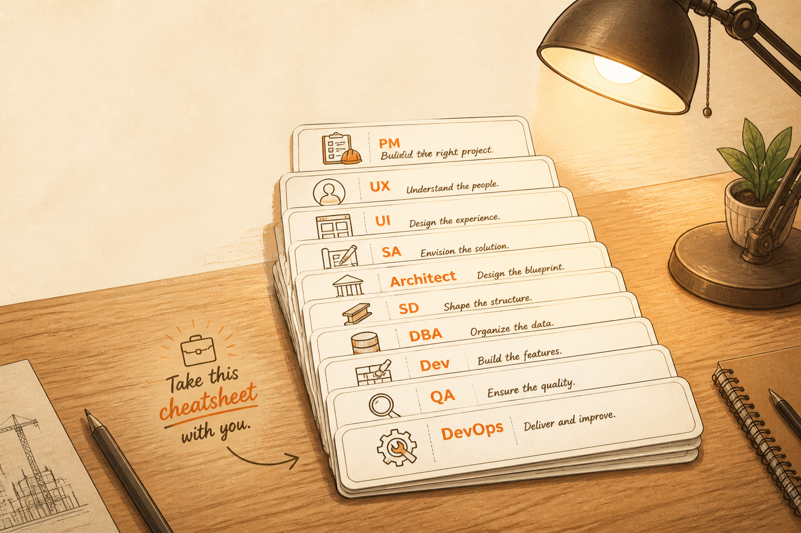

<!-- _class: chapter -->

APPENDIX · 00 · CHEATSHEET

# 9 角色速查表
## *一頁帶走*

---

<!-- _class: cover -->

---

<!-- _class: compact -->

## CHEATSHEET · 9 角色一覽

| 角色 | 蓋房子對應 | 一句話 | 降低的不確定性 |
|---|---|---|---|
| **PM** | 建案企劃 | 把商業問題翻成可執行需求 | 商業價值 |
| **UX** | 室內動線 | 設計使用者怎麼走 | 使用者行為 |
| **UI** | 樣品屋 | 畫面怎麼長 | 視覺呈現 |
| **SA** | 建築師 | 補規則的縫隙 | 業務規則 |
| **Architect** | 結構技師 | 決定系統會不會死 | 系統演進與非功能風險 |
| **SD** | 施工圖 | 把架構翻成可開發模組 | 開發落地 |
| **DBA** | 地基 / 水塔 | 守住資料生命線 | 資料正確性、效能、可靠性 |
| **Dev** | 工班師傅 | 把設計變成代碼 | 實作正確性 |
| **QA** | 驗收員 | 設計驗證框架 | 結果正確性 |
| **DevOps** | 物業 / 保全 / 消防 | 讓上線後活著 | 上線運行 |

> Source: _source/braindump.md · §角色 = 消除不確定性

---

<!-- _class: compact -->

## CHEATSHEET · 經典產出

| 角色 | 經典產出 |
|---|---|
| PM | PRD / User Story / Backlog / Persona / Roadmap |
| UX | User Journey / Wireframe / Prototype / Usability Test |
| UI | Mockup / Component Library / Design System |
| SA | Use Case / State Diagram / Business Rule / Permission Matrix |
| Architect | Architecture Diagram / ADR / NFR Spec / Service Boundary |
| SD | API Spec / Sequence Diagram / Module Design |
| DBA | ERD / Schema + Index / Backup Plan / Data Governance |
| Dev | Code (PR) / Unit Test / Documentation |
| QA | Test Case / Test Plan / Bug Report / Automation Scripts |
| DevOps | CI/CD Pipeline / IaC / Monitoring Dashboard / Runbook |

> Source: _source/braindump.md · §角色全景

---

<!-- _class: compact -->

## CHEATSHEET · 容易搞混的對照

| 對照 | 差異核心 |
|---|---|
| PM vs BA | 產品策略 vs 需求分析 |
| PM vs PO（Scrum） | 整體產品 vs Backlog 排序 |
| PM vs Project Manager | 產品價值 vs 專案時程 |
| UX vs UI | 動線 vs 樣品屋 |
| SA vs PM | 系統規格 vs 商業需求 |
| SA vs Architect | 系統怎麼跑 vs 系統怎麼活下去 |
| Architect vs SD | 城市規劃 vs 建築設計 |
| Architect vs CTO | 技術決策 vs 技術領導 |
| DBA vs Data Engineer | OLTP 維運 vs ETL 管線 |
| Dev vs SD | 看文件實作 vs 寫文件 |
| Dev vs QA | unit / 整合測試 vs E2E / 整合測試 |
| DevOps vs SRE | 文化方法 vs 角色命名 |
| DevOps vs Sysadmin | 持續交付 vs 系統管理 |

> Source: _source/braindump.md · §SA vs Architect

---

<!-- _class: end -->

# Cheatsheet 完
## *下一站，三句口訣彙整。*

 

→ 01 Mnemonics
