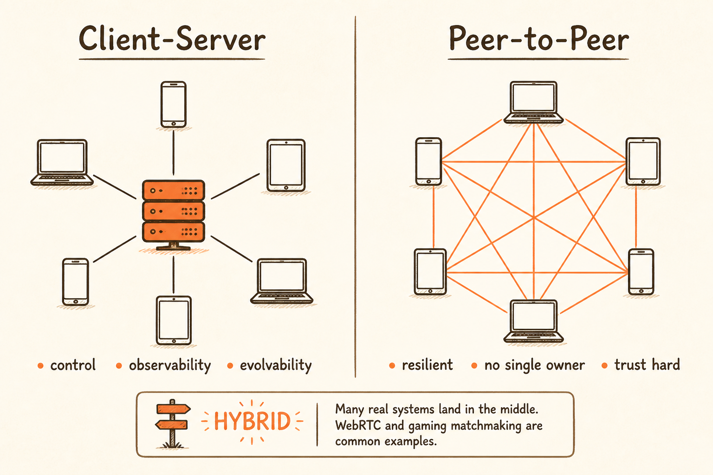
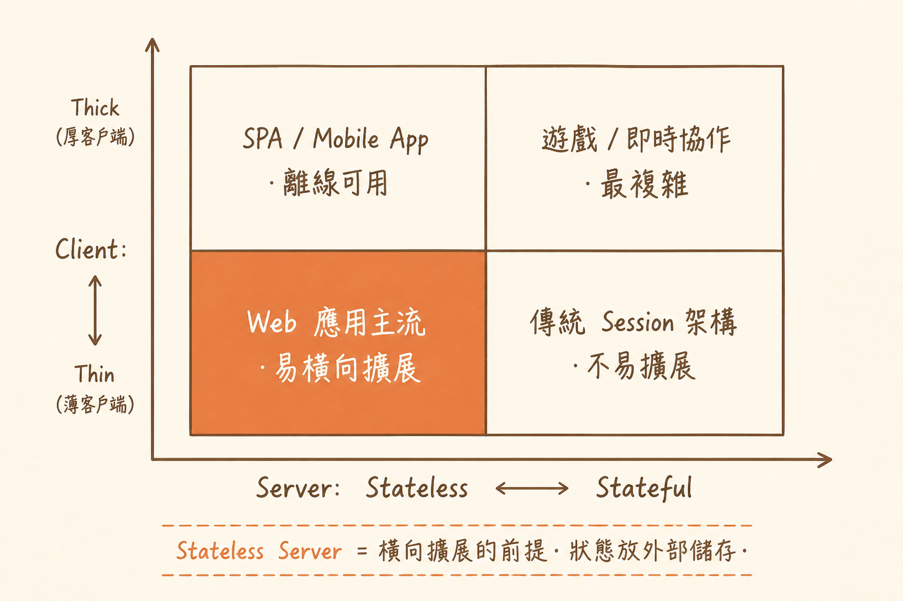

<!-- _class: chapter -->

CHAPTER · 01 · TOPIC 02

# Client-Server
## *集中化付出代價，換來控制、可觀測、可演化。*

---

<!-- _class: cover -->

---

<!-- _class: cover -->

---

## CLIENT-SERVER · WHY

SECTION 2 · CLIENT-SERVER

# 為何不是 P2P 統治產業？

 

**集中化的代價是 server 成本，但換來的是：**
**控制（authn/authz）· 可觀測（logging）· 可演化（一鍵更新）**

 

- P2P 適合：BitTorrent、區塊鏈、特定協作（資料密集、無中心信任源）
- Client-Server 適合：99% 商業軟體（要管理使用者、要更新 schema、要審計）
- **混合**：許多大型遊戲（DOTA、CSGO）採用 Server 撮合 + 對等連線
- **WebRTC** 是 P2P 的常見出口：視訊/音訊通話需要點對點低延遲，但仍依賴 signaling server 撮合

> Source: 基本觀念/02 Client-Server Architecture.pdf · §Client-Server vs P2P

---

## CLIENT-SERVER · HOW

# Thin / Thick · Stateful / Stateless

  

    <strong>Thin Client + Stateless Server</strong>
    Web 應用主流　·　易橫向擴展
  

  

    <strong>Thick Client + Stateless Server</strong>
    SPA / Mobile App　·　離線可用
  

  

    <strong>Thin Client + Stateful Server</strong>
    傳統 Session 架構　·　不易擴展
  

  

    <strong>Thick Client + Stateful Server</strong>
    遊戲 / 即時協作　·　最複雜
  

 

**Stateless Server** 是橫向擴展的前提。狀態應放外部儲存（Redis / DB），不放伺服器記憶體。

> Source: 基本觀念/02 Client-Server Architecture.pdf · §Thin vs Thick Client

---

## CLIENT-SERVER · TRADE-OFF

# Stateful 的三大反模式

**反模式 ①：Session 黏在伺服器記憶體**
A 伺服器掛掉 → 使用者被迫重新登入。失去自由路由的彈性。

**反模式 ②：信任 request body 的 user_id**
攻擊者改 body 中的 `user_id` 就能讀任何人資料。**永遠從 token 解析使用者**，不從 body。

**反模式 ③：用 sticky session 補狀態漏洞**
LB 被迫綁定使用者到特定機器。擴容、graceful drain、故障切換全部變難。

**修法統一**：把狀態推到外部（Redis / DB / JWT），伺服器永遠 stateless。

> Source: 基本觀念/02 Client-Server Architecture.pdf · §安全提醒 + Server 職責

---

<!-- _class: end -->

# Client-Server 完
## *Stateless 是基本盤——下一步看怎麼擴規模。*

 

→ 1.3 Scalability
