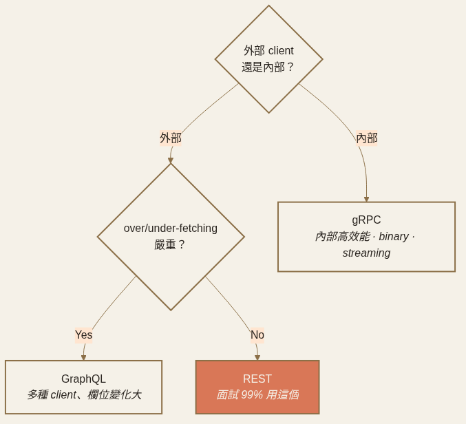
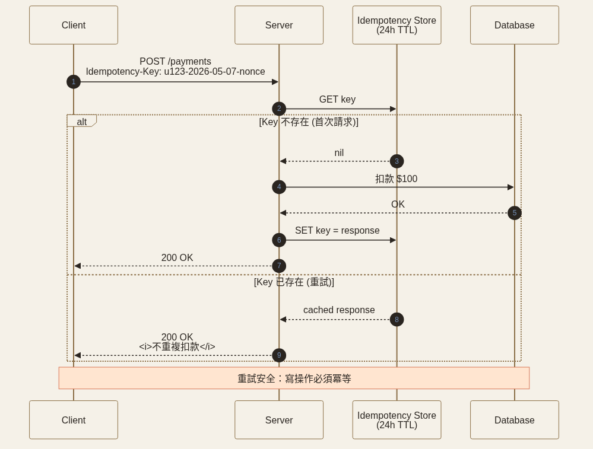

<!-- _class: chapter -->

<div class="ch-no">CHAPTER · 01 · TOPIC 04</div>

# API Design
## *對外 REST、對內 gRPC，剩下看清楚再選。*


---


## API DESIGN · 風格選型

<span class="kicker">SECTION 4 · API DESIGN</span>

# REST · RPC · GraphQL · gRPC

| 風格 | 適用 | 優勢 | 痛點 |
|------|------|------|------|
| **REST** | 公開 API · 簡單 CRUD | 通用、可快取 | over/under-fetching |
| **RPC** (JSON-RPC, etc.) | 內部服務 | 像呼叫函式 | 弱規範 |
| **GraphQL** | 多種 client、欄位變化大 | 一次取齊、Schema 強型別 | N+1 query、cache 難 |
| **gRPC** | 內部高效能、跨語言 | binary、streaming、契約清楚 | 瀏覽器支援差 |

<br>

<span class="muted">**經驗法則**：對外 REST/GraphQL，對內 gRPC，金流 RPC + 強審計。**gRPC vs JSON over HTTP 吞吐量可達 10×**。</span>

> Source: 基本觀念/05 API Design.pdf + 01 Networking · §gRPC


---


## API DESIGN · 決策樹

# 三個問題決定風格

```
        外部 client 還是內部？
              │
        ┌─────┴─────┐
       外部         內部
        │            │
   over/under       gRPC
   fetching 嚴重？   （binary、契約清楚）
        │
   ┌────┴────┐
  Yes       No
   │         │
 GraphQL    REST
```

<span class="muted">面試裡 99% 用 REST 就對了。除非題目明確要靈活查詢（GraphQL）或內部高效能（gRPC），不要過早跳。</span>



> Source: 基本觀念/05 API Design.pdf · §決策樹

---


## API DESIGN · 反模式

# REST 三大反模式

<div class="alert">

**① Chatty API**：列表頁要 1 個 GET /users + N 個 GET /users/{id}/posts → **N+1 請求**。
修：在資源裡 embed 必要欄位，或允許 `?include=posts`。

</div>

<div class="alert">

**② Operation 偽裝成 Resource**：`POST /updateUser`、`POST /startGame` 不是 RESTful。
修：改用 `PUT /users/{id}`、`PATCH /games/{id} {status:"started"}`。

</div>

<div class="alert">

**② Over-fetching**：行動端只要 5 個欄位，後端回 50 個。耗流量、耗電。
修：sparse fieldsets（`?fields=id,name`）或改用 GraphQL。

</div>

> Source: 基本觀念/01 Networking · §REST + GraphQL 動機


---


## API DESIGN · 隱性決策

# 那些「不講就會錯」的細節

<div class="def">
<span class="term">Idempotency · 冪等性</span>
GET / PUT / DELETE 天生冪等；<strong>POST 不是</strong>。寫操作必須帶 <code>Idempotency-Key</code>，伺服器去重 24h。<br>
**典型 key**：用戶 ID + 業務天 + nonce（避免一天內重複扣款）。
</div>

<div class="def">
<span class="term">Versioning · 版本管理</span>
URL 路徑（/v1/）· Header（Accept-Version）· Query。<br>
**推薦**：URL 路徑，最直觀，便於 routing 與廢棄。
</div>

<div class="def">
<span class="term">Pagination · 分頁</span>
Offset/Limit（簡單但深翻慢）vs Cursor（快、不可跳頁）。<br>
**大量資料用 Cursor**，避免 OFFSET 1000000 的全掃。
</div>



> Source: 基本觀念/01 Networking · §冪等性 + REST §Methods

---


<!-- _class: end -->

# API Design 完
## *四件事都串起來了——下一張，把它們組裝成一個系統。*

<br>

<span class="lead">→ 1.5 Recap & Case Study</span>
