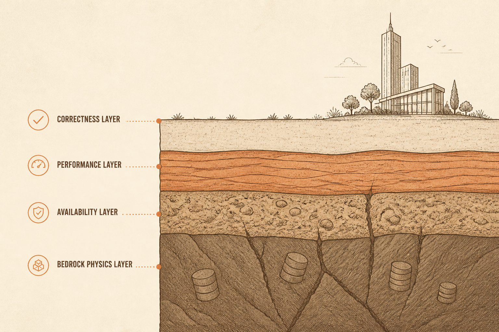
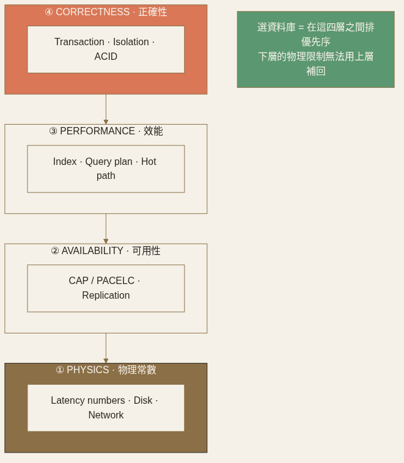

<!-- _class: chapter -->

<div class="ch-no">CHAPTER · 02</div>

# Data Fundamentals
## *資料層的物理常數，與你逃不掉的取捨*

<!--
開場 30 秒：
- 從 Ch.1 的「網路是物理常數」延伸到「資料也有物理常數」
- 重點不是教 SQL，而是建立「為何要在這四件事之間取捨」的直覺
- 講者語氣：穩、列舉具體場景
-->


---

<!-- _class: cover -->

<div style="text-align:center;">



</div>


---


## OBJECTIVES · 學習目標

看完本章，你能回答：

<div class="stack">
  <div class="layer client"><strong>① CAP 真的存在嗎？該怎麼讀？</strong>　 P 永遠成立，挑 C 還是 A</div>
  <div class="layer app"><strong>② Index 為何「快讀慢寫」？</strong>　 B+Tree vs LSM 的根本差異</div>
  <div class="layer data"><strong>③ Transaction 真的能 ACID 嗎？</strong>　 隔離級別與異常現象</div>
  <div class="layer infra"><strong>④ 哪些數字必須背？</strong>　 Latency Numbers Every Engineer Should Know</div>
</div>

> Source: 基本觀念/03 + 07 + 08 + 12


---


## MENTAL MODEL · 資料層的四個維度

```
┌──────────────────────────────────────────────────┐
│  CORRECTNESS    Transaction · Isolation · ACID   │  ← Ch.2.3
├──────────────────────────────────────────────────┤
│  PERFORMANCE    Index · Query plan · Hot path    │  ← Ch.2.2
├──────────────────────────────────────────────────┤
│  AVAILABILITY   CAP / PACELC · Replication mode  │  ← Ch.2.1
├──────────────────────────────────────────────────┤
│  PHYSICS        Latency numbers · Disk · Network │  ← Ch.2.4
└──────────────────────────────────────────────────┘
            選資料庫 = 在這四層之間排優先序
```

<span class="muted">這四層由下而上累加成本。違反 PHYSICS 的設計在任何資料庫上都跑不快。</span>



> Source: 整理自 基本觀念/03 + 07 + 08 + 12
