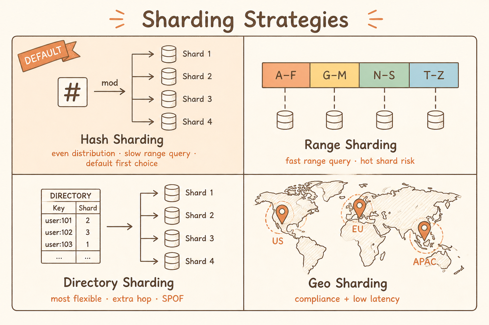
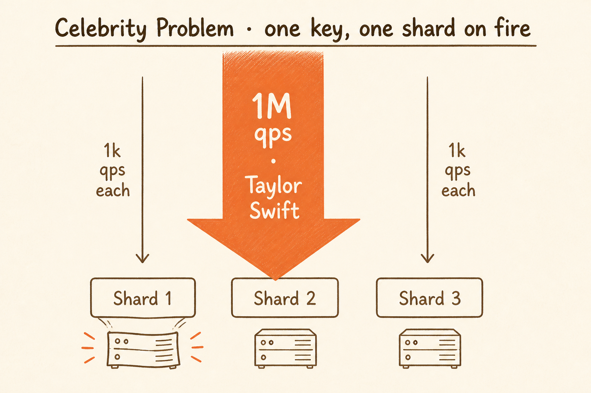
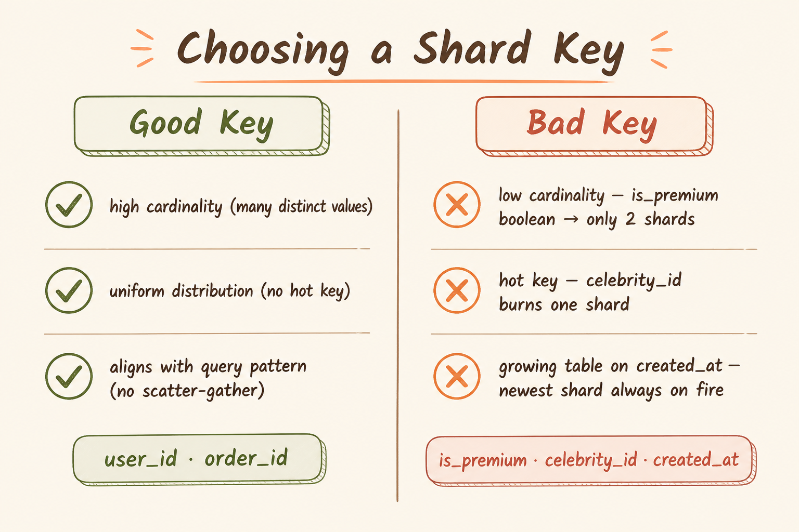

<!-- _class: chapter -->

<div class="ch-no">CHAPTER · 03 · TOPIC 02</div>

# Sharding
## *把一張大表切成 N 張小表，分散到 N 台機器*

---

<!-- _class: cover -->

<div style="text-align:center;">



</div>


---


<!-- _class: cover -->

<div style="text-align:center;">



</div>


---


<!-- _class: cover -->

<div style="text-align:center;">



</div>


---


## SHARDING · WHY

# 為何單一資料庫撐不住？

<br>

<div class="highlight">

**垂直擴展撞牆的 3 個真實上限**：
1. **磁碟容量**：單機 SSD ~ 30 TB；**Amazon Aurora 也只有 ~ 256 TB 硬限**
2. **寫吞吐量**：單 leader 寫入上限 ~ 10K-50K TPS
3. **熱點集中**：單表 hot row 鎖爭用會讓並發歸零

</div>

<br>

- Sharding = **把一張大表切成 N 個小表**，分散到 N 台機器
- 每台機器只負責一部分資料，吞吐量 ~ 線性擴展

<div class="def">
<span class="term">Partitioning vs Sharding</span>
**Partitioning** = 同一台 DB 內邏輯切分；**Sharding** = 跨機器切分。多數工程師混用，重點是說清楚「資料在一台還是多台」。
</div>

> Source: 基本觀念/10 Sharding.pdf · §1 Why Shard

---

## SHARDING · HOW

# 三種分片策略

<div class="matrix-2x2">
  <div class="featured">
    <strong>Hash Sharding</strong>
    shard = hash(key) % N<br>
    分布均勻 · 範圍查詢慢 · 預設首選
  </div>
  <div>
    <strong>Range Sharding</strong>
    A-F → s1, G-M → s2 ...<br>
    範圍查詢快 · 易產生 hot shard
  </div>
  <div>
    <strong>Directory Sharding</strong>
    查 lookup table 決定<br>
    最彈性 · 多 1 跳 · 有 SPOF
  </div>
  <div>
    <strong>Geo Sharding</strong>
    依使用者地區切<br>
    Compliance + 低延遲
  </div>
</div>

<span class="muted">**選擇法則**：以等值查詢為主用 Hash；範圍查詢多用 Range；資料分布不均才用 Directory（面試很少是正解）。</span>

> Source: 基本觀念/10 Sharding.pdf · §2 Strategies

---

## SHARDING · 分片鍵選擇

# 選錯分片鍵的災難

<div class="tradeoff">
  <div class="pro">
    <h3>好的分片鍵（3 條件）</h3>
    <ul>
      <li><strong>高基數</strong>（distinct values 多）</li>
      <li><strong>均勻分佈</strong>（避免 hot shard）</li>
      <li><strong>對齊查詢模式</strong>（避免 scatter-gather）</li>
      <li><em>例：user_id, order_id</em></li>
    </ul>
  </div>
  <div class="con">
    <h3>糟糕的分片鍵</h3>
    <ul>
      <li>低基數（is_premium 布林值 → 只能 2 份）</li>
      <li>有熱點（celebrity_id 寫爆 1 個 shard）</li>
      <li>成長表用 created_at（新寫入打爆最新 shard）</li>
    </ul>
  </div>
</div>

<div class="alert">

**反模式**：以時間為分片鍵。今天的 shard 永遠是熱點，昨天的 shard 永遠閒著。

</div>

> Source: 基本觀念/10 Sharding.pdf · §3 Shard Key

---

## SHARDING · Hot Shard

# Celebrity Problem · 名人效應

```
              Server
        ┌───────┴───────┐
        │       │       │
      1M qps  1k qps  1k qps
        ↓       ↓       ↓
     [Shard 1][Shard 2][Shard 3]
     (Taylor Swift)
```

<div class="alert">

Taylor Swift 的 user_id 那個 shard，**流量可能是普通 user 的 1000 倍**。
hash 函數對所有 ID 一視同仁——但有些 key 本來就比其他 key 更活躍。

</div>

**三種應對方式**：
- **隔離熱 key 到專屬 shard**：把 celebrity 帳號搬去專用 shard（Directory Sharding 派上用場）
- **複合 shard key**：`hash(user_id + date)` 把單一用戶資料隨時間分散
- **動態 shard 拆分**：MongoDB balancer / Vitess online resharding

> Source: 基本觀念/10 Sharding.pdf · §4 Hot Spots

---

## SHARDING · 跨 Shard 操作

# JOIN 為何難？怎麼少做？

<div class="def">
<span class="term">Scatter-Gather</span>
查 64 個 shard 取 top 10 → **64 倍網路呼叫 + 等最慢的回應**。Top-N 查詢是典型受害者。
</div>

<div class="def">
<span class="term">減少跨 shard 查詢的三招</span>
**① 快取結果**：top posts 快取 5 分鐘 · **② 反正規化**：把貼文資訊冗餘存到用戶 shard · **③ 接受罕見查詢的代價**：管理後台一天跑幾次的查詢慢一點沒關係
</div>

<div class="def">
<span class="term">跨 Shard Transaction：避開 2PC</span>
**設計成單 shard transaction**（最佳）→ **Saga 模式**（補償動作）→ **接受最終一致性**。教科書的 2PC 在生產系統幾乎沒人用。
</div>

> Source: 基本觀念/10 Sharding.pdf · §5 Cross-Shard Ops

---

## SHARDING · TRADE-OFF

# Sharding 不是免費午餐

<div class="tradeoff">
  <div class="pro">
    <h3>Sharding 帶來</h3>
    <ul>
      <li>讀寫吞吐量 ~ N 倍擴展</li>
      <li>單 shard 故障爆炸範圍縮小</li>
      <li>單表大小可控（每片獨立優化）</li>
    </ul>
  </div>
  <div class="con">
    <h3>Sharding 的代價</h3>
    <ul>
      <li>跨 shard JOIN 不可行（要在應用層）</li>
      <li>跨 shard 事務需 Saga（避開 2PC）</li>
      <li>Resharding 是地獄（時間以小時計）</li>
      <li>運維成本 ~ N 倍（備份、監控、升級）</li>
    </ul>
  </div>
</div>

<span class="muted">**口訣**：能不分就不分。垂直擴展 + 讀寫分離 + Cache 撐到 80%，再 Shard。**面試建議從 64 shards 起步**——留有成長空間又不過度設計。</span>

> Source: 基本觀念/10 Sharding.pdf · §6 Trade-offs + §7 Interview

---

<!-- _class: end -->

# Sharding 完
## *資料切完了，每片要再複製幾份？*

<br>

<span class="lead">→ Topic 03 Replication</span>
