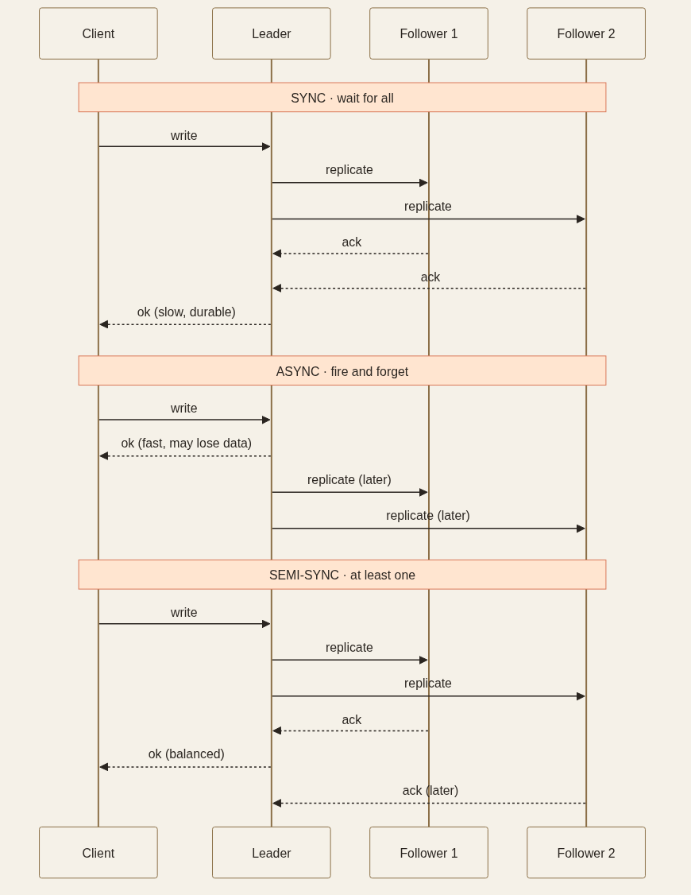
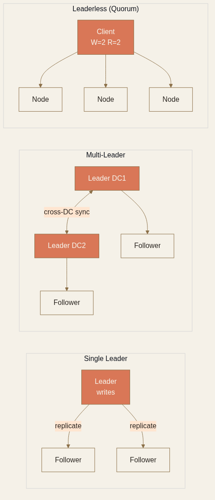

<!-- _class: chapter -->

CHAPTER · 03 · TOPIC 03

# Replication
## *把同一份資料複製到多台機器，挑戰永遠在「資料會變」*

---

<!-- _class: cover -->

---

## REPLICATION · WHY

# 為何要複製多份？

3

 

**典型 3 副本架構**解 3 件事：

- **可用性**：1 台壞，剩 2 台還能服務（99.9% → 99.99%）
- **讀效能**：讀流量打到 follower，主節點專心寫
- **災備**：跨 AZ / 跨 Region 部署，機房災難不丟資料

 

**沒有 Replication = 單點故障**。一台磁碟壞了 = 一批資料永遠失蹤。

> Source: 基本觀念/11 Replication.pdf · §1 Why Replicate

---

## REPLICATION · HOW

# 三種複製模式

| 模式 | 主節點 commit 條件 | 一致性 | 延遲 | 資料丟失風險 |
|------|-------------------|--------|------|------------|
| **Sync（同步）** | 所有 follower 確認 | 強 | 高 | 0 |
| **Async（非同步）** | 自己寫完即返回 | 弱 | 低 | 主壞 → 丟最後幾秒 |
| **Semi-sync（半同步）** | 至少 1 個 follower 確認 | 中 | 中 | 極低 |

 

**MySQL semi-sync** 是金流系統的經典選擇：保證至少 1 份備援收到，又不被慢的 follower 拖死。

> Source: 基本觀念/11 Replication.pdf · §2 Sync vs Async

---

## REPLICATION · 拓撲

# Leader-Follower / Multi-Leader / Leaderless

  

    <strong>Single Leader</strong>
    1 主寫 N 從讀 
    最簡單 · 90% 場景夠用
  

  

    <strong>Multi-Leader</strong>
    多主可寫 · 互相同步 
    跨 datacenter 寫入快 · 衝突難解
  

  

    <strong>Leaderless（Quorum）</strong>
    W + R > N 保一致 
    Cassandra · DynamoDB
  

  

    <strong>Chain Replication</strong>
    寫頭、讀尾、鏈式同步 
    強一致 + 高吞吐
  

**單 datacenter 用 multi-leader 不值得**——複雜度遠超過好處。Multi-leader 是為跨 region 而生。

> Source: 基本觀念/11 Replication.pdf · §3 Topologies

---

## REPLICATION · Replication Log

# 4 種日誌實作方式

| 方式 | 原理 | 缺點 | 代表 |
|------|------|------|------|
| **Statement-based** | 把 SQL 語句傳給 follower 執行 | NOW() / RAND() 不一致 | MySQL 5.1 前 |
| **WAL Shipping** | 把儲存引擎的 WAL 直送 | 跨版本升版需停機 | PostgreSQL · Oracle |
| **Logical Log（row-based）** | 解析行層次變更 | 解析成本 | MySQL binlog · CDC |
| **Trigger-based** | 應用層 trigger 抓變更 | overhead 大 | 跨資料庫類型同步 |

 

**Logical log** 是 **Change Data Capture（CDC）** 的基礎——把 DB 變更 stream 到 Kafka / 搜尋引擎 / 數據倉儲。

> Source: 基本觀念/11 Replication.pdf · §4 Replication Log

---

## REPLICATION · 一致性陷阱

# Replication Lag 引發的怪事

Read-after-write inconsistency
使用者剛 update profile，刷新後看到舊資料——因為讀打到了還沒同步完的 follower。
**3 種解法**：① 自己的資料從 leader 讀 · ② 追蹤 client 的 LSN（log sequence number），跟不上的 follower 就改打 leader · ③ 寫入後 N 秒強制讀 leader

Monotonic Read
同一使用者連續兩次讀，第二次看到比第一次還舊的資料。
**解法**：sticky session，同 user 永遠打同一個 follower。

Replication Lag 監控
**Lag 超過 30 秒觸發告警**——超過這個值通常代表 follower 跟不上、可能要切流量或重建。

> Source: 基本觀念/11 Replication.pdf · §5 Lag Issues

---

## REPLICATION · Failover

# Leader 掛了之後最容易出事

**Failover 三步驟**：偵測 leader 失效（timeout 30s）→ 從 follower 選新 leader → 重新設定流量

 

**Failover 三大地雷**：
- **Split Brain**：兩個節點都以為自己是 leader，雙寫導致資料損毀
  → STONITH（Shoot The Other Node In The Head）+ **fencing token** 確保舊 leader 完全下線
- **資料丟失**：async 複製下，舊 leader 還沒傳的寫入直接被丟掉
- **Timeout 拿捏**：太長失效恢復慢；太短在尖峰時誤觸發

**真正的強一致 Failover** 需要 **Raft / Paxos consensus 演算法**——PostgreSQL 用 **Patroni**、k8s 用 **etcd** 實作這套機制，代價是延遲與複雜度上升。

> Source: 基本觀念/11 Replication.pdf · §3 Handling Failures + §10 Deep Dive

---

## REPLICATION · TRADE-OFF

# 副本數量的甜蜜點

  

    <h3>多副本好處</h3>
    <ul>
      <li>更高可用性（N+1 容錯）</li>
      <li>讀流量可線性擴展</li>
      <li>跨地理低延遲讀</li>
    </ul>
  

  

    <h3>多副本代價</h3>
    <ul>
      <li>儲存成本 ~ N 倍</li>
      <li>同步寫延遲 ~ 最慢副本</li>
      <li>Quorum N 大時，W + R 也跟著大</li>
    </ul>
  

**業界默契**：**3 副本是甜蜜點**——可以容忍 1 副本掛掉而不影響可用性，成本三倍但 dollars 還能接受。
**Quorum 預設 n=3, w=2, r=2**（容忍 1 個失效）；高可靠用 n=5, w=3, r=3。

> Source: 基本觀念/11 Replication.pdf · §6 Quorum + §11 Cost

---

<!-- _class: end -->

# Replication 完
## *資料安全了，下一步——讀取怎麼變更快？*

 

→ Topic 04 Caching
