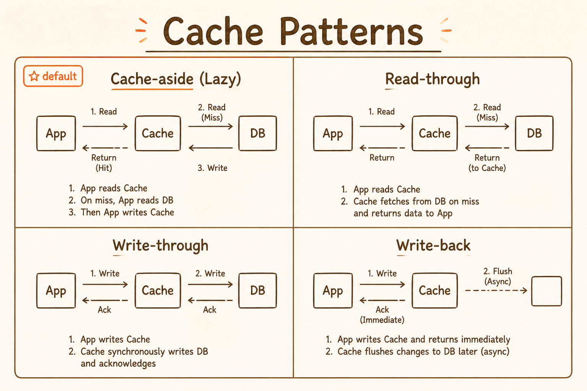
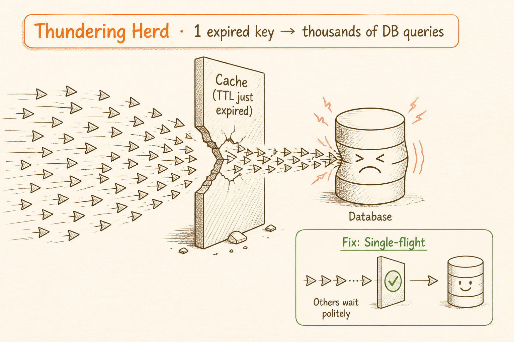
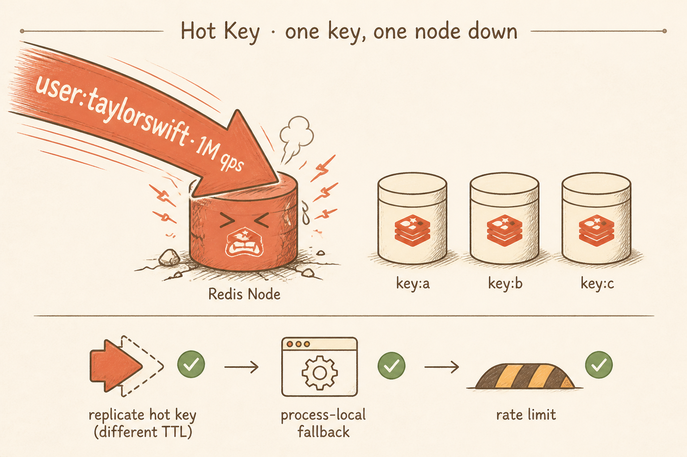
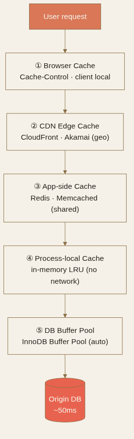

<!-- _class: chapter -->

<div class="ch-no">CHAPTER · 03 · TOPIC 04</div>

# Caching
## *把貴的、慢的、共用的計算結果暫存——萬靈丹也是萬惡源*


---

<!-- _class: cover -->

<div style="text-align:center;">



</div>


---


<!-- _class: cover -->

<div style="text-align:center;">



</div>


---


<!-- _class: cover -->

<div style="text-align:center;">



</div>


---


## CACHING · WHY

# Cache 為何不可缺？

<div class="big-number">50×</div>

<br>

**真實數字**：
- 從 Postgres 讀一筆 user profile ~ **50 ms**
- 從 Redis 讀同一筆 ~ **1 ms** → **快了 50 倍**

<br>

<div class="highlight">

**Cache 的本質**：把貴的、慢的、共用的結果存進記憶體，繞過磁碟。
**Cache 的詛咒**：「There are only two hard things in CS: cache invalidation and naming things.」 — Phil Karlton

</div>

> Source: 基本觀念/09 Caching.pdf · §1 Why Cache


---


## CACHING · 五層擺放

# Cache 該擺哪一層？

```
┌─────────────────────────────────────────────────────┐
│  ① Browser Cache       客戶端本地（Cache-Control）   │
├─────────────────────────────────────────────────────┤
│  ② CDN Edge Cache      地理就近（CloudFront、Akamai）│
├─────────────────────────────────────────────────────┤
│  ③ App-side Cache      Redis / Memcached（共享）     │
├─────────────────────────────────────────────────────┤
│  ④ Process-local Cache 進程內 LRU（無網路）          │
├─────────────────────────────────────────────────────┤
│  ⑤ DB Buffer Pool      InnoDB Buffer Pool（自動）    │
└─────────────────────────────────────────────────────┘
```

<span class="muted">**CDN 威力數字**：跨洲（VA → 印度）原本 **250-300 ms**，CDN 邊緣快取 **20-40 ms**。延遲量級的差距。</span>



> Source: 基本觀念/09 Caching.pdf · §2 Layers

---


## CACHING · 模式

# Cache-aside vs Read-through vs Write-through vs Write-back

<div class="matrix-2x2">
  <div class="featured">
    <strong>Cache-aside（Lazy）</strong>
    讀 miss → 查 DB → 回填<br>
    最常見 · 面試預設答案
  </div>
  <div>
    <strong>Read-through</strong>
    Cache 自己負責回填<br>
    應用碼乾淨 · CDN 本質就是這個
  </div>
  <div>
    <strong>Write-through</strong>
    寫 cache + 同步寫 DB<br>
    一致性強 · 寫變慢 · 雙寫風險
  </div>
  <div>
    <strong>Write-back（Write-behind）</strong>
    寫 cache 即返回，背景刷 DB<br>
    最快 · 可能丟資料
  </div>
</div>

<span class="muted">**90% 場景用 Cache-aside**。寫密集且容忍丟資料用 Write-back（如 metrics pipeline）；金流類用 Write-through。</span>

> Source: 基本觀念/09 Caching.pdf · §3 Patterns


---


## CACHING · Eviction 策略

# 記憶體滿了，誰先走？

| 策略 | 規則 | 適用 | 代表 |
|------|------|------|------|
| **LRU**（最近最少使用） | 移除最久沒被存取的 | 預設首選 · 適合大多工作負載 | Redis · Memcached |
| **LFU**（最不常使用） | 移除存取次數最少的 | 長期持續熱門的 key | 排行榜、熱門影片 |
| **FIFO**（先進先出） | 按插入時間移除 | **生產環境少用**（忽略使用模式） | 簡易快取層 |
| **TTL**（存活時間） | 不是淘汰策略，是過期時間 | 必須與 LRU/LFU 搭配 | 通用 |

<br>

<span class="muted">**面試標準答案**：「我用 Redis，LRU eviction，個人資料 TTL 10 分鐘，更新時主動 invalidate。」</span>

> Source: 基本觀念/09 Caching.pdf · §4 Eviction Policy


---


## CACHING · 三大反模式

# Penetration · Avalanche · Stampede

<div class="def">
<span class="term">Cache Penetration · 穿透</span>
查不存在的 key，每次都繞過 cache 打 DB。
**解法**：null 也快取（短 TTL）· Bloom filter 預判
</div>

<div class="def">
<span class="term">Cache Avalanche · 雪崩</span>
大批 key 同時過期，瞬間打爆 DB。
**解法**：TTL 加隨機抖動（±10%）· 多級 cache · circuit breaker
</div>

<div class="def">
<span class="term">Cache Stampede / Thundering Herd · 擊穿</span>
熱點 key 過期瞬間，並發請求都打到 DB（一個查詢瞬間變幾千個）。
**最有效解法**：**Request Coalescing / Single-flight**——只讓一個請求去重建，其他等待結果 · Cache warming（過期前主動刷新）
</div>

> Source: 基本觀念/09 Caching.pdf · §5 Failure Modes


---


## CACHING · Hot Key

# 單一熱 key 也能打掛 Redis

<div class="alert">

**情境**：Twitter 上 Taylor Swift 的 `user:taylorswift` 這個 key，可能每秒收到幾百萬個請求。
就算其他都正常，**這單一 key 就能把單台 Redis 節點打掛**。

</div>

**三招應對**：
- **複製熱 key**：同一個值存到多個 cache 節點，分散讀取負載（注意 TTL 不要完全相同，否則同時過期 → Stampede）
- **加行程內備援快取**：極端熱門值存進 application 行程內，避免每次打 Redis
- **套用 Rate Limiting**：對異常流量模式踩煞車

> Source: 基本觀念/09 Caching.pdf · §5 Hot Keys


---


## CACHING · TRADE-OFF

# Cache 的隱性成本

<div class="tradeoff">
  <div class="pro">
    <h3>Cache 帶來</h3>
    <ul>
      <li>讀延遲降到 ~ 1ms（純 RAM）</li>
      <li>DB 壓力降 5-10 倍</li>
      <li>成本壓低（cache 比 DB 便宜）</li>
    </ul>
  </div>
  <div class="con">
    <h3>Cache 的代價</h3>
    <ul>
      <li>多一層失敗點（Redis 掛了？）</li>
      <li>一致性窗口（DB 更新後 cache 還舊）</li>
      <li>記憶體成本 + eviction 策略要調</li>
      <li>Debug 變難（cached vs fresh 永遠在猜）</li>
    </ul>
  </div>
</div>

<span class="muted">**進入順序**：先 measure 慢在哪，再加 cache。**不要 premature caching**。面試 5 步驟：確認瓶頸 → 決定快取什麼 → 選架構 → 設淘汰策略 → 說明缺點。</span>

> Source: 基本觀念/09 Caching.pdf · §6 Trade-offs + §7 Interview


---


<!-- _class: end -->

# Caching 完
## *四個工具到齊——把它們組合起來看一個真實系統。*

<br>

<span class="lead">→ Recap & Case Study</span>
