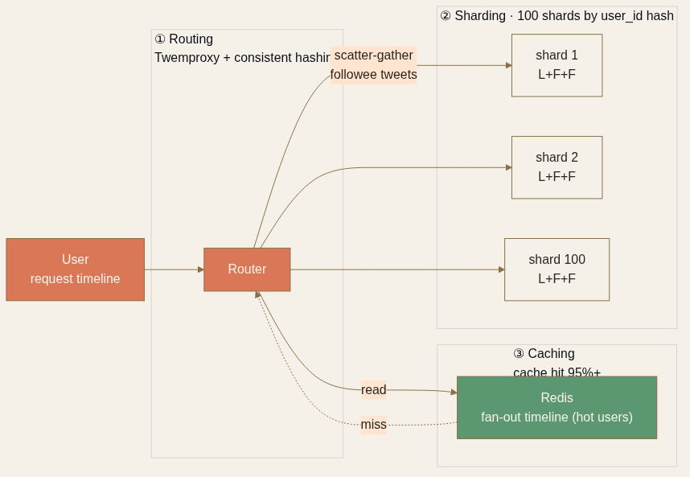

<!-- _class: chapter -->

CHAPTER · 03 · TOPIC 99

# Case Study & Recap
## *把分散式資料層的四個動作串起來看*

---

## CASE STUDY · 把分散式資料層串起來

# 設計：Twitter Timeline 讀取

  
<strong>Sharding</strong>　 user_id hash sharding · 100 shards · scatter-gather 取 followee tweets

  
<strong>Replication</strong>　 每 shard 3 副本（1 leader + 2 follower）· async replication

  
<strong>Caching</strong>　 熱用戶 timeline 預先 fan-out 寫 Redis · cache hit 95%+

  
<strong>Routing</strong>　 Twemproxy + consistent hashing 路由到對應 Redis 與 DB shard

 

每個決策都對應 Ch.3 的一個面向。
**Ch.4 開始挖基礎設施層**——這些 shard、cache、replica 跑在什麼之上？

> Source: 整合 Ch.3 全章 + Twitter Engineering 公開資料

---

## RECAP · 第三章帶走的東西

  

    <h3>新的工具</h3>
    <ul>
      <li>Consistent Hashing + Virtual Nodes</li>
      <li>3 種 Sharding 策略 + 分片鍵 3 條件</li>
      <li>Sync / Async / Semi-sync 取捨</li>
      <li>Single / Multi / Leaderless 三種拓撲</li>
      <li>5 層 Cache 擺放邏輯</li>
      <li>Penetration / Avalanche / Stampede 三招</li>
    </ul>
  

  

    <h3>還沒回答的問題</h3>
    <ul>
      <li>用哪個資料庫產品？　→ Ch.4 DB</li>
      <li>API Gateway 怎麼選？　→ Ch.4 GW</li>
      <li>K8s 跟 Serverless 怎麼選？　→ Ch.4</li>
      <li>圖片影片怎麼存？　→ Ch.4 Blob</li>
    </ul>
  

---

<!-- _class: end -->

# Ch.3 完
## *資料散開了，下一站看支撐這一切的基礎設施。*

 

→ Ch.4 Infrastructure
