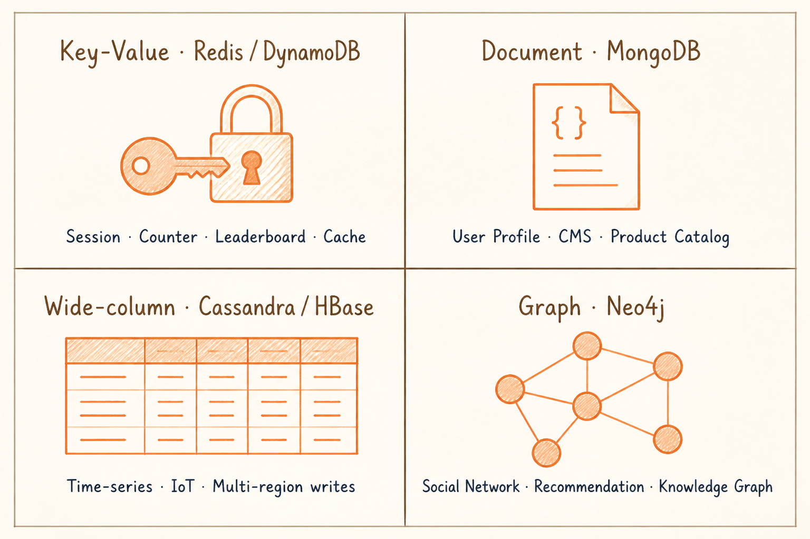
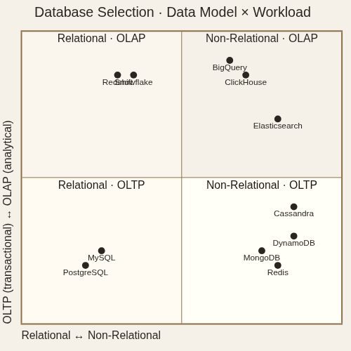

<!-- _class: chapter -->

CHAPTER · 04 · TOPIC 01

# Database
## *選錯資料庫的代價：migrate 一張 10 億筆的表 = 數週工程 + 不可逆風險*

---

<!-- _class: cover -->

---

## DATABASE · WHY

SECTION 1 · DATABASE

# 為何沒有「最好的」資料庫？

 

**每種資料庫都在 4 個維度做了取捨**：  
**模型**（Relational / KV / Document / Graph） ·  
**一致性**（Strong / Eventual） ·  
**擴展性**（Vertical / Horizontal） ·  
**查詢能力**（SQL / API / Index 種類）

 

選錯資料庫的代價：**migrate 一張 10 億筆的表 = 數週工程 + 不可逆風險**。

> Source: 常用技術/01 Database.pdf · §1 為什麼選擇這麼複雜

---

## DATABASE · 兩個正交維度

# 兩個維度看清資料庫全景

  

    <h3>維度 1 · 資料模型 (Data Model)</h3>
    <ul>
      <li>固定 schema 表格 → RDBMS</li>
      <li>巢狀 JSON 文件 → Document</li>
      <li>純 key 取值 → KV Store</li>
      <li>節點 + 邊 → Graph</li>
      <li>向量空間 → Vector DB</li>
    </ul>
  

  

    <h3>維度 2 · 工作負載 (Workload)</h3>
    <ul>
      <li>OLTP：高並發點查詢、小量寫入</li>
      <li>OLAP：海量歷史資料聚合分析</li>
      <li>典型：業務先 OLTP，再 ETL 到 OLAP</li>
      <li>HTAP：兩種兼顧（代價大）</li>
    </ul>
  

**兩維度正交（互相獨立）**——「PostgreSQL OLTP」「ClickHouse OLAP」「Cassandra OLTP NoSQL」都是兩維交叉的結果。

> Source: 常用技術/01 Database.pdf · §兩個維度看清資料庫的全景

---

## DATABASE · 六大類型

# 6 種資料庫一張表看懂

| 類型 | 代表 | 強項 | 痛點 |
|------|------|------|------|
| **RDBMS** | PostgreSQL · MySQL | ACID · 任意 join · 成熟 | 水平擴展難 |
| **KV Store** | Redis · DynamoDB | 極快 · 簡單 | 不適合複雜查詢 |
| **Document** | MongoDB · Couchbase | Schema-flexible · 巢狀 | join 弱 · ACID 限本文檔 |
| **Wide-column** | Cassandra · HBase | 寫吞吐極高 · 線性擴展 | 不適合即興查詢 |
| **Search** | Elasticsearch · OpenSearch | 全文 · Aggregation | 非主存儲 · 一致性弱 |
| **Graph** | Neo4j · Neptune | 多跳關係查詢 | 寫慢 · 規模有限 |
| **Vector** | Pinecone · pgvector | 相似度搜尋 (ANN) | 精確查詢能力弱 |

**多數系統會混用 2-3 種**：主資料 RDBMS · 熱資料 Redis · 全文搜尋 Elasticsearch。

> Source: 常用技術/01 Database.pdf · §NoSQL 資料庫 + Vector Database

---

## DATABASE · NoSQL 適用場景

# 4 種 NoSQL 對應的代表場景

  

    <strong>Key-Value · Redis / DynamoDB</strong>
    Session、計數器、排行榜、快取 
    微秒級延遲 · 高吞吐
  

  

    <strong>Document · MongoDB</strong>
    用戶設定檔、CMS、產品目錄 
    schema 多變、快速迭代
  

  

    <strong>Wide-column · Cassandra / HBase</strong>
    時序資料、IoT、寫入吞吐極高 
    write anywhere · 多地部署
  

  

    <strong>Graph · Neo4j</strong>
    社交網路、推薦、知識圖譜 
    多跳查詢比 SQL JOIN 快幾個數量級
  

 

**NoSQL 共同取捨**：BASE 模型（Basically Available, Soft state, Eventual consistency）—— 放棄強一致性換水平擴展。

> Source: 常用技術/01 Database.pdf · §NoSQL 資料庫

---

## DATABASE · TRADE-OFF

# RDBMS vs NoSQL 的選型決策

  

    <h3>選 RDBMS（PostgreSQL 為先）</h3>
    <ul>
      <li>需要 join、事務、複雜查詢</li>
      <li>未來 schema 不確定，先 RDBMS</li>
      <li>單表 < 100GB · QPS < 5000</li>
      <li><em>可惜的是：90% 工程師選 MongoDB 卻只用到 RDBMS 子集</em></li>
    </ul>
  

  

    <h3>選 NoSQL</h3>
    <ul>
      <li>只查 by primary key</li>
      <li>寫遠多於讀（Cassandra）</li>
      <li>巢狀 JSON 是天然模型（Document）</li>
      <li>Time-series（IoT、metrics）</li>
    </ul>
  

**Linus 哲學的選型口訣**：**先 PostgreSQL**。撐到撞牆再換——通常永遠撞不到牆。

> Source: 常用技術/01 Database.pdf · §在面試中如何選擇資料庫

---

## DATABASE · 面試答題公式

# 三步收斂選型 + 一句說理由

Step 1 · 形狀
有固定結構、需 JOIN → RDBMS · KV 取值 → DynamoDB/Redis · 巢狀 → MongoDB · 關係多跳 → Neo4j · 相似度 → Vector DB

Step 2 · OLTP 還是 OLAP
業務交易 + ACID → OLTP · 海量歷史聚合 → OLAP（BigQuery / ClickHouse / Redshift），考慮獨立資料倉儲

Step 3 · 規模與一致性取捨
強一致 + 複雜查詢 → RDBMS · 輕鬆水平擴展、可接受最終一致 → NoSQL

**最後一定要說選的「理由」**——選 PostgreSQL 強調 ACID、選 Cassandra 強調寫吞吐 + 多地部署、選 BigQuery 強調 column-oriented 加速分析。

> Source: 常用技術/01 Database.pdf · §不要一開始就比較 SQL vs NoSQL + §說出你的理由

---

<!-- _class: end -->

# Database 完
## *結構化資料解決了——下一站處理大檔案。*

 

→ Topic 02 Blob Storage
