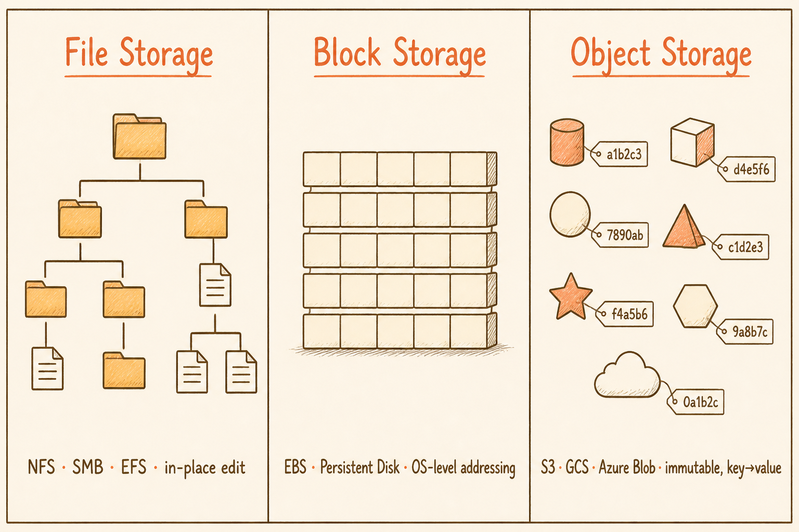
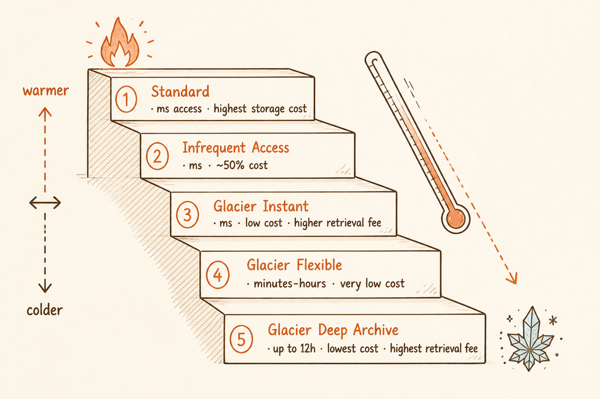
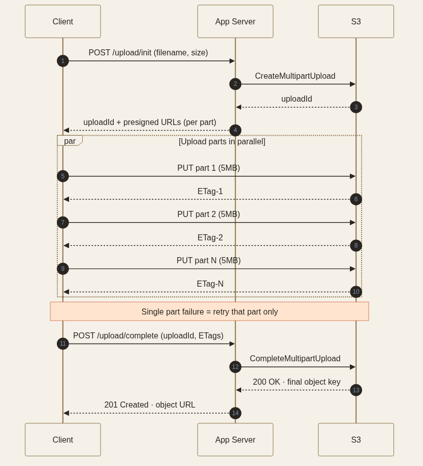

<!-- _class: chapter -->

CHAPTER · 04 · TOPIC 02

# Blob Storage
## *二進位資料不進資料庫——這是現代系統設計的鐵律之一*

---

<!-- _class: cover -->

---

<!-- _class: cover -->

---

## BLOB STORAGE · WHY

SECTION 2 · BLOB STORAGE

# 為何不把圖片影片放 DB？

100×

 

把 1GB 影片塞進 PostgreSQL：

- **儲存成本**：DB 儲存 ~ Blob 儲存的 **10-100 倍**
- **備份成本**：DB backup 要連影片一起備
- **查詢污染**：vacuum / analyze 全被大檔案拖慢
- **CDN 整合**：DB → CDN 中間隔了一層應用

 

**反模式**：用 BYTEA / BLOB 欄位存大檔。應該存 **URL** 指向 S3 / GCS。

> Source: 常用技術/02 Blob Storage.pdf · §什麼是 Blob Storage

---

## BLOB STORAGE · 三種儲存對比

# File / Block / Object 走的是不同路

| 類型 | 資料模型 | 修改方式 | 代表產品 |
|------|---------|---------|----------|
| **File Storage** | 樹狀目錄 + 檔案 | 就地修改檔案某幾行 | NFS · SMB · EFS |
| **Block Storage** | 固定大小區塊 | OS 層次位址讀寫 | EBS · Persistent Disk |
| **Object Storage** | 扁平 key → value | **不可變** · 整體覆寫 | S3 · GCS · Azure Blob |

 

**Object Storage 的取捨本質**：你放棄了「就地修改」與「低延遲隨機存取」，**換到** 11 個 9 耐久性、近乎無限水平擴展、極低儲存成本。

> Source: 常用技術/02 Blob Storage.pdf · §什麼是 Blob Storage

---

## BLOB STORAGE · HOW

# Object Storage 為何便宜又好？

  
<strong>① 扁平命名空間</strong>　 沒有目錄樹開銷 · 純 key → value（前綴只是顯示慣例）

  
<strong>② 強耐久性</strong>　 11 個 9（99.999999999%）· 跨 3 個 AZ 自動複製

  
<strong>③ HTTP 原生</strong>　 直接被 CDN 包覆 · 客戶端 presigned URL 上傳

  
<strong>④ 分層存儲</strong>　 Hot / Warm / Cold / Archive · 自動降冷

 

**S3 收費分 3 部分**：儲存（$/GB-month） + 請求次數（$/1000 ops） + 傳輸（$/GB out）。**讀流量是大頭**——所以才需要 CDN。

> Source: 常用技術/02 Blob Storage.pdf · §核心概念 + §耐久性和可用性

---

## BLOB STORAGE · 5 個儲存等級

# 越冷越便宜，但取回越貴

| 等級 | 適合場景 | 取回延遲 | 儲存成本 | 取回費 |
|------|---------|----------|----------|--------|
| **Standard** | 頻繁存取 | 毫秒 | 最高 | 無 |
| **Infrequent Access** | 每月幾次 | 毫秒 | ~ Std × 0.5 | 有 |
| **Glacier Instant** | 每季一次 | 毫秒 | 低 | 較高 |
| **Glacier Flexible** | 備份、幾小時內取回 | 分鐘-小時 | 很低 | 更高 |
| **Glacier Deep Archive** | 法規歸檔、極少取 | 最長 12 小時 | ~ Std × 0.1 | 最高 |

 

**反模式**：把熱資料丟去 Glacier 省錢——一次大規模取回的費用可能遠超你省下的儲存成本。

> Source: 常用技術/02 Blob Storage.pdf · §儲存分層

---

## BLOB STORAGE · 模式

# 大檔案上傳的 3 個必學模式

Presigned URL Upload
Client 跟 Server 拿短時效 URL，**直接上傳到 S3**，不經過你的伺服器。 
**好處**：節省你 server 的頻寬與 RAM，避免 1GB 檔案塞爆 worker。

Multipart Upload
大檔切成 5MB 小塊並行上傳，**單塊失敗只重傳該塊**。 
**門檻**：> 100 MB 都該用，> 5 GB 必須用（S3 單次 PUT 上限）。

Lifecycle Policy
**冷資料自動降冷**：30 天後降 Standard-IA · 90 天後降 Glacier · 7 年後刪除。 
**典型場景**：log、備份、用戶上傳的歷史檔案——存了 7 年沒人看。

> Source: 常用技術/02 Blob Storage.pdf · §生命週期策略

---

## BLOB STORAGE · 安全與災備

# 4 件不能漏的設計

  

    <strong>私有 Bucket + Presigned URL</strong>
    預設封鎖所有公開存取 
    用簽名 URL 授予「個別物件 + 有效期」
  

  

    <strong>Bucket Policy vs IAM</strong>
    IAM = 身份視角的權限 
    Bucket Policy = 資源視角（可跨帳號）
  

  

    <strong>Versioning · 對抗誤刪</strong>
    啟用後刪除只是加標記 
    搭配 lifecycle 限制歷史版本數
  

  

    <strong>Cross-Region Replication</strong>
    災難恢復 + 讀延遲優化 
    非同步、秒-分鐘級
  

 

**最常見資安事件**：S3 Bucket 配置成公開——用 S3 Access Analyzer 持續掃描。

> Source: 常用技術/02 Blob Storage.pdf · §存取控制 + §跨區域複製 + §怎麼防止 S3 Bucket 被公開曝露

---

## BLOB STORAGE · TRADE-OFF

# Blob Storage 不是萬能

  

    <h3>放 Blob Storage</h3>
    <ul>
      <li>大型二進位資料（圖片、影片、模型檔）</li>
      <li>只按 key 取整個物件</li>
      <li>需要極高耐久性 + 低成本</li>
      <li>一旦寫入很少修改</li>
    </ul>
  

  

    <h3>不要丟 Blob Storage</h3>
    <ul>
      <li>需要按內容查詢（搜尋）</li>
      <li>需要就地修改一小段</li>
      <li>需要低延遲隨機存取（&lt; ms）</li>
      <li>資料單元 &lt; 幾 KB（用 DB）</li>
    </ul>
  

**典型分工**：DB 存 metadata（key、大小、所有者、上傳時間） + Blob Storage 存實際 bytes。需要搜尋就把 metadata 索引到 Elasticsearch。

> Source: 常用技術/02 Blob Storage.pdf · §怎麼決定用哪個

---

<!-- _class: end -->

# Blob Storage 完
## *資料存好了——下一站處理進入系統的流量。*

 

→ Topic 03 API Gateway
