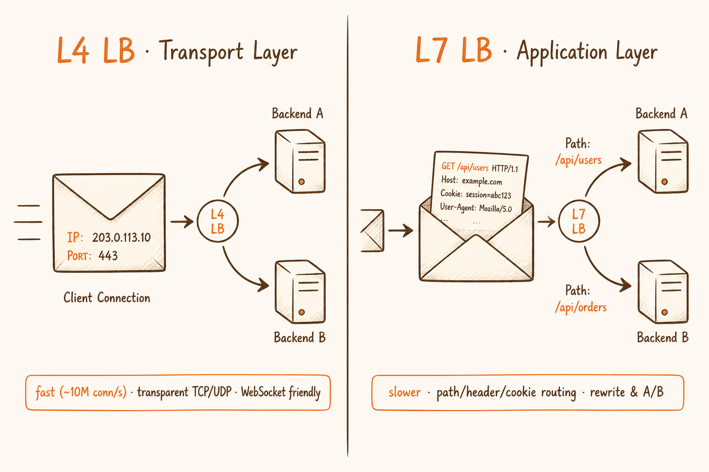
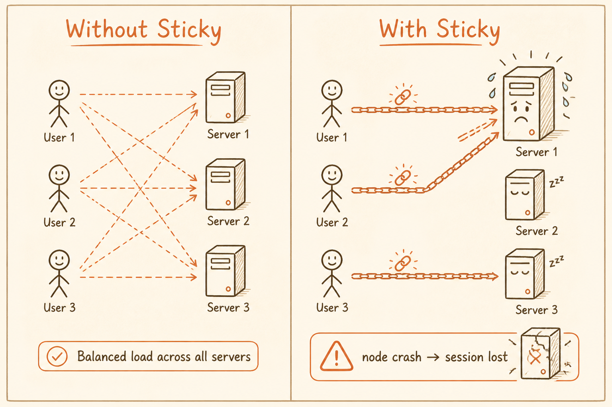
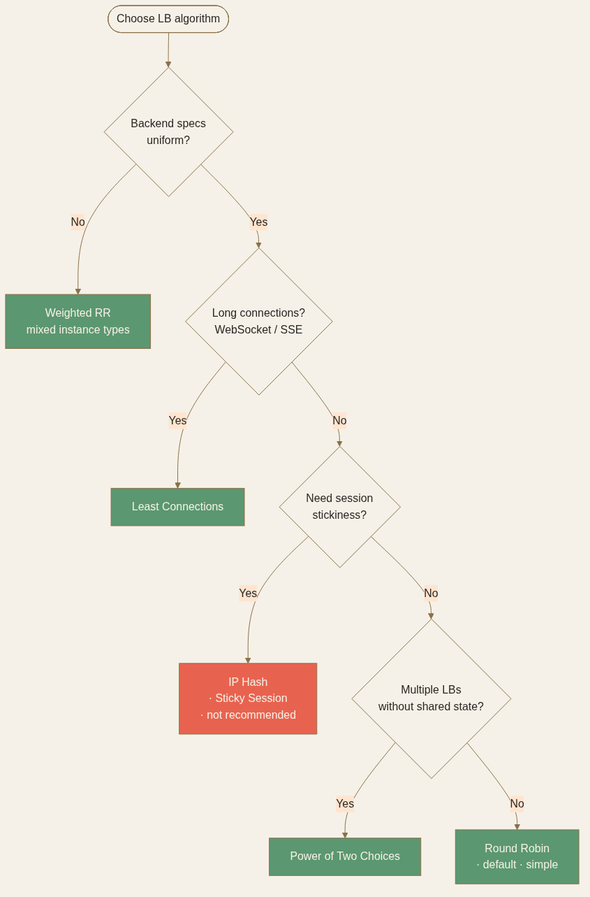

<!-- _class: chapter -->

<div class="ch-no">CHAPTER · 04 · TOPIC 04</div>

# Load Balancer
## *流量分配的本質不是「平均」，而是「整體吞吐最大化、避免局部過載」*


---

<!-- _class: cover -->

<div style="text-align:center;">



</div>


---


<!-- _class: cover -->

<div style="text-align:center;">



</div>


---


## LOAD BALANCER · WHY

<span class="kicker">SECTION 4 · LOAD BALANCER</span>

# 為何水平擴展非要 LB 不可？

<br>

**Ch.1.3 講過**：水平擴展三前提之一是「可路由」。LB 就是那個路由器。

<br>

<div class="highlight">

**LB 解 4 件事**：  
① 流量分配 ② 健康檢查（壞節點剔除）  
③ TLS 終止（unburden 後端）④ Sticky session（必要時）

</div>

> Source: 常用技術/04 Load Balancer.pdf · §基本概念 + §核心功能


---


## LOAD BALANCER · HOW

# L4 vs L7

<div class="matrix-2x2">
  <div class="featured">
    <strong>L4 LB（傳輸層）</strong>
    依 IP + Port 分發 · 不看 payload<br>
    超快（~10M conn/s）· 透明 TCP/UDP
  </div>
  <div>
    <strong>L7 LB（應用層）</strong>
    依 HTTP path / header / cookie<br>
    慢一點 · 但能做 routing / rewrite
  </div>
</div>

<br>

<div class="def">
<span class="term">速答法則</span>
<strong>WebSocket / 長連線</strong> → L4 LB（不會頻繁斷線重建）<br>
<strong>一般 HTTP/HTTPS</strong> → L7 LB（更靈活的內容路由）
</div>

> Source: 常用技術/04 Load Balancer.pdf · §在系統設計面試中如何談 Load Balancer


---


## LOAD BALANCER · 演算法

# 5 種演算法的盲點

| 演算法 | 行為 | 適用 | 盲點 |
|--------|------|------|------|
| **Round Robin** | 輪流派發 | 後端規格一致、請求時長相近 | 請求時長差異大會積壓 |
| **Least Connections** | 派給連線最少的 | 長連線（WebSocket）、API 處理時間差大 | 連線數 ≠ CPU 負載 |
| **Weighted RR** | 依權重派發 | 後端規格不一（混合機型） | 靜態權重，無法即時反應壓力 |
| **IP Hash** | 同 IP 永遠同節點 | Sticky session（不推薦） | 企業 NAT 出口會集中流量 |
| **Power of Two Choices** | 隨機 2 選最少 | 大規模、多 LB 不需共享狀態 | 實作不普及 |

<br>

<span class="muted">**現代雲端 LB 通常結合即時負載資訊（連線數、延遲、錯誤率）做動態調整**——比靜態演算法聰明得多。</span>



> Source: 常用技術/04 Load Balancer.pdf · §常見演算法

---


## LOAD BALANCER · Health Check

# 健康檢查的 3 個設計陷阱

<div class="def">
<span class="term">頻率太低</span>
故障切換慢——壞節點還在收流量幾十秒，用戶不停看到 5xx。
</div>

<div class="def">
<span class="term">頻率太高</span>
給後端額外負擔——10ms 一次的 health check 等於每秒 100 次空打。
</div>

<div class="def">
<span class="term">邏輯過於簡單</span>
誤判——只 check 「process 還活著嗎」，但服務的 DB 連線已掛、根本處理不了請求。應該檢查依賴（DB / Redis）的可達性。
</div>

<br>

<div class="alert">

**反模式**：把 health check endpoint 做成「永遠回 200」——這等於沒做。要真的檢查關鍵依賴。

</div>

> Source: 常用技術/04 Load Balancer.pdf · §健康檢查（Health Check）


---


## LOAD BALANCER · Sticky Session

# Sticky Session 的副作用

<div class="tradeoff">
  <div class="pro">
    <h3>它解的問題</h3>
    <ul>
      <li>Session 存在應用本地記憶體</li>
      <li>同一用戶請求黏到同一節點</li>
      <li>避免跨節點同步成本</li>
      <li>實作快、改動小</li>
    </ul>
  </div>
  <div class="con">
    <h3>它帶來的問題</h3>
    <ul>
      <li>流量分佈不均（熱節點）</li>
      <li>節點掛掉 → session 直接消失</li>
      <li>擴縮容時 hash 大幅變動</li>
      <li>違反「無狀態服務」設計原則</li>
    </ul>
  </div>
</div>

<span class="muted">**正解**：把 session 外移到 Redis / 資料庫，讓應用層保持 stateless。Sticky Session 是過渡方案，不是長期最優架構。</span>

> Source: 常用技術/04 Load Balancer.pdf · §Session Persistence（Sticky Session）


---


## LOAD BALANCER · Connection Draining

# 下線節點的優雅關閉

```
[正常運行]
  LB → Node-A (active)
  LB → Node-B (active)

[Node-A 要下線]
  ① LB 標記 Node-A 為 draining
  ② 不再派新連線給 Node-A
  ③ 等待現有連線完成（timeout：30s-5min）
  ④ 確認無連線後才停 process
```

<br>

<div class="highlight">

**Connection Draining 解的核心問題**：滾動更新、scale-in、節點維護時，**正在處理的請求不會被硬切斷**。和容器的 graceful shutdown 配合（SIGTERM 後先拒絕新請求、等舊的處理完）。

</div>

> Source: 常用技術/04 Load Balancer.pdf · §健康檢查 + 對應雲端服務行為（ALB connection draining 預設 300s）


---


## LOAD BALANCER · 部署拓撲

# Edge → Internal → Service Mesh

```
Internet
   │
   ▼
[ Anycast / DNS LB ]   ← 1. Geo-LB（CloudFlare、Route53）
   │
   ▼
[ L4 LB · ELB-NLB ]    ← 2. Edge L4（TLS pass-through）
   │
   ▼
[ L7 LB · ALB / Nginx ] ← 3. App L7（HTTP routing）
   │
   ▼
[ Service Mesh · Envoy ] ← 4. Internal mesh（mTLS、retry）
   │
   ▼
[ Service Pod ]
```

<span class="muted">**現代雲端通常 4 層 LB 串聯**——每層解決一個獨立問題。簡單系統可省略 1-2 層。</span>

> Source: 常用技術/04 Load Balancer.pdf · §多區域分流 + 整理自雲端典型架構


---


<!-- _class: end -->

# Load Balancer 完
## *流量分到實例了——但「實例」本身怎麼跑？*

<br>

<span class="lead">→ Topic 05 Container</span>
