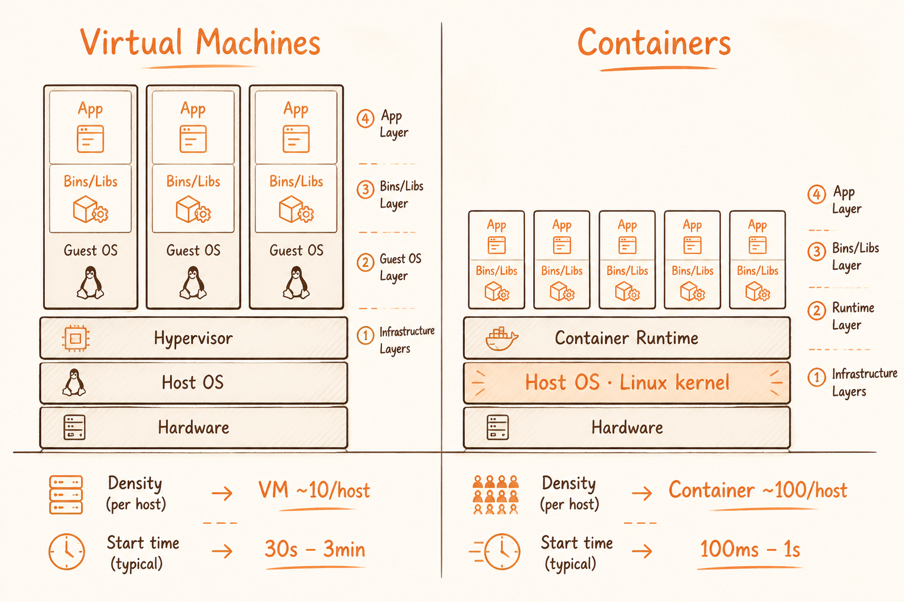
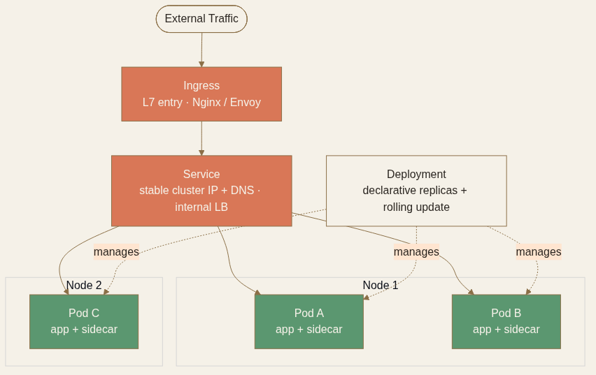
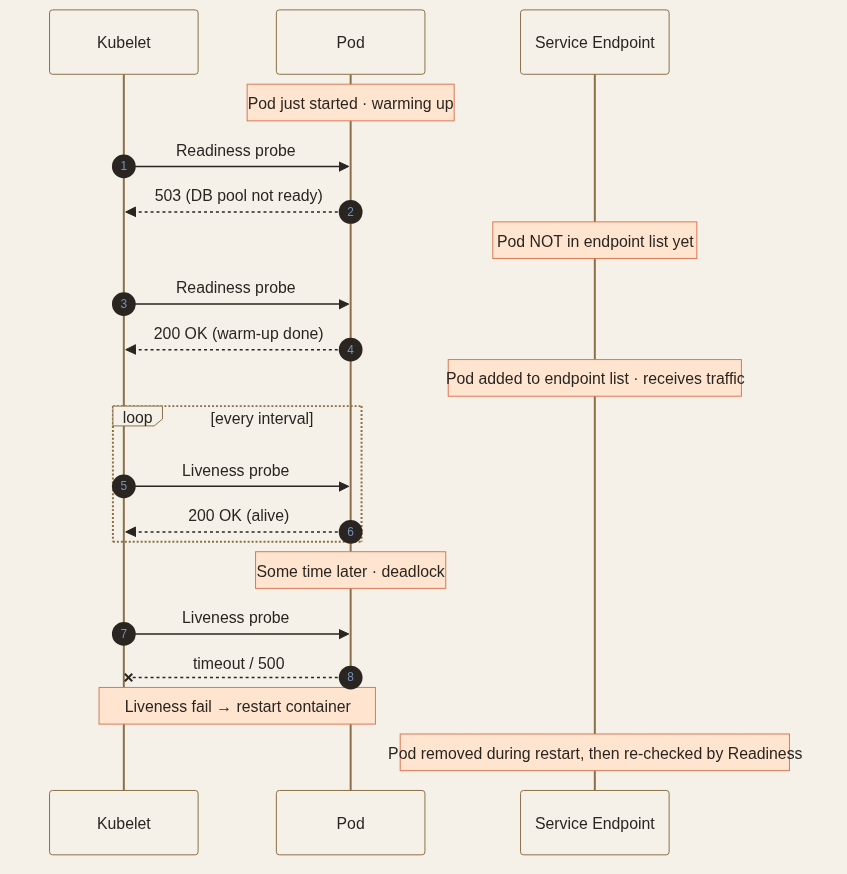

<!-- _class: chapter -->

<div class="ch-no">CHAPTER · 04 · TOPIC 05</div>

# Container
## *「應用 + 依賴」打成一個不可變的包，到處都跑得起來*


---

<!-- _class: cover -->

<div style="text-align:center;">



</div>


---


## CONTAINER · WHY

<span class="kicker">SECTION 5 · CONTAINER</span>

# 為何 Container 取代 VM？

<div class="big-number">10×</div>

<br>

| 維度 | VM | Container |
|------|-----|-----------|
| 啟動時間 | 30s-3min | 100ms-1s |
| 記憶體開銷 | 1-2 GB（含完整 OS） | 10-50 MB |
| 密度 | 10/host | 100/host |
| 隔離邊界 | 完整 kernel 隔離 | 行程層、共用 host kernel |

<br>

<div class="highlight">

**Container 革命的本質**：把「應用 + 依賴」打成一個不可變的包，**到處都跑得起來**。底層機制是 Linux **namespace**（process / network / fs 隔離） + **cgroups**（CPU / memory 限制）。

</div>

> Source: 常用技術/05 Container.pdf · §虛擬機器 vs. 容器


---


## CONTAINER · 隔離邊界

# Container vs VM 該選哪個？

<div class="tradeoff">
  <div class="pro">
    <h3>用 Container（90% 場景）</h3>
    <ul>
      <li>微服務、API、worker、排程</li>
      <li>啟動快、密度高、CI/CD 順暢</li>
      <li>同一 OS / kernel 的工作負載</li>
    </ul>
  </div>
  <div class="con">
    <h3>用 VM</h3>
    <ul>
      <li>強安全隔離（多租戶 SaaS）</li>
      <li>跑不同 OS（Windows on Linux host）</li>
      <li>Legacy 應用無法容器化</li>
      <li>Lambda / Fargate 底層用 microVM</li>
    </ul>
  </div>
</div>

<span class="muted">**Image 標準**：OCI（Open Container Initiative）image spec 是業界標準——Docker、containerd、Podman 都遵循。換 runtime 不換 image。</span>

> Source: 常用技術/05 Container.pdf · §容器和 VM 在你的設計裡什麼時候各自適合


---


## CONTAINER · 編排層

# K8s 的核心概念對應

<div class="stack">
  <div class="layer client"><strong>Pod</strong>　 一組共享網路與儲存的 container · 排程的最小單元</div>
  <div class="layer app"><strong>Deployment</strong>　 宣告式管理 Pod 副本數與滾動更新</div>
  <div class="layer data"><strong>Service</strong>　 給 Pod 一個穩定的 DNS 與 cluster IP（內建 LB）</div>
  <div class="layer infra"><strong>Ingress</strong>　 對外的 L7 入口（通常背後是 Nginx / Envoy）</div>
</div>

<br>

<span class="muted">**K8s 解的核心問題**：node 壞掉 / 流量變化 / 版本切換時，**自動把目標狀態 reconcile 出來**。HPA 根據 CPU / 記憶體 / 自訂指標自動擴縮 Pod 數量。</span>



> Source: 常用技術/05 Container.pdf · §Kubernetes 的核心概念

---


## CONTAINER · Liveness vs Readiness

# 兩種探針的職責切分

<div class="def">
<span class="term">Liveness Probe</span>
**「容器還活著嗎？」**——失敗就 kill + restart。<br>
適合檢查：process 還在、deadlock 沒發生。
</div>

<div class="def">
<span class="term">Readiness Probe</span>
**「容器準備好接流量了嗎？」**——失敗就從 Service 後端移除（不重啟）。<br>
適合檢查：DB 連線、cache warm-up 完成。
</div>

<br>

<div class="alert">

**反模式**：兩個 probe 都打同一個 endpoint。Liveness 該寬鬆（避免重啟風暴），Readiness 該嚴格（暖機中先別接流量）。

</div>



> Source: 常用技術/05 Container.pdf · §容器崩潰了怎麼辦

---


## CONTAINER · 無狀態設計

# Stateless 是容器化的前提

```
Session / 用戶狀態  →  Redis
持久化資料         →  PostgreSQL / MySQL
檔案、媒體         →  S3 / Object Storage
服務間設定         →  ConfigMap / Secrets / 環境變數
```

<br>

<div class="highlight">

**核心原則**：容器本身是短暫的（ephemeral），任何需要跨請求保留的東西都必須**外部化**。  
有狀態 = 容器 A 重啟後存在它記憶體裡的 session 全部消失，用戶被登出。

</div>

> Source: 常用技術/05 Container.pdf · §無狀態設計的重要性


---


## CONTAINER · TRADE-OFF

# 該不該上 K8s？

<div class="tradeoff">
  <div class="pro">
    <h3>該上 K8s</h3>
    <ul>
      <li>10+ 個服務、跨 team</li>
      <li>需要滾動更新、藍綠部署</li>
      <li>有 SRE 團隊維運</li>
      <li>多環境（dev/staging/prod）一致性</li>
    </ul>
  </div>
  <div class="con">
    <h3>不該上 K8s</h3>
    <ul>
      <li>< 5 個服務 → docker-compose 夠</li>
      <li>沒有專人懂網路 / RBAC / Helm</li>
      <li>業務未驗證 → ECS / Cloud Run 更省心</li>
      <li>單體應用 → VM 部署最省事</li>
    </ul>
  </div>
</div>

<div class="alert">

**反模式**：3 人團隊上 K8s。**運維時間 > 業務時間**，從第一天起就在開倒車。

</div>

> Source: 常用技術/05 Container.pdf · §什麼時候在面試裡用這些


---


<!-- _class: end -->

# Container 完
## *容器有狀態包袱——下一站看完全無狀態的 FaaS。*

<br>

<span class="lead">→ Topic 06 Serverless</span>
