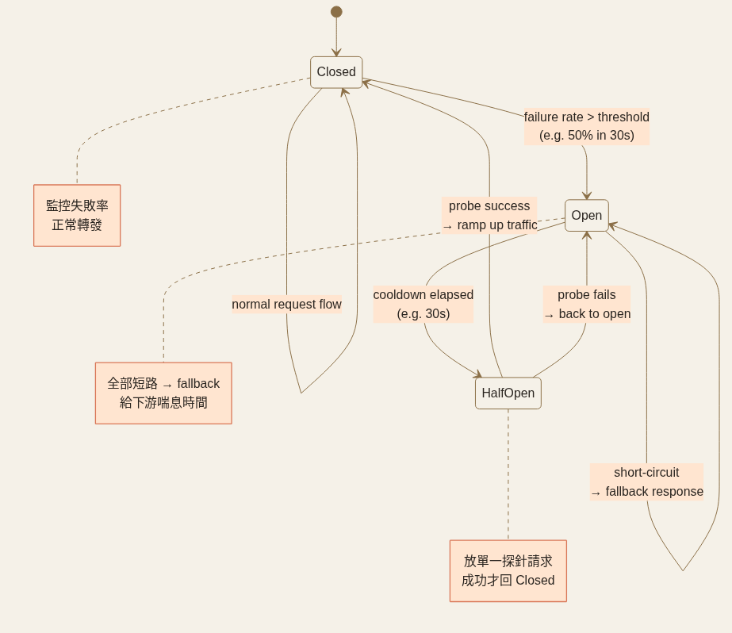
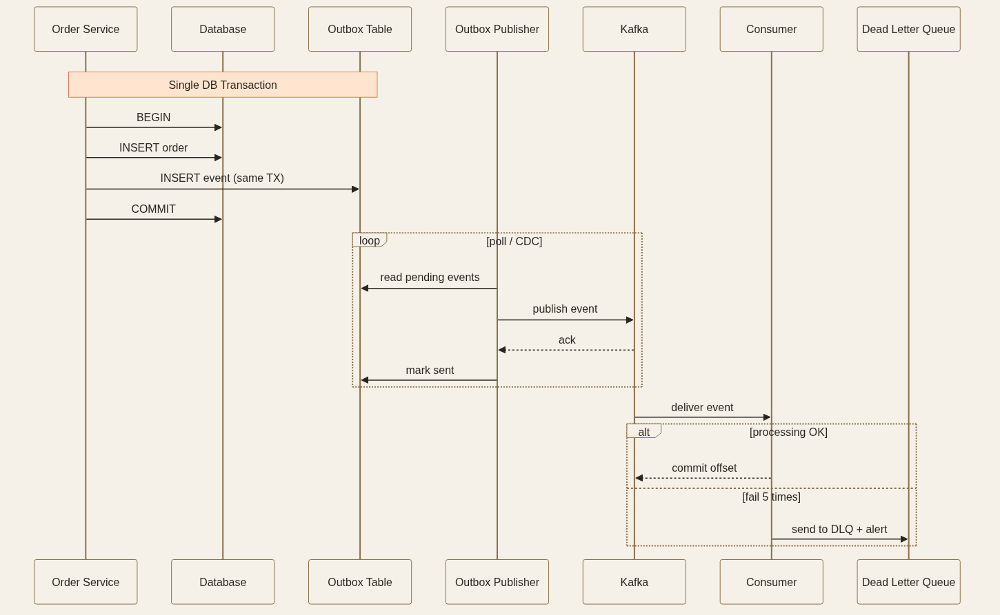

<!-- _class: chapter -->

<div class="ch-no">CHAPTER · 05 · TOPIC 04</div>

# Reliable Delivery
## *故障不是例外而是常態，6 道防線讓系統優雅應對*


---


## RELIABLE DELIVERY · WHY

# 為何訊息送達這麼難？

<br>

<div class="highlight">

**生產者 / Broker / 消費者** 任意一邊都可能壞。
**「絕對送到一次」** 在分散式系統裡是 **不可能**——只能在語意上模擬。

</div>

<br>

| 語意 | 保證 | 風險 | 範例 |
|------|------|------|------|
| **At-most-once** | 最多送一次 | 可能丟失 | 點擊統計 |
| **At-least-once** | 至少送一次 | 可能重複 | 訂單確認 email |
| **Exactly-once** | 邏輯上恰好一次 | 需要冪等性配合 | 金流交易 |

> Source: 維運與可靠性/03 Reliable Delivery.pdf · §1


---


## RELIABLE DELIVERY · 六大防線

# 不是孤立的工具，是一套相依的系統

```
請求發出
   ↓
① Timeout（讓故障快速失敗）
   ↓
② Retry（對暫時故障再給機會）
   ↓
③ Backoff with Jitter（防驚群效應）
   ↓
④ Idempotency（讓重試安全）
   ↓
⑤ Circuit Breaker（失敗率太高就熔斷）
   ↓
⑥ Failover / Fallback（找替代或降級）
```

<span class="muted">**理解它們的關係，比記每個定義更重要**。每一個防線建立在前一個的基礎上。</span>


> Source: 維運與可靠性/03 Reliable Delivery.pdf · §概念串接

---


## RELIABLE DELIVERY · Timeout

# 最基本也最常被遺忘的防線

<div class="def">
<span class="term">4 種 timeout</span>
<strong>Connection Timeout</strong>（建立連線的最長等待，幾百 ms 到幾秒）<br>
<strong>Read Timeout</strong>（連線後等回應的最長時間，依下游 P99 設定）<br>
<strong>Write Timeout</strong>（送出資料的最長時間）<br>
<strong>Overall Request Timeout</strong>（端到端預算，含所有重試）
</div>

<div class="def">
<span class="term">怎麼設值</span>
<strong>下游 P99 的 2-3 倍</strong>。如下游 P99 = 150ms → timeout 設 400ms。<br>
太短引入太多誤殺，太長失去意義。
</div>

<div class="alert">

**沒設 timeout 的後果**：依賴卡住 → 連線池塞滿 → 你的服務也停止回應 → **級聯故障（cascading failure）**。

</div>

> Source: 維運與可靠性/03 Reliable Delivery.pdf · §超時


---


## RELIABLE DELIVERY · Retry 該不該重試？

# 不是所有錯誤都該重試

<div class="tradeoff">
  <div class="pro">
    <h3>應該重試</h3>
    <ul>
      <li>網路暫時錯誤（連線/讀取超時、ECONNRESET）</li>
      <li>5xx 伺服器錯誤（503、502，通常是暫時過載）</li>
      <li>資料庫連線池暫時耗盡</li>
    </ul>
  </div>
  <div class="con">
    <h3>不應該重試</h3>
    <ul>
      <li>4xx 客戶端錯誤（400、401、403、404）</li>
      <li>業務邏輯錯誤（庫存不足、餘額不夠）</li>
      <li>非冪等操作（在做完冪等之前）</li>
    </ul>
  </div>
</div>

<div class="highlight">

**最大重試次數**：通常 **3 到 5 次**。超過就讓請求失敗，由上層降級邏輯接管。**無限重試 + 所有 client 都重試 = 把已過載的系統推向更深淵**。

</div>

> Source: 維運與可靠性/03 Reliable Delivery.pdf · §重試


---


## RELIABLE DELIVERY · Idempotency

# 讓重試變得安全

<div class="def">
<span class="term">天然冪等的操作</span>
<strong>GET</strong>（不改變狀態）· <strong>PUT</strong>（完整替換，多次 PUT 結果相同）· <strong>DELETE</strong>（刪除已不存在的資源結果相同）
</div>

<div class="def">
<span class="term">不冪等的操作（要特別處理）</span>
<strong>POST</strong>（建立新資源）：建立兩次訂單就有兩筆訂單
</div>

<div class="def">
<span class="term">Idempotency Key 模式（Stripe 的做法）</span>
Client 第一次送請求時附 UUID，重試帶相同 ID。<br>
Server 先查去重表：有就直接回前次結果，沒有才執行並存結果（TTL 24h）。
</div>

<span class="muted">**訊息佇列必備**：at-least-once delivery 是 Kafka/SQS 常見保證，consumer 必須冪等才能安全處理重複訊息。用 `message_id` 做唯一鍵。</span>

> Source: 維運與可靠性/03 Reliable Delivery.pdf · §冪等性 + Stripe API


---


## RELIABLE DELIVERY · Backoff + Jitter

# 同步重試的驚群效應

<div class="alert">

**反模式**：100 個 client 在同一毫秒失敗 → 全部 1 秒後重試 → 100 個請求又同時擊中已奄奄一息的服務 → **驚群效應（thundering herd）**。指數退避**也只是把脈衝延後**，不分散。

</div>

<br>

```python
# AWS 官方推薦：Full Jitter
def retry_with_jitter(fn, max_retries=5, base_delay=1.0, max_delay=30.0):
    for attempt in range(max_retries):
        try:
            return fn()
        except RetryableError:
            cap = min(base_delay * (2 ** attempt), max_delay)
            delay = random.uniform(0, cap)   # ← 在 [0, cap] 隨機選
            time.sleep(delay)
```

<span class="muted">**Decorrelated Jitter** 變體：每次等待時間基於上次等待時間，隨機性更強，效果通常更好但實作稍複雜。</span>

> Source: 維運與可靠性/03 Reliable Delivery.pdf · §退避加抖動 (AWS)


---


## RELIABLE DELIVERY · Circuit Breaker

# 失敗率超閾值就熔斷，三狀態圖

```
Closed（正常） → 失敗率超過閾值 → Open（熔斷）
                                    ↓ 等待一段時間（如 30s）
                                Half-Open（半開）
                                  ↙        ↘
                          測試請求成功    測試請求失敗
                            → Closed       → Open
```

<div class="def">
<span class="term">Closed（正常）</span> 監控失敗率，正常轉發
</div>

<div class="def">
<span class="term">Open（熔斷）</span> 直接走降級，下游服務得到喘息
</div>

<div class="def">
<span class="term">Half-Open（半開）</span> 放一個探針請求進來測試是否恢復
</div>

<span class="muted">**Half-Open 的關鍵**：恢復後**不要立刻全流量放開**，要 traffic ramp-up 逐步放量，否則突然全流量再次擊垮剛恢復的服務。</span>



> Source: 維運與可靠性/03 Reliable Delivery.pdf · §熔斷器三狀態

---


## RELIABLE DELIVERY · Failover vs Fallback

# 兩個都是「服務替代」，方向不同

<div class="tradeoff">
  <div class="pro">
    <h3>Failover（故障切換）</h3>
    <ul>
      <li>找一個**健康的同類**來替代</li>
      <li>LB health check 把不健康節點移出</li>
      <li>DB Primary 掛 → 提升 Replica（同步：無丟失但慢；非同步：快但可能失資料）</li>
      <li>RDS Multi-AZ 自動切換 ~60 秒</li>
    </ul>
  </div>
  <div class="con">
    <h3>Fallback（降級回應）</h3>
    <ul>
      <li>用一個**較簡陋但能用**的替代撐過去</li>
      <li>DB 掛 → 回快取裡的舊資料（serve stale）</li>
      <li>推薦系統掛 → 回「熱門商品」靜態列表</li>
      <li>評分服務超時 → 顯示「暫時不可用」而不是整頁崩潰</li>
    </ul>
  </div>
</div>

> Source: 維運與可靠性/03 Reliable Delivery.pdf · §故障切換 + 降級回應


---


## RELIABLE DELIVERY · Outbox / DLQ

# 事務性 Outbox + 毒訊息隔離

<div class="def">
<span class="term">Transactional Outbox</span>
寫業務 + 寫 outbox 表在**同一個 DB transaction**裡完成。<br>
背景進程從 outbox 撈訊息送到 broker（搭配 CDC 如 Debezium 直接讀 WAL）。<br>
**徹底解決**「DB 寫成功但訊息發送失敗」的不一致。
</div>

<div class="def">
<span class="term">Dead Letter Queue（DLQ）</span>
重試 3-5 次仍失敗的訊息送 DLQ，主流程不被毒訊息堵塞。<br>
**監控指標**：DLQ 訊息數應為 0；> 0 工程師介入。
</div>

<div class="alert">

**沒 DLQ 的災難**：毒訊息卡住 partition → 整批訊息堵在後面 → 系統看起來活著但沒在動。

</div>



> Source: 維運與可靠性/03 Reliable Delivery.pdf · §3 + 整合 Outbox 慣例

---


## RELIABLE DELIVERY · 一段話講完

# 面試金句模板

<div class="highlight">

「這地方我們調用了**支付 API**。我會設定 **3 秒讀取超時**，對 **5xx 錯誤做指數退避重試**（最多 3 次，加上 jitter 防驚群效應）。每個支付請求**帶上冪等鍵**，確保重試不會導致重複扣款。如果失敗率在 30 秒內超過 50%，**熔斷器打開**，直接回傳『支付服務暫時不可用』的錯誤，而不是讓用戶等到超時。」

</div>

<br>

<span class="muted">這一段話就涵蓋了 **Timeout、Retry、Backoff with Jitter、冪等性、Circuit Breaker**，完整而自然。**比逐個列定義更有說服力**。</span>

> Source: 維運與可靠性/03 Reliable Delivery.pdf · §面試裡的說法


---


<!-- _class: end -->

# Reliable Delivery 完
## *系統能優雅應對故障，最後讓它變透明可觀測。*

<br>

<span class="lead">→ 5.5 Observability</span>
