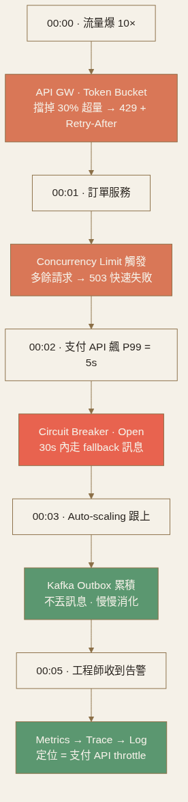

<!-- _class: chapter -->

CHAPTER · 05 · RECAP

# Recap & Case Study
## *一個 incident，把 5 層可靠性串起來*

---

## CASE STUDY · 訂單系統的可靠性堆疊

# 設計：把 5 層配齊

  
<strong>① Contain</strong>　 資料層連線池隔離（read pool / write pool）· timeout 1s · bulkhead 隔離支付/通知/DB

  
<strong>② Coordinate</strong>　 庫存扣減用 etcd 分散式鎖 · idempotency_key 防重複下單 · OCC 樂觀鎖更新庫存

  
<strong>③ Protect</strong>　 API GW token bucket 限流（用戶 10 RPS）· concurrency limit 50 · 下游 circuit breaker 50% error 觸發 · 過載丟棄 retry 請求

  
<strong>④ Deliver</strong>　 訂單事件用 transactional outbox + Kafka · consumer 用 message_id 去重 · 失敗 5 次入 DLQ + 告警

  
<strong>⑤ Observe</strong>　 SLO P99 < 800ms · 四金信號全收 · trace 全採異常 + 1% 正常 · 錯誤率 0.1% PagerDuty

> Source: 整合 Ch.5 全章 + Stripe / Shopify Engineering Blog

---

## CASE STUDY · Incident 演練

# 黑色星期五，10× 流量打進來

  
<strong>00:00</strong>　 流量爆 → API GW token bucket 擋掉 30% 超量請求，回 <code>429</code> + Retry-After

  
<strong>00:01</strong>　 訂單服務 concurrency limit 觸發，多餘請求快速失敗（503）保住已進來的

  
<strong>00:02</strong>　 支付 API P99 飆到 5s → 熔斷器 Open，30 秒內走 fallback「稍後重試」

  
<strong>00:03</strong>　 Auto-scaling 跟上，Kafka outbox 累積但不丟訊息，consumer 慢慢消化

  
<strong>00:05</strong>　 Metrics 警告觸發 → trace 定位到支付 API → log 確認對方在 throttle 我們

 

**5 層全配齊**才能在 10× 流量、雲服務部分故障、惡意攻擊下守住 SLA。沒有 observability，這 5 分鐘你會像盲人摸象。

---

## RECAP · 第五章帶走的東西

  

    <h3>新的工具</h3>
    <ul>
      <li>4 種分散式鎖 + fencing token + 三大陷阱</li>
      <li>5 種 contention 解法（Pessimistic / OCC / SERIALIZABLE / 2PC / Saga）</li>
      <li>6 層過載防護 + Token vs Leaky bucket</li>
      <li>Reliable Delivery 6 防線 + Circuit Breaker 三狀態</li>
      <li>三支柱 + 四金信號 + USE / RED + Error Budget</li>
    </ul>
  

  

    <h3>還沒回答的問題</h3>
    <ul>
      <li>讀多怎麼撐？　→ Ch.6 Scaling Reads</li>
      <li>寫多怎麼撐？　→ Ch.6 Scaling Writes</li>
      <li>大檔案怎麼分發？　→ Ch.6 CDN / Large Blob</li>
    </ul>
  

---

## RECAP · 一句話總結每個主題

Distributed Lock 鎖是設計失敗的證據。先想能不能改資料結構消除鎖，再考慮鎖。

Contention 能在單 DB 解決就不要跨 DB；能用 OCC 就不要用 pessimistic lock。

Overload Protection 6 層疊加的防線，每層擋一種失敗。處理 30% 比所有人一起死要好。

Reliable Delivery Timeout → Retry → Backoff+Jitter → Idempotency → Circuit Breaker → Fallback，互相依存。

Observability Metrics 是儀表板，Traces 縮範圍，Logs 給細節。對症狀警告，不對原因警告。

---

<!-- _class: end -->

# Ch.5 完
## *系統能在故障中存活，下一站把流量擴展到極致。*

 

→ Ch.6 Scaling Patterns
