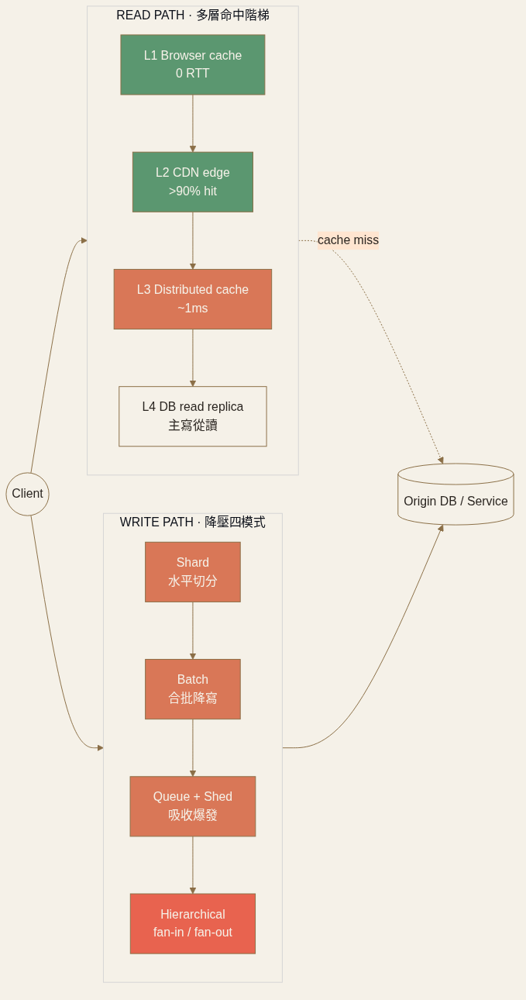

<!-- _class: chapter -->

CHAPTER · 06 · TOPIC 00

# Scaling Patterns
## *把系統擴展到 10×、100×、1000× 的具體模式*

<!--
開場 30 秒：
- Ch.5 教「故障下存活」；Ch.6 教「流量爆發下存活」
- 4 個關鍵字：Scale Reads · Scale Writes · Distributed Cache · CDN
- 講者語氣：模式驅動，每個 pattern 都對應一個明確的 bottleneck
-->

---

<!-- _class: cover -->

---

## OBJECTIVES · MENTAL MODEL · NUMBERS

  
<strong>① READ PATH</strong>　 Replica · Cache · Materialized View → Ch.6.1

  
<strong>② WRITE PATH</strong>　 Shard · Batch · Queue · Aggregate → Ch.6.2

  
<strong>③ CACHE</strong>　 Distributed cache · 一致性 · HA → Ch.6.3

  
<strong>④ EDGE</strong>　 CDN · Edge compute · 全球分發 → Ch.6.4

| 元件 | 單機上限 | 撞牆訊號 |
|------|---------|---------|
| 關聯式 DB（B-tree） | ~1K wps | CPU/IO wait |
| Cassandra（append-only） | ~10K wps | compaction 排隊 |
| Redis 單機 | ~100K ops/s | network bw 滿 |
| Read replica（有 index） | 50K–100K rps | replication lag |

**讀寫不對稱**：90% 系統讀:寫 = 100:1。先優化讀，撞牆再優化寫。

> Source: 常用技術/08 + 10 · 設計模式/01 §2 · 02 §1
