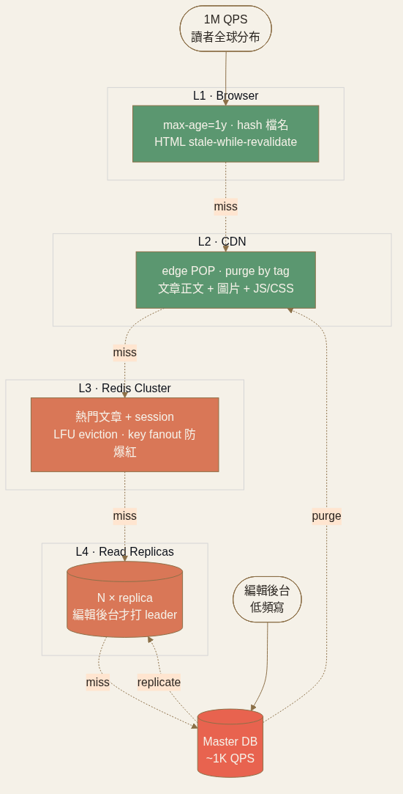

<!-- _class: chapter -->

CHAPTER · 06 · RECAP

# Ch.6 Recap
## *把 4 個擴展模式串成真實系統*

---

## CASE STUDY · 新聞網站（極致讀擴展）

  
<strong>L1 · Browser</strong>　 圖文 max-age=1 年（hash 檔名）· HTML stale-while-revalidate

  
<strong>L2 · CDN</strong>　 文章正文 + 圖片 + JS/CSS edge cache · purge by tag 上稿即刷

  
<strong>L3 · Redis Cluster</strong>　 熱門文章 + session · LFU eviction · key fanout 防爆紅

  
<strong>L4 · DB Read Replicas</strong>　 一寫多讀 · 編輯後台才打 leader

**99% 讀請求在 L2 命中**——讀流量看似 1M QPS，DB 實際只承受 1k QPS。

---

## RECAP · 第六章帶走的東西

  

    <h3>新的工具</h3>
    <ul>
      <li>讀擴展 4 層階梯 + cache versioning + stampede 防禦</li>
      <li>寫擴展 4 模式（Shard/Batch/Queue/Aggregate）+ hot key split</li>
      <li>Distributed cache：consistent hashing · replication · failure modes</li>
      <li>CDN 4 層 + invalidation 三招 + edge compute</li>
    </ul>
  

  

    <h3>還沒回答的問題</h3>
    <ul>
      <li>異步任務怎麼設計？　→ Ch.7 Queue / Long Running</li>
      <li>即時推播怎麼做？　→ Ch.7 Real-time</li>
      <li>大檔案怎麼處理？　→ Ch.7 Large Blobs</li>
      <li>怎麼做全文搜尋？　→ Ch.7 Search</li>
      <li>RAG 系統長怎樣？　→ Ch.7 RAG</li>
    </ul>
  

---

<!-- _class: end -->

# Ch.6 完
## *擴展模式都備齊了，下一站進階：異步、即時、搜尋、AI。*

 

→ Ch.7 Advanced Patterns
