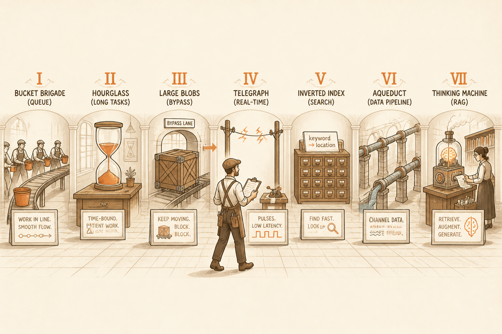
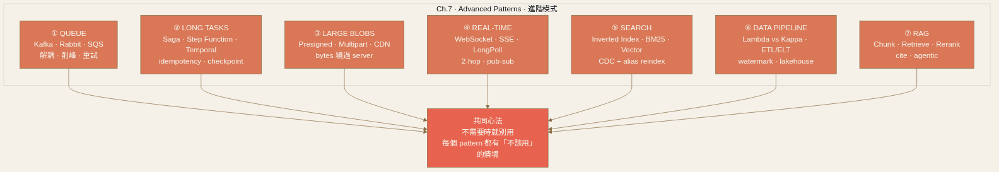

<!-- _class: chapter -->

<div class="ch-no">CHAPTER · 07 · TOPIC 00</div>

# Advanced Patterns
## *進階場景的專用模式 · 異步、即時、搜尋、管線、AI*

<!--
開場 30 秒：
- Ch.6 把通用擴展模式講完；Ch.7 進入特定場景才需要的進階 pattern
- 7 個關鍵字：Queue · Long Tasks · Large Blobs · Real-time · Search · Pipeline · RAG
- 每個都標註「什麼系統真的需要」
-->


---

<!-- _class: cover -->

<div style="text-align:center;">



</div>


---


## OBJECTIVES · 學習目標

看完本章，你能回答：

<div class="stack">
  <div class="layer client"><strong>① Queue 怎麼選？</strong>　 Kafka vs RabbitMQ vs SQS · partition / DLQ / backpressure</div>
  <div class="layer app"><strong>② 長任務怎麼設計？</strong>　 切片、checkpointing、idempotency、saga</div>
  <div class="layer data"><strong>③ 大檔案怎麼搬？</strong>　 presigned URL · multipart · CDN · resume</div>
  <div class="layer infra"><strong>④ 即時推播怎麼做？</strong>　 WebSocket / SSE / Long Polling · 1M connection scale</div>
  <div class="layer infra"><strong>⑤ 全文搜尋為何需要專用引擎？</strong>　 倒排索引 · BM25 · vector</div>
  <div class="layer infra"><strong>⑥ Lambda / Kappa 架構差在哪？</strong>　 batch + stream · ETL vs ELT</div>
  <div class="layer infra"><strong>⑦ RAG 系統怎麼搭？</strong>　 chunk · retrieve · rerank · hallucination 對策</div>
</div>

> Source: 常用技術/07 + 設計模式/03 + 04 + 05 + 06 + 07 + 08


---


## MENTAL MODEL · 進階模式 7 個方向

```
┌──────────────────────────────────────────────────┐
│  ⑦ AI       RAG · Vector DB · LLM orchestration  │  ← 07
├──────────────────────────────────────────────────┤
│  ⑥ ANALYTIC Data Pipeline · Lambda / Kappa       │  ← 06
├──────────────────────────────────────────────────┤
│  ⑤ SEARCH   Inverted Index · Relevance · Index   │  ← 05
├──────────────────────────────────────────────────┤
│  ④ REALTIME WebSocket · SSE · Long Polling       │  ← 04
├──────────────────────────────────────────────────┤
│  ③ BLOB     Presigned URL · Multipart · CDN      │  ← 03
├──────────────────────────────────────────────────┤
│  ② LONG     Saga · Step Function · Checkpoint    │  ← 02
├──────────────────────────────────────────────────┤
│  ① QUEUE    Kafka · Rabbit · SQS · NATS          │  ← 01
└──────────────────────────────────────────────────┘
        每個都有「什麼時候用、什麼時候別用」
```

<span class="muted">**這章的 pattern 大多是「不需要時就別用」**——加一個 Kafka 進來，整個系統複雜度跳一階。</span>



> Source: 整理自 常用技術/07 + 設計模式/03/04/05/06/07/08

---


<!-- _class: end -->

# Overview 完
## *先講 Queue——進階模式的共同基石。*

<br>

<span class="lead">→ 01 Queue</span>
