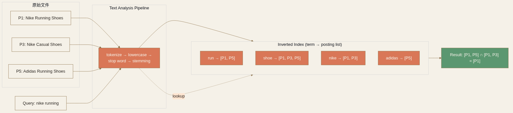
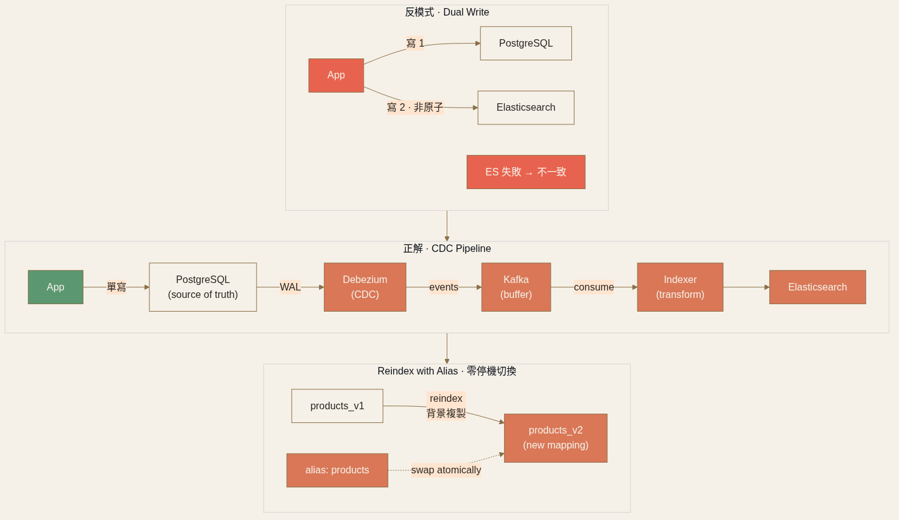

<!-- _class: chapter -->

<div class="ch-no">CHAPTER · 07 · TOPIC 05</div>

# Search System
## *搜尋是相關性排序 · 不是精確比對 · 不該住在主資料庫*


---


## SEARCH · WHY

# 為何 LIKE '%xxx%' 不夠？

<br>

<div class="highlight">

**SQL LIKE** 不能用 index（前綴萬用字）→ 必須**全表掃**。  
**SQL LIKE** 不會做斷詞、同義詞、相關性、拼字糾正、boost 排序。  
**Search 引擎**做的事是：**理解使用者真正想找什麼**。

</div>

<br>

<span class="muted">資料庫做**精確比對**（user_id=123）；搜尋做**相關性排序**（所有「跑步鞋」相關商品按關聯度排）。完全不同的資料結構和查詢引擎。</span>

> Source: 設計模式/06 Search System.pdf · §為什麼搜尋是一個獨立的設計問題


---


## SEARCH · 倒排索引

# Inverted Index：搜尋引擎的核心

```
原始文件：
  P1: "Nike Running Shoes"
  P3: "Nike Casual Shoes"
  P5: "Adidas Running Shoes"

倒排索引（term → posting list）：
  run    → [P1, P5]
  shoe   → [P1, P3, P5]
  nike   → [P1, P3]
  adidas → [P5]

查詢「nike running」→ [P1, P5] ∩ [P1, P3] = [P1]
```

<div class="def">
<span class="term">Text Analysis Pipeline</span>
Tokenize → Lowercase → Stop word removal → Stemming（running/runs/ran → run）。**index 和 query 必須走同一條 pipeline**才能匹配。
</div>



> Source: 設計模式/06 Search System.pdf · §倒排索引

---


## SEARCH · Indexing Pipeline

# CDC 是預設答案，不是 Dual Write

<div class="alert">

**反模式 — Dual Write**：app 同時寫 PostgreSQL 和 ES。  
**問題**：兩個寫入不是原子的——ES 失敗就資料不一致。

</div>

```
PostgreSQL ──WAL──→ Debezium ──events──→ Kafka ──→ Indexer ──→ Elasticsearch
   (source)         (CDC)                (buffer)   (transform)   (search idx)
```

<div class="highlight">

**CDC 優點**：應用只寫主庫 · 搜尋同步完全解耦 · ES 暫時掛了 Kafka 緩衝不丟資料 · 索引時可做轉換（合併多表、計算欄位）  
**代價**：幾秒到幾十秒延遲（大多數搜尋場景可接受）

</div>



> Source: 設計模式/06 Search System.pdf · §Indexing Pipeline

---


## SEARCH · 相關性排序

# BM25 + Boosting + 業務指標

<div class="def">
<span class="term">BM25（Lucene/ES 預設）</span>
TF-IDF 改良版 · 加入文件長度標準化 · TF 飽和函數。<strong>「Gore-Tex」IDF 高（罕見有辨別力）</strong>，「鞋」IDF 低（每個商品都有）。
</div>

<div class="def">
<span class="term">Field Boosting</span>
<code>"fields": ["name^3", "category^2", "description^1"]</code>——名稱權重是描述的 3 倍。同樣的關鍵字出現位置不同，相關性不同。
</div>

<div class="def">
<span class="term">業務邏輯混入排序</span>
最終分數 = 相關性 × 0.6 + 銷量 × 0.2 + 評分 × 0.1 + 新品加成 × 0.1。**純文字相關性不夠**，真實搜尋總是業務指標的線性組合。
</div>

> Source: 設計模式/06 Search System.pdf · §相關性排序


---


## SEARCH · 進階：Vector / Hybrid

# 從 BM25 到語義搜尋

<div class="def">
<span class="term">Vector / Semantic Search</span>
query 與文件都轉成向量找最相近——**不依賴關鍵字命中**。「我的車怪聲音」可匹配「引擎異音」。
</div>

<div class="def">
<span class="term">Hybrid Search</span>
**BM25（lexical / sparse）** + **vector（semantic / dense）** → 取聯集 → cross-encoder rerank。  
適合 query 帶縮寫、產品名、團隊名（lexical 強），又要處理同義詞（semantic 強）。
</div>

<div class="def">
<span class="term">Autocomplete = Edge N-gram</span>
indexing 時把 "running" 拆成 r/ru/run/runn/runni/runnin/running，**每個前綴都建索引**——查詢直接用前綴精確匹配，**100ms 內回應**。
</div>

> Source: 設計模式/06 Search System.pdf · §Autocomplete + RAG context


---


## SEARCH · Elasticsearch 部署

# Sharding · Replica · Cold/Warm/Hot

<div class="stack">
  <div class="layer client"><strong>① Coordinator + Data Node</strong>　 query 進 coordinator → 並行查所有 shard → 合併結果</div>
  <div class="layer app"><strong>② Sharding</strong>　 每 shard 控制 <strong>10–50GB</strong>；索引建立時固定，事後只能 reindex 改</div>
  <div class="layer data"><strong>③ Replica</strong>　 1 primary + 1–2 replica，提供讀吞吐和容錯</div>
  <div class="layer infra"><strong>④ Hot/Warm/Cold Tier</strong>　 熱資料用 SSD · 冷 log 移到 cheap S3-backed nodes</div>
</div>

<br>

<div class="highlight">

**Shard 估算**：預估一年資料量 ÷ 25GB = primary shard 數。**寧可多設一點**——數量固定後只能 reindex。

</div>

> Source: 設計模式/06 Search System.pdf · §搜尋系統的擴展


---


## SEARCH · Reindex with Alias

# 零停機索引切換

```
1. Create products_v2  (新 mapping)
2. Reindex products_v1 → products_v2  (背景複製)
3. Atomic alias swap: "products" → v2  ← 一行命令切換
4. Delete products_v1
```

<div class="alert">

**反模式**：直接刪除舊索引重建——搜尋會在重建期間失效。  
**正解**：用 alias 做零停機切換，這是 Elasticsearch 的**標準做法**。

</div>

<span class="muted">**ES 不該做主存儲**——它是 secondary index，主資料還在 PostgreSQL/MySQL。掛了重建即可。</span>

> Source: 設計模式/06 Search System.pdf · §重建索引


---


## SEARCH · 分頁陷阱

| 方式 | 適用 | 注意 |
|------|------|------|
| **From/Size** | 有頁碼的搜尋（電商） | **限制最大 offset 10,000**——深分頁效能崩潰 |
| **Search After** | 無限下拉 feed（手機 App） | 效能穩 · 但**不能跳頁** |
| **PIT Cursor** | 翻頁過程要一致快照 | 成本最高 · 適合報表匯出 |

<br>

<div class="highlight">

**面試標準答案**：「搜尋功能我會用 Elasticsearch 建獨立索引，資料透過 CDC + Kafka 從主資料庫非同步同步。」**主動說「不會用 LIKE」就拿一半分**。

</div>

> Source: 設計模式/06 Search System.pdf · §分頁


---


<!-- _class: end -->

# Search 完
## *倒排索引 + 相關性排序 + 業務指標——下一站講分析資料怎麼搬。*

<br>

<span class="lead">→ 06 Data Pipeline</span>
