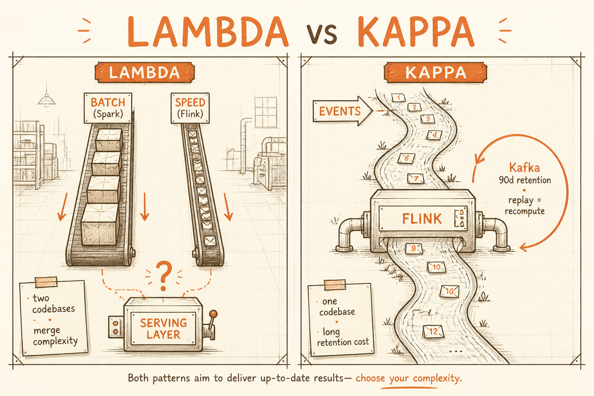
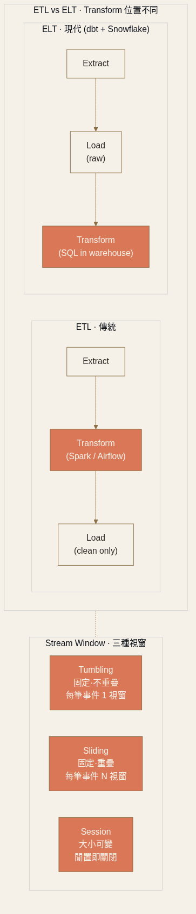

<!-- _class: chapter -->

<div class="ch-no">CHAPTER · 07 · TOPIC 06</div>

# Data Pipeline
## *把原始事件搬到能被分析的地方 — 別在 OLTP 上跑 OLAP*


---

<!-- _class: cover -->

<div style="text-align:center;">



</div>


---


## PIPELINE · WHY

# 為何 OLTP 跟 OLAP 要分開？

| 維度 | OLTP（線上交易） | OLAP（離線分析） |
|------|-----------------|-----------------|
| 寫頻率 | 高（每筆即時） | 批次（每日 / 每小時） |
| 查詢模式 | by primary key | aggregation / join 巨表 |
| 延遲要求 | <100ms | 秒-分鐘可接受 |
| 資料量 | TB | PB+ |
| 引擎 | PostgreSQL · MySQL | BigQuery · Snowflake · Redshift |

<div class="highlight">

**在 OLTP 上跑 OLAP 查詢** = 把報表跑死交易庫。  
**Data Pipeline 的職責**：把資料從 OLTP **複製 / 轉換**到 OLAP。

</div>

> Source: 設計模式/07 Data Pipeline.pdf · §什麼是 Data Pipeline


---


## PIPELINE · Batch vs Stream

# 批次還是串流？延遲決定一切

<div class="tradeoff">
  <div class="pro">
    <h3>Batch（Spark）</h3>
    <ul>
      <li>處理「靜止的資料」 · 每小時 / 每天跑</li>
      <li>吞吐高 · 成本低 · 邏輯簡單</li>
      <li>延遲：<strong>≥ 10 分鐘</strong>（Spark job 啟動約 5–8 分鐘）</li>
      <li>用途：報表、ML 訓練、帳單計算</li>
    </ul>
  </div>
  <div class="con">
    <h3>Stream（Flink / Kafka Streams）</h3>
    <ul>
      <li>處理「移動中的資料」 · 來一筆處理一筆</li>
      <li>低延遲（秒/亞秒）· 複雜度高</li>
      <li>用途：詐欺偵測、即時儀表板、推薦</li>
      <li>必須處理：重試、亂序、不重複計算</li>
    </ul>
  </div>
</div>

<span class="muted">**第一個問題永遠是**：「這個資料需要多快被看到？」</span>

> Source: 設計模式/07 Data Pipeline.pdf · §批次還是串流


---


## PIPELINE · Stream 視窗

# Tumbling · Sliding · Session

<div class="def">
<span class="term">Tumbling Window（滾動）</span>
固定大小 · 不重疊。「過去 5 分鐘的訂單數」——每筆事件只屬於一個視窗。
</div>

<div class="def">
<span class="term">Sliding Window（滑動）</span>
固定大小 · 重疊。「最近 5 分鐘的訂單數，每 1 分鐘更新」——同一筆事件可能屬於多個視窗。
</div>

<div class="def">
<span class="term">Session Window（會話）</span>
按用戶活動分組 · 閒置超過 N 分鐘算 session 結束。**大小可變**——適合分析用戶行為流。
</div>



> Source: 設計模式/07 Data Pipeline Design.pdf · §Apache Flink

---


## PIPELINE · Event Time & Watermark

# 串流處理最微妙的問題

<div class="alert">

**問題**：手機離線時產生的事件，網路恢復才送到 server。  
用「處理時間」分視窗會把它分到錯誤的視窗。

</div>

<br>

<div class="highlight">

**Event Time**：用事件本身記錄的真實發生時間  
**Watermark**：處理器對「這個時間點之前的所有事件都已到達」的聲明——**watermark 推進 → 視窗關閉並輸出**

</div>

<span class="muted">**取捨**：watermark 延遲設長（10s）→ 結果準確但輸出慢；設短 → 快但可能漏遲到事件。</span>

> Source: 設計模式/07 Data Pipeline.pdf · §Event Time vs Processing Time


---


## PIPELINE · Lambda vs Kappa

<div class="matrix-2x2">
  <div class="featured">
    <strong>Lambda 架構</strong>
    Batch layer（Spark · 完整正確）<br>
    + Speed layer（Flink · 低延遲近似）<br>
    + Serving layer 合併
  </div>
  <div>
    <strong>Kappa 架構</strong>
    只有一條 stream pipeline（Kafka + Flink）<br>
    重新計算 = replay log<br>
    Kafka 保留期設足夠長（例如 90 天）
  </div>
  <div>
    <strong>Lambda 痛點</strong>
    兩套 codebase（batch / stream）<br>
    相同邏輯改兩遍 · 結果合併複雜
  </div>
  <div>
    <strong>Kappa 痛點</strong>
    重算大量歷史時 stream 比 Spark 慢<br>
    Kafka 長期保留儲存成本高
  </div>
</div>

<span class="muted">**現代趨勢**：**Kappa 為主**——維護成本低。除非題目強調「TB 級歷史分析」才需 Lambda。</span>

> Source: 設計模式/07 Data Pipeline.pdf · §兩種架構哲學


---


## PIPELINE · ETL vs ELT

<div class="tradeoff">
  <div class="pro">
    <h3>ETL（傳統）</h3>
    <ul>
      <li>Extract → <strong>Transform</strong> → Load</li>
      <li>清洗在中間層（Spark / Airflow）</li>
      <li>Warehouse 只進入乾淨資料</li>
      <li><em>痛點：transform schema 寫死，新需求要回源頭重抽</em></li>
    </ul>
  </div>
  <div class="con">
    <h3>ELT（現代）</h3>
    <ul>
      <li>Extract → Load → <strong>Transform</strong>（在 Warehouse 內）</li>
      <li>原始資料先進 Snowflake/BigQuery</li>
      <li>用 SQL（dbt）做 transform layer</li>
      <li>新需求改 SQL 即可，不重 ingest</li>
    </ul>
  </div>
</div>

<div class="highlight">

**ELT + dbt + Snowflake/BigQuery** 是 2020s 的事實標準——把昂貴的 transform 工作交給雲端 data warehouse 的 MPP 引擎。

</div>

> Source: 設計模式/07 Data Pipeline.pdf · §ETL 與 ELT


---


## PIPELINE · 資料去哪？

# Warehouse · Lake · Lakehouse

<div class="def">
<span class="term">Data Warehouse</span>
**結構化、已清洗** · schema-on-write · 適合 BI 報表。BigQuery · Snowflake · Redshift。
</div>

<div class="def">
<span class="term">Data Lake</span>
**原始、未處理** · schema-on-read · 儲存便宜彈性高 · 適合 ML 訓練。S3 + Parquet · HDFS · Azure Data Lake。
</div>

<div class="def">
<span class="term">Data Lakehouse（湖倉一體）</span>
S3 上加格式層（**Apache Iceberg / Delta Lake**）→ 支援 ACID 事務、Schema 演化、time travel、高效分析查詢。**Databricks / Snowflake 都在走這條路**。
</div>

> Source: 設計模式/07 Data Pipeline.pdf · §資料去哪裡


---


## PIPELINE · 容錯機制

# 三種語意保證 · Exactly-Once 是怎麼做到的

<div class="def">
<span class="term">At-most-once</span>
最多一次 · 可能遺失。實作最簡單，**金融/健康場景無法接受**。
</div>

<div class="def">
<span class="term">At-least-once</span>
至少一次 · 可能重複。**大多數系統的預設**——遇到失敗就重試。
</div>

<div class="def">
<span class="term">Exactly-once</span>
精確一次。代價最高。**實務做法**：pipeline 保證 at-least-once + **下游寫入做冪等**（upsert / ON CONFLICT DO NOTHING）→ 等同 exactly-once 效果。
</div>

<span class="muted">**Checkpoint** = 串流處理器把當前 offset + 中間聚合 state 寫到 S3。崩潰後從 checkpoint 恢復，不從頭重算。</span>

> Source: 設計模式/07 Data Pipeline.pdf · §容錯機制


---


## PIPELINE · CDC + Fan-out

# 兩個常見的管線模式

```
[CDC]  PostgreSQL ──WAL──→ Debezium ──→ Kafka ──→ {BigQuery · ES · Redis}

[Fan-out]  App Server ──event──→ Kafka Topic ──┬──→ Feed Service
                                              ├──→ Search Indexer
                                              ├──→ Recommendation
                                              └──→ Analytics
```

<div class="highlight">

**面試標準答案**：「不影響線上 DB 效能下同步資料到另一個系統，**CDC + Kafka 是預設方案**。」

</div>

<span class="muted">**Data Enrichment**：高吞吐 stream 中，每筆事件都查 DB 找 user profile 會死。把 user profile 快取在 Redis / 本地記憶體並定期刷。</span>

> Source: 設計模式/07 Data Pipeline.pdf · §三個常見的管線模式


---


<!-- _class: end -->

# Data Pipeline 完
## *Kafka 是骨幹 · Flink 是引擎——下一站講 RAG 怎麼幫 LLM 接上你的私有資料。*

<br>

<span class="lead">→ 07 RAG</span>
