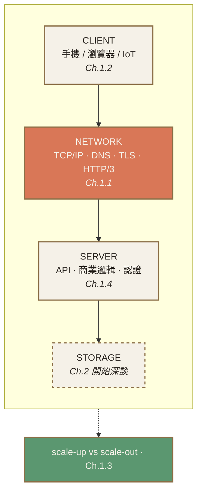
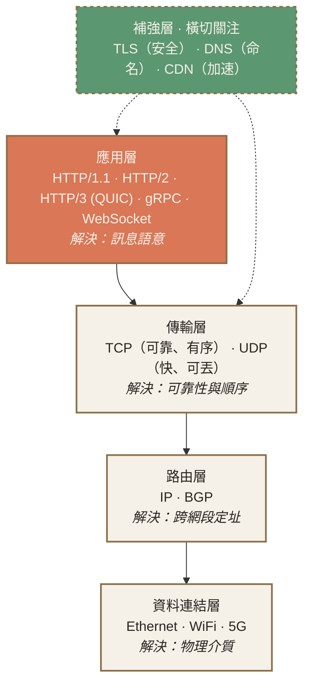
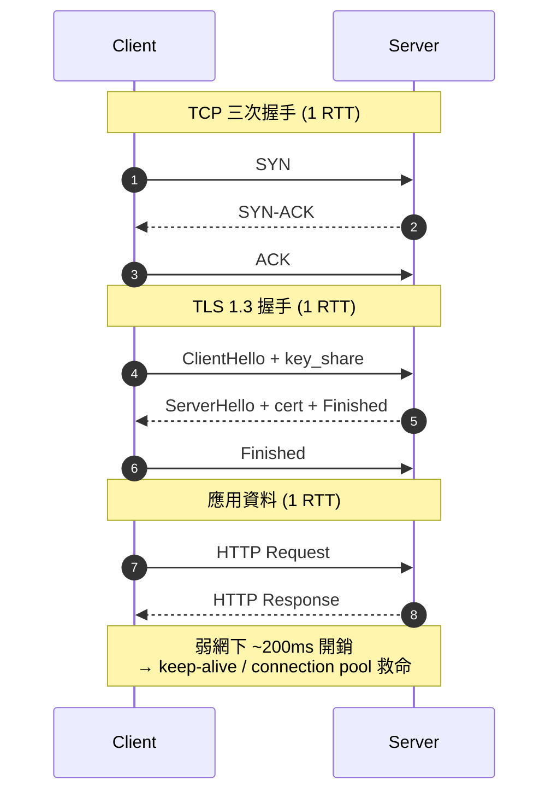
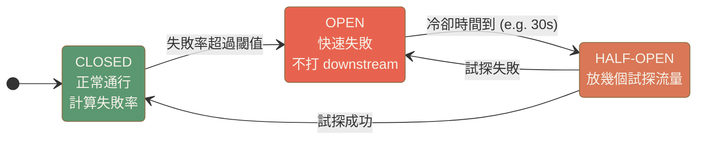
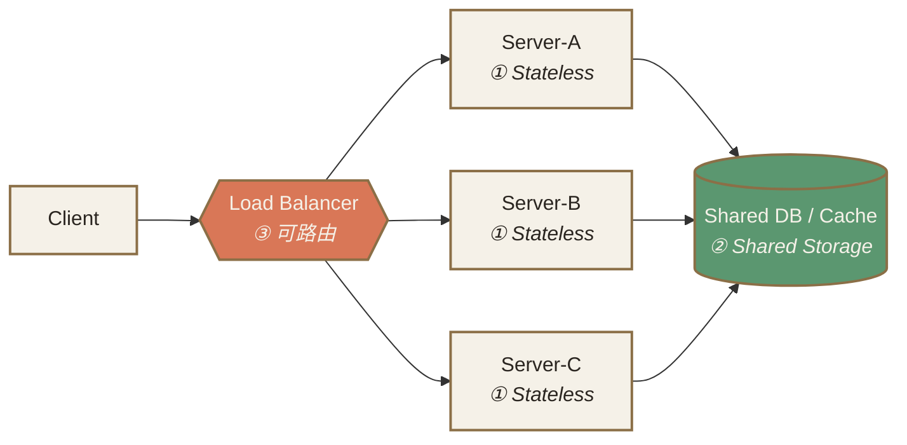
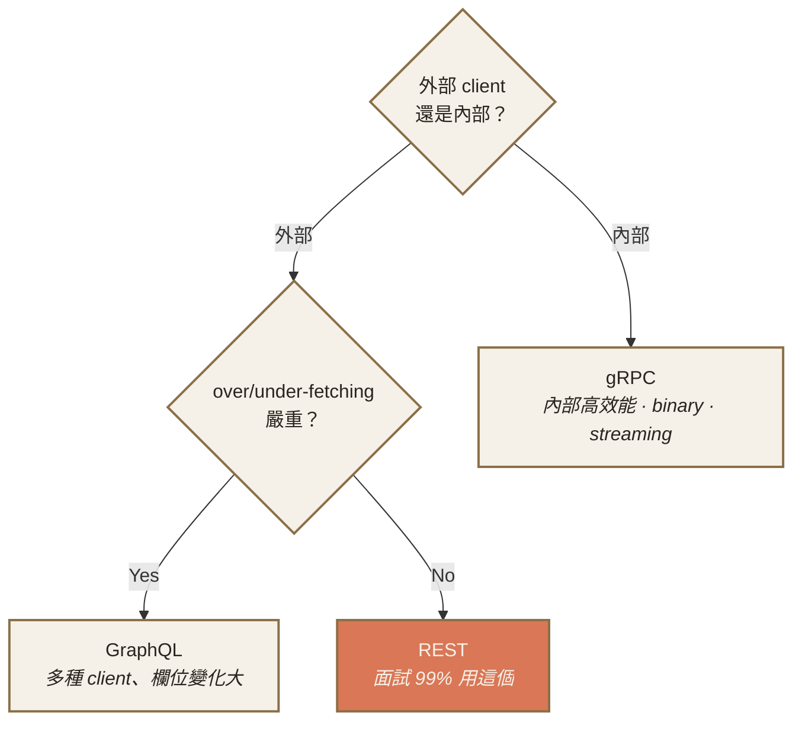
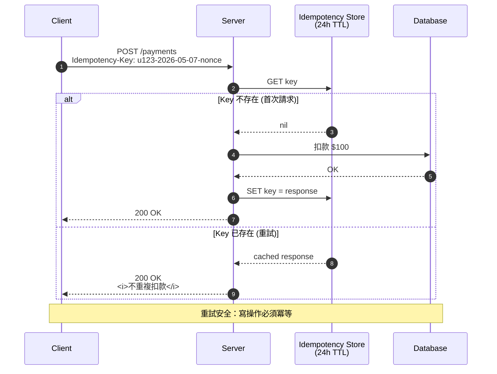
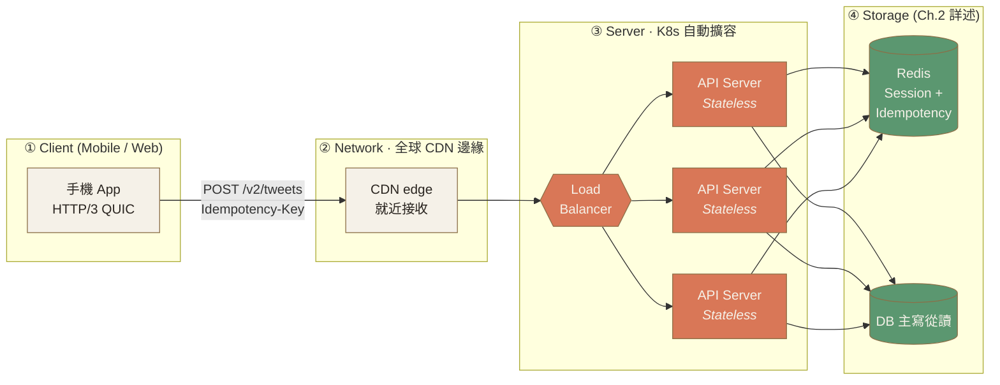

# Ch.1 · Foundation Layer · 圖像 Prompts

> Style guide: [`../0_STYLE_GUIDE.md`](../0_STYLE_GUIDE.md)
> Save images to: `ppt/assets/diagrams/01-foundation/`

**本章圖像總覽**：14 張 · P1 × 7 · P2 × 7 · P3 × 0 · A × 1 · B × 4 · C × 3 · D × 3 · E × 4

---

## Image 01 · Hero · 章首封面

- **Type**: A · Hero illustration
- **Priority**: P1
- **Slide**: `01-foundation/00_overview.md` · 第 1 張（chapter cover）
- **Save as**: `ppt/assets/diagrams/01-foundation/00_hero.png`
- **Aspect**: 16:9
- **Prompt**:
  ```
  An editorial illustration of a massive foundation stone half-buried in soil, with a layered architectural structure rising above it; the stone is engraved with subtle technical glyphs (network nodes, an API symbol, a stack of servers) hinting at the unseen physical bedrock beneath every distributed system. Faint horizontal strata in the ground suggest geological time and immovability — a metaphor for the speed of light and physics as the immovable floor of system design.
  Composition: centered low-horizon view, foundation stone occupying lower one-third with rising architectural layers above; soft side lighting from the upper-left; subtle background suggesting a far-off network of cities connected by thin curved lines; ample whitespace top and right for slide title overlay.
  editorial illustration, hand-drawn technical sketch style, warm color palette featuring cream off-white #F5F1E8 background and warm orange #D97757 accents with deep brown #8B6F47 secondary lines, minimalist flat vector with subtle paper texture, clean geometric lines, ample whitespace, educational diagram style, calm composed mood.
  --ar 16:9 --style raw --no photo-realistic, 3d render, neon, gradient glow, cluttered text, watermark, kawaii, anime
  ```
- **Note**: 強化「物理常數 / 不可逾越的地基」的章節隱喻，與 Ch.1 標題「四件事，所有系統的地基」呼應。

---

## Image 02 · Mental Model · Foundation 四層責任

- **Type**: E · Mermaid · 主推 + B · 隱喻備援
- **Priority**: P1
- **Slide**: `01-foundation/00_overview.md` · MENTAL MODEL section
- **Save as (Mermaid 渲染)**: `ppt/assets/diagrams/01-foundation/00_mental_model.png`
- **Aspect**: 16:9

**Mermaid 原始碼**（推薦做法，貼到 https://mermaid.live 渲染後存 PNG）：


**AI Prompt 備援**（若不想用 Mermaid）：
```
A vertical four-tier stack diagram resembling architectural floor plans, labeled top-to-bottom: CLIENT, NETWORK, SERVER, STORAGE. Each tier is a horizontal slab with a small icon on the left (a phone, a globe with routing lines, a server box, a stylized cylinder), and a thin chapter reference tag on the right. A subtle vertical arrow on the right side labeled "scale-up vs scale-out" spans the entire stack.
Composition: centered four-row stack occupying middle 60% of canvas; warm orange highlight on the NETWORK row to signal physics-bound; storage row drawn in dashed outline to mark "discussed later"; ample whitespace and clean geometric proportions.
editorial illustration, hand-drawn technical sketch style, warm color palette featuring cream off-white #F5F1E8 background and warm orange #D97757 accents with deep brown #8B6F47 secondary lines, minimalist flat vector with subtle paper texture, clean geometric lines, ample whitespace, educational diagram style, calm composed mood.
--ar 16:9 --style raw --no photo-realistic, 3d render, neon, gradient glow, cluttered text, watermark, kawaii, anime
```

- **Note**: 全章核心心智模型。四層責任分離是「分散式系統可以演化」的前提，後續所有章節都掛在這個結構上。

---

## Image 03 · Networking · TCP/IP 協定棧速查

- **Type**: C · 結構圖 (Mermaid)
- **Priority**: P1
- **Slide**: `01-foundation/01_networking.md` · NETWORKING · HOW
- **Save as**: `ppt/assets/diagrams/01-foundation/01_networking_01_stack.png`
- **Aspect**: 16:9

**Mermaid 原始碼**：


- **Note**: 協定棧速查表的視覺化，強調應用層為「使用者最常碰」的層次（橘色）；TLS/DNS/CDN 是橫切（cross-cutting）。

---

## Image 04 · Networking · RTT 與光速天花板

- **Type**: B · 概念隱喻
- **Priority**: P1
- **Slide**: `01-foundation/01_networking.md` · NETWORKING · WHY
- **Save as**: `ppt/assets/diagrams/01-foundation/01_networking_02_rtt.png`
- **Aspect**: 16:9
- **Prompt**:
  ```
  An editorial illustration of planet Earth viewed from space, with three pairs of cities marked by small dots and connected by curved arc lines following the surface curvature: Taipei to New York (~130 ms, longest arc), London to New York (~56 ms minimum), and a tight loop within a single data center (~0.5 ms). Each arc has a small handwritten-style latency number floating beside it. A soft horizontal line at the top labeled "speed of light · 300,000 km/s" reminds the viewer of the physical ceiling.
  Composition: Earth occupying right two-thirds of canvas as a flat circle with subtle continent outlines; arcs drawn in warm orange of varying lengths; latency labels in deep brown handwritten style; left side reserved for the headline "光速是天花板"; ample whitespace.
  editorial illustration, hand-drawn technical sketch style, warm color palette featuring cream off-white #F5F1E8 background and warm orange #D97757 accents with deep brown #8B6F47 secondary lines, minimalist flat vector with subtle paper texture, clean geometric lines, ample whitespace, educational diagram style, calm composed mood.
  --ar 16:9 --style raw --no photo-realistic, 3d render, neon, gradient glow, cluttered text, watermark, kawaii, anime
  ```
- **Note**: 把抽象的「光速 = 物理問題」具象成地球弧線距離，幫助學生內化跨地理同步的不可能性。

---

## Image 05 · Networking · TLS Handshake 序列圖

- **Type**: E · Sequence Diagram (Mermaid)
- **Priority**: P2
- **Slide**: `01-foundation/01_networking.md` · NETWORKING · TRADE-OFF（補充長連線成本）
- **Save as**: `ppt/assets/diagrams/01-foundation/01_networking_03_tls.png`
- **Aspect**: 16:9

**Mermaid 原始碼**：


- **Note**: 視覺化「TCP + TLS 為何吃掉 200ms」的根本原因，呼應反模式「行動 App 對每個 API 都新建連線」。

---

## Image 06 · Networking · CDN 全球邊緣

- **Type**: B · 概念隱喻
- **Priority**: P2
- **Slide**: `01-foundation/01_networking.md` · NETWORKING · 邊緣加速
- **Save as**: `ppt/assets/diagrams/01-foundation/01_networking_04_cdn.png`
- **Aspect**: 16:9
- **Prompt**:
  ```
  An editorial illustration of a flat world map dotted with around 20 small node icons distributed across continents (edge locations), and a single large central node in the middle representing the origin server. Each edge node has a small "user" icon nearby, with a short solid line from user to nearest edge (fast), and a long thin dashed line from edge back to origin (slow, infrequent). The contrast between many short solid lines and few long dashed lines visualizes "data locality."
  Composition: world map fills full canvas with subtle continent outlines in deep brown; edge nodes drawn as small warm orange circles; origin as a slightly larger circle in the center; user icons in muted brown; legend in lower-right with two line styles labeled "user → edge (fast)" and "edge → origin (rare sync)".
  editorial illustration, hand-drawn technical sketch style, warm color palette featuring cream off-white #F5F1E8 background and warm orange #D97757 accents with deep brown #8B6F47 secondary lines, minimalist flat vector with subtle paper texture, clean geometric lines, ample whitespace, educational diagram style, calm composed mood.
  --ar 16:9 --style raw --no photo-realistic, 3d render, neon, gradient glow, cluttered text, watermark, kawaii, anime
  ```
- **Note**: 把「資料局部性」具象化——靜態用 CDN、動態用區域分片，本質都是「資料放靠近運算的地方」。

---

## Image 07 · Networking · Circuit Breaker 三狀態

- **Type**: E · State Diagram (Mermaid)
- **Priority**: P2
- **Slide**: `01-foundation/01_networking.md` · NETWORKING · 故障模式
- **Save as**: `ppt/assets/diagrams/01-foundation/01_networking_05_circuit.png`
- **Aspect**: 16:9

**Mermaid 原始碼**：


- **Note**: Circuit Breaker 三狀態是「面試金句」也是真實生產系統的關鍵防線。狀態圖比文字描述清楚 10 倍。

---

## Image 08 · Client-Server vs P2P 架構對照

- **Type**: D · 對照圖
- **Priority**: P2
- **Slide**: `01-foundation/02_client_server.md` · CLIENT-SERVER · WHY
- **Save as**: `ppt/assets/diagrams/01-foundation/02_client_server_01_vs_p2p.png`
- **Aspect**: 16:9
- **Prompt**:
  ```
  A side-by-side architectural comparison diagram split vertically down the middle. Left half titled "Client-Server"—a central server hub with several client icons (phone, laptop, tablet) connected by straight lines radiating outward, like a star topology. Right half titled "Peer-to-Peer"—six peer icons arranged in a hexagon, each connected to every other peer by lines forming a mesh, no central hub. Below each diagram, three short bullet labels: left says "control · observability · evolvability", right says "resilient · no single owner · trust hard". A small "hybrid" callout box at bottom notes WebRTC and gaming matchmaking as common middle-ground.
  Composition: clean 50/50 vertical split with a thin divider line; both halves use identical visual weight; warm orange highlights on the central server (left) and on the mesh edges (right); deep brown for icons; ample whitespace.
  editorial illustration, hand-drawn technical sketch style, warm color palette featuring cream off-white #F5F1E8 background and warm orange #D97757 accents with deep brown #8B6F47 secondary lines, minimalist flat vector with subtle paper texture, clean geometric lines, ample whitespace, educational diagram style, calm composed mood.
  --ar 16:9 --style raw --no photo-realistic, 3d render, neon, gradient glow, cluttered text, watermark, kawaii, anime
  ```
- **Note**: 視覺化解釋「為何 99% 商業軟體選 C/S」——星狀拓撲讓控制、可觀測、可演化變容易。

---

## Image 09 · Client-Server · Thin/Thick × Stateful/Stateless 2x2

- **Type**: D · 2x2 矩陣
- **Priority**: P1
- **Slide**: `01-foundation/02_client_server.md` · CLIENT-SERVER · HOW
- **Save as**: `ppt/assets/diagrams/01-foundation/02_client_server_02_matrix.png`
- **Aspect**: 16:9
- **Prompt**:
  ```
  A clean 2x2 matrix diagram. Horizontal axis labeled "Server: Stateless ←→ Stateful" with arrow pointing from left to right. Vertical axis labeled "Client: Thin ←→ Thick" with arrow pointing from bottom to top. Four quadrants, each a labeled box:
  - bottom-left (Thin + Stateless): "Web 應用主流 · 易橫向擴展" — highlighted with warm orange filled background to mark as the recommended quadrant
  - top-left (Thick + Stateless): "SPA / Mobile App · 離線可用"
  - bottom-right (Thin + Stateful): "傳統 Session 架構 · 不易擴展"
  - top-right (Thick + Stateful): "遊戲 / 即時協作 · 最複雜"
  A small footer caption reads "Stateless Server = 橫向擴展的前提。狀態放外部儲存。"
  Composition: centered 2x2 grid occupying middle 70% of canvas; clear axis labels with arrowheads; the recommended quadrant filled with warm orange and white text; other quadrants outlined in deep brown with cream fill; ample whitespace around grid.
  editorial illustration, hand-drawn technical sketch style, warm color palette featuring cream off-white #F5F1E8 background and warm orange #D97757 accents with deep brown #8B6F47 secondary lines, minimalist flat vector with subtle paper texture, clean geometric lines, ample whitespace, educational diagram style, calm composed mood.
  --ar 16:9 --style raw --no photo-realistic, 3d render, neon, gradient glow, cluttered text, watermark, kawaii, anime
  ```
- **Note**: 經典 2x2 是 Trade-off 思考的標準工具。Stateless 是橫向擴展的前提這個訊息靠視覺強化最有效。

---

## Image 10 · Scalability · Vertical vs Horizontal vs Hybrid

- **Type**: D · 對照圖
- **Priority**: P1
- **Slide**: `01-foundation/03_scalability.md` · SCALABILITY · TRADE-OFF
- **Save as**: `ppt/assets/diagrams/01-foundation/03_scalability_01_up_vs_out.png`
- **Aspect**: 16:9
- **Prompt**:
  ```
  A three-panel comparison diagram laid out horizontally with thin dividers. Left panel "Scale Up (垂直)"—a single server box growing taller through three stacked sizes (small → medium → large), with a small ceiling line at the top labeled "硬體上限". Middle panel "Scale Out (水平)"—a row of identical small server boxes multiplying from one to five to many, with arrows suggesting infinite extension to the right. Right panel "Hybrid (典型策略)"—a layered diagram with the application tier shown as multiple horizontal boxes (scale out) and the database tier shown as a single tall box (scale up), connected by lines. Each panel has a one-line caption underneath.
  Composition: equal-width three columns; vertical growth visualized in left panel; horizontal multiplication in middle; layered hybrid in right; warm orange used to highlight the "Hybrid" label as the recommended pragmatic strategy; ample whitespace at top for slide title.
  editorial illustration, hand-drawn technical sketch style, warm color palette featuring cream off-white #F5F1E8 background and warm orange #D97757 accents with deep brown #8B6F47 secondary lines, minimalist flat vector with subtle paper texture, clean geometric lines, ample whitespace, educational diagram style, calm composed mood.
  --ar 16:9 --style raw --no photo-realistic, 3d render, neon, gradient glow, cluttered text, watermark, kawaii, anime
  ```
- **Note**: 三欄對照清楚呈現三種策略，並暗示「應用層 Scale Out · 資料層 Scale Up」的實務黃金組合。

---

## Image 11 · Scalability · 橫向擴展三前提架構

- **Type**: C · 架構圖 (Mermaid)
- **Priority**: P1
- **Slide**: `01-foundation/03_scalability.md` · SCALABILITY · HOW
- **Save as**: `ppt/assets/diagrams/01-foundation/03_scalability_02_three_prereq.png`
- **Aspect**: 16:9

**Mermaid 原始碼**：


- **Note**: 三前提缺一不可：沒有 stateless 就沒有自由路由；沒有 shared storage 就沒有一致性。圖示直接對應 slide 上的 ASCII art。

---

## Image 12 · API Design · 風格選型決策樹

- **Type**: E · Decision Tree (Mermaid)
- **Priority**: P1
- **Slide**: `01-foundation/04_api_design.md` · API DESIGN · 決策樹
- **Save as**: `ppt/assets/diagrams/01-foundation/04_api_design_01_decision_tree.png`
- **Aspect**: 16:9

**Mermaid 原始碼**：


- **Note**: 把 slide 內 ASCII 決策樹轉成清晰的 mermaid，REST 用橘色強調「預設選項」。

---

## Image 13 · API Design · Idempotency 序列圖

- **Type**: E · Sequence Diagram (Mermaid)
- **Priority**: P2
- **Slide**: `01-foundation/04_api_design.md` · API DESIGN · 隱性決策（Idempotency）
- **Save as**: `ppt/assets/diagrams/01-foundation/04_api_design_02_idempotency.png`
- **Aspect**: 16:9

**Mermaid 原始碼**：


- **Note**: 「典型 key = 用戶 ID + 業務天 + nonce」這條規則用序列圖最容易記住。Note 補上「重試安全」核心訊息。

---

## Image 14 · Recap · Twitter 發推文整合架構

- **Type**: C · 架構圖 (Mermaid)
- **Priority**: P2
- **Slide**: `01-foundation/99_recap.md` · CASE STUDY
- **Save as**: `ppt/assets/diagrams/01-foundation/99_recap_01_twitter.png`
- **Aspect**: 16:9

**Mermaid 原始碼**：


- **Note**: 章末 case study 把 Network / Client-Server / Scale / API 四個面向整合成一張圖，學生看完整章後能對照每個元件對應到哪個概念。

---

## 索引

| # | Topic | Priority | Type | File |
|---|-------|---------|------|------|
| 01 | Hero · 章首封面 | P1 | A | `00_hero.png` |
| 02 | Mental Model · 4 層責任 | P1 | E + B | `00_mental_model.png` |
| 03 | Networking · 協定棧 | P1 | C | `01_networking_01_stack.png` |
| 04 | Networking · RTT 光速 | P1 | B | `01_networking_02_rtt.png` |
| 05 | Networking · TLS Handshake | P2 | E | `01_networking_03_tls.png` |
| 06 | Networking · CDN 邊緣 | P2 | B | `01_networking_04_cdn.png` |
| 07 | Networking · Circuit Breaker | P2 | E | `01_networking_05_circuit.png` |
| 08 | Client-Server vs P2P | P2 | D | `02_client_server_01_vs_p2p.png` |
| 09 | C/S · 2x2 矩陣 | P1 | D | `02_client_server_02_matrix.png` |
| 10 | Scalability · Up/Out/Hybrid | P1 | D | `03_scalability_01_up_vs_out.png` |
| 11 | Scalability · 三前提架構 | P1 | C | `03_scalability_02_three_prereq.png` |
| 12 | API · 風格決策樹 | P1 | E | `04_api_design_01_decision_tree.png` |
| 13 | API · Idempotency 序列 | P2 | E | `04_api_design_02_idempotency.png` |
| 14 | Recap · Twitter 整合架構 | P2 | C | `99_recap_01_twitter.png` |
