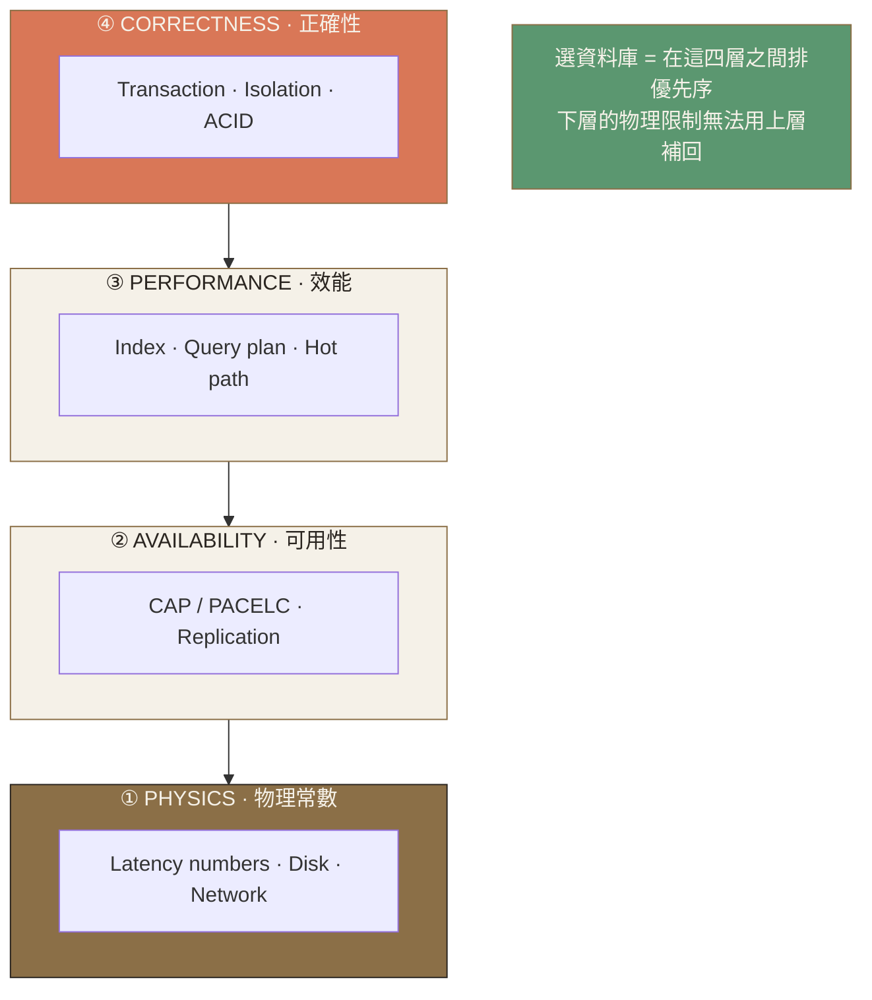
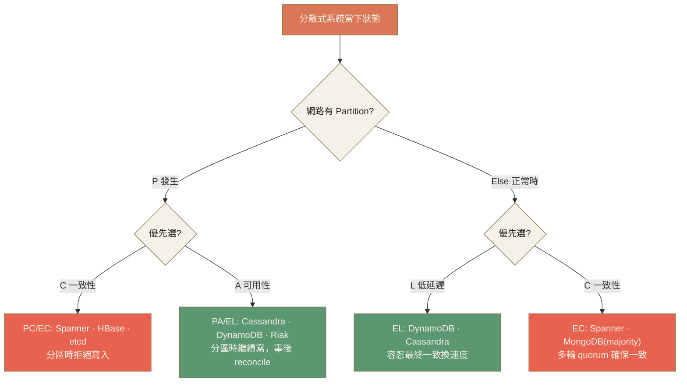
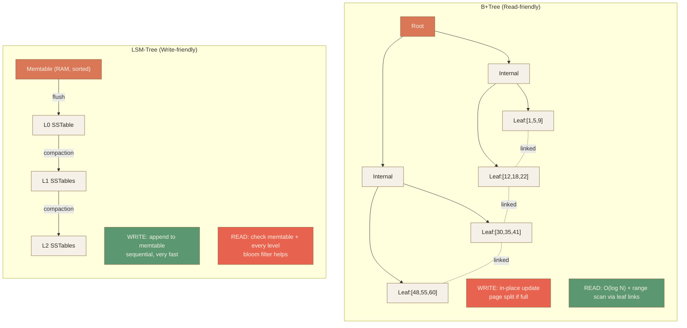
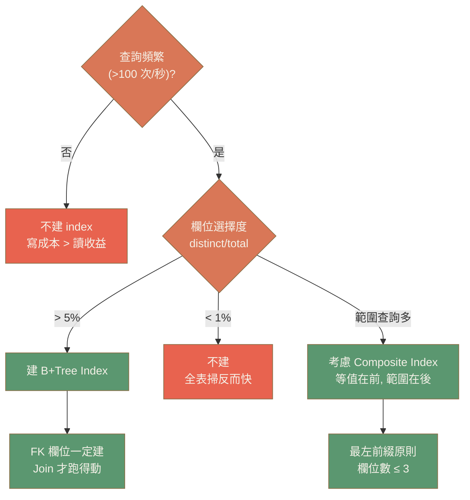
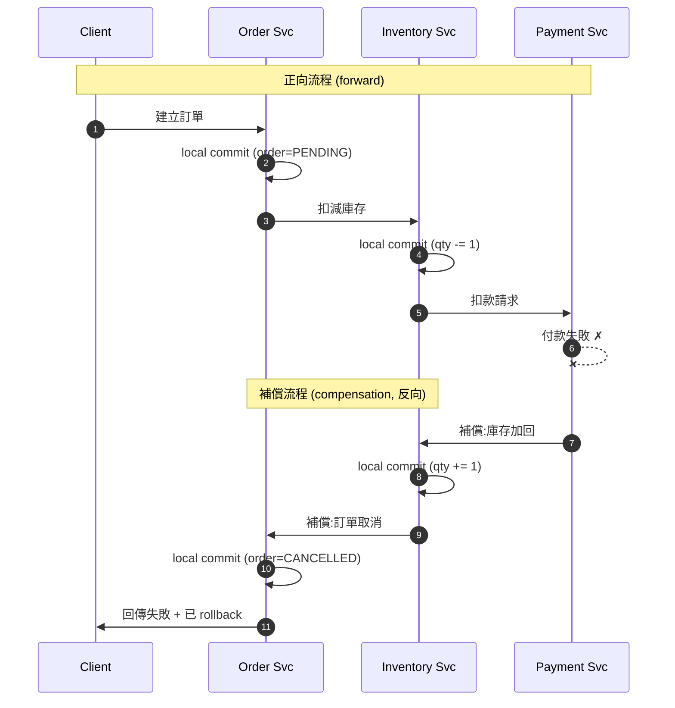
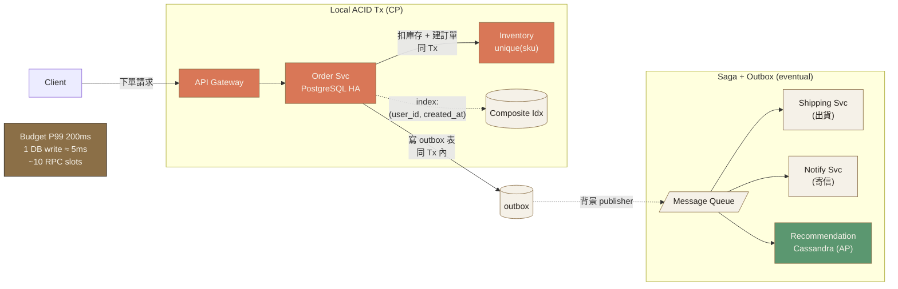

# Ch.2 · Data Fundamentals · 圖像 Prompts

> Style guide: [`../0_STYLE_GUIDE.md`](../0_STYLE_GUIDE.md)
> Save images to: `ppt/assets/diagrams/02-data-fundamentals/`

**本章圖像總覽**：14 張 · P1 × 6 · P2 × 7 · P3 × 1 · A × 1 · B × 4 · C × 1 · D × 4 · E × 4

---

## Image 01 · Hero · 章首封面

- **Type**: A · Hero illustration
- **Priority**: P1
- **Slide**: `02-data-fundamentals/00_overview.md` · 第 1 張（cover）
- **Save as**: `ppt/assets/diagrams/02-data-fundamentals/00_hero.png`
- **Aspect**: 16:9
- **Prompt**:
  ```
  An editorial illustration of a deep cross-section of geological rock strata seen from the side, with four distinct horizontal layers labeled from bottom to top — bedrock physics layer, availability layer, performance layer, correctness layer — and a small architectural building rising on top of the topmost layer, evoking the chapter theme of data fundamentals as the immovable physical bedrock of every system design.
  Composition: side-view geological cross-section dominating the lower two-thirds of the canvas, layers rendered as horizontal sedimentary strips of varying texture and weight, the deepest layer drawn with the densest hatching, a small slender architectural silhouette emerging at the top right balanced by ample whitespace on the left, subtle fault lines and tiny database cylinder fossils embedded in the lower strata as easter eggs.
  editorial illustration, hand-drawn technical sketch style, warm color palette featuring cream off-white #F5F1E8 background and warm orange #D97757 accents with deep brown #8B6F47 secondary lines, minimalist flat vector with subtle paper texture, clean geometric lines, ample whitespace, educational diagram style, calm composed mood.
  --ar 16:9 --style raw --no photo-realistic, 3d render, neon, gradient glow, cluttered text, watermark, kawaii, anime
  ```
- **Note**: 銜接 Ch.1 的「網路是物理常數」隱喻，把資料層比做岩層 / 沉積層——越下層越逃不掉。建築物是上層應用，但若忽視底層物理會地基崩塌。

---

## Image 02 · Mental Model · 資料層的四個維度

- **Type**: E · Mermaid（主）
- **Priority**: P1
- **Slide**: `02-data-fundamentals/00_overview.md` · MENTAL MODEL section
- **Save as (Mermaid 渲染)**: `ppt/assets/diagrams/02-data-fundamentals/00_mental_model.png`
- **Aspect**: 16:9

**Mermaid 原始碼**（推薦做法，貼到 https://mermaid.live 渲染後存 PNG）：


**AI Prompt 備援**（若不想用 Mermaid）：
```
A vertical four-tier ladder diagram showing the four dimensions of data layer design — from bottom to top: Physics (latency numbers, disk, network), Availability (CAP/PACELC, replication), Performance (index, query plan), Correctness (transaction, ACID, isolation) — each tier depicted as a horizontal block with bracketed icons.
Composition: clean vertical stack centered on canvas, the bottom layer drawn thickest and most weighted to suggest it as the immovable foundation, ascending tiers progressively lighter, a small annotation on the right reads "choosing a database = ordering priorities across these four", ample margin around the stack.
editorial illustration, hand-drawn technical sketch style, warm color palette featuring cream off-white #F5F1E8 background and warm orange #D97757 accents with deep brown #8B6F47 secondary lines, minimalist flat vector with subtle paper texture, clean geometric lines, ample whitespace, educational diagram style, calm composed mood.
--ar 16:9 --style raw --no photo-realistic, 3d render, neon, gradient glow, cluttered text, watermark, kawaii, anime
```

- **Note**: 全章導讀骨架。觀眾離開本章只要記住「資料層 = 4 個維度疊加」就值回票價。底層 PHYSICS 用最重的視覺重量強化「逃不掉」。

---

## Image 03 · CAP Theorem · 三角形與三類資料庫

- **Type**: B · 概念隱喻
- **Priority**: P1
- **Slide**: `02-data-fundamentals/01_cap_theorem.md` · CAP · WHY
- **Save as**: `ppt/assets/diagrams/02-data-fundamentals/01_cap_theorem_01_triangle.png`
- **Aspect**: 16:9
- **Prompt**:
  ```
  An editorial illustration of the classic CAP triangle, an equilateral triangle with the three vertices labeled C (Consistency), A (Availability), and P (Partition Tolerance), with a thick warm-orange chain wrapped around the bottom edge connecting C and A — that bottom edge is crossed out with a soft red strikethrough and a small label reads "CA does not exist in distributed systems". The P vertex at the top is drawn as a fixed anchor with a tiny chain icon meaning "always required". Two small grouped pebbles sit beside CP edge labeled "Spanner · etcd · HBase" and beside AP edge labeled "Cassandra · DynamoDB · Riak".
  Composition: a single large triangle centered slightly left, three vertex labels in clean serif, the bottom edge struck through, two annotation clusters on the right side aligned to CP and AP edges, plenty of whitespace.
  editorial illustration, hand-drawn technical sketch style, warm color palette featuring cream off-white #F5F1E8 background and warm orange #D97757 accents with deep brown #8B6F47 secondary lines, minimalist flat vector with subtle paper texture, clean geometric lines, ample whitespace, educational diagram style, calm composed mood.
  --ar 16:9 --style raw --no photo-realistic, 3d render, neon, gradient glow, cluttered text, watermark, kawaii, anime
  ```
- **Note**: 直接把「CA 不存在」視覺化——觀眾最常誤解的就是以為三選二。划掉 CA 邊比口頭講十次有用。

---

## Image 04 · PACELC · 決策樹

- **Type**: E · Mermaid
- **Priority**: P2
- **Slide**: `02-data-fundamentals/01_cap_theorem.md` · CAP · HOW (PACELC)
- **Save as**: `ppt/assets/diagrams/02-data-fundamentals/01_cap_theorem_02_pacelc.png`
- **Aspect**: 16:9

**Mermaid 原始碼**：


- **Note**: PACELC 的精髓是「沒分區時你還在 trade-off」。樹狀展開遠比表格直觀，左右兩條路徑分別代表 P 真實發生與正常時。

---

## Image 05 · CAP · 知名 DB 定位象限

- **Type**: D · 對照圖（2x2 矩陣）
- **Priority**: P2
- **Slide**: `02-data-fundamentals/01_cap_theorem.md` · 具體系統參數
- **Save as**: `ppt/assets/diagrams/02-data-fundamentals/01_cap_theorem_03_db_quadrant.png`
- **Aspect**: 16:9
- **Prompt**:
  ```
  An editorial 2x2 quadrant diagram with the horizontal axis labeled "Else: prefer Latency ← → prefer Consistency" and vertical axis labeled "Partition: prefer Availability ↑ ↓ prefer Consistency". In each quadrant a database logo-card sits with its name and one short tagline: top-left "Cassandra (AP/EL) — quorum tunable, eventually consistent, multi-DC", top-right "DynamoDB (AP/EL by default) — eventually consistent reads, optional strong reads", bottom-right "Spanner (CP/EC) — TrueTime, global strong consistency, ~5-10ms writes", bottom-left empty placeholder labeled "etcd / ZooKeeper (CP) — Raft / ZAB consensus, minority rejected during partition" pinned in the same quadrant as Spanner with a divider line.
  Composition: clean cross-axis 2x2 grid taking center 70% of canvas, axis labels in small caps, each quadrant card uses a small icon and a single sentence, ample margin and gridline weight kept minimal.
  editorial illustration, hand-drawn technical sketch style, warm color palette featuring cream off-white #F5F1E8 background and warm orange #D97757 accents with deep brown #8B6F47 secondary lines, minimalist flat vector with subtle paper texture, clean geometric lines, ample whitespace, educational diagram style, calm composed mood.
  --ar 16:9 --style raw --no photo-realistic, 3d render, neon, gradient glow, cluttered text, watermark, kawaii, anime
  ```
- **Note**: 把抽象的 PACELC 落在具體 DB 上。觀眾看完能直接對照自己用的 DB 在哪個象限。

---

## Image 06 · CAP · ATM 提款機案例（隱喻分裂）

- **Type**: B · 概念隱喻
- **Priority**: P2
- **Slide**: `02-data-fundamentals/01_cap_theorem.md` · CAP · 真實案例 ATM
- **Save as**: `ppt/assets/diagrams/02-data-fundamentals/01_cap_theorem_04_atm_split.png`
- **Aspect**: 16:9
- **Prompt**:
  ```
  An editorial split illustration showing two parallel ATM machines side by side separated by a vertical jagged crack representing a network partition. The left ATM has a small "CP" badge and shows a digital display saying "SERVICE UNAVAILABLE", with a small sad customer figure waiting; the right ATM has an "AP" badge and shows "DISPENSING $1000" while two duplicate customer figures (one at this ATM, one transparent ghost on the other side) both withdraw — a small "double-spend" warning icon hovers above. A broken fiber-optic cable runs along the ground between them.
  Composition: symmetrical left-right split with a vertical zigzag crack in the middle, each side captures one ATM with its outcome, small comic-strip caption boxes below each ATM ("CP: balance always correct, sometimes unavailable" / "AP: always available, balance can be wrong"), broken cable as a horizontal connecting motif at the bottom.
  editorial illustration, hand-drawn technical sketch style, warm color palette featuring cream off-white #F5F1E8 background and warm orange #D97757 accents with deep brown #8B6F47 secondary lines, minimalist flat vector with subtle paper texture, clean geometric lines, ample whitespace, educational diagram style, calm composed mood.
  --ar 16:9 --style raw --no photo-realistic, 3d render, neon, gradient glow, cluttered text, watermark, kawaii, anime
  ```
- **Note**: 把抽象的 C/A trade-off 用「同一場景兩種選擇」的具象畫面呈現，是課程裡記憶點最強的一張。

---

## Image 07 · Indexing · B+Tree vs LSM-Tree 對照

- **Type**: E · Mermaid（雙樹結構）
- **Priority**: P1
- **Slide**: `02-data-fundamentals/02_indexing.md` · INDEXING · HOW
- **Save as**: `ppt/assets/diagrams/02-data-fundamentals/02_indexing_01_btree_vs_lsm.png`
- **Aspect**: 16:9

**Mermaid 原始碼**：


- **Note**: 把兩種樹的形狀並列，加上「寫路徑/讀路徑」標註，看完馬上理解為何 B+Tree 讀友善、LSM 寫友善。彩色標註 ok / warn 直接揭示優缺點。

---

## Image 08 · Indexing · 何時建 Index 決策樹

- **Type**: E · Mermaid
- **Priority**: P2
- **Slide**: `02-data-fundamentals/02_indexing.md` · INDEXING · 速判決策
- **Save as**: `ppt/assets/diagrams/02-data-fundamentals/02_indexing_02_decision.png`
- **Aspect**: 16:9

**Mermaid 原始碼**：


- **Note**: 「選擇度低不建、寫多不建、FK 一定建」三句話畫成樹，DBA 面試常考題。

---

## Image 09 · Transactions · ACID 4 件事 icon

- **Type**: B · 概念隱喻（4-icon panel）
- **Priority**: P1
- **Slide**: `02-data-fundamentals/03_transactions.md` · ACID 四件事
- **Save as**: `ppt/assets/diagrams/02-data-fundamentals/03_transactions_01_acid_icons.png`
- **Aspect**: 16:9
- **Prompt**:
  ```
  An editorial four-panel diagram introducing ACID with one icon per letter, arranged in a clean 4-column grid: A — "Atomicity" depicted as two gears welded together with an "all or nothing" tag and a tiny rollback arrow underneath; C — "Consistency" depicted as a balance scale staying level with a small constraint check icon; I — "Isolation" depicted as two parallel sealed glass tubes each containing a tiny transaction figure that cannot see the other; D — "Durability" depicted as a stone tablet engraved with bytes plus a small WAL scroll icon, surviving a tiny lightning bolt above.
  Composition: four equal-width panels in a single horizontal row, each panel has the letter A/C/I/D as a large drop-cap on the upper-left corner, the icon dominates the center, a one-line caption under each icon, divider lines between panels are thin and warm-brown.
  editorial illustration, hand-drawn technical sketch style, warm color palette featuring cream off-white #F5F1E8 background and warm orange #D97757 accents with deep brown #8B6F47 secondary lines, minimalist flat vector with subtle paper texture, clean geometric lines, ample whitespace, educational diagram style, calm composed mood.
  --ar 16:9 --style raw --no photo-realistic, 3d render, neon, gradient glow, cluttered text, watermark, kawaii, anime
  ```
- **Note**: 4 個字母對應 4 個視覺隱喻，比死背定義有效。Durability 那塊特意用「石板 + 雷電」呼應「機器爆炸資料還在」。

---

## Image 10 · Transactions · 隔離級別 vs 異常現象矩陣

- **Type**: D · 對照矩陣
- **Priority**: P1
- **Slide**: `02-data-fundamentals/03_transactions.md` · 隔離級別
- **Save as**: `ppt/assets/diagrams/02-data-fundamentals/03_transactions_02_isolation_matrix.png`
- **Aspect**: 16:9
- **Prompt**:
  ```
  An editorial 4x3 matrix table titled "Isolation Levels vs Concurrency Anomalies". The four rows from top to bottom: Read Uncommitted, Read Committed, Repeatable Read, Serializable. The three columns: Dirty Read, Non-Repeatable Read, Phantom Read. Each cell contains either a small warm-orange "X" icon (means "anomaly possible") or a moss-green checkmark inside a shield icon (means "prevented"). The matrix forms a clear staircase pattern with checkmarks filling progressively from bottom-right toward top-left as isolation strengthens. Two annotation callouts: one near "Repeatable Read" row noting "MySQL InnoDB default + Gap Lock prevents Phantom too", one near "Read Committed" noting "PostgreSQL default — fastest, most footguns".
  Composition: large clean grid centered on canvas, row labels on the left, column labels on top, the staircase pattern visually obvious, two callout boxes attached via thin warm-orange lines on the right side, ample whitespace.
  editorial illustration, hand-drawn technical sketch style, warm color palette featuring cream off-white #F5F1E8 background and warm orange #D97757 accents with deep brown #8B6F47 secondary lines, minimalist flat vector with subtle paper texture, clean geometric lines, ample whitespace, educational diagram style, calm composed mood.
  --ar 16:9 --style raw --no photo-realistic, 3d render, neon, gradient glow, cluttered text, watermark, kawaii, anime
  ```
- **Note**: 「樓梯狀」是這個表的視覺記憶點。觀眾看到階梯就能反推出哪一級防哪些異常。MySQL/PostgreSQL 註記直接點出實務預設值。

---

## Image 11 · Transactions · Saga 補償交易序列圖

- **Type**: E · Mermaid sequenceDiagram
- **Priority**: P2
- **Slide**: `02-data-fundamentals/03_transactions.md` · Saga 補償交易細節
- **Save as**: `ppt/assets/diagrams/02-data-fundamentals/03_transactions_03_saga.png`
- **Aspect**: 16:9

**Mermaid 原始碼**：


- **Note**: Saga 的核心是「逐步本地 commit + 失敗時逐步補償」。序列圖展示前進與回退兩段，標註點出「補償必須冪等」的工程要點。

---

## Image 12 · Numbers · Latency 階梯圖（對數刻度）

- **Type**: D · 對照圖（log-scale ladder）
- **Priority**: P1
- **Slide**: `02-data-fundamentals/04_numbers.md` · 必背 Latency Table
- **Save as**: `ppt/assets/diagrams/02-data-fundamentals/04_numbers_01_latency_ladder.png`
- **Aspect**: 16:9
- **Prompt**:
  ```
  An editorial horizontal logarithmic-scale ladder chart titled "Latency Numbers Every Engineer Should Know" with a single horizontal axis from "0.5 ns" on the left to "150 ms" on the right, marked at each decade (ns, μs, ms). Eleven labeled tick marks ascend the ladder as small steps, each step is a short vertical bar topped with a tiny domain icon and a label: "L1 cache 0.5 ns", "Branch mispredict 5 ns", "L2 cache 7 ns", "Mutex 25 ns", "RAM 100 ns", "Snappy 1KB 3 μs", "1KB over 1Gbps 10 μs", "SSD random 150 μs", "1MB SSD seq 1 ms", "Same-DC RTT 0.5 ms", "CA→Netherlands RTT 150 ms". Three subtle horizontal background bands group ticks into "CPU/Memory" (warm cream), "Storage" (warm tan), "Network" (warm orange), with the rightmost cross-continent tick rendered with extra weight as the dramatic far-end anchor.
  Composition: full-width horizontal axis dominating canvas, eleven steps spaced logarithmically (so left half is dense, right tail stretches wide), small annotations above each tick, the three background color-bands beneath are subtle and only suggest grouping, plenty of vertical breathing room.
  editorial illustration, hand-drawn technical sketch style, warm color palette featuring cream off-white #F5F1E8 background and warm orange #D97757 accents with deep brown #8B6F47 secondary lines, minimalist flat vector with subtle paper texture, clean geometric lines, ample whitespace, educational diagram style, calm composed mood.
  --ar 16:9 --style raw --no photo-realistic, 3d render, neon, gradient glow, cluttered text, watermark, kawaii, anime
  ```
- **Note**: Jeff Dean 的經典表用對數刻度視覺化才能感受到「跨洲 RTT 比 L1 慢 3 億倍」。三色分帶幫觀眾在心智模型裡分群（CPU / Storage / Network）。

---

## Image 13 · Numbers · 現代 DB 容量「反直覺」

- **Type**: D · 對照圖（4-card panel）
- **Priority**: P3
- **Slide**: `02-data-fundamentals/04_numbers.md` · 現代資料庫實際容量
- **Save as**: `ppt/assets/diagrams/02-data-fundamentals/04_numbers_02_capacity.png`
- **Aspect**: 16:9
- **Prompt**:
  ```
  An editorial four-card panel titled "Don't anchor on 2010 numbers — modern single-machine reality". Each card shows one system with three big numerics: card 1 "PostgreSQL / MySQL — single-node 64 TiB · Aurora 128 TiB · cached read 1-5 ms · writes 10-20k TPS"; card 2 "Redis — single node 1 TB RAM · sub-1ms read · 100k+ ops/sec"; card 3 "Kafka — 1 broker = 1M msgs/sec · 50 TB store · weeks of retention"; card 4 "App Server — 100k+ concurrent · 25 Gbps · 64-512 GB RAM (up to 2 TB)". Below the four cards a long warm-orange banner says "Most teams talk about sharding at 500GB-2TB. A tuned PostgreSQL hits 50 TiB before you should worry."
  Composition: 2x2 card grid filling upper two-thirds, each card has a small system logo placeholder in the upper-left and three short statistic lines stacked, the bottom banner spans full width as a punchy callout.
  editorial illustration, hand-drawn technical sketch style, warm color palette featuring cream off-white #F5F1E8 background and warm orange #D97757 accents with deep brown #8B6F47 secondary lines, minimalist flat vector with subtle paper texture, clean geometric lines, ample whitespace, educational diagram style, calm composed mood.
  --ar 16:9 --style raw --no photo-realistic, 3d render, neon, gradient glow, cluttered text, watermark, kawaii, anime
  ```
- **Note**: 反「過度設計」的彈藥。觀眾離開這頁要記住「先別急著 sharding，單機調好可以撐很大」。錦上添花，預算緊就先跳過。

---

## Image 14 · Recap · 電商下訂單交易整合圖

- **Type**: C · 結構/架構圖
- **Priority**: P2
- **Slide**: `02-data-fundamentals/99_recap.md` · CASE STUDY 電商下訂單
- **Save as (Mermaid 渲染)**: `ppt/assets/diagrams/02-data-fundamentals/99_recap_01_ecommerce_flow.png`
- **Aspect**: 16:9

**Mermaid 原始碼**：


- **Note**: 章末整合：把 CAP（CP for orders, AP for recommendations）/ Index（composite + unique）/ Tx（local ACID + Saga + Outbox）/ Numbers（latency budget）四件事在一張圖上同時可見。觀眾離開時帶走「四維度怎麼在一個真實案例裡同時用」。

---

## 索引（章節結尾）

| #  | Topic                              | Priority | Type | File                                              |
|----|------------------------------------|----------|------|---------------------------------------------------|
| 01 | Hero · 章首封面                     | P1       | A    | `00_hero.png`                                     |
| 02 | Mental Model · 資料層 4 維度        | P1       | E    | `00_mental_model.png`                             |
| 03 | CAP Triangle · 三類定位             | P1       | B    | `01_cap_theorem_01_triangle.png`                  |
| 04 | PACELC · 決策樹                     | P2       | E    | `01_cap_theorem_02_pacelc.png`                    |
| 05 | CAP · DB 定位象限                   | P2       | D    | `01_cap_theorem_03_db_quadrant.png`               |
| 06 | CAP · ATM 隱喻分裂                  | P2       | B    | `01_cap_theorem_04_atm_split.png`                 |
| 07 | Indexing · B+Tree vs LSM            | P1       | E    | `02_indexing_01_btree_vs_lsm.png`                 |
| 08 | Indexing · 何時建 Index 決策樹       | P2       | E    | `02_indexing_02_decision.png`                     |
| 09 | Transactions · ACID 4 icon          | P1       | B    | `03_transactions_01_acid_icons.png`               |
| 10 | Transactions · 隔離級別矩陣          | P1       | D    | `03_transactions_02_isolation_matrix.png`         |
| 11 | Transactions · Saga 補償序列圖       | P2       | E    | `03_transactions_03_saga.png`                     |
| 12 | Numbers · Latency 階梯圖             | P1       | D    | `04_numbers_01_latency_ladder.png`                |
| 13 | Numbers · 現代 DB 容量反直覺         | P3       | D    | `04_numbers_02_capacity.png`                      |
| 14 | Recap · 電商下單整合圖               | P2       | C    | `99_recap_01_ecommerce_flow.png`                  |
