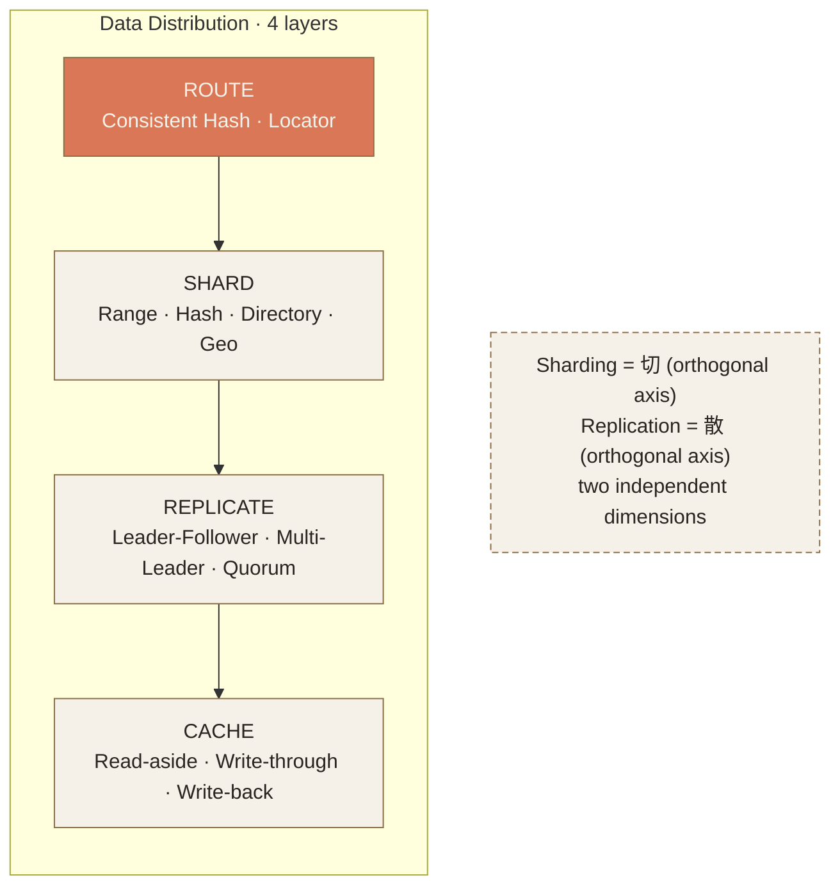
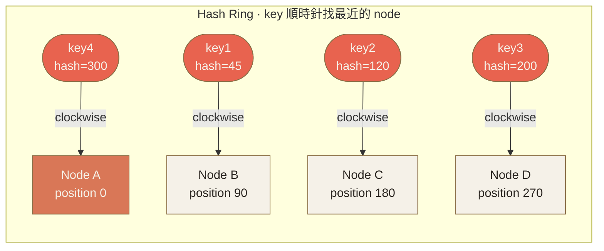
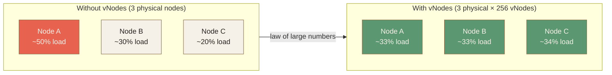
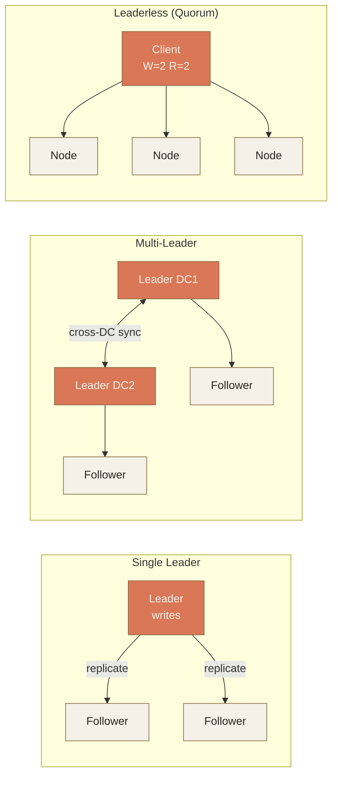
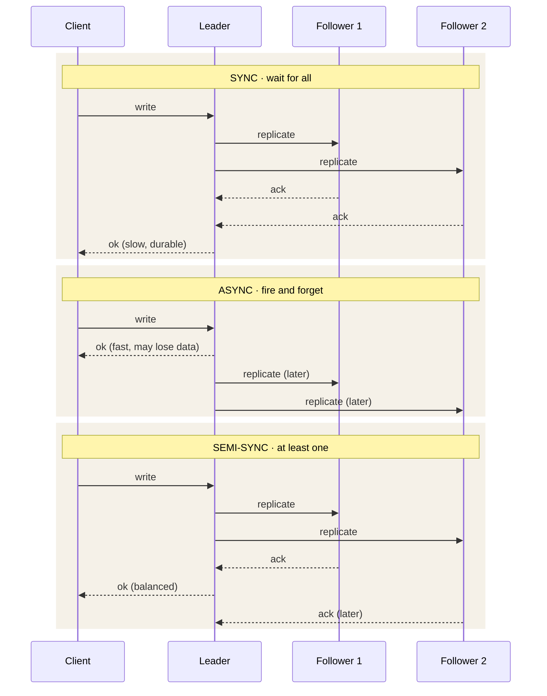
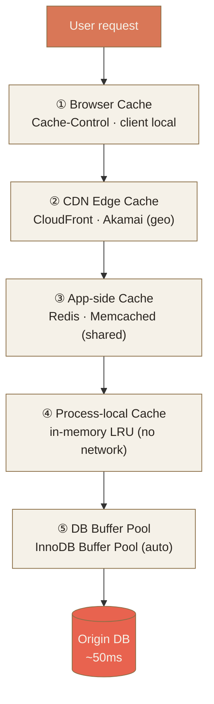
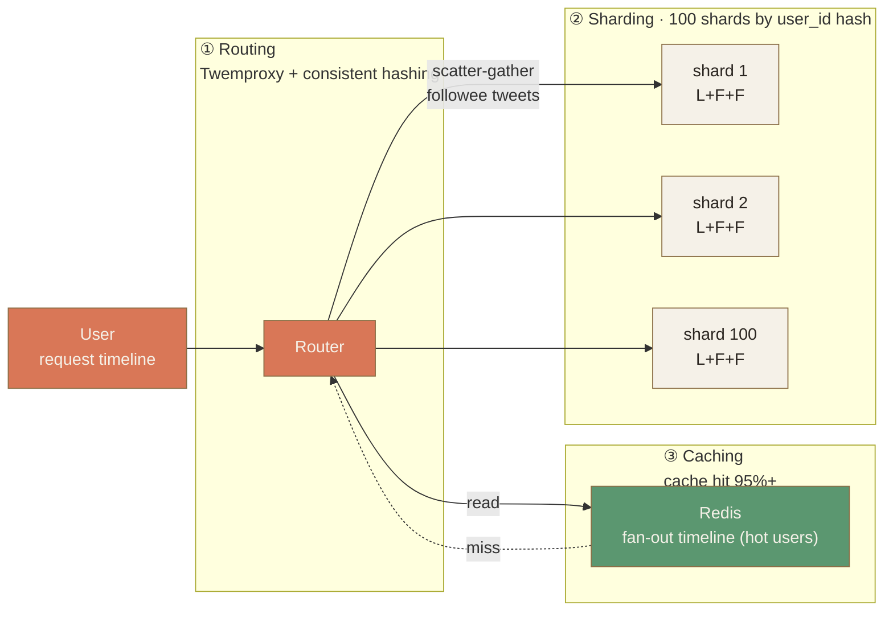

# Ch.3 · Data Distribution · 圖像 Prompts

> Style guide: [`../0_STYLE_GUIDE.md`](../0_STYLE_GUIDE.md)
> Save images to: `ppt/assets/diagrams/03-data-distribution/`

**本章圖像總覽**：16 張 · P1 × 8 · P2 × 6 · P3 × 1 · ｜ A × 1 · B × 5 · C × 6 · D × 3 · E × 2

章節主題：把資料切散到多台機器；如何選 shard key；複製拓撲的取捨；快取策略與失效。
資料夾覆蓋：`00_overview` / `01_consistent_hashing` / `02_sharding` / `03_replication` / `04_caching` / `99_recap`。

---

## Image 01 · Hero · 章首封面

- **Type**: A · Hero illustration
- **Priority**: P1
- **Slide**: `03-data-distribution/00_overview.md` · 第 1 張（cover）
- **Save as**: `ppt/assets/diagrams/03-data-distribution/00_hero.png`
- **Aspect**: 16:9
- **Prompt**:
  ```
  An editorial illustration of a farmer's hand sowing seeds across a tiled patchwork of small fields, each field a different shape but stitched together by faint contour lines, with a few seeds in mid-air showing duplicated copies (one seed splitting into three faint shadows landing on different plots), evoking the chapter theme of distributing data across many machines through sharding, replication and routing.
  Composition: wide horizon layout, hand in upper-left corner releasing seeds that arc across the frame, fields arranged as a loose grid of irregular polygons in the lower two-thirds, distant silhouettes of small server-like haystacks at the field corners, abundant negative space sky, single warm orange accent on the central seed trail.
  editorial illustration, hand-drawn technical sketch style, warm color palette featuring cream off-white #F5F1E8 background and warm orange #D97757 accents with deep brown #8B6F47 secondary lines, minimalist flat vector with subtle paper texture, clean geometric lines, ample whitespace, educational diagram style, calm composed mood.
  --ar 16:9 --style raw --no photo-realistic, 3d render, neon, gradient glow, cluttered text, watermark, kawaii, anime
  ```
- **Note**: 用「撒種到不同田」的隱喻表達 sharding（切分）+ replication（複製）+ routing（落點），同時暗示「決策不可逆」（種下去就長出來了）。

---

## Image 02 · Mental Model · 分散式資料層的 4 個動作

- **Type**: E · Mermaid（主）+ B · 概念隱喻（備援）
- **Priority**: P1
- **Slide**: `03-data-distribution/00_overview.md` · MENTAL MODEL section
- **Save as (Mermaid 渲染)**: `ppt/assets/diagrams/03-data-distribution/00_mental_model.png`
- **Aspect**: 16:9

**Mermaid 原始碼**（推薦做法，貼到 https://mermaid.live 渲染後存 PNG）：


**AI Prompt 備援**（若不想用 Mermaid）：
```
A four-tier horizontal stack diagram showing the four operations of distributed data: top tier ROUTE (with a small compass icon), second tier SHARD (with a knife slicing icon), third tier REPLICATE (with two overlapping pages icon), bottom tier CACHE (with a small drawer icon). To the right side, a vertical annotation reads "Sharding = 切 / Replication = 散 / orthogonal axes".
Composition: clean horizontal bands stacked vertically, each band same height with a label on the left and a tiny hand-drawn icon on the right, single warm orange highlight on the top ROUTE band, brown outlines, side annotation in lighter brown.
editorial illustration, hand-drawn technical sketch style, warm color palette featuring cream off-white #F5F1E8 background and warm orange #D97757 accents with deep brown #8B6F47 secondary lines, minimalist flat vector with subtle paper texture, clean geometric lines, ample whitespace, educational diagram style, calm composed mood.
--ar 16:9 --style raw --no photo-realistic, 3d render, neon, gradient glow, cluttered text, watermark, kawaii, anime
```

- **Note**: 這張是全章的索引圖。讓讀者把 Topic 01–04 的順序內化為「先路由、再切、再散、最後快取」。

---

## Image 03 · Consistent Hashing · Hash Ring

- **Type**: C · Mermaid 結構圖（主）
- **Priority**: P1
- **Slide**: `03-data-distribution/01_consistent_hashing.md` · §HOW Hash Ring 概念
- **Save as (Mermaid 渲染)**: `ppt/assets/diagrams/03-data-distribution/01_consistent_hashing_01_ring.png`
- **Aspect**: 1:1

**Mermaid 原始碼**：


**AI Prompt 備援**：
```
A hand-drawn circular hash ring diagram. The ring is a clean thin circle with four large filled dots labeled "Node A / B / C / D" placed roughly at 12, 3, 6, 9 o'clock positions. Four small hollow dots labeled "key1 / key2 / key3 / key4" sit between the nodes. Tiny clockwise arrows show each key flowing to the next node clockwise. Below the ring, a short caption reads "key clockwise to nearest node".
Composition: ring centered, ample whitespace around, node labels outside the ring, key labels inside the ring, all clockwise flow arrows in warm orange, ring outline in deep brown.
editorial illustration, hand-drawn technical sketch style, warm color palette featuring cream off-white #F5F1E8 background and warm orange #D97757 accents with deep brown #8B6F47 secondary lines, minimalist flat vector with subtle paper texture, clean geometric lines, ample whitespace, educational diagram style, calm composed mood.
--ar 1:1 --style raw --no photo-realistic, 3d render, neon, gradient glow, cluttered text, watermark, kawaii, anime
```

- **Note**: Hash ring 是本章最核心的視覺。順時針流向必須清楚，不然 consistent hashing 的「相鄰節點才被影響」說不清楚。

---

## Image 04 · Consistent Hashing · 加減節點

- **Type**: B · 概念隱喻
- **Priority**: P2
- **Slide**: `03-data-distribution/01_consistent_hashing.md` · §加減節點「只有鄰居會痛」
- **Save as**: `ppt/assets/diagrams/03-data-distribution/01_consistent_hashing_02_neighbor.png`
- **Aspect**: 16:9
- **Prompt**:
  ```
  A side-by-side editorial diagram showing two scenarios on the same hash ring. Left scenario: a new node E is inserted between D and A on the ring; only the arc segment between D and E is highlighted with a soft warm orange wash, labeled "moved keys: 1/N". Right scenario: node A is removed from the ring; the arc that previously belonged to A is now redirected with a curved arrow toward node B, labeled "B doubles its load — vNode fixes this". Each ring is small enough to sit comfortably with its caption.
  Composition: two equal panels separated by a thin vertical brown rule, each panel contains a small ring diagram on top and a one-line caption underneath, headline above both panels reads "Only neighbors feel it", warm orange used only on the affected arc and arrow.
  editorial illustration, hand-drawn technical sketch style, warm color palette featuring cream off-white #F5F1E8 background and warm orange #D97757 accents with deep brown #8B6F47 secondary lines, minimalist flat vector with subtle paper texture, clean geometric lines, ample whitespace, educational diagram style, calm composed mood.
  --ar 16:9 --style raw --no photo-realistic, 3d render, neon, gradient glow, cluttered text, watermark, kawaii, anime
  ```
- **Note**: 用「染色弧段」可視化 1/N 的影響範圍——這是整個 consistent hashing 的賣點。

---

## Image 05 · Consistent Hashing · Virtual Nodes

- **Type**: C · Mermaid（主）+ D · 對照（備援）
- **Priority**: P2
- **Slide**: `03-data-distribution/01_consistent_hashing.md` · §虛擬節點
- **Save as (Mermaid 渲染)**: `ppt/assets/diagrams/03-data-distribution/01_consistent_hashing_03_vnode.png`
- **Aspect**: 16:9

**Mermaid 原始碼**（兩個 ring 並排對比）：


**AI Prompt 備援**：
```
A side-by-side comparison of two hash rings. Left ring labeled "Without vNodes": only three large filled dots (A, B, C) placed unevenly around the ring, with the arc owned by node A clearly larger than the others, annotated "uneven 50% / 30% / 20%". Right ring labeled "With vNodes": same three nodes but each appears as many small dots scattered uniformly around the ring (about 30 dots per node, color-coded), annotated "uniform ~33% each". A small bridging arrow between the two rings reads "law of large numbers".
Composition: two rings side by side, generous space between them, captions below each ring, the unbalanced left ring uses warm orange wash to mark the oversized arc, the right ring uses three subtle tones of brown to distinguish the three node families.
editorial illustration, hand-drawn technical sketch style, warm color palette featuring cream off-white #F5F1E8 background and warm orange #D97757 accents with deep brown #8B6F47 secondary lines, minimalist flat vector with subtle paper texture, clean geometric lines, ample whitespace, educational diagram style, calm composed mood.
--ar 16:9 --style raw --no photo-realistic, 3d render, neon, gradient glow, cluttered text, watermark, kawaii, anime
```

- **Note**: vNode 是 consistent hashing 從「課本概念」變成「真能用」的關鍵。對照圖讓「為何 Cassandra 預設 256」一秒內被理解。

---

## Image 06 · Sharding · 三種分片策略對照

- **Type**: D · 對照圖（2x2 矩陣）
- **Priority**: P1
- **Slide**: `03-data-distribution/02_sharding.md` · §HOW 三種分片策略
- **Save as**: `ppt/assets/diagrams/03-data-distribution/02_sharding_01_strategies.png`
- **Aspect**: 16:9
- **Prompt**:
  ```
  A 2x2 matrix titled "Sharding Strategies" with four equal cells. Top-left cell (highlighted with subtle warm orange tint) labeled "Hash Sharding" with a tiny icon of a hash symbol feeding into modulo arrows pointing to four shards; subtitle "even distribution · slow range query · default first choice". Top-right cell labeled "Range Sharding" with a horizontal bar split into colored ranges A-F / G-M / N-S / T-Z; subtitle "fast range query · hot shard risk". Bottom-left cell labeled "Directory Sharding" with a small lookup-table icon pointing to multiple shards; subtitle "most flexible · extra hop · SPOF". Bottom-right cell labeled "Geo Sharding" with a tiny world map split into US/EU/APAC regions; subtitle "compliance + low latency".
  Composition: clean 2x2 grid with thin brown dividers, each cell has icon on top, label in middle, two-line subtitle in lighter brown at bottom, top-left cell receives the warm orange "default" tag.
  editorial illustration, hand-drawn technical sketch style, warm color palette featuring cream off-white #F5F1E8 background and warm orange #D97757 accents with deep brown #8B6F47 secondary lines, minimalist flat vector with subtle paper texture, clean geometric lines, ample whitespace, educational diagram style, calm composed mood.
  --ar 16:9 --style raw --no photo-realistic, 3d render, neon, gradient glow, cluttered text, watermark, kawaii, anime
  ```
- **Note**: 與 slide 上原本的 `<div class="matrix-2x2">` 直接呼應，是讀者最常回頭翻的「決策表」。

---

## Image 07 · Sharding · Celebrity Problem · Hot Shard

- **Type**: B · 概念隱喻
- **Priority**: P1
- **Slide**: `03-data-distribution/02_sharding.md` · §Hot Shard / Celebrity Problem
- **Save as**: `ppt/assets/diagrams/03-data-distribution/02_sharding_02_hotshard.png`
- **Aspect**: 16:9
- **Prompt**:
  ```
  An editorial illustration showing three rectangular shard boxes in a row at the bottom labeled "Shard 1 / Shard 2 / Shard 3". Above them, three downward arrows of dramatically different thicknesses: the middle arrow pointing to Shard 1 is enormous (warm orange, marked "1M qps · Taylor Swift") while the other two are thin lines (marked "1k qps each"). A small server icon under Shard 1 is bowed under the weight, with tiny stress lines around it; the other two shards stand upright and idle. Headline at the top reads "Celebrity Problem · one key, one shard on fire".
  Composition: vertical hierarchy of headline > arrows > shards, the contrast in arrow thickness is the visual punchline, warm orange reserved exclusively for the oversized arrow and the soft red stress lines, the two idle shards drawn in thin brown outline only.
  editorial illustration, hand-drawn technical sketch style, warm color palette featuring cream off-white #F5F1E8 background and warm orange #D97757 accents with deep brown #8B6F47 secondary lines, minimalist flat vector with subtle paper texture, clean geometric lines, ample whitespace, educational diagram style, calm composed mood.
  --ar 16:9 --style raw --no photo-realistic, 3d render, neon, gradient glow, cluttered text, watermark, kawaii, anime
  ```
- **Note**: Hot shard 是分片設計第一血淚教訓。誇張的「箭頭粗細落差」一眼讓人記住——hash 公平不代表流量公平。

---

## Image 08 · Sharding · Shard Key 三條件

- **Type**: D · 對照圖
- **Priority**: P2
- **Slide**: `03-data-distribution/02_sharding.md` · §分片鍵選擇
- **Save as**: `ppt/assets/diagrams/03-data-distribution/02_sharding_03_shardkey.png`
- **Aspect**: 16:9
- **Prompt**:
  ```
  A two-column comparison diagram titled "Choosing a Shard Key". Left column header "Good Key" in moss green with three checkmark rows: "high cardinality (many distinct values)", "uniform distribution (no hot key)", "aligns with query pattern (no scatter-gather)" — example tag at bottom "user_id · order_id". Right column header "Bad Key" in soft red with three cross-mark rows: "low cardinality — is_premium boolean → only 2 shards", "hot key — celebrity_id burns one shard", "growing table on created_at — newest shard always on fire". Vertical thin brown rule between columns.
  Composition: clean two-column layout, each row a single line with a small icon (check or cross) at the left, generous vertical spacing, example tags inside soft pill shapes at the bottom of each column, headline centered above.
  editorial illustration, hand-drawn technical sketch style, warm color palette featuring cream off-white #F5F1E8 background and warm orange #D97757 accents with deep brown #8B6F47 secondary lines, minimalist flat vector with subtle paper texture, clean geometric lines, ample whitespace, educational diagram style, calm composed mood.
  --ar 16:9 --style raw --no photo-realistic, 3d render, neon, gradient glow, cluttered text, watermark, kawaii, anime
  ```
- **Note**: 把「該做 / 不該做」並排，是面試者最常被問的部分。圖直接做成口袋小抄。

---

## Image 09 · Replication · 三種拓撲

- **Type**: C · Mermaid 結構圖
- **Priority**: P1
- **Slide**: `03-data-distribution/03_replication.md` · §拓撲 Single / Multi / Leaderless
- **Save as (Mermaid 渲染)**: `ppt/assets/diagrams/03-data-distribution/03_replication_01_topologies.png`
- **Aspect**: 16:9

**Mermaid 原始碼**：


**AI Prompt 備援**：
```
Three small architecture diagrams arranged horizontally with labeled headers. Left diagram "Single Leader": one filled orange box at the top labeled "Leader" with two arrows fanning down to two outlined boxes "Follower / Follower". Middle diagram "Multi-Leader": two filled orange boxes side by side labeled "Leader DC1 / Leader DC2" connected by a bidirectional arrow labeled "cross-DC sync"; each leader has one follower hanging below. Right diagram "Leaderless (Quorum)": three identical outlined boxes in a row labeled "Node / Node / Node"; a single client box on top connects to all three with arrows labeled "W=2, R=2".
Composition: three equal panels separated by thin brown vertical rules, headers above each panel, arrows are thin lines with tiny arrowheads, warm orange reserved for leader nodes and the active client.
editorial illustration, hand-drawn technical sketch style, warm color palette featuring cream off-white #F5F1E8 background and warm orange #D97757 accents with deep brown #8B6F47 secondary lines, minimalist flat vector with subtle paper texture, clean geometric lines, ample whitespace, educational diagram style, calm composed mood.
--ar 16:9 --style raw --no photo-realistic, 3d render, neon, gradient glow, cluttered text, watermark, kawaii, anime
```

- **Note**: 三拓撲一張看完。Quorum 圖把 W=2 R=2 標出來，讓「W+R>N」一眼可驗證。

---

## Image 10 · Replication · Sync vs Async 寫入序列

- **Type**: E · Mermaid sequenceDiagram
- **Priority**: P1
- **Slide**: `03-data-distribution/03_replication.md` · §HOW 三種複製模式
- **Save as (Mermaid 渲染)**: `ppt/assets/diagrams/03-data-distribution/03_replication_02_sync_async.png`
- **Aspect**: 16:9

**Mermaid 原始碼**：


- **Note**: 「commit 何時返回」是這 3 模式的真正差別。序列圖讓延遲與資料丟失風險「看得到」。

---

## Image 11 · Replication · Lag 一致性陷阱

- **Type**: B · 概念隱喻
- **Priority**: P2
- **Slide**: `03-data-distribution/03_replication.md` · §一致性陷阱 Read-after-write
- **Save as**: `ppt/assets/diagrams/03-data-distribution/03_replication_03_lag.png`
- **Aspect**: 16:9
- **Prompt**:
  ```
  An editorial illustration of a person standing in front of two vertical screens. Left screen labeled "Just updated profile" shows a fresh profile card with a new name highlighted. Right screen labeled "Refreshed page (2 seconds later)" shows the OLD profile card. A confused thought bubble above the person reads "??". Behind the screens, two cylindrical database icons: the left one labeled "Leader" with a fresh green checkmark, the right one labeled "Follower (lag 2s)" still loading with a small spinner-like swirl.
  Composition: person centered facing forward, two screens fanning slightly outward, databases visible behind in lighter brown outline, thought bubble in warm orange, the time-lag swirl on the follower in soft red.
  editorial illustration, hand-drawn technical sketch style, warm color palette featuring cream off-white #F5F1E8 background and warm orange #D97757 accents with deep brown #8B6F47 secondary lines, minimalist flat vector with subtle paper texture, clean geometric lines, ample whitespace, educational diagram style, calm composed mood.
  --ar 16:9 --style raw --no photo-realistic, 3d render, neon, gradient glow, cluttered text, watermark, kawaii, anime
  ```
- **Note**: read-after-write 是工程師日常被問的「為什麼我的東西沒更新」。把它做成「人 + 兩個螢幕 + 兩個 DB」最易共鳴。

---

## Image 12 · Caching · 五層快取階層

- **Type**: C · Mermaid 結構圖
- **Priority**: P1
- **Slide**: `03-data-distribution/04_caching.md` · §五層擺放
- **Save as (Mermaid 渲染)**: `ppt/assets/diagrams/03-data-distribution/04_caching_01_hierarchy.png`
- **Aspect**: 16:9

**Mermaid 原始碼**：


**AI Prompt 備援**：
```
A vertical 5-tier funnel showing cache layers from user to origin database. Each tier is a horizontal band labeled, top to bottom: "① Browser Cache (client local)", "② CDN Edge Cache (geo, ~20ms)", "③ App-side Cache (Redis ~1ms shared)", "④ Process-local Cache (no network)", "⑤ DB Buffer Pool (auto)". Below the last tier sits a cylinder labeled "Origin DB (~50ms)" in a soft red wash. Arrows on the right margin point downward through each tier, with latency annotations "1ms / 20ms / 1ms / <0.1ms / 5ms / 50ms".
Composition: vertical stack of 5 equal-height bands narrowing slightly toward the bottom, latency annotations on the right, warm orange reserved for the user request entry point at the very top, soft red on the database at the bottom indicating "expensive".
editorial illustration, hand-drawn technical sketch style, warm color palette featuring cream off-white #F5F1E8 background and warm orange #D97757 accents with deep brown #8B6F47 secondary lines, minimalist flat vector with subtle paper texture, clean geometric lines, ample whitespace, educational diagram style, calm composed mood.
--ar 16:9 --style raw --no photo-realistic, 3d render, neon, gradient glow, cluttered text, watermark, kawaii, anime
```

- **Note**: 五層階層讓讀者明白 cache 不是 Redis 一個位置而已。每層延遲標出來，「為何 CDN 是質變」一目瞭然。

---

## Image 13 · Caching · 四種模式對照

- **Type**: D · 對照圖（2x2 矩陣）
- **Priority**: P1
- **Slide**: `03-data-distribution/04_caching.md` · §模式 cache-aside / read-through / write-through / write-back
- **Save as**: `ppt/assets/diagrams/03-data-distribution/04_caching_02_patterns.png`
- **Aspect**: 16:9
- **Prompt**:
  ```
  A 2x2 matrix titled "Cache Patterns" showing four small flow diagrams. Top-left cell (highlighted with warm orange tag "default"): "Cache-aside (Lazy)" — App reads Cache → on miss, App reads DB then writes Cache. Top-right cell: "Read-through" — App reads Cache; Cache itself fetches from DB on miss. Bottom-left cell: "Write-through" — App writes Cache and Cache synchronously writes DB. Bottom-right cell: "Write-back" — App writes Cache and returns immediately; Cache asynchronously flushes to DB later (dashed arrow). Each cell contains 3 simple boxes (App / Cache / DB) connected by tiny arrows demonstrating the pattern.
  Composition: 2x2 grid with thin brown dividers, each cell has a label header and a 3-box mini-diagram below, warm orange accent only on the cache-aside cell label, dashed arrows used to indicate asynchronous flow in write-back.
  editorial illustration, hand-drawn technical sketch style, warm color palette featuring cream off-white #F5F1E8 background and warm orange #D97757 accents with deep brown #8B6F47 secondary lines, minimalist flat vector with subtle paper texture, clean geometric lines, ample whitespace, educational diagram style, calm composed mood.
  --ar 16:9 --style raw --no photo-realistic, 3d render, neon, gradient glow, cluttered text, watermark, kawaii, anime
  ```
- **Note**: 「應用層 vs cache 自己負責」「同步 vs 非同步」兩條維度可以直接從這 4 格讀出來。讀者把這張當決策表。

---

## Image 14 · Caching · Cache Stampede 反模式

- **Type**: B · 概念隱喻
- **Priority**: P2
- **Slide**: `03-data-distribution/04_caching.md` · §三大反模式 stampede / thundering herd
- **Save as**: `ppt/assets/diagrams/03-data-distribution/04_caching_03_stampede.png`
- **Aspect**: 16:9
- **Prompt**:
  ```
  An editorial illustration showing the cache-stampede anti-pattern as a herd of small triangular arrows charging from left to right. They first hit a thin wall labeled "Cache (TTL just expired)" which has a cracked gap in the middle; the arrows funnel through the gap and slam into a small database cylinder on the right that is bowed and stressed (with soft red stress marks). Above the herd, a label reads "Thundering Herd · 1 expired key → thousands of DB queries". On the right side, a small inset box labeled "Fix: Single-flight" shows a single arrow being granted passage while the others wait politely behind a green checkmark gate.
  Composition: horizontal flow left-to-right, herd of arrows on the left, broken cache wall in the middle, stressed DB on the right, fix-inset in the lower-right corner, warm orange used on the headline label and the soft red on the DB stress marks.
  editorial illustration, hand-drawn technical sketch style, warm color palette featuring cream off-white #F5F1E8 background and warm orange #D97757 accents with deep brown #8B6F47 secondary lines, minimalist flat vector with subtle paper texture, clean geometric lines, ample whitespace, educational diagram style, calm composed mood.
  --ar 16:9 --style raw --no photo-realistic, 3d render, neon, gradient glow, cluttered text, watermark, kawaii, anime
  ```
- **Note**: Stampede 是 cache 三大反模式裡最容易在生產發生的。「一個 key 過期 → 幾千個 DB 查詢」這個畫面感讓讀者一輩子忘不掉。

---

## Image 15 · Caching · Hot Key 隔離

- **Type**: B · 概念隱喻
- **Priority**: P3
- **Slide**: `03-data-distribution/04_caching.md` · §Hot Key
- **Save as**: `ppt/assets/diagrams/03-data-distribution/04_caching_04_hotkey.png`
- **Aspect**: 16:9
- **Prompt**:
  ```
  An editorial illustration of a single Redis-like cylinder labeled "Redis Node" being overwhelmed by an enormous arrow labeled "user:taylorswift · 1M qps", while three other cache cylinders nearby are labeled with normal keys (key:a / key:b / key:c) and stand calmly. Below the scene, a horizontal "fix row" shows three small icons in sequence: a duplicate-arrow icon labeled "replicate hot key (different TTL)", a tiny app-process icon labeled "process-local fallback", a speed-bump icon labeled "rate limit". A thin headline at the top reads "Hot Key · one key, one node down".
  Composition: top half is the disaster scene with the stressed Redis on the left and the calm trio on the right, bottom half is the three-step fix row, warm orange on the giant arrow, soft red stress marks on the overwhelmed node, moss green checkmarks beside each fix icon.
  editorial illustration, hand-drawn technical sketch style, warm color palette featuring cream off-white #F5F1E8 background and warm orange #D97757 accents with deep brown #8B6F47 secondary lines, minimalist flat vector with subtle paper texture, clean geometric lines, ample whitespace, educational diagram style, calm composed mood.
  --ar 16:9 --style raw --no photo-realistic, 3d render, neon, gradient glow, cluttered text, watermark, kawaii, anime
  ```
- **Note**: Hot key 與 hot shard 同源（celebrity problem），但發生在 cache 層。把兩張放一起講可以強化「key-level 熱點是跨層共通的」。

---

## Image 16 · Recap · Twitter Timeline 整合架構

- **Type**: C · Mermaid 結構圖
- **Priority**: P2
- **Slide**: `03-data-distribution/99_recap.md` · CASE STUDY Twitter Timeline
- **Save as (Mermaid 渲染)**: `ppt/assets/diagrams/03-data-distribution/99_recap_01_twitter.png`
- **Aspect**: 16:9

**Mermaid 原始碼**：


**AI Prompt 備援**：
```
A horizontal architecture diagram of Twitter timeline read path. Left: a user icon labeled "User · request timeline". Middle-left: a router box labeled "Twemproxy + consistent hashing". Middle: a Redis cluster box labeled "Pre-computed fan-out timelines · 95% hit". Right: a row of 100 shard boxes labeled "shard 1 / shard 2 / ... / shard 100", each with three small DB cylinders inside marked "L + F + F" (1 leader + 2 followers, async replication). Solid arrow from router to Redis labeled "read"; dashed arrow from Redis back to router labeled "miss"; fan-out arrows from router to multiple shards labeled "scatter-gather followee tweets".
Composition: left-to-right flow, four labeled regions (Routing / Caching / Sharding+Replication), warm orange on the user and router, moss green on the cache success path, brown outlines on shards, dashed lines indicate cache miss fallback.
editorial illustration, hand-drawn technical sketch style, warm color palette featuring cream off-white #F5F1E8 background and warm orange #D97757 accents with deep brown #8B6F47 secondary lines, minimalist flat vector with subtle paper texture, clean geometric lines, ample whitespace, educational diagram style, calm composed mood.
--ar 16:9 --style raw --no photo-realistic, 3d render, neon, gradient glow, cluttered text, watermark, kawaii, anime
```

- **Note**: 整章結束的「四件工具串起來」實例。圖中 4 個區塊分別對應 Topic 01–04，是讀者最後一張帶走的整合畫面。

---

## 索引（章節結尾）

| #  | Topic                                | Priority | Type | File                                          |
|----|--------------------------------------|----------|------|-----------------------------------------------|
| 01 | Hero · 章首封面                       | P1       | A    | `00_hero.png`                                 |
| 02 | Mental Model · 4 layers              | P1       | E    | `00_mental_model.png`                         |
| 03 | Consistent Hashing · Hash Ring       | P1       | C    | `01_consistent_hashing_01_ring.png`           |
| 04 | Consistent Hashing · 加減節點          | P2       | B    | `01_consistent_hashing_02_neighbor.png`       |
| 05 | Consistent Hashing · vNodes          | P2       | C    | `01_consistent_hashing_03_vnode.png`          |
| 06 | Sharding · 三種策略                   | P1       | D    | `02_sharding_01_strategies.png`               |
| 07 | Sharding · Celebrity Hot Shard       | P1       | B    | `02_sharding_02_hotshard.png`                 |
| 08 | Sharding · Shard Key 三條件           | P2       | D    | `02_sharding_03_shardkey.png`                 |
| 09 | Replication · 三種拓撲                | P1       | C    | `03_replication_01_topologies.png`            |
| 10 | Replication · Sync vs Async sequence | P1       | E    | `03_replication_02_sync_async.png`            |
| 11 | Replication · Lag 一致性陷阱           | P2       | B    | `03_replication_03_lag.png`                   |
| 12 | Caching · 五層階層                    | P1       | C    | `04_caching_01_hierarchy.png`                 |
| 13 | Caching · 四種模式                    | P1       | D    | `04_caching_02_patterns.png`                  |
| 14 | Caching · Stampede 反模式             | P2       | B    | `04_caching_03_stampede.png`                  |
| 15 | Caching · Hot Key                    | P3       | B    | `04_caching_04_hotkey.png`                    |
| 16 | Recap · Twitter Timeline             | P2       | C    | `99_recap_01_twitter.png`                     |

**統計**：16 張 · P1 × 8 · P2 × 6 · P3 × 1 · A × 1 · B × 5 · C × 6 · D × 3 · E × 2
