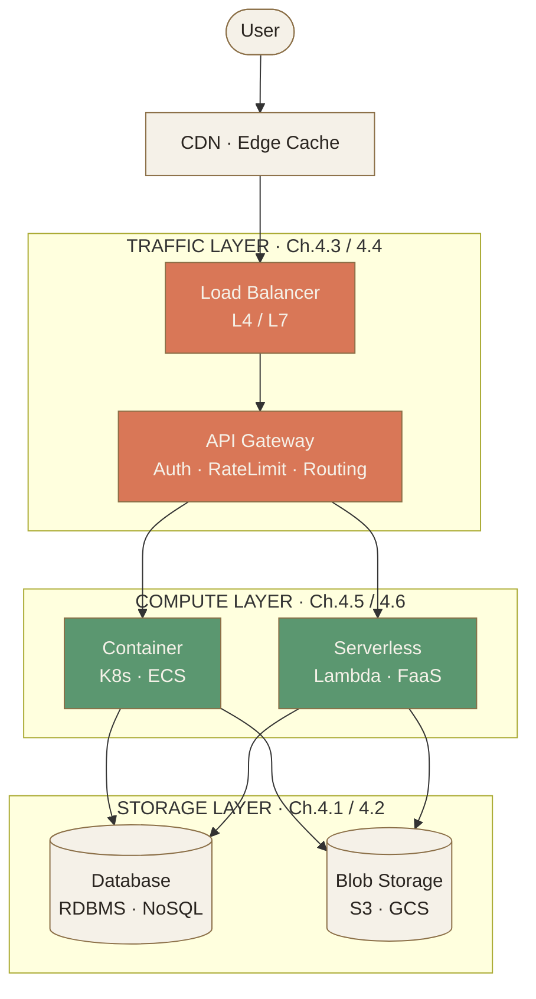
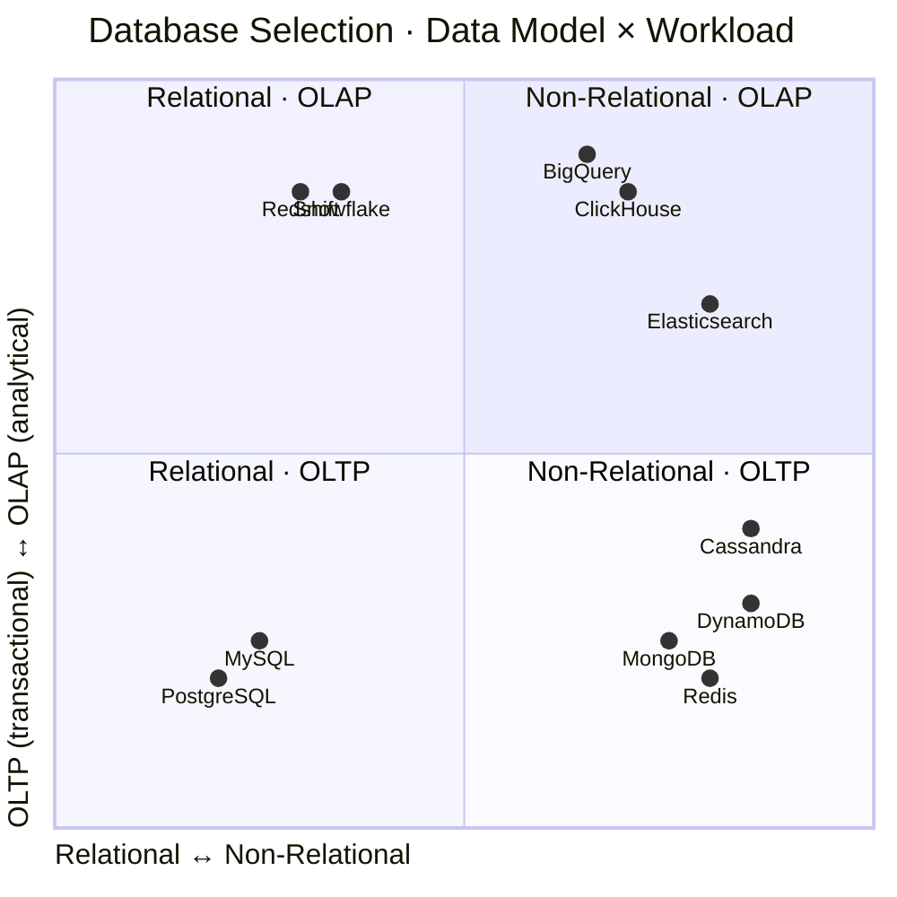
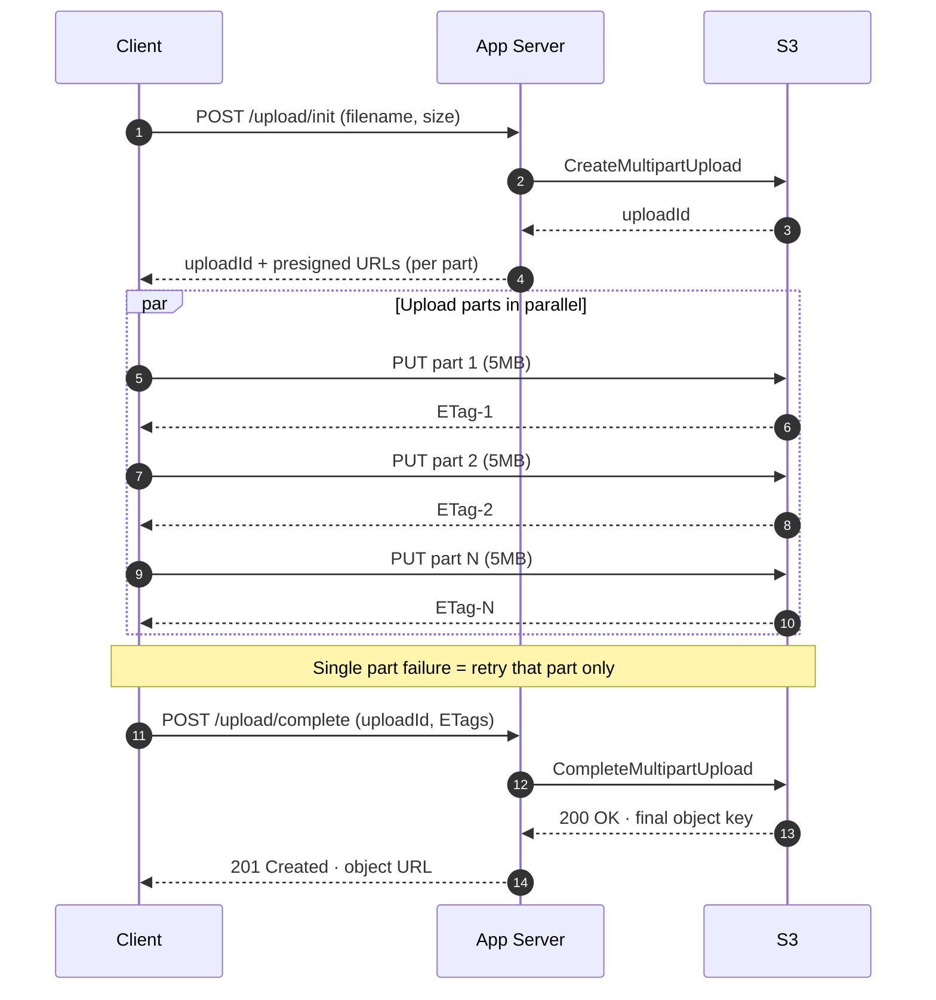
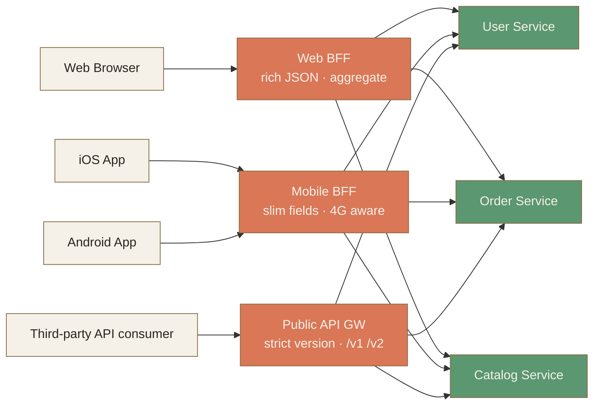
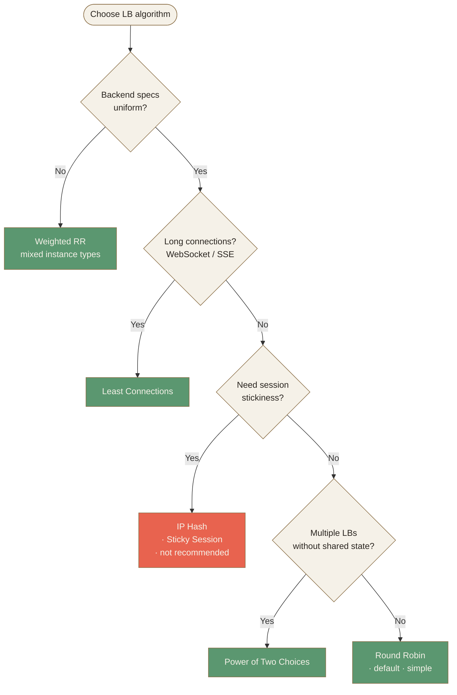
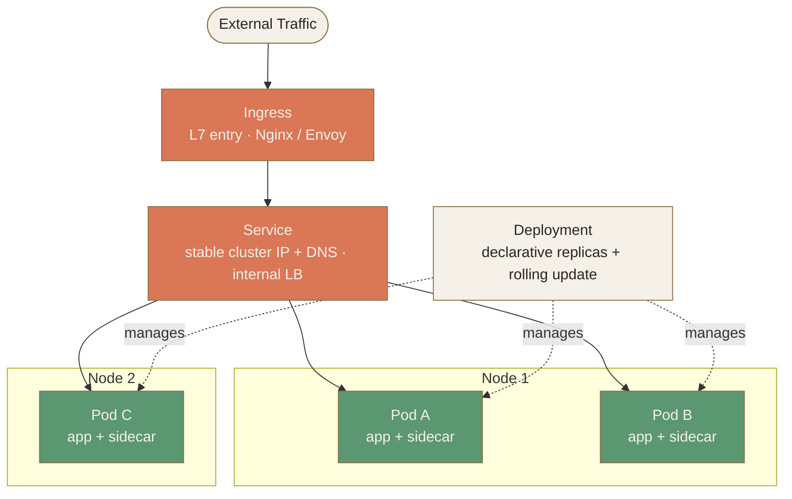
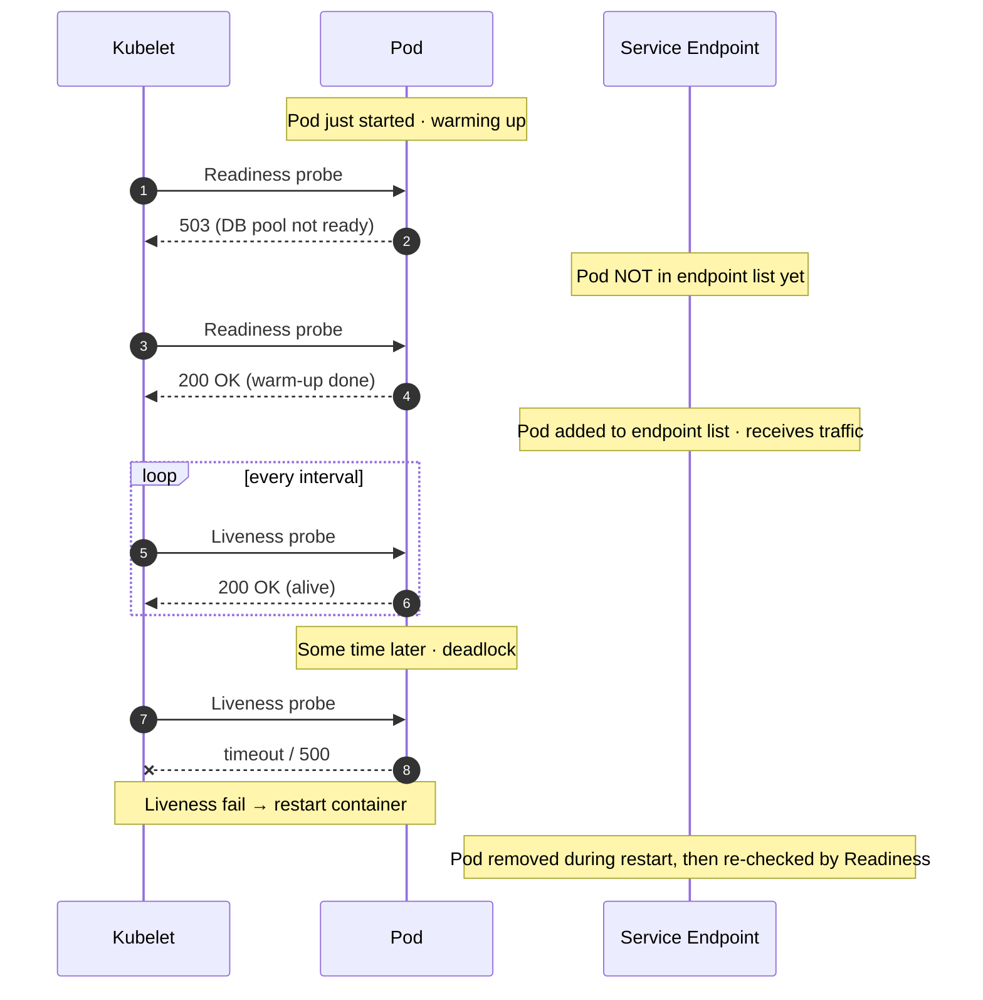
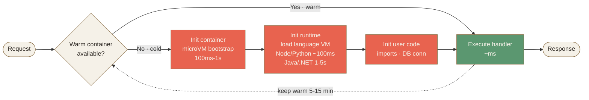
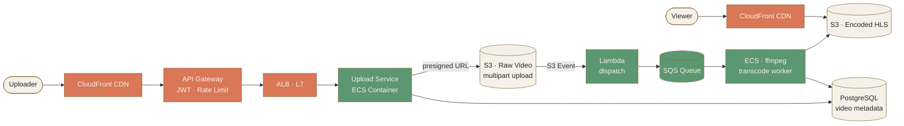

# Ch.4 · Infrastructure · 基礎建設 · 圖像 Prompts

> Style guide: [`../0_STYLE_GUIDE.md`](../0_STYLE_GUIDE.md)
> Save images to: `ppt/assets/diagrams/04-infrastructure/`

**本章圖像總覽**：18 張 · P1 × 7 · P2 × 9 · P3 × 2 · A × 1 · B × 3 · C × 7 · D × 6 · E × 1

---

## Image 01 · Hero · 章首封面

- **Type**: A · Hero illustration
- **Priority**: P1
- **Slide**: `04-infrastructure/00_overview.md` · 第 1 張（cover）
- **Save as**: `ppt/assets/diagrams/04-infrastructure/00_hero.png`
- **Aspect**: 16:9
- **Prompt**:
  ```
  An editorial illustration of a craftsman's open toolbox on a workbench, containing six distinct hand-drawn tools each labeled subtly: a stacked-cylinder database, a treasure chest for blob storage, a gateway arch, a balance scale for load balancer, a shipping container, and a small lambda symbol on a cloud. Above the toolbox, faint architectural blueprint lines connect the tools to a layered city skyline silhouette representing a distributed system rising from solid ground.
  Composition: centered toolbox in the lower two-thirds, blueprint connections fanning outward and upward, ample negative space at the top with a subtle title area, foundational baseline at the bottom suggesting "infrastructure as ground".
  editorial illustration, hand-drawn technical sketch style, warm color palette featuring cream off-white #F5F1E8 background and warm orange #D97757 accents with deep brown #8B6F47 secondary lines, minimalist flat vector with subtle paper texture, clean geometric lines, ample whitespace, educational diagram style, calm composed mood.
  --ar 16:9 --style raw --no photo-realistic, 3d render, neon, gradient glow, cluttered text, watermark, kawaii, anime
  ```
- **Note**: 開場 hero 用「工具箱」隱喻——六個基礎建設元件就是工程師的六把工具，每把都有自己的用途，沒有萬用神兵。

---

## Image 02 · Mental Model · 三層基礎建設架構

- **Type**: E · Mermaid（首選）
- **Priority**: P1
- **Slide**: `04-infrastructure/00_overview.md` · MENTAL MODEL section（第 3 張）
- **Save as (Mermaid 渲染)**: `ppt/assets/diagrams/04-infrastructure/00_mental_model.png`
- **Aspect**: 16:9

**Mermaid 原始碼**（推薦做法，貼到 https://mermaid.live 渲染後存 PNG）：


**AI Prompt 備援**（若不想用 Mermaid）：
```
A hand-drawn three-tier architecture diagram showing the path from a user icon at top, descending through a CDN cloud, then a Load Balancer plus API Gateway box (TRAFFIC layer), then splitting into Container and Serverless boxes (COMPUTE layer), then connecting downward to Database cylinder and Blob Storage drum (STORAGE layer). Three layers labeled on the right side as TRAFFIC, COMPUTE, STORAGE with thin bracket lines.
Composition: vertical waterfall flow, three horizontal bands stacked, arrows in warm orange, layer labels in deep brown italic on the right margin.
editorial illustration, hand-drawn technical sketch style, warm color palette featuring cream off-white #F5F1E8 background and warm orange #D97757 accents with deep brown #8B6F47 secondary lines, minimalist flat vector with subtle paper texture, clean geometric lines, ample whitespace, educational diagram style, calm composed mood.
--ar 16:9 --style raw --no photo-realistic, 3d render, neon, gradient glow, cluttered text, watermark, kawaii, anime
```

- **Note**: 全章心智模型——所有後續內容都掛在這個三層上，幫讀者每讀一個 topic 都知道在哪一層。

---

## Image 03 · Database · 兩個正交維度 2×2

- **Type**: D · 對照圖（2x2 matrix）
- **Priority**: P1
- **Slide**: `04-infrastructure/01_database.md` · 兩個正交維度（第 3 張）
- **Save as**: `ppt/assets/diagrams/04-infrastructure/01_database_01_matrix.png`
- **Aspect**: 16:9

**Mermaid 原始碼**（quadrant chart）：


**AI Prompt 備援**：
```
A hand-drawn 2x2 matrix labeled "Database Selection". Horizontal axis from "Relational" on the left to "Non-Relational" on the right. Vertical axis from "OLTP" at the bottom to "OLAP" at the top. Four quadrants populated with database name labels: bottom-left has "PostgreSQL · MySQL", bottom-right has "Redis · DynamoDB · MongoDB · Cassandra", top-left has "Snowflake · Redshift", top-right has "ClickHouse · BigQuery · Elasticsearch". Title above the matrix.
Composition: clean centered 2x2 grid taking 70 percent of canvas, axis labels in deep brown italic, database names in dark navy text, quadrant backgrounds tinted very faintly with cream variants.
editorial illustration, hand-drawn technical sketch style, warm color palette featuring cream off-white #F5F1E8 background and warm orange #D97757 accents with deep brown #8B6F47 secondary lines, minimalist flat vector with subtle paper texture, clean geometric lines, ample whitespace, educational diagram style, calm composed mood.
--ar 16:9 --style raw --no photo-realistic, 3d render, neon, gradient glow, cluttered text, watermark, kawaii, anime
```

- **Note**: 「資料模型 × 工作負載」兩個正交維度，是面試/選型時最快收斂的工具。讓讀者把市面上各家 DB 一眼分類。

---

## Image 04 · Database · 4 種 NoSQL 適用場景

- **Type**: D · 場景四宮格
- **Priority**: P2
- **Slide**: `04-infrastructure/01_database.md` · NoSQL 適用場景（第 5 張）
- **Save as**: `ppt/assets/diagrams/04-infrastructure/01_database_02_nosql_grid.png`
- **Aspect**: 16:9
- **Prompt**:
  ```
  A hand-drawn 2x2 grid showing four NoSQL types with iconographic representations. Top-left cell: "Key-Value · Redis / DynamoDB" with a small key-and-lock icon, caption "Session · Counter · Leaderboard · Cache". Top-right cell: "Document · MongoDB" with a folded paper document icon, caption "User Profile · CMS · Product Catalog". Bottom-left cell: "Wide-column · Cassandra / HBase" with a wide table-of-columns icon, caption "Time-series · IoT · Multi-region writes". Bottom-right cell: "Graph · Neo4j" with a connected-nodes icon, caption "Social Network · Recommendation · Knowledge Graph".
  Composition: four equal-sized cells with thin deep brown dividing lines, icons in warm orange centered above each label, captions in dark navy small text below, no heavy borders, generous internal padding.
  editorial illustration, hand-drawn technical sketch style, warm color palette featuring cream off-white #F5F1E8 background and warm orange #D97757 accents with deep brown #8B6F47 secondary lines, minimalist flat vector with subtle paper texture, clean geometric lines, ample whitespace, educational diagram style, calm composed mood.
  --ar 16:9 --style raw --no photo-realistic, 3d render, neon, gradient glow, cluttered text, watermark, kawaii, anime
  ```
- **Note**: 對應四種主流 NoSQL 一眼看懂典型場景，配合課文「先 PostgreSQL，撞牆再換」的口訣使用。

---

## Image 05 · Blob Storage · File / Block / Object 三種對比

- **Type**: D · 三欄對照圖
- **Priority**: P1
- **Slide**: `04-infrastructure/02_blob_storage.md` · 三種儲存對比（第 3 張）
- **Save as**: `ppt/assets/diagrams/04-infrastructure/02_blob_01_three_storage.png`
- **Aspect**: 16:9
- **Prompt**:
  ```
  A hand-drawn three-panel comparison illustration. Left panel labeled "File Storage" shows a hierarchical folder tree with nested files (icons of folders branching into documents), small caption "NFS · SMB · EFS · in-place edit". Middle panel labeled "Block Storage" shows a stack of equal-sized rectangular blocks like bricks lined up horizontally, small caption "EBS · Persistent Disk · OS-level addressing". Right panel labeled "Object Storage" shows a flat array of unique-shaped objects floating in a wide space, each with a tag-label, caption "S3 · GCS · Azure Blob · immutable, key→value".
  Composition: three vertical panels separated by thin deep brown dividers, each panel has the title at top, central illustration in middle, caption at bottom, equal width allocation, ample whitespace inside each panel.
  editorial illustration, hand-drawn technical sketch style, warm color palette featuring cream off-white #F5F1E8 background and warm orange #D97757 accents with deep brown #8B6F47 secondary lines, minimalist flat vector with subtle paper texture, clean geometric lines, ample whitespace, educational diagram style, calm composed mood.
  --ar 16:9 --style raw --no photo-realistic, 3d render, neon, gradient glow, cluttered text, watermark, kawaii, anime
  ```
- **Note**: 三種儲存的本質差異——folder tree vs blocks vs flat key-value——一張圖視覺記憶點極強。

---

## Image 06 · Blob Storage · S3 Multipart Upload 序列

- **Type**: C · 序列圖
- **Priority**: P2
- **Slide**: `04-infrastructure/02_blob_storage.md` · 大檔上傳模式（第 6 張）
- **Save as**: `ppt/assets/diagrams/04-infrastructure/02_blob_02_multipart.png`
- **Aspect**: 16:9

**Mermaid 原始碼**：


- **Note**: Multipart 是大檔上傳必懂模式——序列圖直接看出「並行 + 單塊重試」的價值。

---

## Image 07 · Blob Storage · 5 個儲存等級階梯

- **Type**: B · 概念隱喻
- **Priority**: P3
- **Slide**: `04-infrastructure/02_blob_storage.md` · 5 個儲存等級（第 5 張）
- **Save as**: `ppt/assets/diagrams/04-infrastructure/02_blob_03_tier_ladder.png`
- **Aspect**: 16:9
- **Prompt**:
  ```
  A hand-drawn descending staircase illustration showing five steps going from upper-left (warm/hot) to lower-right (cold/frozen). Each step labeled top-to-bottom: "Standard · ms access · highest storage cost", "Infrequent Access · ms · ~50% cost", "Glacier Instant · ms · low cost · higher retrieval fee", "Glacier Flexible · minutes-hours · very low cost", "Glacier Deep Archive · up to 12h · lowest cost · highest retrieval fee". A small thermometer icon descends along the staircase from a warm orange flame at the top to a frosty pale-blue ice crystal at the bottom (use only the warm palette tones).
  Composition: diagonal staircase from upper-left to lower-right occupying middle 70 percent, labels written along each step's tread, thermometer descending parallel to steps on the right side, axis hint "warmer ←→ colder" at the side.
  editorial illustration, hand-drawn technical sketch style, warm color palette featuring cream off-white #F5F1E8 background and warm orange #D97757 accents with deep brown #8B6F47 secondary lines, minimalist flat vector with subtle paper texture, clean geometric lines, ample whitespace, educational diagram style, calm composed mood.
  --ar 16:9 --style raw --no photo-realistic, 3d render, neon, gradient glow, cluttered text, watermark, kawaii, anime
  ```
- **Note**: 「越冷越便宜，但取回更貴」用階梯與溫度計同時表現，視覺記憶 anchor。

---

## Image 08 · API Gateway · 7 件職責拼圖

- **Type**: B · 概念拼圖
- **Priority**: P1
- **Slide**: `04-infrastructure/03_api_gateway.md` · Gateway 7 件事（第 3 張）
- **Save as**: `ppt/assets/diagrams/04-infrastructure/03_gw_01_responsibilities.png`
- **Aspect**: 16:9
- **Prompt**:
  ```
  A hand-drawn central archway labeled "API Gateway" in bold, with eight puzzle-piece-shaped tiles arranged in two rows around or below the archway, each tile representing one responsibility with a tiny icon and label. Tiles: "Authn / Authz" with a key icon, "Rate Limiting" with a faucet drip icon, "Routing" with a fork-in-road icon, "Aggregation / BFF" with a merging-arrows icon, "Caching" with a small box-with-clock icon, "Circuit Breaker" with a broken-line switch icon, "Logging / Tracing" with a magnifying-glass icon, "Transformation" with a translating-arrows icon. Tiles fit together implying these are all parts of one gateway.
  Composition: archway centered upper third, eight tiles arranged in a 4x2 grid below the arch, soft connecting lines from arch down to each tile, generous spacing, label sizes consistent.
  editorial illustration, hand-drawn technical sketch style, warm color palette featuring cream off-white #F5F1E8 background and warm orange #D97757 accents with deep brown #8B6F47 secondary lines, minimalist flat vector with subtle paper texture, clean geometric lines, ample whitespace, educational diagram style, calm composed mood.
  --ar 16:9 --style raw --no photo-realistic, 3d render, neon, gradient glow, cluttered text, watermark, kawaii, anime
  ```
- **Note**: Gateway 的價值就是「一次集中 8 件橫切關注點」——拼圖隱喻最直白。

---

## Image 09 · API Gateway · BFF 模式（Web / Mobile / Public）

- **Type**: C · 架構圖
- **Priority**: P2
- **Slide**: `04-infrastructure/03_api_gateway.md` · BFF 模式（第 7 張）
- **Save as**: `ppt/assets/diagrams/04-infrastructure/03_gw_02_bff.png`
- **Aspect**: 16:9

**Mermaid 原始碼**：


- **Note**: 三條客戶端 → 三個 BFF → 共享後端微服務，凸顯「不同客戶端有不同 gateway」的設計動機。

---

## Image 10 · Load Balancer · L4 vs L7 對比

- **Type**: D · 雙欄對照
- **Priority**: P1
- **Slide**: `04-infrastructure/04_load_balancer.md` · L4 vs L7（第 3 張）
- **Save as**: `ppt/assets/diagrams/04-infrastructure/04_lb_01_l4_vs_l7.png`
- **Aspect**: 16:9
- **Prompt**:
  ```
  A hand-drawn split comparison illustration. Left panel labeled "L4 LB · Transport Layer" shows a closed envelope being routed by IP and port number visible on the outside; arrows split the envelope toward two backend boxes without opening it; sub-caption "fast (~10M conn/s) · transparent TCP/UDP · WebSocket friendly". Right panel labeled "L7 LB · Application Layer" shows an envelope being opened to read its HTTP path/header content, then routed differently based on what's inside (e.g., /api/users vs /api/orders going to different backends); sub-caption "slower · path/header/cookie routing · rewrite & A/B".
  Composition: two equal vertical panels divided by a single thin deep brown line, each panel has heading at top and small caption at bottom, central illustration occupies the middle, identical visual weight.
  editorial illustration, hand-drawn technical sketch style, warm color palette featuring cream off-white #F5F1E8 background and warm orange #D97757 accents with deep brown #8B6F47 secondary lines, minimalist flat vector with subtle paper texture, clean geometric lines, ample whitespace, educational diagram style, calm composed mood.
  --ar 16:9 --style raw --no photo-realistic, 3d render, neon, gradient glow, cluttered text, watermark, kawaii, anime
  ```
- **Note**: 「信封不打開 vs 打開讀內容」是 L4/L7 最直觀的譬喻。

---

## Image 11 · Load Balancer · 演算法決策樹

- **Type**: C · 流程決策圖
- **Priority**: P2
- **Slide**: `04-infrastructure/04_load_balancer.md` · 5 種演算法（第 4 張）
- **Save as**: `ppt/assets/diagrams/04-infrastructure/04_lb_02_algo_tree.png`
- **Aspect**: 16:9

**Mermaid 原始碼**：


- **Note**: 5 種演算法不必死背——決策樹走一遍就知道該用哪個。IP Hash 用警告色提示「不推薦」。

---

## Image 12 · Load Balancer · Sticky Session 副作用

- **Type**: D · 對照圖
- **Priority**: P3
- **Slide**: `04-infrastructure/04_load_balancer.md` · Sticky Session（第 6 張）
- **Save as**: `ppt/assets/diagrams/04-infrastructure/04_lb_03_sticky.png`
- **Aspect**: 16:9
- **Prompt**:
  ```
  A hand-drawn split-panel illustration showing the side effects of Sticky Session. Left panel labeled "Without Sticky" shows three stick-figure users, each with their requests evenly distributed across three identical server boxes via dashed lines (balanced load). Right panel labeled "With Sticky" shows the same three users, but each user's requests are bound by a chain icon to one specific server, leading to one server being heavily loaded (drawn larger/sweating with three users worth of arrows) while the other two are nearly idle; below it a small warning shows "node crash → session lost".
  Composition: two equal panels divided vertically, each with title at top, three users on left of each panel, three servers on right of each panel, dashed/chain lines showing routing, small alert callouts at bottom of right panel, balanced visual weight.
  editorial illustration, hand-drawn technical sketch style, warm color palette featuring cream off-white #F5F1E8 background and warm orange #D97757 accents with deep brown #8B6F47 secondary lines, minimalist flat vector with subtle paper texture, clean geometric lines, ample whitespace, educational diagram style, calm composed mood.
  --ar 16:9 --style raw --no photo-realistic, 3d render, neon, gradient glow, cluttered text, watermark, kawaii, anime
  ```
- **Note**: 視覺化「熱節點」副作用——左邊均衡、右邊集中冒汗，配合「節點掛掉 session 全失」一句反模式提示。

---

## Image 13 · Container · VM vs Container 隔離邊界

- **Type**: B · 概念對比
- **Priority**: P1
- **Slide**: `04-infrastructure/05_container.md` · 為何 Container 取代 VM（第 2 張）
- **Save as**: `ppt/assets/diagrams/04-infrastructure/05_container_01_vm_vs_container.png`
- **Aspect**: 16:9
- **Prompt**:
  ```
  A hand-drawn cross-section comparison of stacked layers. Left side labeled "Virtual Machines" shows from bottom to top: hardware bar, then "Host OS" bar, then "Hypervisor" bar, then three tall stacks each containing "Guest OS" + "Bins/Libs" + "App" — each stack is heavy and tall, drawn with thick borders. Right side labeled "Containers" shows from bottom to top: hardware bar, then "Host OS · Linux kernel" bar (shared and emphasized), then "Container Runtime" bar, then five short stacks each containing only "Bins/Libs" + "App" — each stack is short, slim, drawn with light borders. Density indicator below: "VM ~10/host" vs "Container ~100/host" with start-time hints "30s-3min" vs "100ms-1s".
  Composition: two equal halves split vertically, layered architecture stacks aligned to ground line, container side visibly more compact, clear labels and small numeric annotations on the right margin of each side.
  editorial illustration, hand-drawn technical sketch style, warm color palette featuring cream off-white #F5F1E8 background and warm orange #D97757 accents with deep brown #8B6F47 secondary lines, minimalist flat vector with subtle paper texture, clean geometric lines, ample whitespace, educational diagram style, calm composed mood.
  --ar 16:9 --style raw --no photo-realistic, 3d render, neon, gradient glow, cluttered text, watermark, kawaii, anime
  ```
- **Note**: 核心對比——「每台 VM 自帶 Guest OS」vs「Container 共用 host kernel」，視覺上密度差立刻看見。

---

## Image 14 · Container · K8s Pod / Deployment / Service 結構

- **Type**: C · 架構圖
- **Priority**: P2
- **Slide**: `04-infrastructure/05_container.md` · K8s 核心概念（第 4 張）
- **Save as**: `ppt/assets/diagrams/04-infrastructure/05_container_02_k8s.png`
- **Aspect**: 16:9

**Mermaid 原始碼**：


- **Note**: K8s 四個核心抽象（Ingress / Service / Deployment / Pod）一張圖看懂職責——Pod 是排程單元，Service 是網路抽象，Deployment 是宣告式管理。

---

## Image 15 · Container · Liveness vs Readiness 序列圖

- **Type**: C · 序列圖
- **Priority**: P2
- **Slide**: `04-infrastructure/05_container.md` · Liveness vs Readiness（第 5 張）
- **Save as**: `ppt/assets/diagrams/04-infrastructure/05_container_03_probes.png`
- **Aspect**: 16:9

**Mermaid 原始碼**：


- **Note**: 兩種 probe 的職責分工序列——Readiness 控「能不能接流量」，Liveness 控「該不該重啟」，視覺上看出兩條獨立決策路徑。

---

## Image 16 · Serverless · Cold Start 數字階梯

- **Type**: D · 對照圖（橫條視覺化）
- **Priority**: P2
- **Slide**: `04-infrastructure/06_serverless.md` · Cold Start 的數字（第 2 張）
- **Save as**: `ppt/assets/diagrams/04-infrastructure/06_serverless_01_cold_start.png`
- **Aspect**: 16:9
- **Prompt**:
  ```
  A hand-drawn horizontal bar chart titled "Cold Start Latency by Runtime". Y-axis lists four categories top-to-bottom: "Go / Rust (compiled)", "Python / Node.js", "Container Image Lambda", "Java / .NET (JVM/CLR)". X-axis shows time in milliseconds with markers at 100ms, 500ms, 1s, 5s. Horizontal bars: Go/Rust short (100-300ms), Python/Node slightly longer (100-500ms), Container Image medium-long (500ms-2s), Java/.NET very long (1-5s). Each bar labeled with its range to the right of the bar end. A small sub-panel at bottom-right shows "Warm execution: < 50ms · no extra latency" as a tiny reference bar for contrast.
  Composition: title at top, horizontal bar chart occupying left two-thirds, axis labels in deep brown italic, bars filled with warm orange of varying lengths, range labels in dark navy, sub-panel reference bar small at bottom-right.
  editorial illustration, hand-drawn technical sketch style, warm color palette featuring cream off-white #F5F1E8 background and warm orange #D97757 accents with deep brown #8B6F47 secondary lines, minimalist flat vector with subtle paper texture, clean geometric lines, ample whitespace, educational diagram style, calm composed mood.
  --ar 16:9 --style raw --no photo-realistic, 3d render, neon, gradient glow, cluttered text, watermark, kawaii, anime
  ```
- **Note**: 把抽象的「cold start 很慢」轉成具體數字——讓讀者看一眼就記住「Java 比 Go 慢一個數量級」。

---

## Image 17 · Serverless · FaaS 執行流程

- **Type**: C · 流程圖
- **Priority**: P2
- **Slide**: `04-infrastructure/06_serverless.md` · Cold Start 流程（第 2 張說明）
- **Save as**: `ppt/assets/diagrams/04-infrastructure/06_serverless_02_faas_flow.png`
- **Aspect**: 16:9

**Mermaid 原始碼**：


- **Note**: 「冷路徑」三步（init container → init runtime → init user code）vs「熱路徑」一步——視覺上凸顯為何冷啟動慢、為何 warm pool 有效。

---

## Image 18 · Recap · 影片上傳完整架構

- **Type**: C · 系統架構圖
- **Priority**: P2
- **Slide**: `04-infrastructure/99_recap.md` · Case Study（第 2 張）
- **Save as**: `ppt/assets/diagrams/04-infrastructure/99_recap_01_video_arch.png`
- **Aspect**: 16:9

**Mermaid 原始碼**：


- **Note**: 章末整合圖——把 6 個 topic（DB / Blob / Gateway / LB / Container / Serverless）以一個真實影片系統串起來，每個元件都對應 Ch.4 一節。

---

## 索引

| # | Topic | Priority | Type | File |
|---|-------|---------|------|------|
| 01 | Hero · 基礎建設工具箱 | P1 | A | `00_hero.png` |
| 02 | Mental Model · 三層架構 | P1 | E | `00_mental_model.png` |
| 03 | DB · 兩個正交維度 2x2 | P1 | D | `01_database_01_matrix.png` |
| 04 | DB · 4 種 NoSQL 場景 | P2 | D | `01_database_02_nosql_grid.png` |
| 05 | Blob · File/Block/Object 對比 | P1 | D | `02_blob_01_three_storage.png` |
| 06 | Blob · S3 Multipart 序列 | P2 | C | `02_blob_02_multipart.png` |
| 07 | Blob · 5 個儲存等級階梯 | P3 | B | `02_blob_03_tier_ladder.png` |
| 08 | Gateway · 7 件職責拼圖 | P1 | B | `03_gw_01_responsibilities.png` |
| 09 | Gateway · BFF 模式 | P2 | C | `03_gw_02_bff.png` |
| 10 | LB · L4 vs L7 對比 | P1 | D | `04_lb_01_l4_vs_l7.png` |
| 11 | LB · 演算法決策樹 | P2 | C | `04_lb_02_algo_tree.png` |
| 12 | LB · Sticky Session 副作用 | P3 | D | `04_lb_03_sticky.png` |
| 13 | Container · VM vs Container | P1 | B | `05_container_01_vm_vs_container.png` |
| 14 | Container · K8s 結構 | P2 | C | `05_container_02_k8s.png` |
| 15 | Container · Liveness vs Readiness | P2 | C | `05_container_03_probes.png` |
| 16 | Serverless · Cold Start 數字 | P2 | D | `06_serverless_01_cold_start.png` |
| 17 | Serverless · FaaS 執行流程 | P2 | C | `06_serverless_02_faas_flow.png` |
| 18 | Recap · 影片上傳整合架構 | P2 | C | `99_recap_01_video_arch.png` |
