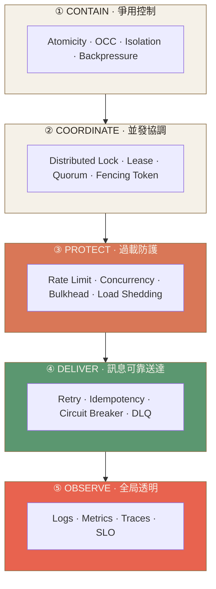
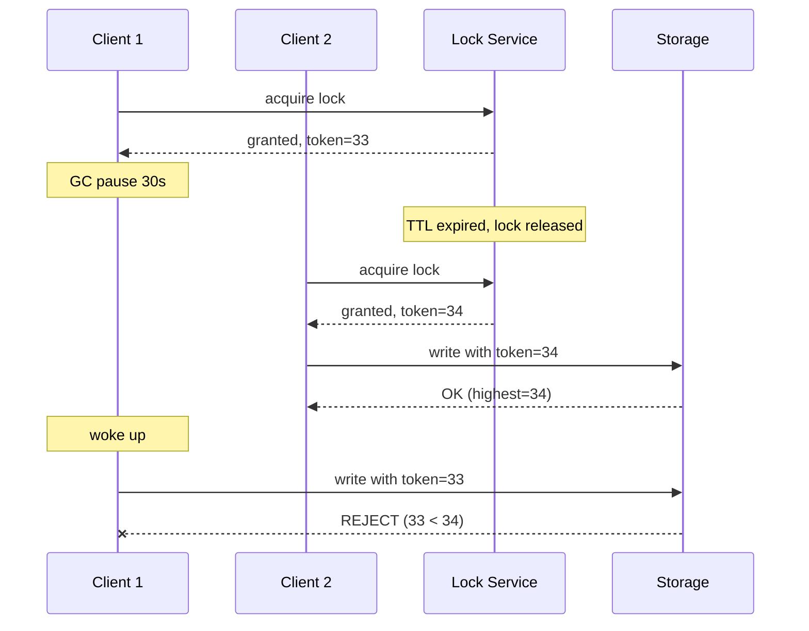
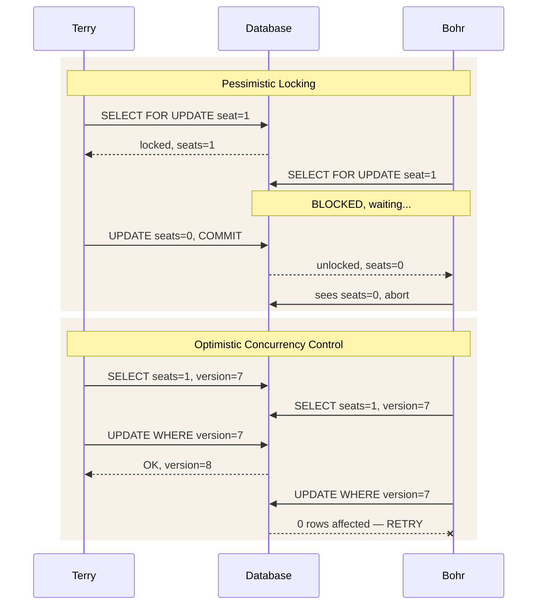
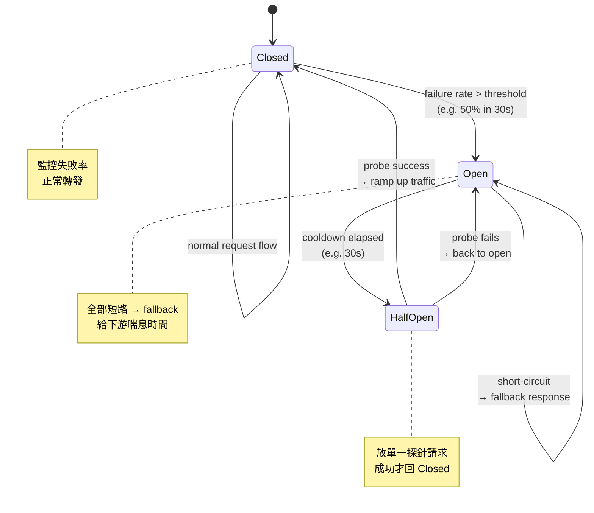
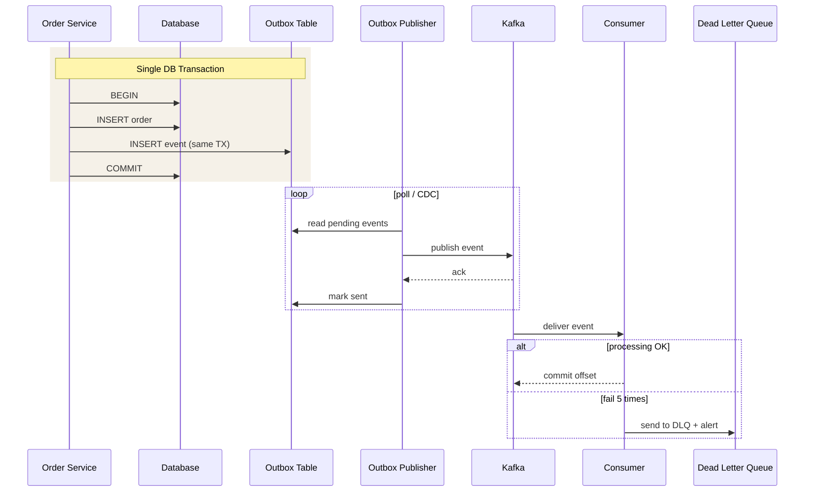
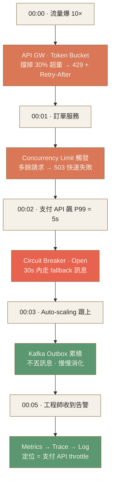

# Ch.5 · Reliability & Ops · 圖像 Prompts

> Style guide: [`../0_STYLE_GUIDE.md`](../0_STYLE_GUIDE.md)
> Save images to: `ppt/assets/diagrams/05-reliability-ops/`

**本章圖像總覽**：15 張 · P1 × 5 · P2 × 8 · P3 × 2 · A × 1 · B × 4 · C × 3 · D × 4 · E × 3

---

## Image 01 · Hero · 章首封面

- **Type**: A · Hero illustration
- **Priority**: P1
- **Slide**: `05-reliability-ops/00_overview.md` · 第 1 張（cover）
- **Save as**: `ppt/assets/diagrams/05-reliability-ops/00_hero.png`
- **Aspect**: 16:9
- **Prompt**:
  ```
  An editorial illustration of a sturdy stone fortress with five concentric defensive walls protecting a small glowing core, weathered guardians stationed at each ring with watchtowers, alarm bells, and signal flags, surrounded by rolling storm clouds and lightning trying to penetrate the walls but being deflected, a moat of running water at the outer edge.
  Composition: central focal point at the glowing core (representing the running system), five visible concentric rings labeled subtly with small icons (lock, scale, shield, envelope, eye), storm clouds in upper third, calm interior in lower two-thirds, ample whitespace around the fortress for breathing room.
  editorial illustration, hand-drawn technical sketch style, warm color palette featuring cream off-white #F5F1E8 background and warm orange #D97757 accents with deep brown #8B6F47 secondary lines, minimalist flat vector with subtle paper texture, clean geometric lines, ample whitespace, educational diagram style, calm composed mood.
  --ar 16:9 --style raw --no photo-realistic, 3d render, neon, gradient glow, cluttered text, watermark, kawaii, anime
  ```
- **Note**: 「故障是常態」隱喻 — 多層防線的城堡守護核心系統，呼應 5 個防禦層的核心觀念。

---

## Image 02 · Mental Model · 5 層可靠性防線

- **Type**: E · Mermaid (主) + B · 隱喻備援
- **Priority**: P1
- **Slide**: `05-reliability-ops/00_overview.md` · MENTAL MODEL section
- **Save as (Mermaid 渲染)**: `ppt/assets/diagrams/05-reliability-ops/00_mental_model.png`
- **Aspect**: 16:9

**Mermaid 原始碼**：


**AI Prompt 備援**：
```
A hand-drawn editorial diagram showing five horizontal layered rectangles stacked from bottom to top labeled CONTAIN, COORDINATE, PROTECT, DELIVER, OBSERVE, each layer drawn like an architectural cross-section with subtle textural distinction, an upward arrow on the left side showing escalation from local to global concerns.
Composition: vertical stack centered horizontally, each layer same width but slightly different height, small icon glyphs at right edge of each band (a tiny lock, a tiny scale, a tiny shield, a tiny envelope, a tiny eye), generous whitespace top and bottom.
editorial illustration, hand-drawn technical sketch style, warm color palette featuring cream off-white #F5F1E8 background and warm orange #D97757 accents with deep brown #8B6F47 secondary lines, minimalist flat vector with subtle paper texture, clean geometric lines, ample whitespace, educational diagram style, calm composed mood.
--ar 16:9 --style raw --no photo-realistic, 3d render, neon, gradient glow, cluttered text, watermark, kawaii, anime
```

- **Note**: 5 層防禦由內向外的 mental model，是貫穿全章的骨架圖，必做。

---

## Image 03 · Distributed Lock · 4 經典場景

- **Type**: B · 概念隱喻
- **Priority**: P2
- **Slide**: `05-reliability-ops/01_distributed_lock.md` · 「4 個經典場景」
- **Save as**: `ppt/assets/diagrams/05-reliability-ops/01_distributed_lock_01_scenarios.png`
- **Aspect**: 16:9
- **Prompt**:
  ```
  A 2x2 grid of hand-drawn illustration vignettes depicting four distributed lock scenarios: top-left a shopping cart with a hourglass timer holding limited-edition items during checkout, top-right a ride-share car with multiple passenger hands reaching for it with one hand grabbing first, bottom-left multiple identical cron-job clock icons all pointing to the same single task box with one arrow allowed through, bottom-right an auction gavel poised over a single bid item with multiple bidder paddles raised.
  Composition: clean 2x2 quadrant layout with thin divider lines, each quadrant has its scenario centered with a tiny caption space below, balanced visual weight across all four cells.
  editorial illustration, hand-drawn technical sketch style, warm color palette featuring cream off-white #F5F1E8 background and warm orange #D97757 accents with deep brown #8B6F47 secondary lines, minimalist flat vector with subtle paper texture, clean geometric lines, ample whitespace, educational diagram style, calm composed mood.
  --ar 16:9 --style raw --no photo-realistic, 3d render, neon, gradient glow, cluttered text, watermark, kawaii, anime
  ```
- **Note**: PDF 點名的 4 個必用場景，視覺化幫助記憶「什麼時候該想到鎖」。

---

## Image 04 · Distributed Lock · 4 方案 Trade-off

- **Type**: D · 對照圖
- **Priority**: P1
- **Slide**: `05-reliability-ops/01_distributed_lock.md` · 「4 種實作方案對比」
- **Save as**: `ppt/assets/diagrams/05-reliability-ops/01_distributed_lock_02_tradeoff.png`
- **Aspect**: 16:9
- **Prompt**:
  ```
  A hand-drawn editorial trade-off chart with two axes: horizontal axis labeled "Consistency" weak to strong, vertical axis labeled "Operational Cost" low to high, four labeled circles plotted at distinct positions — Redis SET NX EX in lower-left (weak consistency, low ops), DB Row Lock in middle-left (strong consistency in single DB, low ops), ZooKeeper / etcd in upper-right (strong consistency, high ops), K8s replicas:1 in lower-far-left as a dashed circle (no concurrency at all).
  Composition: clean 2D scatter plot with thin axis lines, each circle a different size proportional to use frequency, dashed connector hint between Redis and Redlock variant, thin annotation lines pointing from each circle to a tiny caption.
  editorial illustration, hand-drawn technical sketch style, warm color palette featuring cream off-white #F5F1E8 background and warm orange #D97757 accents with deep brown #8B6F47 secondary lines, minimalist flat vector with subtle paper texture, clean geometric lines, ample whitespace, educational diagram style, calm composed mood.
  --ar 16:9 --style raw --no photo-realistic, 3d render, neon, gradient glow, cluttered text, watermark, kawaii, anime
  ```
- **Note**: 鎖選型的關鍵 2D 圖：consistency × ops cost，幫助讀者快速決策。

---

## Image 05 · Distributed Lock · Fencing Token 序列圖

- **Type**: E · Mermaid sequence
- **Priority**: P1
- **Slide**: `05-reliability-ops/01_distributed_lock.md` · 「三大陷阱 · GC pause」
- **Save as**: `ppt/assets/diagrams/05-reliability-ops/01_distributed_lock_03_fencing.png`
- **Aspect**: 16:9

**Mermaid 原始碼**：


- **Note**: Fencing token 是 Martin Kleppmann 經典設計，序列圖最能說清「為什麼舊 token 會被拒絕」。

---

## Image 06 · Contention · Pessimistic vs OCC 序列對比

- **Type**: E · Mermaid sequence
- **Priority**: P1
- **Slide**: `05-reliability-ops/02_contention.md` · 「Pessimistic vs Optimistic」
- **Save as**: `ppt/assets/diagrams/05-reliability-ops/02_contention_01_pessimistic_vs_occ.png`
- **Aspect**: 16:9

**Mermaid 原始碼**：


- **Note**: 同一個搶票場景兩種解法的對比，序列圖比文字描述快 10 倍理解。

---

## Image 07 · Contention · 5 層解法複雜度遞進

- **Type**: B · 視覺化階梯
- **Priority**: P2
- **Slide**: `05-reliability-ops/02_contention.md` · 「五層解法的複雜度遞進」
- **Save as**: `ppt/assets/diagrams/05-reliability-ops/02_contention_02_5_layers.png`
- **Aspect**: 16:9
- **Prompt**:
  ```
  A hand-drawn ascending staircase with five distinct steps from bottom-left to upper-right, each step labeled with one technique stacked from simplest at bottom to most complex at top: Atomicity / Transaction, Pessimistic Locking, Optimistic Concurrency, SERIALIZABLE Isolation, 2PC / Saga / Distributed Lock, a small wandering hiker figure on the second step looking up, the upper steps drawn slightly larger and with more decorative detail to suggest higher complexity cost.
  Composition: diagonal staircase taking up the lower two-thirds of frame, each step shown in clean side-view perspective, label boxes floating above each step with thin connector lines, ample sky whitespace above to suggest "higher cost", a subtle dotted line on the right showing complexity gradient.
  editorial illustration, hand-drawn technical sketch style, warm color palette featuring cream off-white #F5F1E8 background and warm orange #D97757 accents with deep brown #8B6F47 secondary lines, minimalist flat vector with subtle paper texture, clean geometric lines, ample whitespace, educational diagram style, calm composed mood.
  --ar 16:9 --style raw --no photo-realistic, 3d render, neon, gradient glow, cluttered text, watermark, kawaii, anime
  ```
- **Note**: 階梯隱喻幫助記憶「能用簡單就不要用複雜」的口訣。

---

## Image 08 · Contention · Isolation Level × 異常矩陣

- **Type**: D · 對照矩陣
- **Priority**: P2
- **Slide**: `05-reliability-ops/02_contention.md` · 「4 個標準 isolation level」
- **Save as**: `ppt/assets/diagrams/05-reliability-ops/02_contention_03_isolation_matrix.png`
- **Aspect**: 16:9
- **Prompt**:
  ```
  A hand-drawn 4x3 truth-table matrix with rows labeled READ UNCOMMITTED / READ COMMITTED / REPEATABLE READ / SERIALIZABLE on the left, columns labeled Dirty Read / Non-repeatable Read / Phantom Read on top, each cell containing either a checkmark icon (anomaly possible) or an X icon (anomaly prevented), the SERIALIZABLE row entirely Xs, the READ UNCOMMITTED row entirely checkmarks, gradient of safety descending from top to bottom.
  Composition: clean grid table layout filling center, header row in slightly emphasized weight, row labels right-aligned, cells equally sized with single-symbol contents, thin grid lines.
  editorial illustration, hand-drawn technical sketch style, warm color palette featuring cream off-white #F5F1E8 background and warm orange #D97757 accents with deep brown #8B6F47 secondary lines, minimalist flat vector with subtle paper texture, clean geometric lines, ample whitespace, educational diagram style, calm composed mood.
  --ar 16:9 --style raw --no photo-realistic, 3d render, neon, gradient glow, cluttered text, watermark, kawaii, anime
  ```
- **Note**: 4 個 isolation level × 3 個異常的經典矩陣，面試常考。

---

## Image 09 · Overload Protection · 6 層防線拼圖

- **Type**: B · 概念架構
- **Priority**: P1
- **Slide**: `05-reliability-ops/03_overload_protection.md` · 「6 層防線」
- **Save as**: `ppt/assets/diagrams/05-reliability-ops/03_overload_01_6_layers.png`
- **Aspect**: 16:9
- **Prompt**:
  ```
  A hand-drawn left-to-right horizontal pipeline diagram showing incoming traffic stream entering from the left passing through six sequential filter gates labeled Rate Limiting, Concurrency Limiting, Queue Leveling, Bulkhead, Load Shedding, with a dashed feedback arrow labeled Backpressure looping from the rightmost back toward the left, each gate drawn like a circular sieve or sluice with progressively smaller flow size, a few "rejected" small request dots peeling off downward at each gate.
  Composition: horizontal flow occupying middle band, traffic source cloud on far left, healthy backend on far right, six gates evenly spaced in between, dashed backpressure arc swinging across the top, dropped request dots falling into a small bucket below each gate.
  editorial illustration, hand-drawn technical sketch style, warm color palette featuring cream off-white #F5F1E8 background and warm orange #D97757 accents with deep brown #8B6F47 secondary lines, minimalist flat vector with subtle paper texture, clean geometric lines, ample whitespace, educational diagram style, calm composed mood.
  --ar 16:9 --style raw --no photo-realistic, 3d render, neon, gradient glow, cluttered text, watermark, kawaii, anime
  ```
- **Note**: 6 層防線串接的核心圖，貫穿整個 Overload 章節。

---

## Image 10 · Overload Protection · Token vs Leaky Bucket

- **Type**: D · 雙隱喻對照
- **Priority**: P1
- **Slide**: `05-reliability-ops/03_overload_protection.md` · 「4 種限流演算法」
- **Save as**: `ppt/assets/diagrams/05-reliability-ops/03_overload_02_token_vs_leaky.png`
- **Aspect**: 16:9
- **Prompt**:
  ```
  A hand-drawn split-screen comparison: left half shows a Token Bucket — a wide-open bucket with small token coins dripping in from a faucet at fixed rate above, requests as small envelopes arriving and each grabbing a coin before passing through, the bucket can hold a stack of coins to allow burst; right half shows a Leaky Bucket — a tall bucket with requests pouring in chaotically from above at variable rate, but a single small hole at the bottom letting requests drip out at constant slow rate, excess overflow spills off the top edge.
  Composition: vertical divider line down the center, each side has its bucket centered with label header above and short caption below, balanced visual weight, the two buckets drawn in similar style but distinguished by where the rate-limiting is happening (input on left, output on right).
  editorial illustration, hand-drawn technical sketch style, warm color palette featuring cream off-white #F5F1E8 background and warm orange #D97757 accents with deep brown #8B6F47 secondary lines, minimalist flat vector with subtle paper texture, clean geometric lines, ample whitespace, educational diagram style, calm composed mood.
  --ar 16:9 --style raw --no photo-realistic, 3d render, neon, gradient glow, cluttered text, watermark, kawaii, anime
  ```
- **Note**: Token vs Leaky Bucket 是面試必考，視覺化記憶比文字快 10 倍。

---

## Image 11 · Reliable Delivery · 6 防線串接

- **Type**: C · 流程圖（Mermaid）
- **Priority**: P1
- **Slide**: `05-reliability-ops/04_reliable_delivery.md` · 「六大防線」
- **Save as**: `ppt/assets/diagrams/05-reliability-ops/04_delivery_01_6_lines.png`
- **Aspect**: 16:9

**Mermaid 原始碼**：


- **Note**: 6 防線從左到右遞進，每層建立在前一層基礎上，呼應 PDF 的「不是孤立工具」核心觀念。

---

## Image 12 · Reliable Delivery · Circuit Breaker 三狀態圖

- **Type**: E · Mermaid stateDiagram
- **Priority**: P1
- **Slide**: `05-reliability-ops/04_reliable_delivery.md` · 「Circuit Breaker · 三狀態圖」
- **Save as**: `ppt/assets/diagrams/05-reliability-ops/04_delivery_02_circuit_breaker.png`
- **Aspect**: 16:9

**Mermaid 原始碼**：


- **Note**: Circuit Breaker 三狀態是 SRE 必懂，stateDiagram 最清楚。

---

## Image 13 · Reliable Delivery · Transactional Outbox 序列圖

- **Type**: E · Mermaid sequence
- **Priority**: P2
- **Slide**: `05-reliability-ops/04_reliable_delivery.md` · 「Outbox / DLQ」
- **Save as**: `ppt/assets/diagrams/05-reliability-ops/04_delivery_03_outbox.png`
- **Aspect**: 16:9

**Mermaid 原始碼**：


- **Note**: Outbox 解決「DB 寫成功但訊息發送失敗」，序列圖是面試最有說服力的證據。

---

## Image 14 · Observability · 三支柱 + 串聯關係

- **Type**: B · 概念隱喻
- **Priority**: P1
- **Slide**: `05-reliability-ops/05_observability.md` · 「三支柱」
- **Save as**: `ppt/assets/diagrams/05-reliability-ops/05_observability_01_three_pillars.png`
- **Aspect**: 16:9
- **Prompt**:
  ```
  A hand-drawn editorial illustration of three classical pillars supporting a horizontal beam labeled "Observability", each pillar distinct: left pillar drawn as a stack of horizontal time-series chart lines representing Metrics, middle pillar drawn as a stack of structured log entries with thin lines of text representing Logs, right pillar drawn as a branching tree of connected spans showing a trace waterfall representing Traces, each pillar has a small connecting thread (trace_id) tying them together at the base.
  Composition: three vertical pillars evenly spaced occupying middle portion of frame, horizontal beam across the top with the title, ground line at bottom with small "trace_id" thread connecting pillar bases, ample sky whitespace above the beam.
  editorial illustration, hand-drawn technical sketch style, warm color palette featuring cream off-white #F5F1E8 background and warm orange #D97757 accents with deep brown #8B6F47 secondary lines, minimalist flat vector with subtle paper texture, clean geometric lines, ample whitespace, educational diagram style, calm composed mood.
  --ar 16:9 --style raw --no photo-realistic, 3d render, neon, gradient glow, cluttered text, watermark, kawaii, anime
  ```
- **Note**: 三支柱經典隱喻 + trace_id 串聯，呼應「三者要互相串聯」核心觀念。

---

## Image 15 · Observability · 四金信號 + SLO/Error Budget

- **Type**: D · 對照圖
- **Priority**: P2
- **Slide**: `05-reliability-ops/05_observability.md` · 「四金信號 / Error Budget」
- **Save as**: `ppt/assets/diagrams/05-reliability-ops/05_observability_02_four_signals_slo.png`
- **Aspect**: 16:9
- **Prompt**:
  ```
  A hand-drawn dashboard sketch with two halves: left side a 2x2 grid of small chart panels labeled Latency (line chart with P99 marker), Traffic (bar chart of RPS), Errors (line chart with red threshold), Saturation (gauge dial), each panel as a tiny editorial sketch; right side a horizontal "Error Budget" bar showing 100% capacity at top, current consumed portion shaded toward the left, remaining budget on the right, with small labels SLI > SLO > SLA stacked beneath as a hierarchy, a small "43 min/month" annotation pointing to remaining budget area.
  Composition: vertical divider line splits frame into 60% / 40%, left side hosts the 2x2 four-signals grid, right side hosts the budget bar and SLI/SLO/SLA stack, balanced visual rhythm.
  editorial illustration, hand-drawn technical sketch style, warm color palette featuring cream off-white #F5F1E8 background and warm orange #D97757 accents with deep brown #8B6F47 secondary lines, minimalist flat vector with subtle paper texture, clean geometric lines, ample whitespace, educational diagram style, calm composed mood.
  --ar 16:9 --style raw --no photo-realistic, 3d render, neon, gradient glow, cluttered text, watermark, kawaii, anime
  ```
- **Note**: Google SRE 四金信號 + Error Budget 視覺化，把可靠性變成可量化討論的數字。

---

## Image 16 · Recap · Black Friday Incident 時間軸

- **Type**: C · Mermaid timeline
- **Priority**: P2
- **Slide**: `05-reliability-ops/99_recap.md` · 「Incident 演練」
- **Save as**: `ppt/assets/diagrams/05-reliability-ops/99_recap_01_incident_timeline.png`
- **Aspect**: 16:9

**Mermaid 原始碼**：


- **Note**: Black Friday 5 分鐘時間軸把 5 層防線全串起來，是全章 case study 的高潮。

---

## 索引

| # | Topic | Priority | Type | File |
|---|-------|---------|------|------|
| 01 | Hero · 章首封面 | P1 | A | `00_hero.png` |
| 02 | Mental Model · 5 層防線 | P1 | E + B | `00_mental_model.png` |
| 03 | Distributed Lock · 4 場景 | P2 | B | `01_distributed_lock_01_scenarios.png` |
| 04 | Distributed Lock · 4 方案 Trade-off | P1 | D | `01_distributed_lock_02_tradeoff.png` |
| 05 | Distributed Lock · Fencing Token 序列 | P1 | E | `01_distributed_lock_03_fencing.png` |
| 06 | Contention · Pessimistic vs OCC | P1 | E | `02_contention_01_pessimistic_vs_occ.png` |
| 07 | Contention · 5 層解法階梯 | P2 | B | `02_contention_02_5_layers.png` |
| 08 | Contention · Isolation × 異常矩陣 | P2 | D | `02_contention_03_isolation_matrix.png` |
| 09 | Overload · 6 層防線拼圖 | P1 | B | `03_overload_01_6_layers.png` |
| 10 | Overload · Token vs Leaky Bucket | P1 | D | `03_overload_02_token_vs_leaky.png` |
| 11 | Delivery · 6 防線串接 | P1 | C | `04_delivery_01_6_lines.png` |
| 12 | Delivery · Circuit Breaker 三狀態 | P1 | E | `04_delivery_02_circuit_breaker.png` |
| 13 | Delivery · Outbox 序列圖 | P2 | E | `04_delivery_03_outbox.png` |
| 14 | Observability · 三支柱 | P1 | B | `05_observability_01_three_pillars.png` |
| 15 | Observability · 四金信號 + SLO | P2 | D | `05_observability_02_four_signals_slo.png` |
| 16 | Recap · Black Friday 時間軸 | P2 | C | `99_recap_01_incident_timeline.png` |

**統計**：
- 總計 16 張（Hero + Mental Model + 13 個 topic 圖 + 1 個 case study）
- Priority 分布：P1 × 9 · P2 × 7 · P3 × 0
- Type 分布：A × 1 · B × 4 · C × 2 · D × 4 · E × 5
