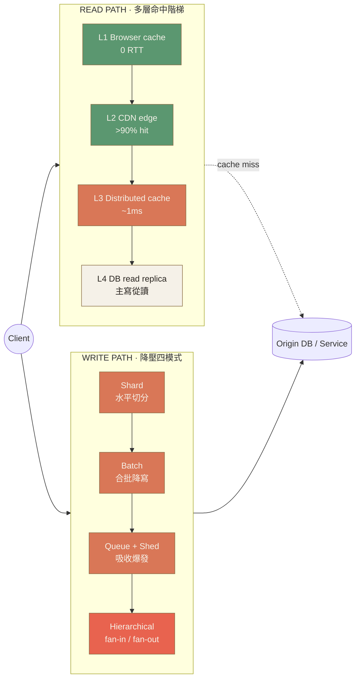
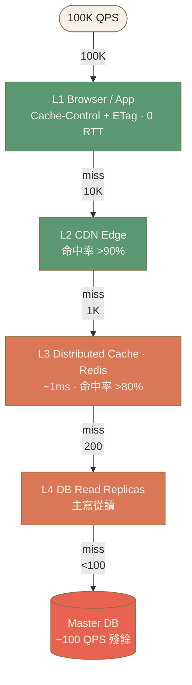
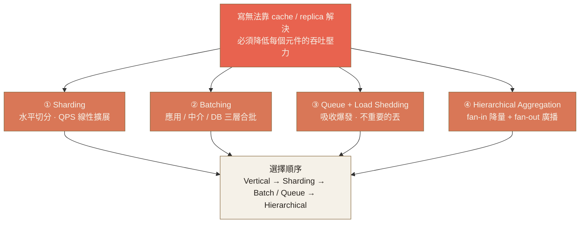
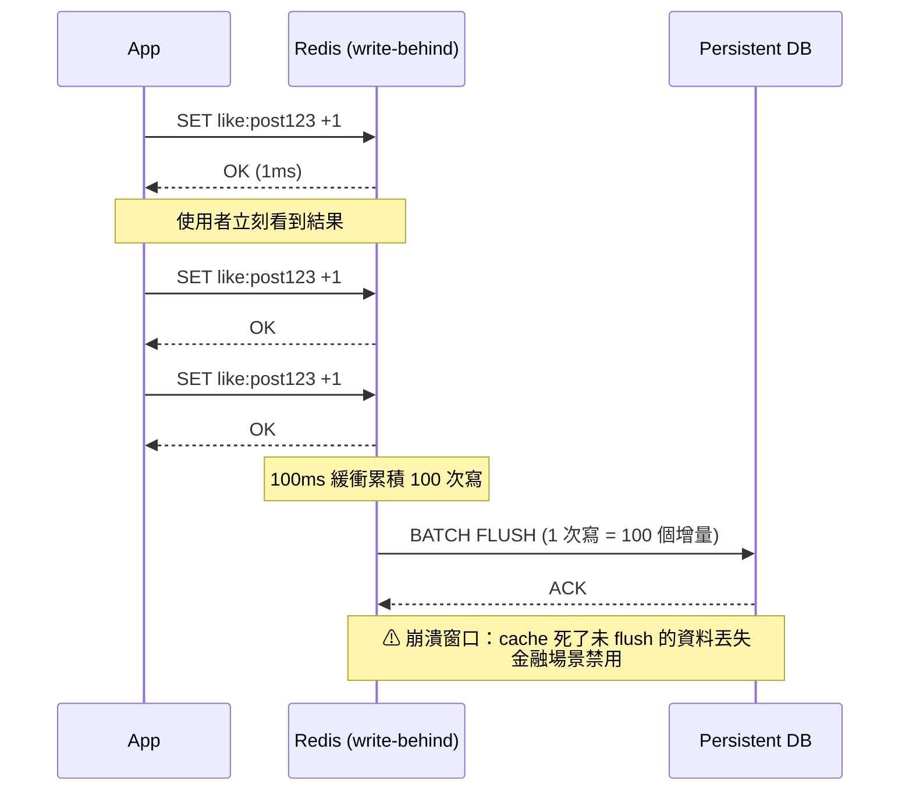
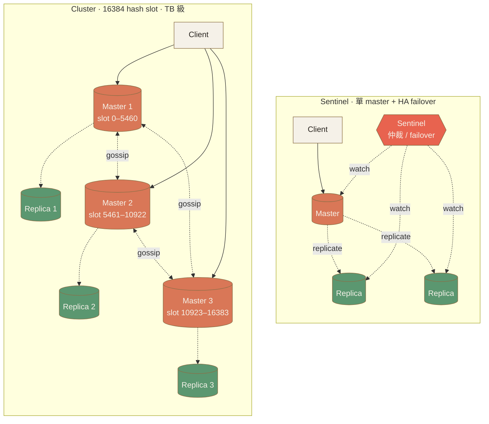
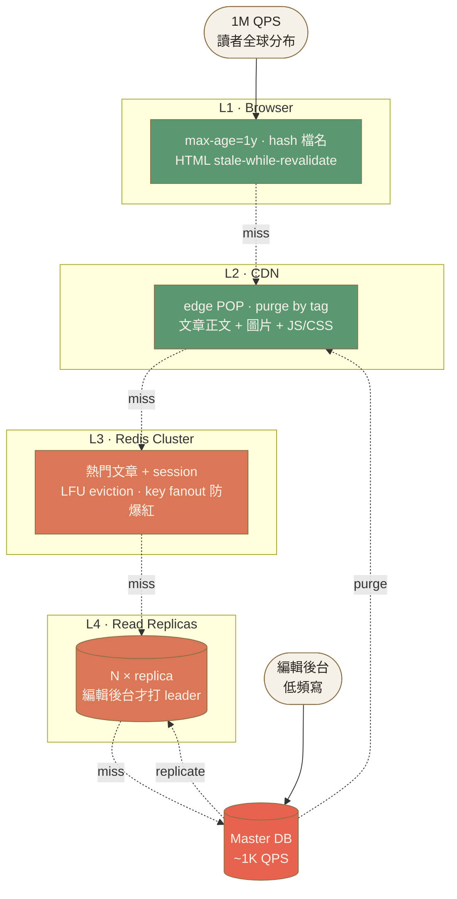

# Ch.6 · Scaling Patterns · 圖像 Prompts

> Style guide: [`../0_STYLE_GUIDE.md`](../0_STYLE_GUIDE.md)
> Save images to: `ppt/assets/diagrams/06-scaling-patterns/`

**本章圖像總覽**：15 張 · P1 × 5 · P2 × 8 · P3 × 2 · A × 1 · B × 6 · C × 5 · D × 3 · E × 1

---

## Image 01 · Hero · 章首封面

- **Type**: A · Hero illustration
- **Priority**: P1
- **Slide**: `06-scaling-patterns/00_overview.md` · 第 1 張（cover）
- **Save as**: `ppt/assets/diagrams/06-scaling-patterns/00_hero.png`
- **Aspect**: 16:9
- **Prompt**:
  ```
  An editorial illustration of a single river of incoming traffic splitting downstream into a fanning network of branching channels and tributaries — like a delta — each branch labeled implicitly by its width (one wide, several mid, many narrow), evoking horizontal scaling and load distribution. In the background, a faint silhouette of a tall tree with branches mirrors the river delta, reinforcing the metaphor of "one source, many paths".
  Composition: left side shows a single thick channel converging from off-canvas; right side shows the channel splitting into 5–7 progressively thinner branches that fade into the right edge; small abstract dot-clusters at branch endpoints suggest end-users; the tree silhouette sits behind, top-right, slightly transparent.
  editorial illustration, hand-drawn technical sketch style, warm color palette featuring cream off-white #F5F1E8 background and warm orange #D97757 accents with deep brown #8B6F47 secondary lines, minimalist flat vector with subtle paper texture, clean geometric lines, ample whitespace, educational diagram style, calm composed mood.
  --ar 16:9 --style raw --no photo-realistic, 3d render, neon, gradient glow, cluttered text, watermark, kawaii, anime
  ```
- **Note**: 「擴展」隱喻：流量像河流分流、像樹開枝散葉——一源多路、橫向擴張的本章主題。

---

## Image 02 · Mental Model · 讀路徑 vs 寫路徑取捨地圖

- **Type**: E · Mermaid（建議）+ B · 隱喻備援
- **Priority**: P1
- **Slide**: `06-scaling-patterns/00_overview.md` · OBJECTIVES · MENTAL MODEL section
- **Save as**: `ppt/assets/diagrams/06-scaling-patterns/00_mental_model.png`
- **Aspect**: 16:9

**Mermaid 原始碼**（推薦做法）：


**AI Prompt 備援**：
```
A side-by-side conceptual map split vertically into two columns labeled "READ PATH" and "WRITE PATH". Left column is a downward staircase of 4 horizontal slabs labeled L1 Browser, L2 CDN, L3 Distributed Cache, L4 DB replica — each slab slightly narrower than the one above, suggesting a funnel of decreasing requests reaching the origin. Right column shows 4 stacked tiles labeled Shard, Batch, Queue, Hierarchical, with small downward arrows between them. A single client figure on the far left sends two arrows: one into the top of the left staircase, one into the top of the right tile-stack. A single origin database cylinder sits at the bottom-center, receiving residual arrows from both columns.
Composition: vertical divider down the middle, balanced two-column layout, ample whitespace, no figure or icon clutter, all labels in minimal sans-serif.
editorial illustration, hand-drawn technical sketch style, warm color palette featuring cream off-white #F5F1E8 background and warm orange #D97757 accents with deep brown #8B6F47 secondary lines, minimalist flat vector with subtle paper texture, clean geometric lines, ample whitespace, educational diagram style, calm composed mood.
--ar 16:9 --style raw --no photo-realistic, 3d render, neon, gradient glow, cluttered text, watermark, kawaii, anime
```

- **Note**: 一張圖建立「讀寫兩條路徑、各有一組工具」的本章心智模型——讀靠多層命中階梯，寫靠四種降壓模式。

---

## Image 03 · Scaling Reads · 4 層命中階梯

- **Type**: C · 結構圖 (Mermaid)
- **Priority**: P1
- **Slide**: `06-scaling-patterns/01_scaling_reads.md` · WHY + HOW section
- **Save as**: `ppt/assets/diagrams/06-scaling-patterns/01_scaling_reads_01_ladder.png`
- **Aspect**: 16:9

**Mermaid 原始碼**：


- **Note**: 視覺化「4 層命中率複合 → 99.9% 請求在 L3 之前被擋下」——讀擴展核心心法。

---

## Image 04 · Scaling Reads · CQRS 讀寫分離模式

- **Type**: B · 概念圖 (AI prompt)
- **Priority**: P2
- **Slide**: `06-scaling-patterns/01_scaling_reads.md` · 三個進階模式 section
- **Save as**: `ppt/assets/diagrams/06-scaling-patterns/01_scaling_reads_02_cqrs.png`
- **Aspect**: 16:9
- **Prompt**:
  ```
  A conceptual diagram showing the CQRS pattern as two clearly separated channels emerging from a single client figure on the left. The top channel labeled "WRITE / Command" flows into a single normalized relational database cylinder, drawn with crisp grid-line strokes representing tables. The bottom channel labeled "READ / Query" flows through a thin transformation node labeled "projection / event sync" into a different store on the right — drawn as a denormalized search-style index with horizontal bars representing documents. A subtle dashed arrow from the write store down to the projection node indicates change propagation. The two stores are visually distinct: write store is a compact cylinder, read store is a wide flat slab with stacked rows.
  Composition: horizontal layout, client on left, write store top-right, read store bottom-right, projection bridge node in the middle-right, clear top/bottom split with a faint horizontal divider, generous whitespace, minimal labels.
  editorial illustration, hand-drawn technical sketch style, warm color palette featuring cream off-white #F5F1E8 background and warm orange #D97757 accents with deep brown #8B6F47 secondary lines, minimalist flat vector with subtle paper texture, clean geometric lines, ample whitespace, educational diagram style, calm composed mood.
  --ar 16:9 --style raw --no photo-realistic, 3d render, neon, gradient glow, cluttered text, watermark, kawaii, anime
  ```
- **Note**: CQRS 本質——讀寫用不同模型；左寫右讀的視覺切分讓「為查詢而生的 read store」概念立刻成立。

---

## Image 05 · Scaling Reads · Replication Lag 視覺化

- **Type**: B · 概念圖 (AI prompt)
- **Priority**: P2
- **Slide**: `06-scaling-patterns/01_scaling_reads.md` · TRADE-OFF（read-your-own-write）
- **Save as**: `ppt/assets/diagrams/06-scaling-patterns/01_scaling_reads_03_lag.png`
- **Aspect**: 16:9
- **Prompt**:
  ```
  A timeline-style illustration showing replication lag. A horizontal time arrow runs across the bottom of the canvas. Top-left: a master database cylinder marked with a small filled dot icon and a label "T0: write committed". A curved arrow trails from the master rightward and slightly downward to a smaller replica cylinder positioned along the timeline at "T0+200ms". Between them, a soft warm-orange band visually fills the gap representing the lag window. A user figure stands below the master at T0 sending a write up; the same user reappears further along the timeline below the replica at T0+50ms reading and seeing an empty result icon (a small unfilled circle), with a thought bubble containing a question mark.
  Composition: horizontal timeline at the bottom, two database cylinders staggered diagonally, soft band between them showing the "lag window", two instances of the same user figure to show before/after, ample whitespace at the top.
  editorial illustration, hand-drawn technical sketch style, warm color palette featuring cream off-white #F5F1E8 background and warm orange #D97757 accents with deep brown #8B6F47 secondary lines, minimalist flat vector with subtle paper texture, clean geometric lines, ample whitespace, educational diagram style, calm composed mood.
  --ar 16:9 --style raw --no photo-realistic, 3d render, neon, gradient glow, cluttered text, watermark, kawaii, anime
  ```
- **Note**: 把 read-your-own-write 抽象問題具象化——使用者寫完馬上讀卻看不到，因為 replica 還沒同步。

---

## Image 06 · Scaling Reads · Cache 三大反模式對照

- **Type**: D · 對照圖 (AI prompt)
- **Priority**: P2
- **Slide**: `06-scaling-patterns/01_scaling_reads.md` · Cache 三大反模式 section
- **Save as**: `ppt/assets/diagrams/06-scaling-patterns/01_scaling_reads_04_antipatterns.png`
- **Aspect**: 16:9
- **Prompt**:
  ```
  A three-panel horizontal comparison illustration. Each panel is a vertical slice of equal width separated by thin vertical lines, with a small numbered tag at the top.
  Panel ① "Cache Stampede": a single TTL clock at the top whose hand has just struck zero, and below it a tight cluster of arrows all simultaneously bursting downward into a small database cylinder which visibly buckles (slightly compressed shape).
  Panel ② "Invalidation Race": two arrows crossing each other in an X — one labeled "write" pointing at a cache box trying to delete it, one labeled "read" pointing at the same cache box just pulling stale data — visualizing the race condition.
  Panel ③ "Hot Key": a normal cache cluster shown as 5 evenly sized boxes, but one box is drawn 3× larger and overheated (small radiating heat lines), surrounded by a swarm of small request arrows all targeting that one oversized box while the other 4 sit idle.
  Composition: 3 equal panels, numbered tags ①②③ at the top, generous internal whitespace within each panel, no overlapping labels.
  editorial illustration, hand-drawn technical sketch style, warm color palette featuring cream off-white #F5F1E8 background and warm orange #D97757 accents with deep brown #8B6F47 secondary lines, minimalist flat vector with subtle paper texture, clean geometric lines, ample whitespace, educational diagram style, calm composed mood.
  --ar 16:9 --style raw --no photo-realistic, 3d render, neon, gradient glow, cluttered text, watermark, kawaii, anime
  ```
- **Note**: 一張圖記住三個 cache 反模式（同時 miss / write-read race / hot key 偏斜）——後續每個都有對應解法。

---

## Image 07 · Scaling Writes · 寫入瓶頸層級圖

- **Type**: C · 結構圖 (Mermaid)
- **Priority**: P1
- **Slide**: `06-scaling-patterns/02_scaling_writes.md` · WHY + 4 個策略 section
- **Save as**: `ppt/assets/diagrams/06-scaling-patterns/02_scaling_writes_01_strategies.png`
- **Aspect**: 16:9

**Mermaid 原始碼**：


- **Note**: 把寫擴展四模式收斂成一張決策圖——從問題出發、四個方向、最後是套用順序。

---

## Image 08 · Scaling Writes · Sharding Key 反模式對照

- **Type**: D · 對照圖 (AI prompt)
- **Priority**: P2
- **Slide**: `06-scaling-patterns/02_scaling_writes.md` · Sharding · Hot Key section
- **Save as**: `ppt/assets/diagrams/06-scaling-patterns/02_scaling_writes_02_sharding_keys.png`
- **Aspect**: 16:9
- **Prompt**:
  ```
  A three-panel comparison illustration showing sharding key choices. Each panel contains the same row of 6 evenly-sized server boxes drawn at the bottom, but with different load distributions visualized as filled bars rising from each box.
  Panel ① "hash(userId) ✓" — all 6 bars are roughly the same medium height, drawn in moss green, evoking even distribution; a small green check mark sits above.
  Panel ② "country ✗" — bars are wildly uneven: the leftmost box (CN) has a bar that nearly hits the top of the panel and is drawn in soft red, while 3 middle boxes have tiny bars and 2 right boxes are nearly empty; a small red cross sits above.
  Panel ③ "timestamp ✗" — only the rightmost box has a tall red bar (the "newest" shard receiving all writes), the other 5 boxes are entirely empty; a small red cross sits above with a clock icon.
  Composition: 3 horizontal panels stacked vertically (or arranged horizontally), each with title and check/cross indicator at top, server row at bottom, clear visual rhythm of bar heights making distribution obvious at a glance.
  editorial illustration, hand-drawn technical sketch style, warm color palette featuring cream off-white #F5F1E8 background and warm orange #D97757 accents with deep brown #8B6F47 secondary lines, minimalist flat vector with subtle paper texture, clean geometric lines, ample whitespace, educational diagram style, calm composed mood.
  --ar 16:9 --style raw --no photo-realistic, 3d render, neon, gradient glow, cluttered text, watermark, kawaii, anime
  ```
- **Note**: 用「同樣的 6 個 shard、不同 sharding key、不同負載分布」三聯圖把抽象的「key 選擇」變具象。

---

## Image 09 · Scaling Writes · Hot Key Split

- **Type**: B · 概念圖 (AI prompt)
- **Priority**: P2
- **Slide**: `06-scaling-patterns/02_scaling_writes.md` · Hot Key Split section
- **Save as**: `ppt/assets/diagrams/06-scaling-patterns/02_scaling_writes_03_hotkey_split.png`
- **Aspect**: 16:9
- **Prompt**:
  ```
  A two-stage transformation illustration with a clear "before → after" arrow in the middle.
  Left side "Before": a single key labeled "Post1Likes" drawn as one box, with a swarm of ~30 incoming arrows from many user icons all converging on it. The box is drawn slightly oversized and has heat lines radiating from it (it's overwhelmed). A small label below reads "single shard bottleneck".
  Middle: a thick warm-orange arrow labeled "split into k = 4".
  Right side "After": four smaller boxes labeled Post1Likes-0, Post1Likes-1, Post1Likes-2, Post1Likes-3 arranged in a row. The same swarm of incoming write arrows is now evenly distributed across all 4 boxes. Below them, a smaller cluster of "read aggregator" arrows pulls from all 4 and sums to a single result, with a small note "reads × k (cost)".
  Composition: clear horizontal flow, before/after symmetry, thick central transition arrow, dramatic difference in arrow density between the single hot box and the 4 split boxes.
  editorial illustration, hand-drawn technical sketch style, warm color palette featuring cream off-white #F5F1E8 background and warm orange #D97757 accents with deep brown #8B6F47 secondary lines, minimalist flat vector with subtle paper texture, clean geometric lines, ample whitespace, educational diagram style, calm composed mood.
  --ar 16:9 --style raw --no photo-realistic, 3d render, neon, gradient glow, cluttered text, watermark, kawaii, anime
  ```
- **Note**: Hot key split 的核心心法——寫端打散 k 份、讀端付 k 倍代價。

---

## Image 10 · Scaling Writes · Write-Behind 序列

- **Type**: C · 序列圖 (Mermaid)
- **Priority**: P2
- **Slide**: `06-scaling-patterns/02_scaling_writes.md` · Queue · Load Shedding · Batching · DB 層 write-behind
- **Save as**: `ppt/assets/diagrams/06-scaling-patterns/02_scaling_writes_04_write_behind.png`
- **Aspect**: 16:9

**Mermaid 原始碼**：


- **Note**: write-behind 的時序與風險窗口——快但有資料遺失風險，金融禁用。

---

## Image 11 · Distributed Cache · Cluster vs Sentinel

- **Type**: C · 拓撲圖 (Mermaid)
- **Priority**: P1
- **Slide**: `06-scaling-patterns/03_distributed_cache.md` · WHY + Cluster 架構
- **Save as**: `ppt/assets/diagrams/06-scaling-patterns/03_distributed_cache_01_topology.png`
- **Aspect**: 16:9

**Mermaid 原始碼**：


- **Note**: 一張圖看清兩種 Redis 高可用拓撲的差異——Sentinel 簡單但寫不擴展、Cluster 分片可擴 TB 級。

---

## Image 12 · Distributed Cache · Consistent Hashing 加減節點

- **Type**: B · 概念圖 (AI prompt)
- **Priority**: P1
- **Slide**: `06-scaling-patterns/03_distributed_cache.md` · Sharding 必用 Consistent Hashing
- **Save as**: `ppt/assets/diagrams/06-scaling-patterns/03_distributed_cache_02_consistent_hash.png`
- **Aspect**: 16:9
- **Prompt**:
  ```
  A two-panel illustration comparing modulo hashing vs consistent hashing when a node is added.
  Left panel "hash(key) % N — N: 5 → 6": a horizontal row of small key icons mapping to 5 server boxes via thin lines; below it the same row of keys mapping to 6 server boxes — almost every line has been redrawn to a different server (visualized by the lines crossing each other in a chaotic web). A small caption: "almost all keys remap = cold start".
  Right panel "Consistent Hashing — add 1 node": a large clean ring/circle with 5 server nodes placed evenly around it as small circles. Keys are tiny dots scattered on the ring, each assigned to the next clockwise node (shown by short curved arrows). A 6th node is being inserted as a dashed warm-orange circle on the upper-right of the ring; only the small arc of keys between this new node and the previous one is highlighted in warm orange to indicate "only ~1/N keys remap". A small caption: "only ~1/6 keys move".
  Composition: balanced two-panel layout, left panel shows chaotic crossing lines, right panel shows a clean ring with only one small highlighted arc — the visual contrast itself tells the story.
  editorial illustration, hand-drawn technical sketch style, warm color palette featuring cream off-white #F5F1E8 background and warm orange #D97757 accents with deep brown #8B6F47 secondary lines, minimalist flat vector with subtle paper texture, clean geometric lines, ample whitespace, educational diagram style, calm composed mood.
  --ar 16:9 --style raw --no photo-realistic, 3d render, neon, gradient glow, cluttered text, watermark, kawaii, anime
  ```
- **Note**: 為什麼分散式 cache 必用 consistent hashing——左邊 modulo 加節點要重洗，右邊只動 1/N。

---

## Image 13 · CDN · 全球邊緣節點分布

- **Type**: B · 概念隱喻 (AI prompt)
- **Priority**: P1
- **Slide**: `06-scaling-patterns/04_cdn.md` · WHY + 4 個層級
- **Save as**: `ppt/assets/diagrams/06-scaling-patterns/04_cdn_01_global_edge.png`
- **Aspect**: 16:9
- **Prompt**:
  ```
  An editorial-style illustration of a stylized world map drawn as a soft outline (continents only, no country borders, no political detail), centered horizontally. Scattered across the continents are ~12 small warm-orange dots representing CDN edge POPs, with thin curved arcs connecting nearby clusters of dots to suggest a peering mesh. In the dead center of the map sits a single larger box icon labeled "Origin" with a faint shield outline behind it. A few representative end-user figures are placed on different continents, each connected to its nearest edge dot by a short solid line, while a longer dashed line trails from the same edge dot back toward the origin (visually emphasizing "near-user hit, far-server miss"). A horizontal label band at the bottom reads "200+ edge POPs · < 50ms first hop".
  Composition: world map fills 70% of the canvas, edge dots evenly distributed but slightly clustered around population centers, origin sits visually isolated at center, user-to-edge connections are short and bold, edge-to-origin connections are long and faint.
  editorial illustration, hand-drawn technical sketch style, warm color palette featuring cream off-white #F5F1E8 background and warm orange #D97757 accents with deep brown #8B6F47 secondary lines, minimalist flat vector with subtle paper texture, clean geometric lines, ample whitespace, educational diagram style, calm composed mood.
  --ar 16:9 --style raw --no photo-realistic, 3d render, neon, gradient glow, cluttered text, watermark, kawaii, anime
  ```
- **Note**: 一張地圖讓「邊緣就近、回源很遠」的 CDN 第一原則直接成立。

---

## Image 14 · CDN · Push vs Pull Cache 模式對照

- **Type**: D · 對照圖 (AI prompt)
- **Priority**: P2
- **Slide**: `06-scaling-patterns/04_cdn.md` · Push vs Pull · Stale-While-Revalidate
- **Save as**: `ppt/assets/diagrams/06-scaling-patterns/04_cdn_02_push_vs_pull.png`
- **Aspect**: 16:9
- **Prompt**:
  ```
  A side-by-side comparison illustration with a vertical divider down the middle.
  Left panel "PUSH (proactive · 1%)": an origin box on the left actively shoots arrows outward to multiple edge cache boxes arranged in a fan, BEFORE any user requests arrive. A small clock icon shows "T0 · pre-warm". Below: a row of users arrives later, each finding their edge already filled (shown with a small green check on each edge box). Caption: "predictable spike (e.g. video premiere)".
  Right panel "PULL (lazy · 99%)": users arrive first and request from edge boxes that are initially empty (shown with dashed outlines and small "?" inside). The first request triggers a single arrow from edge back to origin (labeled "miss → fetch"); subsequent requests on the same edge get filled boxes (solid outlines with a green check). Caption: "fill on first miss, then serve from cache".
  Composition: clean vertical split, left panel emphasizes "origin pushes outward", right panel emphasizes "users pull → edge → origin", numbered tags ① ② at top of each panel, balanced symmetric layout.
  editorial illustration, hand-drawn technical sketch style, warm color palette featuring cream off-white #F5F1E8 background and warm orange #D97757 accents with deep brown #8B6F47 secondary lines, minimalist flat vector with subtle paper texture, clean geometric lines, ample whitespace, educational diagram style, calm composed mood.
  --ar 16:9 --style raw --no photo-realistic, 3d render, neon, gradient glow, cluttered text, watermark, kawaii, anime
  ```
- **Note**: 兩種 cache 填充模式的時序差異——Push 是 origin 主動先發、Pull 是 user 觸發後填。

---

## Image 15 · Recap · 新聞網站完整架構

- **Type**: C · 架構圖 (Mermaid)
- **Priority**: P2
- **Slide**: `06-scaling-patterns/99_recap.md` · CASE STUDY · 新聞網站
- **Save as**: `ppt/assets/diagrams/06-scaling-patterns/99_recap_01_news_site.png`
- **Aspect**: 16:9

**Mermaid 原始碼**：


- **Note**: 把本章四個工具（Browser / CDN / Redis / Replica）串進一個真實系統——99% 在 L2 命中、leader 只承受編輯流量。

---

## Image 16 · CDN · Edge Compute 流程（錦上添花）

- **Type**: B · 概念圖 (AI prompt)
- **Priority**: P3
- **Slide**: `06-scaling-patterns/04_cdn.md` · Edge Compute section
- **Save as**: `ppt/assets/diagrams/06-scaling-patterns/04_cdn_03_edge_compute.png`
- **Aspect**: 16:9
- **Prompt**:
  ```
  A horizontal flow illustration showing edge compute as a "filter + decide" stage between user and origin. Far left: a user figure sends a request along a horizontal line. Middle: a stylized edge POP drawn as a small house-shaped node with a tiny gear icon inside, labeled "Worker / Lambda@Edge". Inside the edge node, a small vertical stack of 4 mini-tags reads top to bottom: "Auth check", "A/B variant", "Bot / rate limit", "Image transform". Two arrows leave the edge node: one short downward arrow loops back to the user labeled "respond at edge (90%)" drawn in moss green; one longer rightward arrow continues to an origin box on the far right labeled "origin (10%)" drawn in warm orange dashed line.
  Composition: linear left-to-right flow, edge node visually emphasized as the decision point in the middle, two divergent outputs with clear visual weight (short green vs long orange), mini-tags inside the edge node arranged as a compact stack.
  editorial illustration, hand-drawn technical sketch style, warm color palette featuring cream off-white #F5F1E8 background and warm orange #D97757 accents with deep brown #8B6F47 secondary lines, minimalist flat vector with subtle paper texture, clean geometric lines, ample whitespace, educational diagram style, calm composed mood.
  --ar 16:9 --style raw --no photo-realistic, 3d render, neon, gradient glow, cluttered text, watermark, kawaii, anime
  ```
- **Note**: 邊緣不只是 cache——Worker 在邊緣攔下大部分請求，origin 只接剩下的 10%。

---

## 索引

| #  | Topic                                  | Priority | Type | File                                                    |
|----|----------------------------------------|----------|------|---------------------------------------------------------|
| 01 | Hero · 章首封面                        | P1       | A    | `00_hero.png`                                           |
| 02 | Mental Model · 讀寫路徑取捨地圖        | P1       | E    | `00_mental_model.png`                                   |
| 03 | Scaling Reads · 4 層命中階梯           | P1       | C    | `01_scaling_reads_01_ladder.png`                        |
| 04 | Scaling Reads · CQRS 讀寫分離          | P2       | B    | `01_scaling_reads_02_cqrs.png`                          |
| 05 | Scaling Reads · Replication Lag        | P2       | B    | `01_scaling_reads_03_lag.png`                           |
| 06 | Scaling Reads · Cache 三反模式         | P2       | D    | `01_scaling_reads_04_antipatterns.png`                  |
| 07 | Scaling Writes · 4 模式決策圖          | P1       | C    | `02_scaling_writes_01_strategies.png`                   |
| 08 | Scaling Writes · Sharding Key 反模式   | P2       | D    | `02_scaling_writes_02_sharding_keys.png`                |
| 09 | Scaling Writes · Hot Key Split         | P2       | B    | `02_scaling_writes_03_hotkey_split.png`                 |
| 10 | Scaling Writes · Write-Behind 序列     | P2       | C    | `02_scaling_writes_04_write_behind.png`                 |
| 11 | Distributed Cache · Cluster vs Sentinel| P1       | C    | `03_distributed_cache_01_topology.png`                  |
| 12 | Distributed Cache · Consistent Hashing | P1       | B    | `03_distributed_cache_02_consistent_hash.png`           |
| 13 | CDN · 全球邊緣節點分布                 | P1       | B    | `04_cdn_01_global_edge.png`                             |
| 14 | CDN · Push vs Pull 對照                | P2       | D    | `04_cdn_02_push_vs_pull.png`                            |
| 15 | Recap · 新聞網站完整架構               | P2       | C    | `99_recap_01_news_site.png`                             |
| 16 | CDN · Edge Compute 流程                | P3       | B    | `04_cdn_03_edge_compute.png`                            |
