# Ch.7 · Advanced Patterns · 圖像 Prompts

> Style guide: [`../0_STYLE_GUIDE.md`](../0_STYLE_GUIDE.md)
> Save images to: `ppt/assets/diagrams/07-advanced-patterns/`

**本章圖像總覽**：17 張 · P1 × 4 · P2 × 11 · P3 × 2 · A × 1 · B × 3 · C × 7 · D × 5 · E × 1

涵蓋 7 個 topic（Queue、Long Tasks、Large Blobs、Real-time、Search、Pipeline、RAG）+ 章首 hero、mental model、章末 case study。Real-time fanout、RAG、Pipeline 架構優先以 Mermaid 呈現；Queue/Long Tasks/Pipeline 對比優先以 AI 隱喻 + 文字標註呈現。

---

## Image 01 · Hero · 章首封面

- **Type**: A · Hero illustration
- **Priority**: P1
- **Slide**: `07-advanced-patterns/00_overview.md` · 第 1 張（cover）
- **Save as**: `ppt/assets/diagrams/07-advanced-patterns/00_hero.png`
- **Aspect**: 16:9
- **Prompt**:
  ```
  An editorial illustration of a multi-tool craftsman's workshop with seven distinct specialized stations arranged in a softly lit hall, each station representing an advanced engineering pattern: a bucket brigade conveyor (queue), an hourglass on a workbench (long tasks), a heavy crate on rollers bypassing the office (large blobs), a telegraph wire transmitting pulses (real-time), a card-catalog with inverted slips (search), an aqueduct of pipes channeling water (data pipeline), and a librarian feeding scrolls into a thinking machine (RAG). A single craftsman walks through the center holding a clipboard, evaluating which station to use, evoking the chapter theme of choosing the right specialized pattern only when the problem demands it.
  Composition: wide horizontal hall layout, central walking figure as focal point, seven stations arranged left-to-right in subtle perspective with shallow depth, each station rendered as a small vignette with a hand-lettered roman numeral I–VII above it, soft warm lighting, plenty of whitespace at top and bottom for slide title overlay.
  editorial illustration, hand-drawn technical sketch style, warm color palette featuring cream off-white #F5F1E8 background and warm orange #D97757 accents with deep brown #8B6F47 secondary lines, minimalist flat vector with subtle paper texture, clean geometric lines, ample whitespace, educational diagram style, calm composed mood.
  --ar 16:9 --style raw --no photo-realistic, 3d render, neon, gradient glow, cluttered text, watermark, kawaii, anime
  ```
- **Note**: 「七個專業工坊」隱喻——每個 advanced pattern 都是一個專用工具，需要時才打開那個工坊；呼應章節核心訊息「不需要時就別用」。

---

## Image 02 · Mental Model · 7 個方向能力地圖

- **Type**: E · Mermaid（主）+ B · 隱喻備援
- **Priority**: P1
- **Slide**: `07-advanced-patterns/00_overview.md` · MENTAL MODEL section
- **Save as (Mermaid 渲染)**: `ppt/assets/diagrams/07-advanced-patterns/00_mental_model.png`
- **Aspect**: 16:9

**Mermaid 原始碼**（推薦做法，貼到 https://mermaid.live 渲染後存 PNG）：
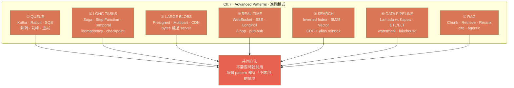

**AI Prompt 備援**：
```
A hand-drawn technical infographic showing seven labeled rectangular cards arranged in two rows, each card representing one advanced system pattern (Queue, Long Tasks, Large Blobs, Real-time, Search, Data Pipeline, RAG), with a small icon and one-line description on each card, all arrows pointing downward into a single banner that reads "Use only when needed."
Composition: 4-3 grid layout, banner at the bottom, clean grid spacing, hand-lettered labels.
editorial illustration, hand-drawn technical sketch style, warm color palette featuring cream off-white #F5F1E8 background and warm orange #D97757 accents with deep brown #8B6F47 secondary lines, minimalist flat vector with subtle paper texture, clean geometric lines, ample whitespace, educational diagram style, calm composed mood.
--ar 16:9 --style raw --no photo-realistic, 3d render, neon, gradient glow, cluttered text, watermark, kawaii, anime
```

- **Note**: 七個 topic 的全景圖；提醒讀者「複雜度跟著規模才有意義」是貫穿章節的判斷標準。

---

## Image 03 · Queue · Producer-Queue-Consumer 基本流

- **Type**: C · 結構/流程圖（Mermaid）
- **Priority**: P1
- **Slide**: `07-advanced-patterns/01_queue.md` · QUEUE WHY section
- **Save as**: `ppt/assets/diagrams/07-advanced-patterns/01_queue_01_basic_flow.png`
- **Aspect**: 16:9

**Mermaid 原始碼**：
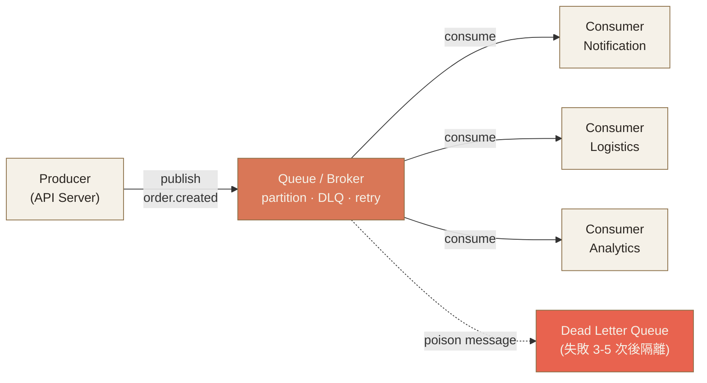

- **Note**: 解釋「為什麼要 Queue」——一個 producer fan-out 給多個 consumer，加上 DLQ 保護不被 poison message 拖垮。

---

## Image 04 · Queue · Kafka vs RabbitMQ vs SQS 三方對比

- **Type**: D · 對照圖
- **Priority**: P2
- **Slide**: `07-advanced-patterns/01_queue.md` · QUEUE 三大選型 section
- **Save as**: `ppt/assets/diagrams/07-advanced-patterns/01_queue_02_three_brokers.png`
- **Aspect**: 16:9
- **Prompt**:
  ```
  A hand-drawn editorial illustration comparing three message broker products as three distinct workshop tools side by side, each with a hand-lettered label on its base. Left tool: a long durable conveyor belt of pallets labeled "KAFKA · log replay · partition order · 100k msg/s", drawn as a continuous flat conveyor with multiple parallel tracks (partitions). Middle tool: an old-fashioned mail-sorting carousel with multiple exchange rooms labeled "RABBITMQ · routing · exchange + queue · 30k msg/s", drawn as a circular hub with letters routed to side bins. Right tool: a clean managed mailbox post outside a cloud-shaped office labeled "SQS · managed · 14d retention · 3k msg/s", drawn as a small mailbox under an outlined cloud.
  Composition: three equal-width vertical panels separated by faint vertical dividers, each panel has its tool centered with a one-line strength caption underneath, tiny pictogram showing throughput bar at the bottom of each panel, hand-lettered headline at top "QUEUE TRADE-OFF · 三選一".
  editorial illustration, hand-drawn technical sketch style, warm color palette featuring cream off-white #F5F1E8 background and warm orange #D97757 accents with deep brown #8B6F47 secondary lines, minimalist flat vector with subtle paper texture, clean geometric lines, ample whitespace, educational diagram style, calm composed mood.
  --ar 16:9 --style raw --no photo-realistic, 3d render, neon, gradient glow, cluttered text, watermark, kawaii, anime
  ```
- **Note**: 視覺化三者本質差異——log（Kafka）vs broker routing（Rabbit）vs managed simple queue（SQS）。

---

## Image 05 · Queue · Backpressure 三招

- **Type**: D · 對照圖（Mermaid 變體）
- **Priority**: P2
- **Slide**: `07-advanced-patterns/01_queue.md` · Backpressure section
- **Save as**: `ppt/assets/diagrams/07-advanced-patterns/01_queue_03_backpressure.png`
- **Aspect**: 16:9

**Mermaid 原始碼**：
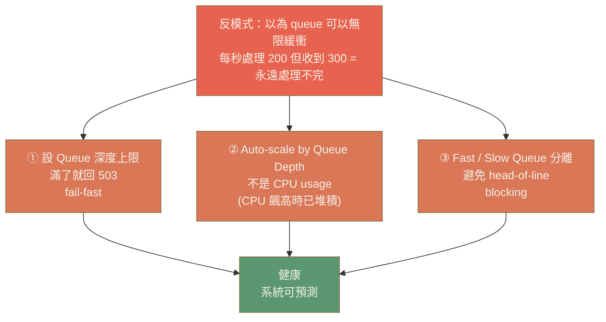

- **Note**: Backpressure 是 queue 最被忽略的問題；三招是面試與實戰的標準答法。

---

## Image 06 · Long Tasks · 4 個必備機制

- **Type**: C · 流程圖（Mermaid）
- **Priority**: P1
- **Slide**: `07-advanced-patterns/02_long_running_tasks.md` · LONG TASKS HOW section
- **Save as**: `ppt/assets/diagrams/07-advanced-patterns/02_longtasks_01_four_mechanisms.png`
- **Aspect**: 16:9

**Mermaid 原始碼**：
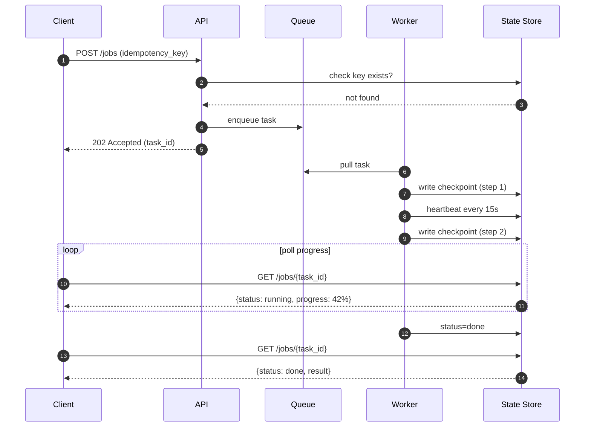

- **Note**: 整合 idempotency key + checkpoint + heartbeat + 進度查詢；一張圖把 4 個機制串成完整流程。

---

## Image 07 · Long Tasks · 編排引擎四方對比

- **Type**: D · 對照圖
- **Priority**: P2
- **Slide**: `07-advanced-patterns/02_long_running_tasks.md` · 編排引擎 section
- **Save as**: `ppt/assets/diagrams/07-advanced-patterns/02_longtasks_02_orchestrators.png`
- **Aspect**: 16:9
- **Prompt**:
  ```
  A hand-drawn editorial illustration comparing four workflow orchestration engines as four control panels arranged in a 2x2 grid, each labeled with hand-lettered name and one-line strength. Top-left panel: a state-machine schematic of connected boxes with JSON brackets labeled "STEP FUNCTIONS · AWS managed · visual". Top-right: a code-editor outline with a small Go gopher silhouette labeled "TEMPORAL · workflow as code · auto retry / replay". Bottom-left: a directed acyclic graph of nodes with a clock and Python logo labeled "AIRFLOW · DAG schedule · batch ETL". Bottom-right: a Kubernetes hexagon with stacked YAML cards labeled "ARGO · K8s native · container DAG".
  Composition: 2x2 panel grid with thin dividers, each panel uniform size, small icon top-center, two-line label below, hand-lettered headline "ORCHESTRATION 4 OPTIONS" across the top, "Modern default → Temporal" hand-noted at the bottom-right corner.
  editorial illustration, hand-drawn technical sketch style, warm color palette featuring cream off-white #F5F1E8 background and warm orange #D97757 accents with deep brown #8B6F47 secondary lines, minimalist flat vector with subtle paper texture, clean geometric lines, ample whitespace, educational diagram style, calm composed mood.
  --ar 16:9 --style raw --no photo-realistic, 3d render, neon, gradient glow, cluttered text, watermark, kawaii, anime
  ```
- **Note**: 一眼看出四個引擎的核心定位差異；幫助記住「Temporal 是現代答案」。

---

## Image 08 · Large Blobs · Presigned URL 序列圖

- **Type**: C · 序列圖（Mermaid）
- **Priority**: P1
- **Slide**: `07-advanced-patterns/03_large_blobs.md` · Presigned URL section
- **Save as**: `ppt/assets/diagrams/07-advanced-patterns/03_blobs_01_presigned_url.png`
- **Aspect**: 16:9

**Mermaid 原始碼**：
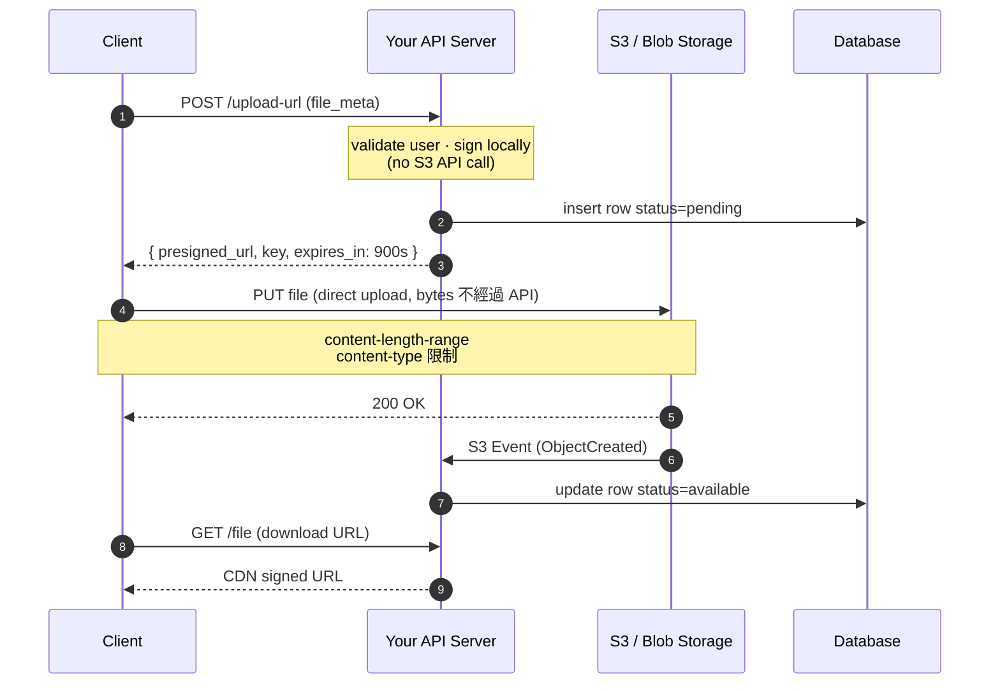

- **Note**: 完整呈現「客戶端直傳」邏輯——server 只簽證、不流 bytes，並用 S3 event 補 metadata 同步。

---

## Image 09 · Large Blobs · S3 Multipart Upload

- **Type**: C · 序列圖（Mermaid）
- **Priority**: P2
- **Slide**: `07-advanced-patterns/03_large_blobs.md` · Multipart Upload section
- **Save as**: `ppt/assets/diagrams/07-advanced-patterns/03_blobs_02_multipart.png`
- **Aspect**: 16:9

**Mermaid 原始碼**：
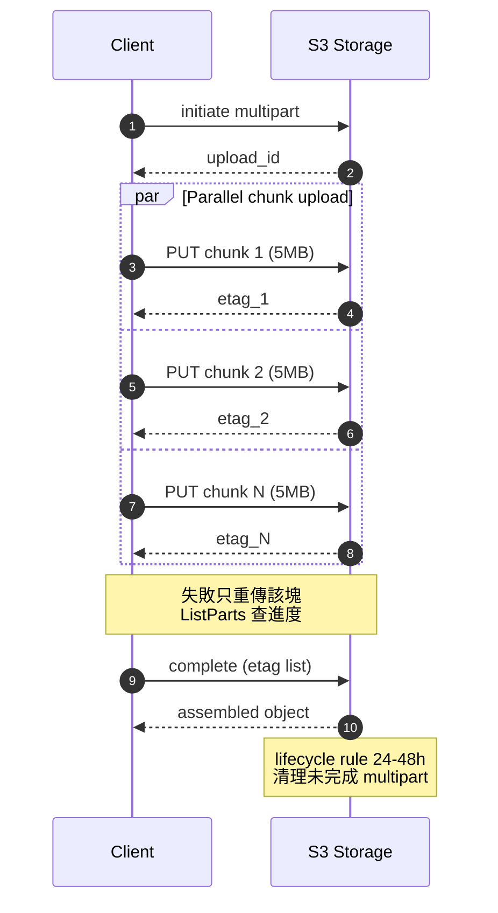

- **Note**: > 100MB 大檔的標準做法；強調「斷點續傳」與「未完成 multipart 要錢」兩個實務細節。

---

## Image 10 · Real-time · 4 種推送技術對比

- **Type**: D · 對照圖
- **Priority**: P1
- **Slide**: `07-advanced-patterns/04_realtime_updates.md` · 4 種推送技術 section
- **Save as**: `ppt/assets/diagrams/07-advanced-patterns/04_realtime_01_four_protocols.png`
- **Aspect**: 16:9
- **Prompt**:
  ```
  A hand-drawn editorial illustration comparing four real-time push protocols as four miniature street scenes arranged horizontally. Scene 1 "LONG POLLING": a customer waits at a counter holding a numbered ticket while the clerk searches in the back, a thought bubble shows "wait... wait...", labeled "1 connection per request · fallback". Scene 2 "SSE": a one-way pneumatic tube delivering rolled-up notes from a building down to a person standing below, labeled "server → client · auto reconnect · AI streaming". Scene 3 "WEBSOCKET": two people on a bridge throwing tennis balls back and forth, both directions, labeled "bidirectional · chat · games". Scene 4 "WEBRTC": two people connected directly by a string-cup phone with a small router silhouette in between, labeled "P2P · video · NAT/STUN/TURN".
  Composition: four equal-width vertical panels with thin vertical dividers, each scene rendered as a small vignette in the upper two-thirds, hand-lettered protocol name and one-line use case in the lower third, hand-lettered headline "HOP 1 · 4 PUSH PROTOCOLS" along the top.
  editorial illustration, hand-drawn technical sketch style, warm color palette featuring cream off-white #F5F1E8 background and warm orange #D97757 accents with deep brown #8B6F47 secondary lines, minimalist flat vector with subtle paper texture, clean geometric lines, ample whitespace, educational diagram style, calm composed mood.
  --ar 16:9 --style raw --no photo-realistic, 3d render, neon, gradient glow, cluttered text, watermark, kawaii, anime
  ```
- **Note**: 用四個生活場景把抽象協定具體化；強化「單向用 SSE、雙向用 WebSocket、P2P 用 WebRTC」的選擇法則。

---

## Image 11 · Real-time · 2-Hop Fan-out 架構

- **Type**: C · 架構圖（Mermaid）
- **Priority**: P1
- **Slide**: `07-advanced-patterns/04_realtime_updates.md` · HOP 2 section + 1M 連線架構 section
- **Save as**: `ppt/assets/diagrams/07-advanced-patterns/04_realtime_02_two_hop_fanout.png`
- **Aspect**: 16:9

**Mermaid 原始碼**：
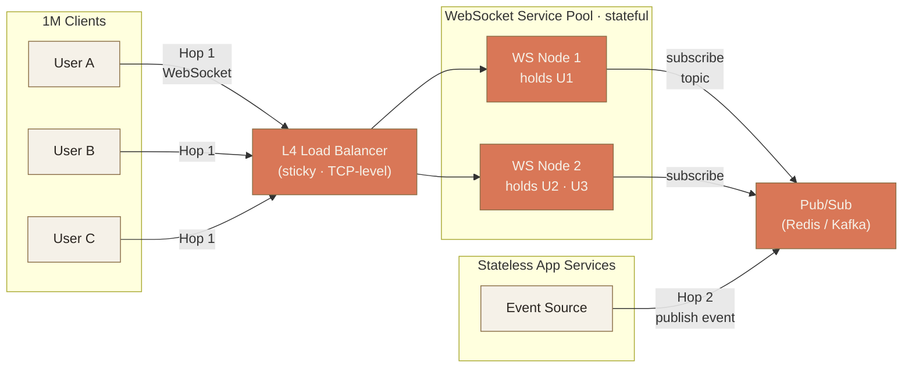

- **Note**: 強調「兩個 hop」的觀念——Hop 1 是 client↔server 協定，Hop 2 是 event source → 持有連線的 server；面試常被問到的核心。

---

## Image 12 · Search · Inverted Index 結構

- **Type**: C · 結構視覺化（Mermaid）
- **Priority**: P1
- **Slide**: `07-advanced-patterns/05_search_system.md` · 倒排索引 section
- **Save as**: `ppt/assets/diagrams/07-advanced-patterns/05_search_01_inverted_index.png`
- **Aspect**: 16:9

**Mermaid 原始碼**：
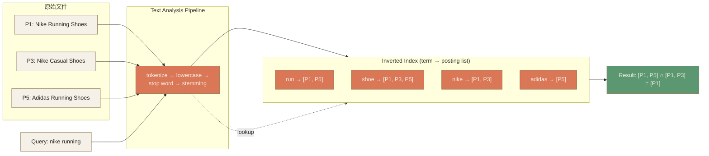

- **Note**: 把抽象的「倒排索引」具體化——文件 → analysis pipeline → term/posting list → 交集 = 結果。

---

## Image 13 · Search · CDC vs Dual Write + Reindex with Alias

- **Type**: C · 流程圖（Mermaid）
- **Priority**: P2
- **Slide**: `07-advanced-patterns/05_search_system.md` · Indexing Pipeline + Reindex with Alias section
- **Save as**: `ppt/assets/diagrams/07-advanced-patterns/05_search_02_cdc_alias.png`
- **Aspect**: 16:9

**Mermaid 原始碼**：
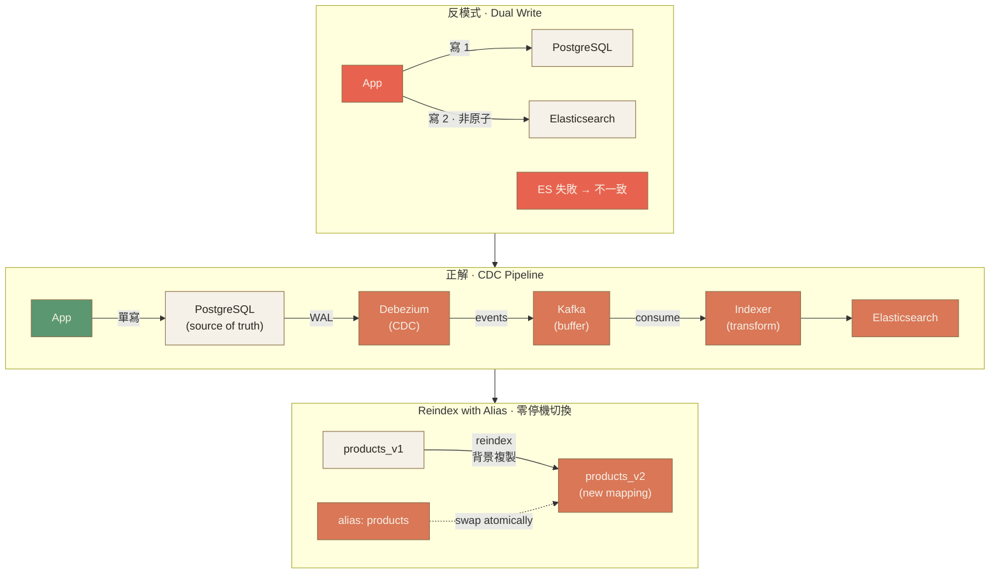

- **Note**: 兩個搜尋系統的標配——CDC 取代 dual write、alias 達成零停機 reindex；面試會接連被問。

---

## Image 14 · Pipeline · Lambda vs Kappa 架構對比

- **Type**: D · 對照圖
- **Priority**: P2
- **Slide**: `07-advanced-patterns/06_data_pipeline.md` · Lambda vs Kappa section
- **Save as**: `ppt/assets/diagrams/07-advanced-patterns/06_pipeline_01_lambda_kappa.png`
- **Aspect**: 16:9
- **Prompt**:
  ```
  A hand-drawn editorial illustration comparing two data pipeline architectures as two factory floor blueprints side by side. Left blueprint "LAMBDA": two parallel conveyor belts—a thick slow belt labeled "BATCH (Spark)" carrying large boxes downward, and a thin fast belt labeled "SPEED (Flink)" carrying small letters in parallel, both belts feeding a merge station labeled "SERVING LAYER" with a question mark suggesting reconciliation effort. A small note on the side reads "two codebases · merge complexity". Right blueprint "KAPPA": a single continuous river of small numbered events flowing through a stream processor labeled "FLINK", with a circular replay arrow looping back labeled "Kafka 90d retention · replay = recompute". A small note reads "one codebase · long retention cost".
  Composition: two equal vertical panels separated by a single thin divider, blueprint-style line drawings on cream background, hand-lettered headline "LAMBDA vs KAPPA" along the top, hand-noted captions in the lower margin.
  editorial illustration, hand-drawn technical sketch style, warm color palette featuring cream off-white #F5F1E8 background and warm orange #D97757 accents with deep brown #8B6F47 secondary lines, minimalist flat vector with subtle paper texture, clean geometric lines, ample whitespace, educational diagram style, calm composed mood.
  --ar 16:9 --style raw --no photo-realistic, 3d render, neon, gradient glow, cluttered text, watermark, kawaii, anime
  ```
- **Note**: 兩條 pipeline（Lambda）vs 一條 stream + replay（Kappa）的本質差異視覺化；現代趨勢是 Kappa。

---

## Image 15 · Pipeline · ETL vs ELT + Stream Window

- **Type**: D · 對照圖（Mermaid 變體）
- **Priority**: P2
- **Slide**: `07-advanced-patterns/06_data_pipeline.md` · ETL vs ELT + Stream 視窗 section
- **Save as**: `ppt/assets/diagrams/07-advanced-patterns/06_pipeline_02_etl_windows.png`
- **Aspect**: 16:9

**Mermaid 原始碼**：
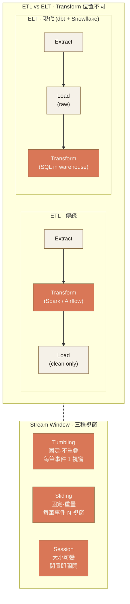

- **Note**: 一張圖兩個概念——上半 ETL/ELT 順序差異（Transform 在哪做）、下半 stream window 三種類型；空間使用率高。

---

## Image 16 · RAG · 4 元件流程

- **Type**: C · 架構圖（Mermaid）
- **Priority**: P1
- **Slide**: `07-advanced-patterns/07_rag.md` · HOW · 4 個元件 section
- **Save as**: `ppt/assets/diagrams/07-advanced-patterns/07_rag_01_four_components.png`
- **Aspect**: 16:9

**Mermaid 原始碼**：
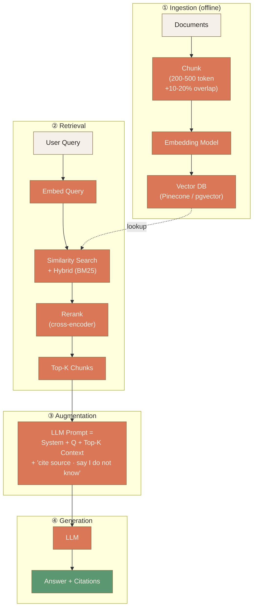

- **Note**: RAG 的標準心智模型——Ingestion 是 offline、Retrieve/Augment/Generate 是 online，rerank 與 cite 在每張 RAG 圖都要強調。

---

## Image 17 · Recap · 客服 AI 助理整合架構

- **Type**: C · 架構圖（Mermaid）
- **Priority**: P2
- **Slide**: `07-advanced-patterns/99_recap.md` · CASE STUDY section
- **Save as**: `ppt/assets/diagrams/07-advanced-patterns/99_recap_01_ai_assistant.png`
- **Aspect**: 16:9

**Mermaid 原始碼**：
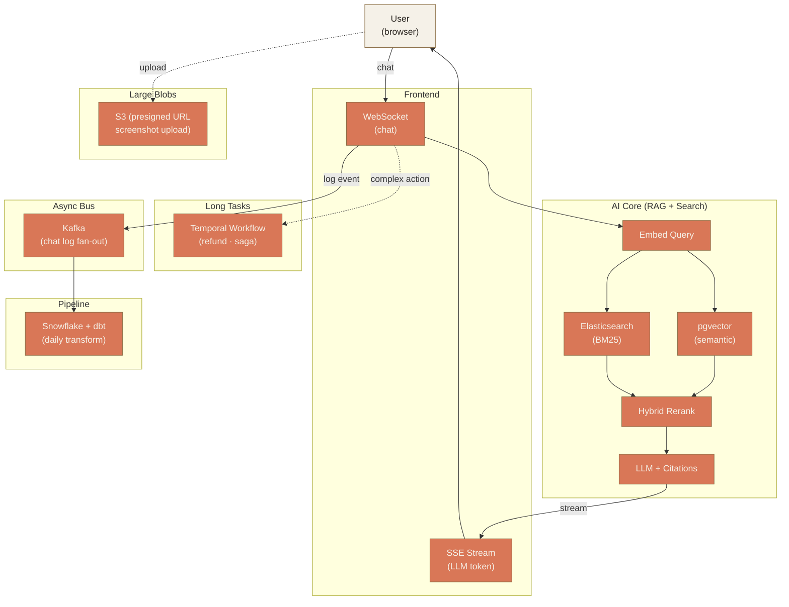

- **Note**: 章末 case study——把 7 個 pattern 全部塞進「客服 AI 助理」的單一架構，幫讀者把章節知識串成可實作的系統。

---

## Image 18 · Recap · 整套 7 章地圖

- **Type**: B · 隱喻地圖
- **Priority**: P3
- **Slide**: `07-advanced-patterns/99_recap.md` · 7 章地圖 section
- **Save as**: `ppt/assets/diagrams/07-advanced-patterns/99_recap_02_course_map.png`
- **Aspect**: 16:9
- **Prompt**:
  ```
  A hand-drawn editorial illustration of a seven-tier ziggurat or layered cake viewed from a slight angle, each tier hand-lettered with chapter name and one-line theme, ascending from broad foundation at the bottom to specialized tip at the top: tier 1 widest "FOUNDATION · client / server / db / cache", tier 2 "DATA FUNDAMENTALS · SQL/NoSQL · ACID · CAP", tier 3 "DATA DISTRIBUTION · sharding · replication", tier 4 "INFRASTRUCTURE · gateway · LB · container", tier 5 "RELIABILITY OPS · monitoring · circuit breaker", tier 6 "SCALING PATTERNS · cache · microservices", tier 7 narrowest at top "ADVANCED · queue / blob / RT / RAG". A small graduate cap rests on top of tier 7. A faint dashed line on the side traces the journey upward.
  Composition: ziggurat or stepped pyramid centered on the cream background, soft side light from the left casting subtle shadows in deep brown, hand-lettered tier labels along each step's right edge, slim vertical hand-noted "the journey" label on the right side, ample whitespace at top above the cap and below the base.
  editorial illustration, hand-drawn technical sketch style, warm color palette featuring cream off-white #F5F1E8 background and warm orange #D97757 accents with deep brown #8B6F47 secondary lines, minimalist flat vector with subtle paper texture, clean geometric lines, ample whitespace, educational diagram style, calm composed mood.
  --ar 16:9 --style raw --no photo-realistic, 3d render, neon, gradient glow, cluttered text, watermark, kawaii, anime
  ```
- **Note**: 畢業頁的「整門課地圖」——七層 ziggurat 視覺化讀者走過的路徑；P3 錦上添花。

---

## Image 19 · RAG · Chunking 三策略（可選）

- **Type**: D · 對照圖
- **Priority**: P3
- **Slide**: `07-advanced-patterns/07_rag.md` · Chunking section
- **Save as**: `ppt/assets/diagrams/07-advanced-patterns/07_rag_02_chunking.png`
- **Aspect**: 16:9
- **Prompt**:
  ```
  A hand-drawn editorial illustration comparing three text chunking strategies side by side, each visualized as a long horizontal scroll cut by different rules. Strategy 1 "FIXED SIZE": a scroll cut at evenly spaced vertical lines with shaded overlap zones at each boundary, labeled "200-500 tokens · 10-20% overlap". Strategy 2 "SEMANTIC": a scroll cut along irregular boundaries that match paragraph breaks and section headings, with small heading icons at each cut, labeled "by paragraph / heading / sentence". Strategy 3 "RECURSIVE": a scroll cut hierarchically—first into large sections, then sub-sections, then sentences, drawn as nested brackets, labeled "section → paragraph → sentence (LangChain default)".
  Composition: three horizontal bands stacked vertically, each band 1/3 of canvas height, each band has the strategy name hand-lettered on the left and the scroll diagram on the right, ample whitespace between bands, top hand-lettered headline "CHUNKING · 3 STRATEGIES".
  editorial illustration, hand-drawn technical sketch style, warm color palette featuring cream off-white #F5F1E8 background and warm orange #D97757 accents with deep brown #8B6F47 secondary lines, minimalist flat vector with subtle paper texture, clean geometric lines, ample whitespace, educational diagram style, calm composed mood.
  --ar 16:9 --style raw --no photo-realistic, 3d render, neon, gradient glow, cluttered text, watermark, kawaii, anime
  ```
- **Note**: Chunking 是 RAG 品質決勝點；三策略並列幫助讀者選擇。P3 錦上添花、可省略。

---

## 索引

| # | Topic | Priority | Type | File |
|---|-------|---------|------|------|
| 01 | Hero · 章首封面 | P1 | A | `00_hero.png` |
| 02 | Mental Model · 7 個方向能力地圖 | P1 | E | `00_mental_model.png` |
| 03 | Queue · Producer-Queue-Consumer 基本流 | P1 | C | `01_queue_01_basic_flow.png` |
| 04 | Queue · Kafka vs RabbitMQ vs SQS | P2 | D | `01_queue_02_three_brokers.png` |
| 05 | Queue · Backpressure 三招 | P2 | D | `01_queue_03_backpressure.png` |
| 06 | Long Tasks · 4 必備機制（序列圖） | P1 | C | `02_longtasks_01_four_mechanisms.png` |
| 07 | Long Tasks · 編排引擎四方對比 | P2 | D | `02_longtasks_02_orchestrators.png` |
| 08 | Large Blobs · Presigned URL 序列圖 | P1 | C | `03_blobs_01_presigned_url.png` |
| 09 | Large Blobs · S3 Multipart Upload | P2 | C | `03_blobs_02_multipart.png` |
| 10 | Real-time · 4 種推送技術對比 | P1 | D | `04_realtime_01_four_protocols.png` |
| 11 | Real-time · 2-Hop Fan-out 架構 | P1 | C | `04_realtime_02_two_hop_fanout.png` |
| 12 | Search · Inverted Index 結構 | P1 | C | `05_search_01_inverted_index.png` |
| 13 | Search · CDC + Reindex with Alias | P2 | C | `05_search_02_cdc_alias.png` |
| 14 | Pipeline · Lambda vs Kappa 架構 | P2 | D | `06_pipeline_01_lambda_kappa.png` |
| 15 | Pipeline · ETL vs ELT + Stream Window | P2 | D | `06_pipeline_02_etl_windows.png` |
| 16 | RAG · 4 元件流程 | P1 | C | `07_rag_01_four_components.png` |
| 17 | Recap · 客服 AI 助理整合架構 | P2 | C | `99_recap_01_ai_assistant.png` |
| 18 | Recap · 整套 7 章地圖 | P3 | B | `99_recap_02_course_map.png` |
| 19 | RAG · Chunking 三策略（可選） | P3 | D | `07_rag_02_chunking.png` |

**統計**：19 張 prompt（包含 1 張可選）· 推薦做 17–18 張（建議省略 #19）
- Priority：P1 × 8 · P2 × 8 · P3 × 2（含可選）= 18 張穩定 + 1 可選
- Type：A × 1 · B × 1 · C × 8 · D × 7 · E × 1 + 備援
