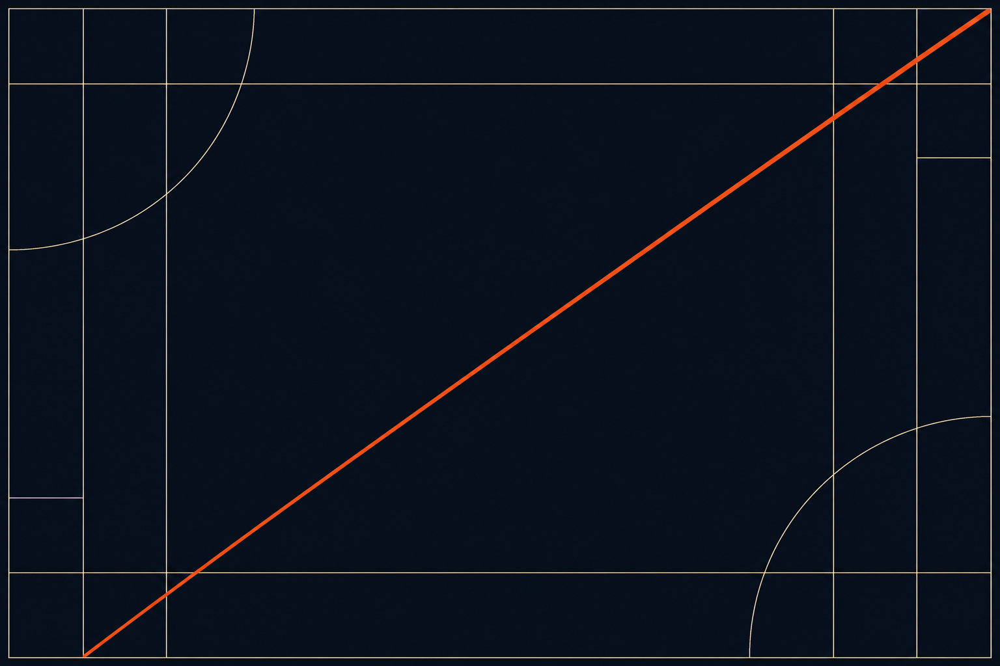
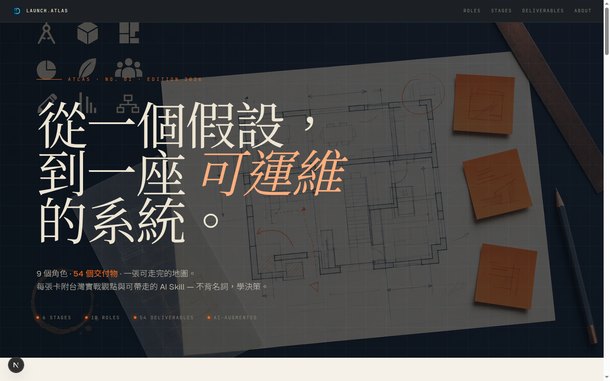
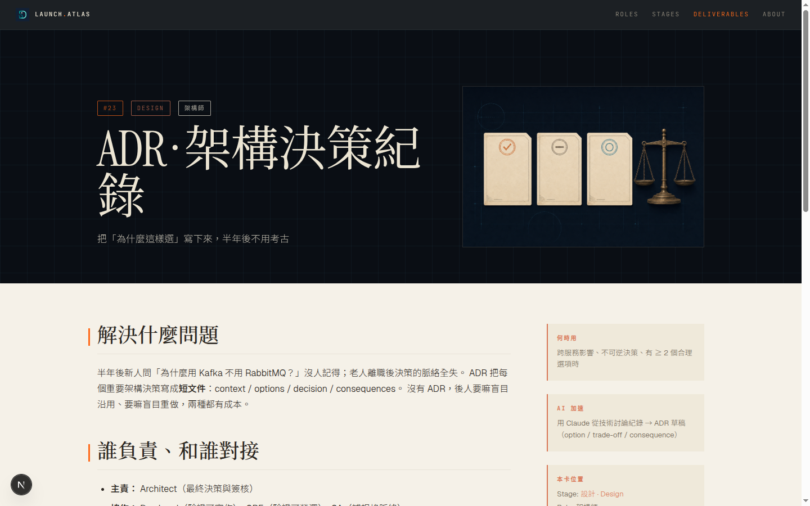
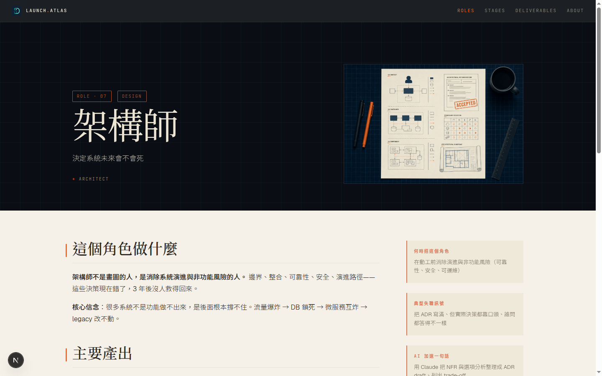
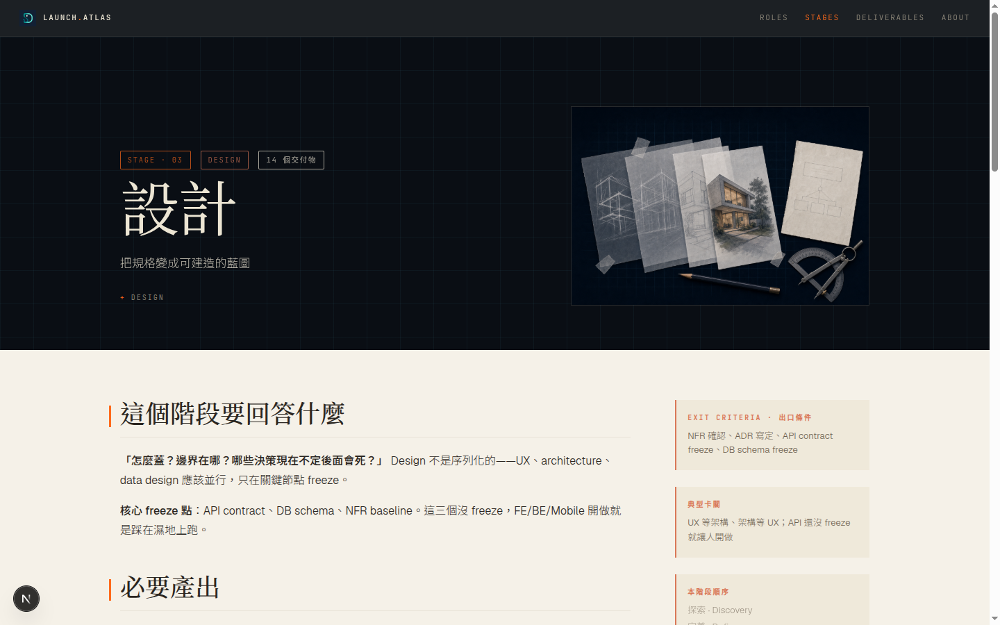

<div align="center">



# System Design All-in-One

### 給寫過幾年 code、想往架構師走的工程師。
**不背名詞，學決策。**

[](LICENSE)
[](#五個子專案)
[](#五個子專案)
[](https://marp.app/)
[](./product_to_launch/)
[](https://claude.com/claude-code)

[**🗺 Launch Atlas — 入口網站**](#-launch-atlas--落地圖鑑) ·
[**📚 五個子專案**](#五個子專案) ·
[**🎯 三種使用方式**](#三種使用方式) ·
[**⚡ Quickstart**](#quickstart)

</div>

---

## 🌟 Launch Atlas · 落地圖鑑

**新功能** — 從一個假設，到一座可運維的系統。9 角色 · 54 交付物 · 6 階段 · 一張可走完的地圖。

[`product_to_launch/`](./product_to_launch/) 是這個倉庫的**入口網站**，把四個姊妹專案的內容濃縮成可掃描的卡片網格，靈感來自 [`pm.chiba.tw`](https://pm.chiba.tw/) 但把「框架」換成「**交付物**」、把光面紙翻成**深墨 hero + 米白內容**雙主題。

<div align="center">

</div>

<table>
<tr>
<td width="33%" align="center">
<br/>
<sub><b>交付物詳細頁</b><br/>四問結構：解決什麼 / 誰負責 / 何時用 / AI 加速</sub>
</td>
<td width="33%" align="center">
<br/>
<sub><b>角色頁</b><br/>10 個角色，每個都解決一種特定的不確定性</sub>
</td>
<td width="33%" align="center">
<br/>
<sub><b>階段頁</b><br/>6 個 SDLC 階段 × 退出條件 × 典型卡關</sub>
</td>
</tr>
</table>

```bash
cd product_to_launch
npm install
npm run dev    # → http://localhost:3000
```

詳見 [`product_to_launch/README.md`](./product_to_launch/README.md)。

---

## 五個子專案

```
system_design_allinone/
├── 🗺 product_to_launch/         ← Launch Atlas · 入口網站（新）
├── 📐 ai_native_system_design/   ← AI 時代系統設計速成（11 章 200 頁）
├── 🏛 software_architect/        ← 架構師的藍圖（10 章 372 頁）
├── 🛠 software_develop_journey/  ← 軟體開發旅程（14 章 384 頁 + process_map）
└── 📚 system_design/             ← 系統設計實戰（7 章 48 主題 + 34 PDF）
```

| 子專案 | 目標讀者 | 主題 | 頁數 |
|---|---|---|---|
| [**落地圖鑑**](./product_to_launch/) | 想看「下一步該做什麼」的 PM/Lead | 9 角色 × 54 交付物 × 6 階段 | 78 頁互動站 |
| [**AI 時代速成**](./ai_native_system_design/) | 已會 code，要當 AI 時代架構師 | 4 大方法論 + 3 實戰案例 + Claude Code 工作流 | 200 頁 |
| [**架構師藍圖**](./software_architect/) | 在職/初階架構師、職涯轉型 | Why / How / Trade-off 三段式教材 | 372 頁 |
| [**軟體開發旅程**](./software_develop_journey/) | 小白、新鮮人、想懂協作邊界 | 9 角色全景 × 蓋房子比喻 + DAG 流程圖 | 384 頁 |
| [**系統設計實戰**](./system_design/) | 想懂架構基礎、深度面試者 | CAP / Sharding / Cache / RAG 全套 | 48 主題 + 34 PDF |

---

## 三種使用方式

| 路徑 | 對象 | 建議起點 |
|------|------|---------|
| **A · 入口掃描（10 分鐘）** | 想知道有什麼 | [`product_to_launch/`](./product_to_launch/) 首頁 → 點感興趣的卡 |
| **B · 線性自學（40 小時）** | 想從 0 到 1 學完 | [`software_develop_journey/`](./software_develop_journey/) → [`system_design/`](./system_design/) → [`software_architect/`](./software_architect/) |
| **C · AI 加速（一週）** | 想用 AI 工作流加速架構工作 | [`ai_native_system_design/`](./ai_native_system_design/) 的 Part 3 |
| **D · 面試衝刺（3 天）** | 中型公司架構師面試 | `system_design/` Ch.1-2 + 90-appendix + 3 個 capstone |

---

## Quickstart

### 落地圖鑑（互動站）

```bash
cd product_to_launch
npm install && npm run dev   # → http://localhost:3000
```

### Marp 簡報（四套教材通用）

```bash
nvm install 20 && nvm use 20
cd <子專案>/ppt
bash scripts/build.sh full       # 整套 PDF + HTML → dist/
bash scripts/build.sh chapter 01-foundation   # 單章
```

### 直接讀 Markdown

每份 `<子專案>/ppt/0X-章節/NN_topic.md` 都是獨立 Marp deck。VS Code + Marp 擴充可即時預覽。

---

## 設計理念

每張 slide / 每張卡片的真正主題只有一句：

> 這個技術解決什麼問題？代價是什麼？什麼時候不該用？

如果你能回答這三個問題，你就是架構師。

四套教材刻意保留 **Why / How / Trade-off** 三段節奏：
- **Why** — 解決什麼具體問題（不是抽象優勢）
- **How** — 核心機制 + 一張示意圖
- **Trade-off** — 得到什麼 vs 失去什麼，何時不該用

落地圖鑑再多一段 **AI-Leverage** — 這個交付物 AI 能加速哪一步？哪一步必須留給人？

---

## 章節能力分級

| Level | 描述 | 對應內容 | 典型場景 |
|-------|------|---------|---------|
| L1 | 看得懂技術名詞 | `system_design/` Ch.1-2 | 讀懂團隊架構文件 |
| L2 | 能畫出基本架構圖 | + Ch.3-4 | 通過初級面試 |
| L3 | 能落地實作中型系統 | + Ch.5 + `software_develop_journey/` | 帶領 3-5 人小組 |
| L4 | 能 review 別人的設計 | + Ch.6 + `software_architect/` | 跨團隊 architect |
| L5 | 能設計新 pattern | + Ch.7 + Capstone + `ai_native_system_design/` | Staff / Principal |

**整套教材目標**：把你從 L1 帶到 L4 的入口。
**Launch Atlas 額外提供**：每階段「該交什麼、誰交、AI 怎麼幫你交」。

---

## 視覺系統

四套教材統一使用 **Anthropic 風格**（暖橙 `#D97757` + 米白底 `#F5F1E8`）。
落地圖鑑與 `process_map` 改用 **Architect's Blueprint**（深墨 `#0a0e14` + 修正橙 `#ff6a1a` + blueprint cyan `#6dd5ed`）。

字體（共用）：Instrument Serif / Playfair Display（標題）· Geist / Inter（內文）· JetBrains Mono / IBM Plex Mono（程式碼）· Noto Sans TC（中文）。

主題 CSS：[`ai_native_system_design/ppt/themes/anthropic.css`](./ai_native_system_design/ppt/themes/anthropic.css) · [`software_develop_journey/process_map/index.html`](./software_develop_journey/process_map/index.html) (inline)

---

## 三個承諾（落地圖鑑共用）

| Vow | 內容 |
|---|---|
| **01 · 不背名詞，學決策** | 每張卡都回答「解決什麼、代價、不該用」 |
| **02 · Why / How / Trade-off** | 任何技術都能用這三段拆解 |
| **03 · AI 加速三問** | AI 能加速哪一步？哪一步必須留給人？人在這一步的判斷依據是什麼？ |

---

## 授權

- **本專案的簡報、腳本、互動站**（`product_to_launch/`、各子專案的 `ppt/` 與 `scripts/`）採 **MIT License** — 見 [LICENSE](LICENSE)
- **`系統設計實戰/` 內的原始 PDF 教材**：著作權屬原作者所有，僅作個人學習收藏，不對外重新散佈

---

<div align="center">
<sub>從一個假設，到一座可運維的系統。</sub><br/>
<sub>不背名詞，學決策 · Why / How / Trade-off · AI 加速三問</sub><br/><br/>
<b>v1.0 · 2026 · hand-crafted with <a href="https://claude.com/claude-code">Claude Code</a></b>
</div>
