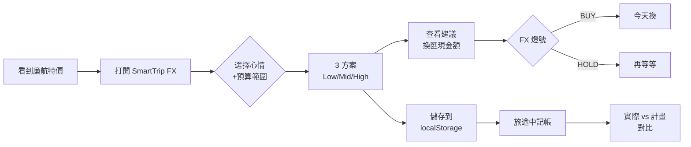

# 03-PRD · 實際結果（AI 回的內容 + 教學要點）

> **這個檔案的用途**：把 [`模板輸入.md`](./模板輸入.md) 完整 prompt 段貼到 Claude 後，AI 真的回的內容。
> 你自己跑出來的結果不會完全一樣（AI 有變異性），但**10 段 H2 章節、表格、Mermaid、inline `**[H/M/L]**` badge**應該對得起來。
> 對照重點看下方的「**教學要點**」與「**常見錯誤**」。

---

> [!NOTE]
> **本檔為 migration 前的 legacy YAML 輸出**。2026-05 站上模板已升級為文件驅動的 markdown 結構（`template-light` / `template-full` + 薄 trigger）。新模板會輸出含 H2 章節、表格、inline `[H/M/L]` badge 的 markdown 文件，內容欄位與本檔 YAML 結構等價，僅格式不同。下方教學要點、confidence / source / decision_log 的判讀方式仍完全適用。對照新流程：請看同卡的 [`模板輸入.md`](./模板輸入.md) 與站上 deliverable 卡片。

---

## AI 輸出（Claude 回應的真實 PRD markdown 文件）

````markdown
# Product Requirements: SmartTrip FX · 旅程外幣費用試算

**Status:** Draft v0.2 · **Owner:** Sunny (PM) · **Last updated:** 2026-05-26 · **Reviewers:** UX / Architect / QA

---

## 1. Executive Summary

台灣 25–40 歲衝動型出境旅客一年出國 1–4 趟，單趟 NT$40,000 預算中匯損與多換成本可達 NT$300–1,500。現有行程規劃工具與 OTA 完全不處理「該帶多少外幣現金」這個決策，旅客只能憑感覺換匯（依據：brief §待解痛點）。SmartTrip FX 用「先算錢再排行程」的定位填補此空白，4 週 MVP 驗證「衝動型旅客會主動找此工具」這個 riskiest assumption（依據：value-hypothesis §riskiest）。

> **TL;DR:** 讓使用者在 3 分鐘內得到「精準建議換匯現金額 + 三方案行程」，事後現金花費誤差 < 15%。

---

## 2. Goals & Non-Goals

### Goals

| # | Goal | Why this matters | Success metric | Confidence |
|---|---|---|---|---|
| G1 | 3 分鐘內生出含換匯建議的行程 | 解 JTBD-001 核心痛點（事前不知道帶多少） | 啟用率 ≥ 40%（進站完成一次生成） | **[H]** |
| G2 | 換匯誤差 < 15% 的旅程比例 ≥ 60% | 證明「精準」差異化護城河 | 有記開支的行程中達標比例 ≥ 60% | **[M]** |
| G3 | 使用者願意回來追蹤旅程開支 | 驗證「不只生一次就跑」 | 30 天回訪 ≥ 20% | **[M]** |
| **Counter** | 生成時間中位數 ≤ 3 分鐘 | 防 goal-hacking：避免為衝啟用率拉長流程 | p50 生成時間 ≤ 180s | **[H]** |

### Non-Goals

- ❌ **Not solving:** 帳號與雲端同步 — Rationale: 違反 brief 主要約束「免登入即開即用」；4 週驗證不該被登入轉換漏斗稀釋。屬 V1 工作。
- ❌ **Not solving:** 訂房 / 訂票實際 API 串接 — Rationale: 用外部連結導出已能驗證主張，自建 API 成本 > 收益。屬 V2。
- ❌ **Not solving:** 個人化推薦 / 歷史學習 — Rationale: 需資料量累積，4 週 MVP 期間無意義。屬 V2。
- ❌ **Not solving:** 多人分帳 / 社群行程 — Rationale: 非核心假設，會稀釋驗證訊號。

---

## 3. Users & Scenarios

**Primary persona:** JTBD-001（衝動型衝出客）+ JTBD-003（選擇困難旅客）
**Secondary persona:** JTBD-002（旅途中即時記帳）、JTBD-004（首次自由行新手，confidence **[L]**）

### Key scenarios

1. **出發前 1–2 週**：使用者在通勤路上開站，輸入目的地+預算+心情，3 分鐘看到三方案 + 建議換匯額
2. **出發前 3 天**：使用者打開已存行程，看 FX 燈號決定今天去銀行換還是再等幾天
3. **旅途中**：使用者新增一筆現金 / 刷卡開支，即時看到剩餘預算與是否超支

### Edge cases

- 使用者填預算 NT$10,000（極低）→ 系統應仍能生成 Low 方案或友善訊息（依據：JTBD-001.success_criteria 「不要狼狽」）
- 即時匯率 API 失敗 → 改用快取匯率 + 明確「模擬」標示（依據：brief §主要約束 P0-8 缺口）
- 使用者中途關閉瀏覽器 → 重整後 localStorage 草稿應可恢復（依據：brief §主要約束「localStorage」）

---

## 4. User Flow



---

## 5. Functional Requirements

### FR-1: 行程生成入口 · Priority **P0** · **[H]**
- **Statement:** 使用者填目的地、日期、預算、心情後產出 Low/Mid/High 三方案
- **Acceptance:**
  - Given 所有必填欄位齊全 / When 按下生成 / Then 回傳 3 方案
  - Given 缺項 / When 按下生成 / Then 顯示明確錯誤訊息（哪欄+為何）
- **Source:** brief §期望成果 + JTBD-003.functional_job

### FR-2: 建議換匯現金額 · Priority **P0** · **[H]**
- **Statement:** 每方案顯示「建議換匯現金額」與台幣約當
- **Acceptance:**
  - 建議額 = 該方案 cash_only 行程總和 × 1.1（10% 緩衝）
  - 依目的地幣別進位（JPY → 1000、KRW → 10000）
- **Source:** brief §待解痛點 + JTBD-001.functional_job

### FR-3: FX 換匯燈號 · Priority **P0** · **[H]**
- **Statement:** 系統顯示 STRONG_BUY / BUY / HOLD 燈號 + 文字建議
- **Acceptance:**
  - 燈號邏輯：今日匯率 vs MA30 偏離 %（細節屬 ADR-002）
  - 畫面附「非投資理財建議」免責聲明
- **Source:** brief §主要約束（法規）+ §期望成果

### FR-4: 即時匯率資料源 · Priority **P0** · **[H]**
- **Statement:** 接入真實匯率 API 取代既有模擬值
- **Acceptance:**
  - 燈號與匯率來自真實 API
  - API 失敗時降級到快取，畫面標「模擬」
- **Source:** brief §主要約束（P0-8 待補）+ value-hypothesis §success_threshold
- **Notes:** 供應商選型屬 ADR-002

### FR-5: 使用分析埋點 · Priority **P0** · **[H]**
- **Statement:** 系統提供事件埋點（生成 / 存檔 / 回訪 / 誤差）
- **Acceptance:**
  - 事件：generate / tier_select / save_trip / add_expense / deal_link_click / return_visit
  - 無 PII，符合「重隱私」定位
- **Source:** brief §主要約束（P0-9 待補）+ value-hypothesis §kill_criteria

### FR-6: 行程儲存（localStorage） · Priority **P0** · **[H]**
- **Statement:** 使用者可將行程存到本機 localStorage 並重開
- **Acceptance:** 儲存後在「我的行程」可見、可重開、瀏覽器重整不消失
- **Source:** brief §主要約束 + JTBD-002

### FR-7: 旅途開支紀錄 · Priority **P0** · **[H]**
- **Statement:** 使用者記錄旅途中現金 / 刷卡開支並對比預算
- **Acceptance:**
  - 新增 / 刪除開支即時更新總額
  - 顯示「計畫 vs 實際」差額與超支標示
- **Source:** JTBD-002.success_criteria

### FR-8: 行程分享 / 匯出 · Priority **P1** · **[M]**
- **Statement:** 行程可分享連結 / 截圖 / PDF
- **Acceptance:** 至少支援一種匯出格式
- **Source:** brief §期望成果（推論：差異化口碑擴散），_TODO: 需訪談確認真實需求_

### FR-9: 旅程回顧 / 心情故事 · Priority **P1** · **[M]**
- **Statement:** 旅程結束後回顧（星等 + 心得）
- **Acceptance:** _TODO: 4 週驗證後 V1 再寫_
- **Source:** brief §期望成果（黏著功能）

### FR-10: 帳號 + 雲端同步 · Priority **P2** · **[H]**
- **Statement:** 跨裝置同步行程
- **Source:** brief §主要約束（明確 V2）

---

## 6. Non-Functional Requirements

| Dimension | Target | Rationale | Confidence |
|---|---|---|---|
| **Latency** | 生成端到端 p95 < 3s；FX 燈號 p95 < 500ms | JTBD-001 要 3 分鐘總時間，扣除填表 ~2 分鐘，運算 buffer < 1 分鐘（依據：JTBD-001.success_criteria） | **[H]** |
| **A11y** | WCAG 2.2 AA | 旅遊規劃常在通勤時手機使用（戶外明亮 + 單手）；AAA 過嚴會拖慢 4 週驗證 | **[H]** |
| **Security** | Data class: internal · Threat: XSS（外部連結） + 第三方 API 偽造 · No PII no PCI-DSS | 無帳號無金流，主要威脅在外部整合（依據：brief §主要約束 免登入） | **[M]** |
| **Audit** | 分析事件 90 天（Plausible 預設） · 無 PII 無 GDPR 完整流程 · FX 燈號附「非投資理財建議」 | 對應金管會（依據：brief §主要約束 法規） | **[H]** |

---

## 7. Risks & Open Questions

### Risks

> **R1:** 即時匯率 API 額度 / 成本超支 — **Mitigation:** 多供應商備援 + 快取 + rate limit（細節屬 ADR-002） — **Owner:** Architect
> **R2:** 4 週驗證窗樣本不足（< 1000 uniques） — **Mitigation:** value-hypothesis 已預留 smoke_test 廣告預算；若仍不足，kill_criteria 觸發 → 重做訪談 — **Owner:** PM
> **R3:** FX 燈號被誤解為投資建議造成法務風險 — **Mitigation:** 免責聲明 + 文案不出現「投資 / 報酬 / 收益」字眼 — **Owner:** Legal review

### Open Questions

- [ ] **Q1:** 使用者主要使用 moment 是「事前 vs 旅途 vs 事後」哪個？_TODO: 需要訪談_
- [ ] **Q2:** 即時匯率 API 在台灣 IP 是否有 latency 問題？_TODO: 需 SRE 實測_
- [ ] **Q3:** 「換匯誤差 < 15%」這個門檻使用者是否真有感？_TODO: 需訪談驗證_

---

## 8. Decision Log

| Date | Decision | Options considered | Chosen | Rejected why | Confidence |
|---|---|---|---|---|---|
| 2026-05-26 | P0-8 即時匯率排 P0 而非 P1 | A. P0 即時匯率 / B. P1 先用模擬值收 feedback / C. P2 完全砍掉燈號 | A | B: 模擬值會污染 G3 差異化認知訊號（使用者說「換匯/現金差異」時，不知是真信還是被假數字騙）。C: 砍掉燈號 = 砍掉差異化護城河本身 | **[H]** |
| 2026-05-26 | FR-9（旅程回顧）放 P1 而非 P0 | A. P0 完整體驗 / B. P1 驗證後加 / C. P2 永遠砍掉 | B | A: 違反 value-hypothesis 聚焦原則，黏著功能不是驗證 riskiest 所必需。C: 若 4 週通過，此功能對 30 天回訪有貢獻 | **[M]** |
| 2026-05-26 | 行程儲存選 localStorage 而非後端 DB | A. localStorage / B. Firebase auth / C. 自建後端 | A | B: 違反 brief「免登入即開即用」；登入漏斗會稀釋 4 週驗證樣本。C: 4 週時間盒下自建後端 + sync > 1 sprint | **[H]** |

---

## 9. Confidence & Sources

- **整份文件最低 confidence 欄位：**
  - G2 success metric（"誤差 < 15% 比例 ≥ 60%"）：**[M]** — 無 baseline，需首 2 週實測校準
  - FR-8 / FR-9：**[M]** — brief 未直接列為核心，從推論而來
  - JTBD-004 新手 persona：**[L]** — 上游 jtbd 已標 L，未訪談證據
- **Fabricated assumptions（我推測但 input 未明說的）：**
  - 「換太多 → 回國再換虧匯差」的 NT$300-1,500 金額是 PRD 推論，非真實訪談數據
  - 「分享 / 匯出有利於口碑擴散」純屬團隊推論
- **Highest-value next input:** 5-8 份 switch interview（為何從 Google + 部落客切換到 SmartTrip FX）—可同時校準 G1/G2 baseline、驗證 JTBD-004 新手族群、確認 FR-8 真實需求

### TODO（缺資料）

- _TODO: 需要 8-20 份 switch interview 校準 G1 success metric baseline_
- _TODO: 需要競品（Klook / Trip.com）漏斗 benchmark 驗證 G2_
- _TODO: 需要新手族群（首次自由行）3 份 switch interview 提升 JTBD-004 confidence_
- _TODO: 需要 SRE 實測即時匯率 API latency 在台灣 IP 的真實值_

---

## 10. Out of Scope

本 PRD **不處理**：

- ❌ **不畫 UI mockup / 設計稿** — 屬 UX design / high-fidelity-mockup 卡
- ❌ **不出具 API spec 或 DB schema** — 屬 ADR-001（架構選型）/ api-spec / data-model 卡
- ❌ **不寫 sprint 拆解或時程估算** — 屬 backlog / PO 工作
- ❌ **不定義 KPI 公式細節**（如「啟用率」公式、誤差計算邏輯）— 屬 North Star / okr 卡
- ❌ **不寫即時匯率供應商選型決策** — 屬 ADR-002（技術選型）
````

---

## 教學要點（看完 AI 輸出後讀這段）

### 1. 為什麼整份輸出是真實 markdown PRD 而不是 YAML？

舊版要學生產 YAML schema，下游卡再剪貼欄位。這有兩個問題：
- **人類認知負擔重**：YAML 嵌套深、沒有視覺層級、看不出哪重要
- **失去文件感**：實際工作的 PRD 是給跨職能團隊 30 分鐘讀完的，不是給 parser 吃的

新版輸出對標 Linear / Amplitude / Atlassian 業界 PRD：
- **表格**列出 Goals / NFR / Decision Log（資訊密度高）
- **Mermaid 流程圖**讓 UX 與 Architect 一眼看懂使用者旅程
- **inline `**[H]**` badge**讓 confidence 可機械抽取又可讀
- **10 段 H2 章節**對標 PRD 業界範式

下游卡（04-acceptance-criteria、05-adr 等）**整份貼這個 markdown 當 context**，不再剪貼個別欄位。

### 2. P0 / P1 / P2 切分的判準是什麼？

**P0 = 砍掉就無法驗證 riskiest_assumption 的功能**。
不是「使用者最想要」也不是「最容易做」。

| FR | 為何 P0 |
|---|---|
| FR-4 即時匯率 | 模擬值會污染 G3「差異化認知」訊號 |
| FR-5 使用分析 | 沒它 → 連 kill_criteria 都無法觸發 |
| FR-1~3 行程/換匯/燈號 | 三者合起來 = 驗證主張本身 |

學生最常犯：把「使用者會喜歡」當 P0 判準，把 FR-9 心情故事放 P0，結果 4 週做不完。

### 3. counter_metric 為什麼是「生成時間中位數 ≤ 3 分鐘」？

**counter_metric = 防止 goal-hacking 的副指標**。
若只看啟用率，PM 會傾向把流程拉長（多問幾題 → 更個人化 → 提高完成意願）來衝啟用率，但這會破壞 JTBD-001 的 ≤ 3 分鐘 success_criteria。
所以 counter_metric 直接綁 JTBD-001 vs JTBD-005 互斥（jtbd §mutually_exclusive_jobs）。

### 4. NFR 4 象限怎麼對應到 SmartTrip？

| 象限 | 本卡選擇 | 為何不更嚴 |
|---|---|---|
| Latency p95 < 3s | JTBD-001 要 3 分鐘總時間 | < 1s 過度工程 |
| A11y AA | 戶外通勤手機情境 | AAA 拖慢 4 週驗證 |
| Security internal | 無帳號無金流 | confidential 對應到帳號系統，V1 才要 |
| Audit 90 天無 PII | Plausible 預設 | 完整 GDPR 流程當 MVP = 過度設計 |

學生常見錯：把 NFR 抄業界 best practice，忘了本案是 4 週 MVP，過嚴會直接做不完。

### 5. 這份 PRD markdown 文件流到下游怎麼用

| 下游卡 | 整份 PRD 當 context 注入後，agent 會自己抓 |
|---|---|
| `04-acceptance-criteria/` | §5 FR-1 ~ FR-10 每條展開 Given/When/Then |
| `05-adr/` | §8 Decision Log（localStorage、即時匯率供應商）→ 寫成 ADR 格式；§6 NFR 當 technical drivers |
| `06-c4-diagram/` | §4 User Flow（推導 system context）+ §10 Out of Scope（系統邊界） |
| `09-non-functional-reqs/` | §6 NFR + counter_metric |
| `12-release-plan/` | §2 Success metrics + §7 Risks（rollback 觸發點） |

過去要剪貼 YAML 欄位，現在 LLM 自己讀整份 markdown 找到。

---

## 學生常見錯誤（交件前自己對照）

| 錯誤 | 為何錯 | 怎麼修 |
|---|---|---|
| AI 還是吐了 YAML / JSON code-fence | 違反規則 5「禁止輸出 YAML / JSON schema」 | 在 prompt 結尾再加一句「最終輸出必須是純 markdown 文件，不可有 yaml / json fence」 |
| 文件漂亮但沒寫 Decision Log | markdown 散文化最常見：好看但失去可審計性 | §8 必須有 ≥ 2 個 rejected options + 各自為何不選 |
| 所有 FR 都標 **[H]** | confidence calibration 失準 | 沒訪談原句的標 **[M]** 或 **[L]**，並在 §9 寫補洞計畫 |
| 沒寫 Mermaid 流程圖 | 違反規則 3 | §4 User Flow 必須有 mermaid fence |
| NFR 只寫 latency，其他 3 象限沒寫 | 違反規則 8 | 4 象限都要寫；不適用時要在 Rationale 寫「為何不適用」|
| §10 Out of Scope 寫成「不做匯率燈號」 | 混淆 product non-goals 與文件 scope | Out of Scope 是「不寫實作 / 不畫 UI / 不出 API spec」這類**文件 scope**，不是產品 non-goal（後者屬 §2 Non-Goals） |
| FR 寫成「使用 React + Tailwind 實作」 | 違反規則 10 不寫 how | PRD 只寫 what & why，框架選型屬 ADR |
| 把所有「使用者想要的功能」都放 P0 | P0 判準錯誤 | P0 篩選用 riskiest_assumption 反推，非主觀重要性 |

---

## 交件 checklist

- [ ] 輸出是純 markdown 文件，**完全沒有 yaml / json fence**
- [ ] 10 段 H2 章節齊全（Exec / Goals / Users / Flow / FR / NFR / Risks / Decision Log / Confidence / Out of Scope）
- [ ] 至少 3 個表格（Goals、NFR、Decision Log）
- [ ] 至少 1 個 Mermaid 流程圖（§4 User Flow）
- [ ] 每個 FR / NFR / Goal 有 inline `**[H]**` / `**[M]**` / `**[L]**` badge
- [ ] P0 功能合起來足以驗證上游 value-hypothesis 的 riskiest_assumption
- [ ] counter_metric 對應到一個 JTBD 互斥
- [ ] §8 Decision Log 每條有 ≥ 2 個 rejected options + 各自 rejected reason
- [ ] §9 Confidence & Sources 對應到每個 **[M]** / **[L]** 的補洞計畫
- [ ] §10 Out of Scope 是文件 scope（不寫 UI / 不寫 API / 不寫 sprint），不是產品 non-goal

---

✅ 過了就可以進下一張：[`04-acceptance-criteria/`](../04-acceptance-criteria/) — 把 PRD §5 的 P0 需求展開成 QA / Dev 可直接寫測試的 Given/When/Then。整份 PRD markdown 文件當下游 prompt 的 context 注入即可。
