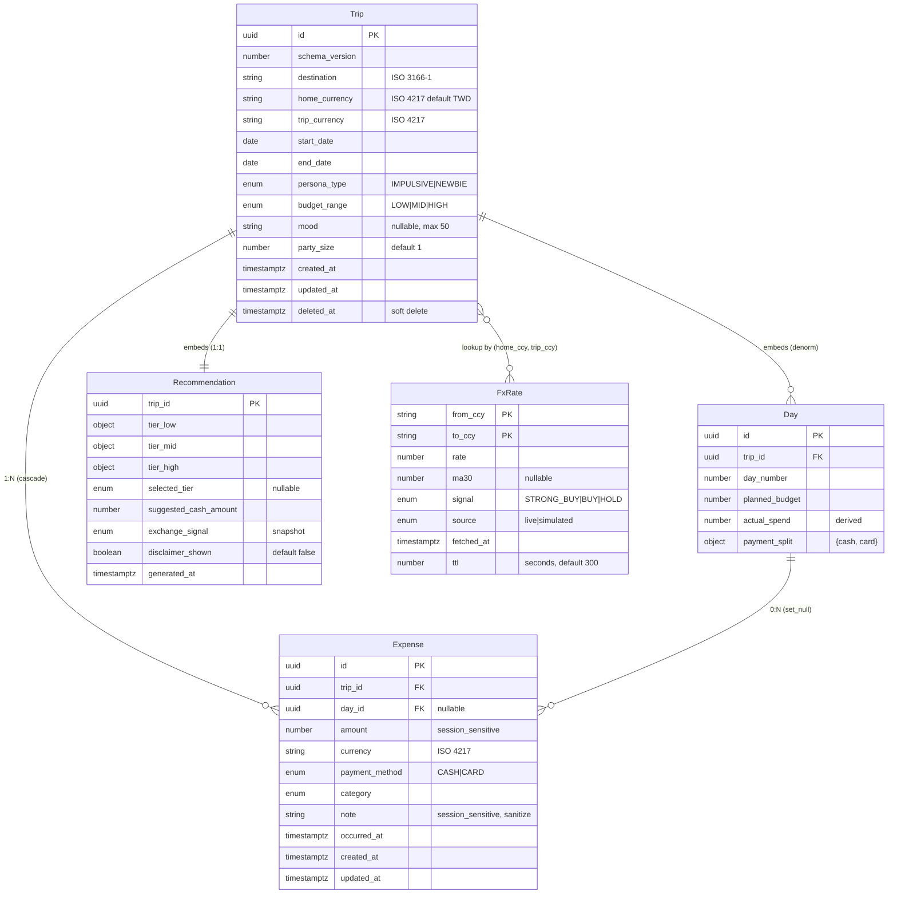

# 08 Data Model · SmartTrip FX 示範

> 用 SmartTrip FX 種子簡報（`demo/種子簡報.md`）+ 完整 PRD（`PRD.md` §6 / §8 / §9）的素材，
> 把上一份「關鍵提問.md」的六題實際答一遍。
> 本卡上游為 05-ADR（已決定 localStorage-first、不接後端 DB）與 07-API-Spec（已定義 `GET /api/v1/fx/rate` 與 `POST /api/v1/itinerary/generate` 合約）。

---

## Q1 示範：「每個欄位的 type / nullable / default」

本卡會議結論：MVP 共 **5 個 entity**（Trip / Day / Expense / FxRate / Recommendation），完整 schema 如下。
每個欄位都標 type / nullable / default / classification / index? + confidence。

### Entity 1 — `Trip`（行程主檔）

> **儲存層**：`localStorage` key = `smarttrip:trip:{tripId}`
> **依據**：PRD §6 P0-1 / P0-2 / P0-6

| 欄位 | type | nullable | default | constraints | classification | index? | source | confidence |
|---|---|---|---|---|---|---|---|---|
| `id` | uuid (v4) | ❌ | — | PK, unique | public | ✅（PK） | PRD P0-6 | [H] |
| `schema_version` | number | ❌ | `1` | audit, integer >= 1 | public | ❌ | 規則 7 | [H] |
| `destination` | string | ❌ | — | ISO 3166-1 alpha-2（`^[A-Z]{2}$`），如 `JP` / `KR` | session_sensitive | ✅（master index） | PRD P0-1 | [H] |
| `home_currency` | string | ❌ | `TWD` | ISO 4217（`^[A-Z]{3}$`） | public | ❌ | PRD P0-1 | [H] |
| `trip_currency` | string | ❌ | — | ISO 4217 | public | ❌ | PRD P0-1, P0-4 | [H] |
| `start_date` | date | ❌ | — | ISO 8601, >= today（建立當下） | session_sensitive | ❌ | PRD P0-1 | [H] |
| `end_date` | date | ❌ | — | ISO 8601, >= `start_date` | session_sensitive | ❌ | PRD P0-1 | [H] |
| `persona_type` | enum | ❌ | `IMPULSIVE` | `IMPULSIVE` / `NEWBIE`（對應種子簡報主要／次要受眾） | public | ❌ | 種子簡報 §目標受眾, PRD §4 | [M] |
| `budget_range` | enum | ❌ | — | `LOW` / `MID` / `HIGH`（與三方案對齊） | public | ❌ | PRD P0-1, P0-2 | [H] |
| `mood` | string | ✅ | `null` | free text, max 50 chars | session_sensitive | ❌ | PRD P0-1 | [M] |
| `party_size` | number | ❌ | `1` | integer, >= 1 | public | ❌ | PRD P0-1 | [H] |
| `created_at` | timestamptz | ❌ | `now()` | ISO 8601 UTC, audit | public | ✅（master index） | 規則 7 | [H] |
| `updated_at` | timestamptz | ❌ | `now()` | ISO 8601 UTC, audit | public | ❌ | 規則 7 | [H] |
| `deleted_at` | timestamptz | ✅ | `null` | soft delete marker；非 null 後 30 天物理 purge | public | ✅（master index） | UX 推論 | [M] |

**Q1 判定**：所有 14 個欄位都通過「type / nullable / default 三問」檢查，沒有「先這樣」或「之後再說」。
低 confidence 兩個欄位（`mood`、`persona_type`、`deleted_at`）已標進 self_review。

---

### Entity 2 — `Day`（單日預算與實際）

> **儲存層**：嵌入 `Trip.days[]`（denorm，與 Q4 決策一致）
> **依據**：PRD §5「隨手記開支並對比預算」+ P0-7

| 欄位 | type | nullable | default | constraints | classification | index? | source | confidence |
|---|---|---|---|---|---|---|---|---|
| `id` | uuid | ❌ | — | PK, unique within Trip | public | ❌ | 規則 7 | [H] |
| `trip_id` | uuid | ❌ | — | logical FK → `Trip.id`（application-enforced） | public | ❌ | PRD P0-7 | [H] |
| `day_number` | number | ❌ | — | integer, 1..N（N = `end_date - start_date + 1`） | public | ❌ | PRD §5 規劃 | [H] |
| `planned_budget` | number | ❌ | `0` | in `trip_currency`, >= 0 | public | ❌ | PRD P0-1 預算範圍 | [H] |
| `actual_spend` | number | ❌ | `0` | in `trip_currency`, >= 0；由 `SUM(Expense.amount WHERE day_id = self.id)` 即時計算 | public | ❌ | PRD P0-7 | [H] |
| `payment_split` | object | ❌ | `{cash: 0, card: 0}` | `{cash: number, card: number}`，與 actual_spend 加總一致 | public | ❌ | PRD P0-3 支付標籤 | [M] |

**Q1 判定**：`Day.actual_spend` 是 derived field，可考慮不存只算；本案選擇存以加速「我的行程」清單顯示，trade-off 寫進 decision_log。

---

### Entity 3 — `Expense`（開支記錄）

> **儲存層**：獨立 key `smarttrip:expense:{tripId}:{expenseId}`（與 Q4 決策一致，新增頻繁拆獨立）
> **依據**：PRD §6 P0-7「開支紀錄」+ §5「旅途中隨手記」

| 欄位 | type | nullable | default | constraints | classification | index? | source | confidence |
|---|---|---|---|---|---|---|---|---|
| `id` | uuid | ❌ | — | PK, unique | public | ✅（PK） | PRD P0-7 | [H] |
| `trip_id` | uuid | ❌ | — | logical FK → `Trip.id` | public | ✅（key prefix scan） | PRD P0-7 | [H] |
| `day_id` | uuid | ✅ | `null` | logical FK → `Day.id`；null = ad-hoc 開支不掛單日 | public | ❌ | PRD §5 推論 | [M] |
| `amount` | number | ❌ | — | IEEE 754 double, >= 0, 顯示用 `toFixed(currency_decimal_places)` | **session_sensitive** | ❌ | PRD P0-7 | [H] |
| `currency` | string | ❌ | `trip.trip_currency` | ISO 4217；允許多幣別（PRD P1「30+ 幣別」） | public | ❌ | PRD P0-7, P1 | [H] |
| `payment_method` | enum | ❌ | — | `CASH` / `CARD`（影響 P0-7「計畫 vs 實際」計算） | public | ❌ | PRD P0-7 | [H] |
| `category` | enum | ❌ | `OTHER` | `FOOD` / `TRANSPORT` / `ACCOMMODATION` / `ATTRACTION` / `OTHER` | public | ❌ | PRD P0-3 推論 | [M] |
| `note` | string | ✅ | `null` | max 200 chars; **必須前端 sanitize**（防 XSS，與 09-NFR security 對齊） | **session_sensitive** | ❌ | UX 推論 | [L] |
| `occurred_at` | timestamptz | ❌ | `now()` | ISO 8601 UTC | session_sensitive | ❌ | PRD P0-7 | [H] |
| `created_at` | timestamptz | ❌ | `now()` | audit | public | ❌ | 規則 7 | [H] |
| `updated_at` | timestamptz | ❌ | `now()` | audit | public | ❌ | 規則 7 | [H] |

**敏感資料註記**：`amount` 雖非傳統 PII，但**在歐美法規（GDPR Recital 75）下屬「財務行為」可識別資料**——本 MVP 因無雲端同步、資料只在使用者裝置，風險可接受；若 V1 加雲同步，amount 必須加密傳輸且禁止 log（含 monitoring trace）。**這段話必須複製到 09-NFR 的 privacy 段。**

---

### Entity 4 — `FxRate`（匯率快照／cache）

> **儲存層**：`localStorage` key = `smarttrip:fx:{from_ccy}:{to_ccy}`（全域 cache，跨 Trip 共用）
> **依據**：PRD §6 P0-5 / P0-8 + 07-API-spec `GET /api/v1/fx/rate` response

| 欄位 | type | nullable | default | constraints | classification | index? | source | confidence |
|---|---|---|---|---|---|---|---|---|
| `from_ccy` | string | ❌ | — | PK 組成, ISO 4217 | public | ✅（PK） | API spec | [H] |
| `to_ccy` | string | ❌ | — | PK 組成, ISO 4217 | public | ✅（PK） | API spec | [H] |
| `rate` | number | ❌ | — | > 0, 6 位小數 | public | ❌ | API spec | [H] |
| `ma30` | number | ✅ | `null` | 30 日移動均線，null = 上游未提供 | public | ❌ | API spec, PRD P0-5 | [H] |
| `signal` | enum | ✅ | `null` | `STRONG_BUY` / `BUY` / `HOLD` | public | ❌ | PRD P0-5 | [H] |
| `source` | enum | ❌ | `live` | `live` / `simulated`（PRD P0-8 失敗時 fallback） | public | ❌ | PRD P0-8 | [H] |
| `fetched_at` | timestamptz | ❌ | `now()` | ISO 8601 UTC | public | ❌ | API spec | [H] |
| `ttl` | number | ❌ | `300` | seconds (5 min)；過期後若 API 不可用則 source = simulated 並繼續用上次值 | public | ❌ | ADR-003 推論 | [H] |

**Q5 直接相關**：FxRate 不建 secondary index — 因為 PK = `(from_ccy, to_ccy)` 已是「查 cache」唯一 query pattern。

---

### Entity 5 — `Recommendation`（生成建議）

> **儲存層**：嵌入 `Trip.recommendation`（denorm，1:1 關係沒必要拆）
> **依據**：PRD §6 P0-2 / P0-4 / P0-5

| 欄位 | type | nullable | default | constraints | classification | index? | source | confidence |
|---|---|---|---|---|---|---|---|---|
| `trip_id` | uuid | ❌ | — | logical FK → `Trip.id`，1:1 | public | ❌ | PRD P0-2 | [H] |
| `tier_low` | object | ❌ | — | `{total_amount, suggested_cash, currency}` | public | ❌ | PRD P0-2 | [H] |
| `tier_mid` | object | ❌ | — | 同上，且 `total_amount > tier_low.total_amount` | public | ❌ | PRD P0-2 | [H] |
| `tier_high` | object | ❌ | — | 同上，且 `total_amount > tier_mid.total_amount` | public | ❌ | PRD P0-2 | [H] |
| `selected_tier` | enum | ✅ | `null` | `LOW` / `MID` / `HIGH`；使用者選定後寫入 | public | ❌ | PRD P0-2 | [H] |
| `suggested_cash_amount` | number | ❌ | — | = `selected_tier.cash_only_sum × 1.1`（PRD P0-4 公式） | public | ❌ | PRD P0-4 | [H] |
| `exchange_signal` | enum | ✅ | `null` | 引用 FxRate.signal；快照於生成當下，後續匯率變化不改本欄 | public | ❌ | PRD P0-5 | [H] |
| `disclaimer_shown` | boolean | ❌ | `false` | 燈號顯示時前端**必須**為 true（與 09-NFR 法規對齊） | public | ❌ | 種子簡報 §主要約束 | [H] |
| `generated_at` | timestamptz | ❌ | `now()` | audit | public | ❌ | 規則 7 | [H] |

**法規硬約束**：`disclaimer_shown` 不是 nullable，default 是 false（不是 true）—— 強迫前端在 render 時顯式 set true，否則 component 假設「沒掛 disclaimer」並 throw error。寧可炸 component 也不能漏掛免責聲明（種子簡報 §主要約束 + PRD §9 Open Question 第 6 條）。

---

## Q2 示範：「PII / 保留 / Erasure」

| 欄位 | classification | retention | erasure |
|---|---|---|---|
| `Trip.destination`, `Trip.start_date`, `Trip.end_date` | session_sensitive（行為資料） | 預設無上限；`deleted_at` 設定後 30 天物理 purge | 設定頁「清空所有資料」清掉 `smarttrip:*` 全部 key（GDPR Art.17 等價） |
| `Trip.mood`, `Expense.note` | session_sensitive（敘事資料） | 隨 Trip 一起 purge | 同上 |
| `Expense.amount`, `Expense.occurred_at` | session_sensitive（財務行為） | 隨 Trip 一起 purge；MVP 無 export 故無外洩風險 | 同上 |
| `Trip.id`, 各 entity 的 `id`（UUID） | public | 與 entity 同 | 同上 |
| `FxRate.*` | public（市場資料） | `fetched_at + ttl` 過期後 LRU evict | 「清空所有資料」一起清 |
| `Recommendation.*`（除 `suggested_cash_amount` 外） | public | 隨 Trip 一起 purge | 同上 |

**Q2 判定**：「MVP 無 PII」這句話正式被否決。session_sensitive 資料共 4 類，全部有 retention + erasure 策略。這段直接餵給 09-NFR 的 `privacy.pii_inventory`。

---

## Q3 示範：「Cardinality + on_delete」

| from | to | cardinality | logical FK | on_delete | rationale |
|---|---|---|---|---|---|
| Trip | Day | 1:N | `Day.trip_id`（嵌入 `Trip.days[]`） | cascade（隨 Trip 整包刪） | Day 嵌入 Trip，整包寫入保證一致性 |
| Trip | Expense | 1:N | `Expense.trip_id` | cascade（StorageAdapter 掃 `smarttrip:expense:{tripId}:*` 並 purge） | Expense 拆獨立 key，purge 失敗時孤兒記錄不影響功能，下次 list 時 GC |
| Day | Expense | 1:N | `Expense.day_id`（nullable） | set_null（Day 刪除時把 `Expense.day_id` 設 null，變成 ad-hoc 開支） | Day 的刪除實際很罕見（除非整個 Trip 刪），但 set_null 比 cascade 安全 |
| Trip | Recommendation | 1:1 | 嵌入 `Trip.recommendation` | cascade（整包刪） | 1:1 沒必要拆獨立 key |
| Trip | FxRate | N:M（logical, not stored） | 無；動態以 `(home_currency, trip_currency)` 查 cache | 無關聯 | FxRate 是全域 cache，跨 Trip 共用；刪 Trip 不影響 cache |

---

## Q4 示範：「Denormalization 決策表」

| Entity | 讀模式 | 寫頻率 | 決策 | trade-off |
|---|---|---|---|---|
| Day | 跟 Trip 一起讀（「打開行程」一次性） | 一次性建立後幾乎不改 | **denorm 嵌入 Trip** | Day 數固定（行程長度 5–10 天），整包重寫成本可接受 |
| Recommendation | 跟 Trip 一起讀（顯示三方案） | 一次性建立後不改 | **denorm 嵌入 Trip** | 1:1 關係，拆獨立 key 沒收益 |
| Expense | 跨 Expense 算總額；單筆新增即時觸發 | 旅途中頻繁新增（PRD P0-7） | **拆獨立 key** | 若嵌入 Trip，每次新增都整包重寫，main thread 阻塞，破壞「新增 ≤ 10 秒」UX |
| FxRate | 生成行程時查；前端展示燈號時查 | TTL 5min，命中率高 | **拆獨立 key**（跨 Trip 共用） | 全域 cache，與 Trip 解耦 |

---

## Q5 示範：「Index 與配額」

| Index | 內容 | 覆蓋 query | cost estimate | 配額影響 |
|---|---|---|---|---|
| `smarttrip:trips_index` | `[{id, created_at, destination, deleted_at}]` | 列「我的行程」清單 | N < 50，掃描 < 1ms | < 2KB |
| key prefix `smarttrip:expense:{tripId}:` | 天然 prefix scan | 列單一 Trip 的所有 expense | M < 200 per trip | 0（無需額外 index key） |
| FxRate PK | `(from_ccy, to_ccy)` | 查 cache | O(1) | 0 |

**配額預估**：50 個 Trip × ~10KB/Trip（含嵌入 Day + Recommendation）= 500KB；1000 筆 Expense × ~500B = 500KB；FxRate 30 對幣別 × 200B = 6KB；index < 2KB。**總計 < 1.1MB / 5MB 上限**，配額預算 78% 餘裕。

**Quota 爆掉降級策略**（送命題 1 的答案）：
1. 偵測 `QuotaExceededError`
2. 自動 GC `deleted_at < now() - 30days` 的 Trip
3. 若仍不足，提示使用者「請刪除 90 天前的行程」並阻擋存檔
4. **絕不** silent drop 使用者正在編輯的資料

---

## Q6 示範：「Migration 策略」

```yaml
initial_schema_version: 1

versioning:
  每筆記錄帶 schema_version 欄位
  StorageAdapter.read() 偵測舊版 → 套用 migration table → 寫回新版

migration_table:
  - from: 1
    to: 2
    transform: |
      record.persona_type ??= 'IMPULSIVE'  # v2 加 persona_type
      record.schema_version = 2

rollback_plan:
  - schema downgrade 不支援
  - 若新版有 bug → 回退 client code（舊 code 讀到 schema_version > 自己支援上限時提示「請更新 App」）
  - 不破壞舊資料

zero_downtime: true
zero_downtime_reason: |
  純前端，無 server-side migration window
  使用者打開 App 那一刻 StorageAdapter on-the-fly migrate
```

---

## ER 圖（Mermaid）



---

## 現場對話（~35 行示範）

> 場景：60 分鐘會議第 25 分鐘，Dev 拋出 Q4（Expense 拆獨立 key），Architect 開始 push back。

**Dev**：「Expense 我打算拆獨立 key `smarttrip:expense:{tripId}:{expenseId}`，不嵌入 Trip。」

**Architect**：「為什麼？Trip 已經有 `days[]`、有 `recommendation`，現在又獨立一個 Expense key，混用兩種策略很怪。」

**Dev**：「query pattern 不同。Day 跟 Recommendation 是『開行程一次性讀』，Expense 是『旅途中每天新增 3–5 筆』。如果嵌入 Trip，每次新增 Expense 都要整包重寫 Trip（含整個 itinerary）。」

**Architect**：「整包重寫多快？」

**Dev**：「localStorage 寫入是 sync 阻塞 main thread。30 個 itinerary item + 100 筆 Expense 嵌進去，每次 setItem 估 50–100ms。PRD P0-7 寫『新增即時更新』，使用者點下『新增開支』按鈕等 100ms 才回應，UX 就壞了。」

**Architect**：「那旅途中累積到 500 筆 Expense，list 出來要遍歷 500 個 key，會不會更慢？」

**Dev**：「會慢一些，但 list 是『打開某 Trip 詳細頁』才觸發，是 cold path。我可以加 lazy load — 先顯示 Day 預算 vs Day.actual_spend 摘要，使用者點某天才 fetch 那天的 expense。」

**Architect**：「OK，但 on_delete 怎麼處理？沒 FK 強制，刪 Trip 時 Expense 怎麼清？」

**Dev**：「StorageAdapter.deleteTrip(tripId) 內部掃 `smarttrip:expense:{tripId}:*` 全部 purge。如果中途失敗（譬如使用者關 tab），孤兒記錄不影響功能 — 下次 list 時 GC 掃一遍順手清掉。寫進 decision_log。」

**Architect**：「孤兒記錄會不會佔配額？」

**Dev**：「會。所以 GC 不是 nice-to-have，是 quota 防爆機制的一部分。我寫進 Q5 的『配額爆掉降級策略』第二步。」

**Architect**：「⋯⋯好。但我要在 decision_log 寫『Architect 提議統一全 denorm 被否決，理由是 Expense 寫入頻率破壞 main thread UX』。」

**Dev**：「寫。這就是 decision_log 的用途——三個月後有人問『為什麼 Expense 拆獨立 key』，看 decision_log 就知道。」

---

## 下游影響（明示具體流向）

| 本卡產出 | 流向哪張下游卡的哪一段 |
|---|---|
| `Expense.amount / payment_method / occurred_at` schema | **11-unit-test** §「schema validation」每欄位生 1 條 test：`amount >= 0`、`payment_method ∈ {CASH, CARD}`、`occurred_at` 為合法 ISO 8601 |
| `Trip 1:N Expense, on_delete = cascade` | **11-unit-test** §「relational integrity」生 test：「建立 Trip + 3 Expense → delete Trip → 預期 Expense 全消失（含孤兒掃描）」 |
| `migration_table v1 → v2` | **11-unit-test** §「migration coverage」每條 migration 生 test：「v1 record → 跑 transform → 預期 schema_version = 2 + 新欄位有正確 default」 |
| `Q5 配額爆掉降級策略`（4 步驟） | **14-runbook** §「localStorage 配額異常」客訴處理步驟：1) 引導使用者打開 DevTools → Application → 看配額占用 2) 引導執行「清空 deleted_at > 30 天」3) 若仍不足，引導匯出後手動刪除 |
| `FxRate.source = simulated` fallback 機制 | **14-runbook** §「FX provider 不可用」標準作業：1) 確認 source = simulated 比例 > 10% 2) 切換 vendor（若已備援）3) 對外公告「目前匯率為快取值」 4) 通知法務確認免責聲明仍有效 |
| `Recommendation.disclaimer_shown default false` | **14-runbook** §「法務通報」第一段：若收到「未顯示免責聲明」客訴，第一步是讀客訴 Trip 的 Recommendation.disclaimer_shown 欄位是否真為 false（component 邏輯 bug）還是純客戶體感問題 |

---

## 附錄：本場會議產出如何被 AI 轉成 markdown

學員**不需動手**——把本場會議的原始 bullet 筆記（6 題的答案 + PRD §6 + 07-API-spec + 05-ADR）
丟給 `card-fill` skill：

```
/card-fill register 08-data-model <你的會議筆記路徑>
/card-fill check <輸出路徑>
```

skill 會依 deliverables 模板輸出含完整 entity 表格 + Mermaid ERD + decision_log 的 markdown。

**本場會議的學習目標到 Q6 答完就結束**——AI 產文是課後 demo，不是課堂活動。
你在教室裡的工作是「**讓每個欄位的命運在這場會議裡定下來**」，不是「**寫對 markdown**」。
