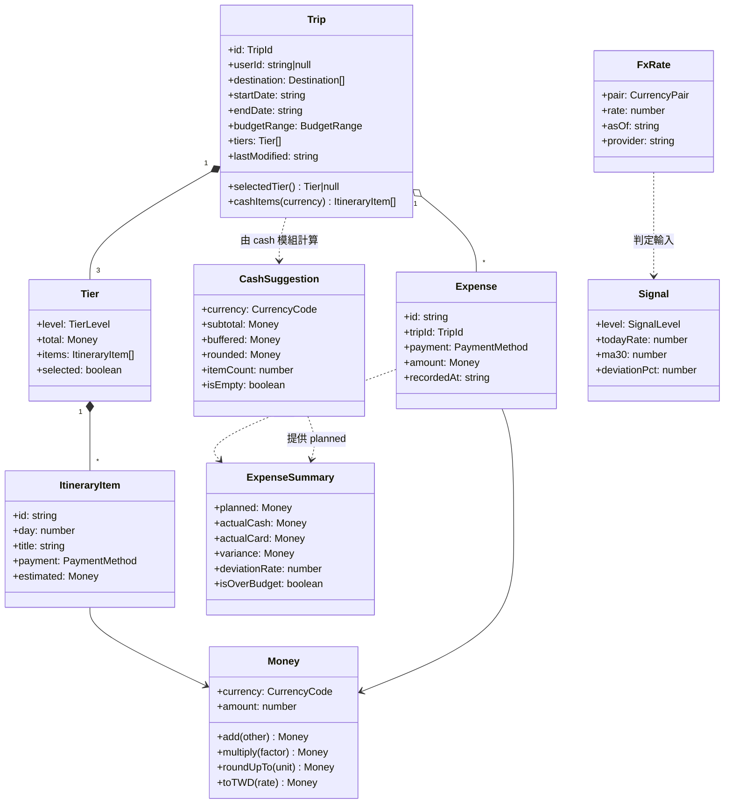

# Class Diagram · 類別圖 · SmartTrip FX 示範

> **AI 推導 · 待審定**｜依 `demo/種子簡報.md` + `PRD.md` v0.1 + `demo/03-design/08-data-model` 推導，未經課堂實跑與人工審定。
> 與 `demo/03-design/` 等 15 份手刻示範地位不同：**結構可照抄，數字與細節請自行查核**。
>
> **上游**：`data-model`、`module-design`、`frd` BR-01～04　**下游**：實作、`unit-test`

---

## 1. Executive Summary

畫 `domain` 層的型別結構。範圍限定**行程 → 現金建議 → 開支對照**這條主線，不畫 UI 與 adapter（後者見 `component-design`）。

三個設計判斷：

1. **金額用值物件 `Money`，不用 `number`**。這是本圖唯一「看起來多餘但一定要做」的決定——產品的核心是金額，`number` 會讓幣別混用在型別上完全無法防範。
2. **`Trip` 是聚合根**。所有寫入都經過它，`Storage Adapter` 只認識 `Trip`。
3. **建議換匯額是計算結果，不是儲存欄位**。存下來就會與行程不同步。

---

## 2. Class Diagram



### 列舉

```ts
type CurrencyCode  = "JPY" | "KRW" | "THB" | "USD" | "EUR" | "TWD" | string;
type PaymentMethod = "cash" | "card";              // 只有兩種（frd BR-04 / IA 分類規則）
type TierLevel     = "low" | "mid" | "high";       // UI 顯示中文（IA D3）
type SignalLevel   = "strong_buy" | "buy" | "hold";
```

---

## 3. Class Responsibilities

| 類別 | 職責 | 不變條件（invariant） | 所屬模組 |
|---|---|---|---|
| **Money** | 金額 + 幣別的值物件 | 不同幣別**不可相加**，運算即拋型別錯；`amount` 以最小單位整數儲存避免浮點誤差 | `shared` |
| **Trip** | 聚合根；一趟行程的完整狀態 | 恰有 3 個 Tier 且 total 遞增（`frd` BR-03）；`userId` MVP 恆為 `null`（`adr` 預留）；`lastModified` 每次寫入更新 | `domain/planning` |
| **Tier** | 單一級距 | `total` ≤ 該級距預算上限；至多一個 `selected` | `domain/planning` |
| **ItineraryItem** | 行程單項 | `payment` 只有兩值，**不得有第三種或空值**（否則 BR-01 的 cash 總和失去意義） | `domain/planning` |
| **CashSuggestion** | 建議換匯額的計算結果 | `rounded ≥ buffered ≥ subtotal`；`subtotal = 0` 時 `isEmpty = true`（`frd` BR-01 邊界） | `domain/cash` |
| **Expense** | 單筆開支 | `amount.currency` 須與所屬 Trip 的消費幣別一致 | `domain/expense` |
| **ExpenseSummary** | 計畫 vs 實際 | `deviationRate` **只用現金開支**對比（`frd` BR-04）；分母為 0 時回 `null` 不回 0 | `domain/expense` |
| **FxRate** | 匯率快照 | `rate` 已正規化為 1 外幣 = N 台幣（`component-design` C3） | `shared` |
| **Signal** | 燈號判定結果 | 只由 `judge()` 產生；MA30 不足時**不產生實例**（回 `null`） | `domain/signal` |

### 三個刻意的設計選擇

| 選擇 | 替代方案 | 為什麼這樣選 |
|---|---|---|
| `Money` 值物件 | `number` + 另存幣別欄位 | 多幣別行程（PRD P1 已上線 30+ 幣別）下，`number` 會讓 JPY 與 KRW 相加在編譯期毫無防護 |
| `CashSuggestion` 為計算結果不入庫 | 存進 `Trip` | 行程一改就過期；且 `okr` KR3 需要能重算歷史行程的建議值 |
| `Signal` 可以不存在（`null`） | 預設 `hold` | 預設 hold 等於憑空給建議（`frd` BR-02 降級規則） |

---

## 9. Design Risks

| # | 風險 | 影響 | 緩解 |
|---|---|---|---|
| **R1** | **`Money` 被繞過**，實作者直接用 `number` 圖方便 | 多幣別相加不會報錯，金額算錯且無人發現 | `coding-standard` 禁止 domain 出現裸 `number` 金額；review 必查 |
| **R2** | **`Trip` 聚合過大**，一趟 5 天行程 × 3 級距 × 每天 6 項 = 90 個 item | localStorage 5MB 上限（`srs`）下，20 趟行程就吃掉可觀空間 | `runbook` 02 已有清理策略；需量測單筆 Trip 的序列化大小 |
| **R3** | **`ItineraryItem.payment` 現實中存在「兩者皆可」** | 強制二選一可能與真實世界不符，導致估算偏差 | 接受：模糊值會讓 BR-01 失去意義。以「預設現金」處理，並在 `usability-test` 驗證 |
| **R4** | **`deviationRate` 樣本偏誤** | 只有記開支的人進得了分母（`north-star` C1 已知） | 型別層面無解，屬產品問題 |
| **R5** | **`userId` 預留欄位長期為 null** | 實作者可能誤刪 | 在型別註解標明來源（`adr` ADR-001 Consequences） |

---

## 12. Confidence & Sources & TODO

| 主張 | Confidence | 依據 |
|---|---|---|
| Trip 為聚合根、三級距組合 | `[H]` | PRD P0-2；`data-model` 同源 |
| `Money` 值物件 | `[M]` | 推導；canon 未提及，但多幣別已上線使此決定有實據 |
| `CashSuggestion` 不入庫 | `[M]` | 推導自 `frd` BR-01 與 KR3 重算需求 |
| 欄位名稱與型別 | `[L]` | **推導**，未與現有程式碼核對 |

**TODO / 未解**

- [ ] **未與 `data-model` 卡逐欄核對**。兩份文件描述同一組實體，若欄位命名不一致會在實作時產生兩套真相。**需做一次對齊**。
- [ ] **現有程式碼已上線**（PRD §6 多數 P0 為 ✅）。本圖為目標結構，與現況差距未盤點；引入 `Money` 可能是全面重構。
- [ ] **R2 未量測**：單筆 Trip 序列化後多大、localStorage 能放幾趟，沒有數字。這直接影響 `runbook` 02 的清理門檻。
- [ ] **多幣別 Trip 的 `CashSuggestion` 是一對多**，圖中以 `..>` 表示但未畫多重度。`frd` BR-01「分列不合併」需在型別上明確為 `CashSuggestion[]`。
