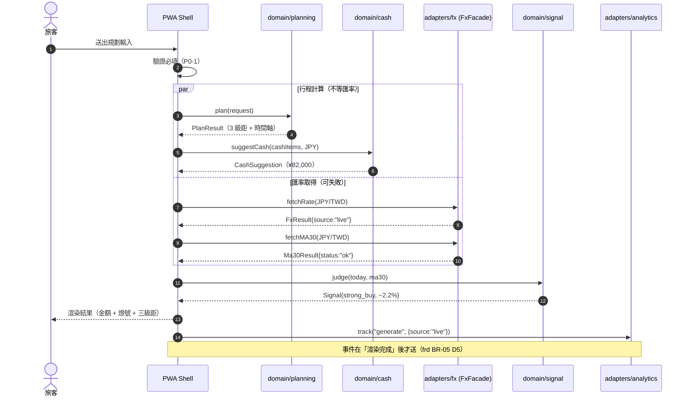
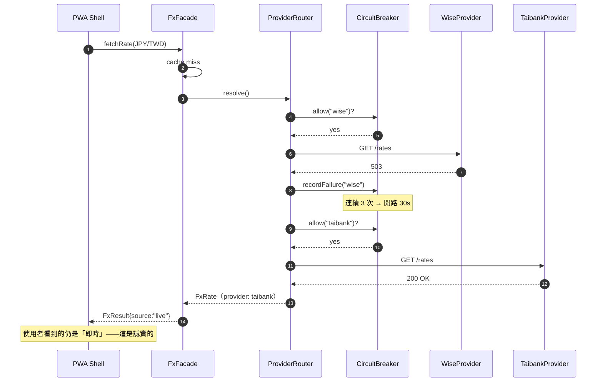
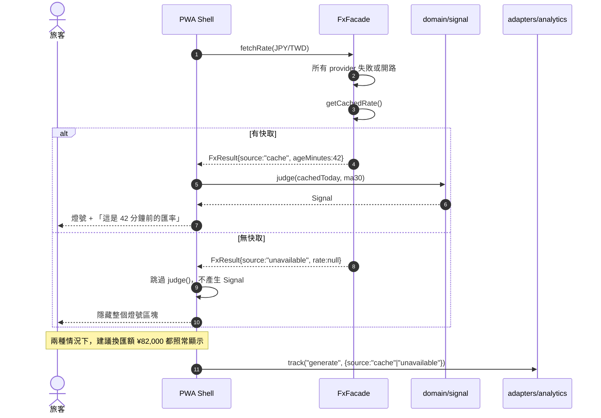
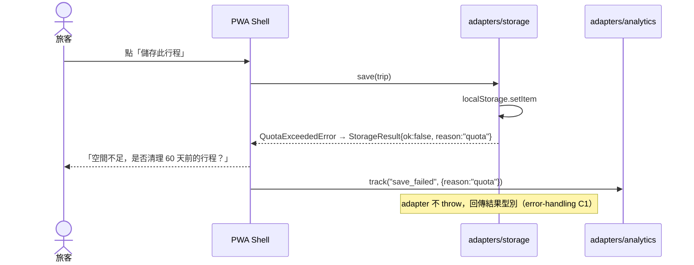

# Sequence Diagram · 時序圖 · SmartTrip FX 示範

> **AI 推導 · 待審定**｜依 `demo/種子簡報.md` + `PRD.md` v0.1 + `demo/03-design/06-c4-diagram`／`07-api-spec` 推導，未經課堂實跑與人工審定。
> 與 `demo/03-design/` 等 15 份手刻示範地位不同：**結構可照抄，數字與細節請自行查核**。
>
> **上游**：`c4-diagram`、`component-design`、`api-spec`　**下游**：`error-handling`、`integration-test`、`observability-spec`

---

## 1. Executive Summary

畫 **UC-01「生成行程與換匯建議」** 的完整時序，因為它是唯一同時碰到外部依賴、法規邏輯與 MoT-1 三分鐘承諾的流程。

一句話結論：

> **匯率失敗不能讓生成失敗。** 建議換匯額（P0-4）只依賴行程資料，燈號（P0-5）才依賴匯率——這條解耦必須在時序上看得見，不能只寫在文件裡。

---

## 2. Happy Path

### 時序上的三個約束

| # | 約束 | 為什麼 |
|---|---|---|
| **T1** | **行程計算與匯率取得並行**，不串行 | 串行會把 FX 的延遲直接加到 MoT-1 的三分鐘預算上 |
| **T2** | **`judge()` 由 Shell 編排**，signal 不自己去拿匯率 | `module-design` 依賴矩陣 M3 → M5 為 ✘ |
| **T3** | **`track("generate")` 在渲染後** | 綁按鈕會讓 KR1 虛高（`frd` BR-05 D5） |

---

## 3. Failure Path

### F1 · 主供應商失效 → 自動切換（使用者無感）

### F2 · 全供應商失效 → 降級到快取（使用者必須知道）

> **最後那個 Note 是整份文件的重點**。P0-4 與 P0-5 的解耦在這裡兌現：**匯率全掛，核心價值仍然交付**。
> 這條路徑同時餵養 `north-star` C3（模擬／快取曝光率）——沒有這個事件，反指標查不到。

### F3 · 儲存失敗（localStorage 容量滿）

---

## 6. Idempotency & Timeout（核心）

### 逾時預算

| 呼叫 | 逾時 | 重試 | 失敗後 | 依據 |
|---|---|---|---|---|
| `fetchRate` 單一 provider | **3s** | 不重試同一家，直接換下一家 | 下一個 provider | `runbook` 05 Mitigation A 提到 3s timeout |
| `fetchMA30` | **5s** | 同上 | `status: insufficient` | 歷史資料量較大 |
| 整體 FX 預算 | **8s** | — | 走 F2 降級 | 三分鐘承諾下，FX 不該吃超過 8 秒 |
| `analytics.track` | **2s** | 不重試 | **靜默丟棄** | `srs` D3：不得影響主流程 |
| `storage.save` | 同步 | 不重試 | 回傳結果型別 | 見 F3 |

### 冪等性

| 操作 | 冪等？ | 處理方式 |
|---|---|---|
| `plan(request)` | **是**（純函數） | 同輸入同輸出；可安全重算 |
| `suggestCash()` | **是**（純函數） | 同上；`okr` KR3 需要重算歷史行程 |
| `fetchRate` | **是**（讀取） | 快取命中即不再打外部 |
| `save(trip)` | **是**（以 `trip.id` 為鍵覆寫） | 重複點擊不會產生兩筆 |
| `track(event)` | **否** | 重複送會虛增計數 → **UI 需防連點**，且 `generate` 綁渲染完成（T3） |
| `add_expense` | **否** | 每筆開支有獨立 id，由 UI 防連點 |

> **`track` 的非冪等是最容易被忽略的風險**：使用者連點兩下生成，KR1 分子多一，啟用率虛高。
> 防線在 UI（送出中禁用按鈕）而非 adapter——這需要寫進 `acceptance-criteria`。

---

## 12. Confidence & Sources & TODO

| 主張 | Confidence | 依據 |
|---|---|---|
| 主流程參與者與順序 | `[H]` | `c4-diagram` 通訊協定表 + `module-design` |
| P0-4／P0-5 解耦 | `[H]` | `srs` D4、`persona` Anti-Persona、`frd` BR-02 |
| provider 切換時序 | `[M]` | 推導自 `component-design` 與 `runbook` 01 |
| 逾時數值（3s／5s／8s） | `[L]` | **推導**；僅 3s 有 `runbook` 依據，其餘為佔位 |

**TODO / 未解**

- [ ] **逾時數值未經量測**。8 秒的 FX 總預算是憑感覺切的，應由 `non-functional-reqs` 的 p95 目標反推。
- [ ] **並行（T1）在既有實作中是否成立未查證**。若現況是串行，這是一次真實的重構而不只是文件。
- [ ] **F2 的「無快取」分支在首次進站必然發生**（in-memory 快取，重整即空——`component-design` R4）。也就是說**每個新使用者的第一次生成都可能看不到燈號**，這個機率未評估，但直接打擊 G3 差異化認知。
- [ ] **多幣別行程的時序未畫**：需對每個幣別各打一次 FX，並行度與總逾時預算需重算。
