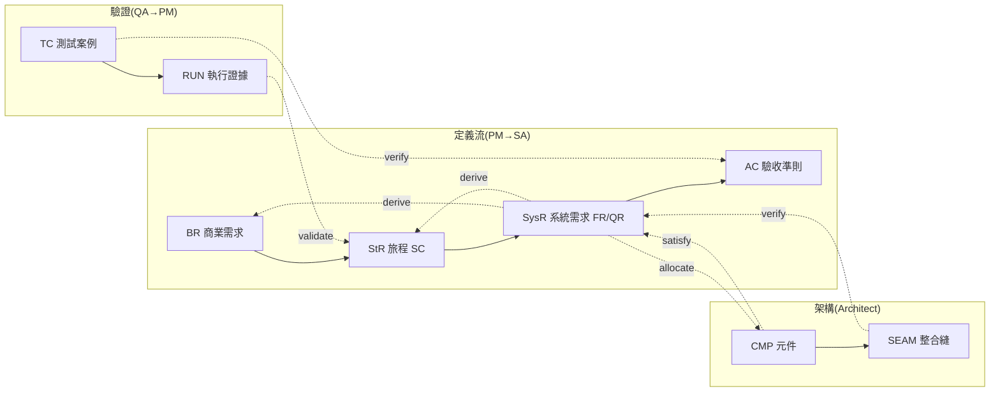

# 術語正典(Terminology Canon)

> 五本殼的欄名、枚舉、狀態機的唯一來源。錨定四個國際標準:
> ISO/IEC/IEEE 29148(需求工程)、ISO/IEC 25010(品質模型)、ISTQB(測試詞彙)、SysML/OMG(追溯動詞)。
> 改任何欄名前,先改這裡;這裡改不動的,欄名就不准動。

## 實體

| 代號 | 中文 | 國際錨點 | 定義 | 住在哪本 |
|---|---|---|---|---|
| BR | 商業需求(K/C) | 29148 BRS | 對客戶承諾的可量測商業結果,含合約紅線 | 01 |
| StR | 利害關係人旅程(SC) | 29148 StRS / OpsCon | 某 persona 一次完整達標的操作情境 | 01 |
| SysR | 系統需求(FR/QR) | 29148 SyRS + 25010 | 系統必須表現的行為(FR)或品質門檻(QR) | 02 |
| AC | 驗收準則 | ISTQB acceptance criteria | SysR 的可判定條件,GWT 格式;QR 必附指標+目標值 | 02 |
| CMP | 元件 | SAD 錨定 | 有邊界宣告(含「不負責什麼」)的實作單元 | 03 |
| SEAM | 整合縫 | ISTQB integration testing | 兩元件間被承諾的互動,由 SIT 關卡驗 | 03 |
| TC | 測試案例 | ISTQB test case | 前置+輸入+步驟+預期結果;必帶 kind | 04 |
| kind | 覆蓋項類別 | ISTQB coverage item | happy / boundary / failure / recovery | 01⑤ 宣告、04 命中 |
| RUN | 執行證據 | ISTQB test run | 一輪 verification / validation 的 append-only 紀錄 | 工具(Plane),殼只鏡射 |

## 追溯動詞(只有五個,SysML)

| 動詞 | 方向 | 意思 | 邊表位置 |
|---|---|---|---|
| derive | SysR → BR / StR | 系統需求從商業需求或旅程推導而來 | 01④、01⑤ |
| satisfy | CMP → SysR | 元件滿足需求 | 03③ |
| allocate | SysR → CMP | 需求分配給元件實作 | 03③ |
| verify | TC → AC;SIT → SysR | 證明系統做對了(verification) | 04③、03④ |
| validate | RUN → StR | 證明做的是對的系統(validation),只有人簽 | 01③ |

## 狀態機(29148 baseline 語意)

`draft → reviewed → baselined → superseded`

- **baselined = 舊詞「定版」**。之後變更走 change control,不准直接改。
- 狀態欄 single-writer:BR/StR 歸 PM,SysR/AC 歸 SA,CMP/SEAM 歸架構師,TC 歸 QA。
- 任何衍生欄([R/O])上游未 baselined 一律視為 ◐ 草案——草案會傳染。

## V&V 兩個字不准互換

- **Verification(驗證)**:系統做對了嗎?TC verify AC、SIT verify SysR。QA 推。
- **Validation(確認)**:做的是對的系統嗎?UAT 走 StR 旅程,PM 簽。
- TC 全綠 ≠ 走查通過 ≠ 驗收簽核,三者分屬不同軸。

## 三層覆蓋率(嚴謹定義)

| 層 | 分母 | 分子 |
|---|---|---|
| BR 覆蓋 | baselined BR 總數 | 有 ≥1 條 derive 邊連到 baselined SysR 者 |
| SysR 覆蓋 | baselined SysR 總數 | 其 AC 被「機檢過 AND QA 簽核」TC verify 者 |
| kind 覆蓋 | 01⑤ 宣告的 (SC, SysR, kind) 列數 | 被合格 TC 命中的列數 |

草案不計票:分母只算 baselined,分子只算雙欄閘門全過的物件。

## 關聯圖(9 節點、單向流、5 個動詞)

實線 = 產出順序;虛線 = 追溯邊。想加第 10 個框,先回答:它持有什麼不可推導的狀態?答不出來就是分組,不是實體。

## 五本殼與角色

| 檔案 | Owner | 唯一可寫 |
|---|---|---|
| 01_價值承諾書.xlsx | PM | BR/StR 狀態、Validation 簽核 |
| 02_需求定版書.xlsx | SA | SysR 狀態(全系統唯一權威)、AC 簽核 |
| 03_架構整合書.xlsx | 架構師 | CMP/SEAM 狀態、allocate/satisfy 邊、QR 驗證形態 |
| 04_測試設計書.xlsx | QA | TC 簽核 |
| 05_統控儀表.xlsx | 經營層/PM | 只有缺口裁決(Owner+期限必填);其餘全推導 |

## 與舊四書的 mapping

| 舊 | 新 | 搬遷備註 |
|---|---|---|
| 業務邏輯驗收控制表 | 01 | SC×需求邊 → 01⑤(kind 拆成一列一個);BDD 生成表退役,GWT 收進 02③ |
| 需求定版書 | 02 | 「收斂狀態」改 `SysR 狀態`;NFR 改 QR 並補 25010 特性;「營運目標/合約下限」剝離成 01 的 BR |
| 模組功能 BOM | 03 | 元件字典/SAD 錨點留下;「需求狀態」欄刪除(02 才是權威);Task 切片出殼進 Plane |
| 測試設計書 | 04 | 「路徑類型」改 `kind`;TC↔AC 分號串拆成 04③ 邊表;SIT 台帳搬 03④ |
| 規格統控規劃書 | 05 | 商業承諾表升格為 01②;缺口表保留但 Owner/期限改必填 |
