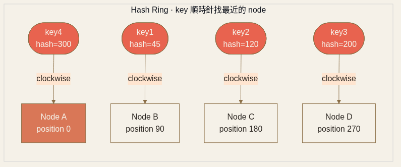
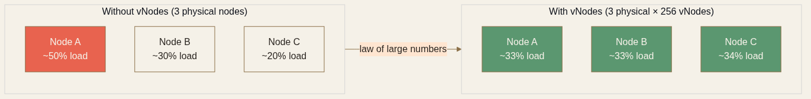

<!-- _class: chapter -->

<div class="ch-no">CHAPTER · 03 · TOPIC 01</div>

# Consistent Hashing
## *讓「加減一台」不再等於「全部重洗」*


---


## CONSISTENT HASHING · WHY

# 為何 modulo N 不夠用？

<br>

**普通 hash sharding**：`shard = hash(key) % N`

加減一台機器（N 改變） → **幾乎所有 key 重新映射** → 大規模搬資料 + cache 失效。

<br>

<div class="alert">

**具體有多痛**：N=3 → N=4，9 個 key 中 **7 個會被搬移**（只有 2 個留在原位）。
10 台變 11 台時，**90% 的資料要搬**。這不只是寫資料慢，更是 cache 全部失效後 DB 被打爆。

</div>

> Source: 基本觀念/06 Consistent Hashing.pdf · §1 Why


---


## CONSISTENT HASHING · HOW

# Hash Ring 的概念

```
                 ┌─────────────────────┐
                 │       0 / 2³²       │
              key1 ●──────┐  ● node A   │
                 │        ↓             │
            node D ●      → key1 → A   │
                 │                      │
                 │        ● key2        │
                 │        ↓             │
                 │      → key2 → B     │
            node C ●                    │
                 │       ● node B       │
                 └─────────────────────┘
```

<div class="highlight">

**Hash Ring**：把 key 與 node 都 hash 到同一環上，**key 順時針找到的第一個 node 就是它的歸屬**。
加減 node 時，**只有相鄰 node 的資料受影響**——平均搬動 1/N。

</div>



> Source: 基本觀念/06 Consistent Hashing.pdf · §2 Algorithm

---


## CONSISTENT HASHING · 加減節點

# 只有「鄰居」會痛

<div class="tradeoff">
  <div class="pro">
    <h3>新節點 E 加入</h3>
    <ul>
      <li>E 落在 D 與 A 之間（位置 150）</li>
      <li>只有 0–150 區間的 key 從 A 搬到 E</li>
      <li>其他 key 完全不動</li>
      <li><em>影響範圍：1/N</em></li>
    </ul>
  </div>
  <div class="con">
    <h3>節點 A 下線</h3>
    <ul>
      <li>原本屬於 A 的 key 順時針交給 B</li>
      <li>但 B 突然要扛兩倍負載</li>
      <li>沒有 vNode 時，分布越不均</li>
      <li><em>這就是 vNode 解的下一個問題</em></li>
    </ul>
  </div>
</div>

> Source: 基本觀念/06 Consistent Hashing.pdf · §2 (b)(c) Add/Remove


---


## CONSISTENT HASHING · 虛擬節點

# Virtual Nodes 解決分布不均

<div class="tradeoff">
  <div class="pro">
    <h3>沒虛擬節點</h3>
    <ul>
      <li>3 個 node 在環上隨機落點</li>
      <li>分布可能 30% / 50% / 20%</li>
      <li>節點少 → hash 環位置容易集中</li>
    </ul>
  </div>
  <div class="con">
    <h3>有虛擬節點</h3>
    <ul>
      <li>每個物理 node 對應 100-200 個虛擬點</li>
      <li>大數法則 → 分布趨於均勻</li>
      <li><strong>Cassandra 預設 256 vnode</strong></li>
    </ul>
  </div>
</div>

<div class="highlight">

**虛擬節點還解第二件事**：**異質硬體分配**——強的機器配 200 個 vNode，弱的機器配 50 個，自然按硬體能力分流量。

</div>



> Source: 基本觀念/06 Consistent Hashing.pdf · §3 Virtual Nodes

---


## CONSISTENT HASHING · 應用

# 哪些系統在用？

| 系統 | 用途 |
|------|------|
| **Memcached client（Ketama）** | 多台 cache server 路由 |
| **Cassandra** | 資料分片（Murmur3 hash + vnode） |
| **DynamoDB** | Partition key 路由 |
| **CDN（Akamai）** | Edge node 選擇 |
| **API Gateway / Sticky Session** | 同 user 永遠路由到同一節點 |
| **Rate Limiting / Metrics** | 同維度 key 聚合到固定節點 |

<span class="muted">**口訣**：「節點會變動 + 想要穩定歸屬 + 希望最少搬家」→ 用 consistent hashing。</span>

> Source: 基本觀念/06 Consistent Hashing.pdf · §4 Applications


---


<!-- _class: end -->

# Consistent Hashing 完
## *路由解決了，下一步——資料怎麼切？*

<br>

<span class="lead">→ Topic 02 Sharding</span>
