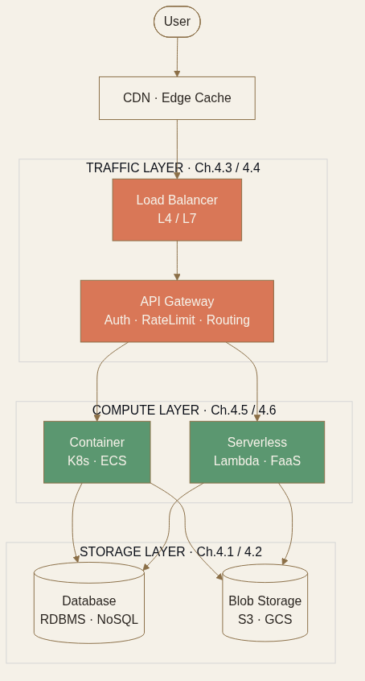

<!-- _class: chapter -->

<div class="ch-no">CHAPTER · 04 · TOPIC 00</div>

# Infrastructure
## *支撐分散式系統的六大物件 · 每個都決定一道架構分水嶺*

<!--
開場 30 秒：
- Ch.3 教會「資料怎麼散」，Ch.4 教「散到什麼之上」
- 6 個基礎設施物件：DB、Blob、API Gateway、Load Balancer、Container、Serverless
- 講者語氣：選型導向，每個物件都附「什麼時候用、什麼時候別用」
-->


---


## OBJECTIVES · 學習目標

看完本章，你能回答：

<div class="stack">
  <div class="layer client"><strong>① 6 種資料庫選型怎麼選？</strong>　 RDBMS / NoSQL / NewSQL / Search / Graph / TimeSeries</div>
  <div class="layer app"><strong>② Blob Storage 為何這麼便宜？</strong>　 物件儲存的設計原理</div>
  <div class="layer data"><strong>③ API Gateway 與 LB 差在哪？</strong>　 L4 vs L7 / 內外職責</div>
  <div class="layer infra"><strong>④ Container vs Serverless 怎麼選？</strong>　 啟動成本 vs 控制力</div>
</div>

> Source: 常用技術/01 + 02 + 03 + 04 + 05 + 06


---


## MENTAL MODEL · 基礎設施的 3 個維度

```
┌──────────────────────────────────────────────────┐
│  COMPUTE      Container · Serverless · VM        │  ← Ch.4.5/6
├──────────────────────────────────────────────────┤
│  TRAFFIC      Load Balancer · API Gateway        │  ← Ch.4.3/4
├──────────────────────────────────────────────────┤
│  STORAGE      Database · Blob Storage            │  ← Ch.4.1/2
└──────────────────────────────────────────────────┘
        每一層都有「self-host vs 雲服務」的取捨
```

<span class="muted">**選型不是「哪個最強」，而是「哪個跟你的限制最相容」**——團隊規模、預算、SLA、合規。</span>



> Source: 整理自 常用技術/01-06

---


## MENTAL MODEL · 三個共用的選型問題

每個基礎設施元件，問同樣 3 個問題就能 80% 收斂：

<div class="stack">
  <div class="layer client"><strong>① 工作負載長什麼樣？</strong>　 流量穩定還是峰谷？讀多還是寫多？同步還是事件驅動？</div>
  <div class="layer app"><strong>② 容忍什麼程度的延遲與不可用？</strong>　 P99 &lt; 50ms vs &lt; 1s · 4 個 9 vs 3 個 9</div>
  <div class="layer data"><strong>③ 團隊有沒有人能維運？</strong>　 沒人會的東西，再強也是地雷——選託管服務</div>
</div>

<br>

<div class="highlight">

**Linus 式判斷**：90% 的「該選哪個」，靠這 3 題就能判出來。剩下 10% 才需要 benchmark。

</div>

> Source: 整理自 常用技術/01-06


---


<!-- _class: end -->

# Overview 完
## *先看資料層——Database 的 6 種模型怎麼選。*

<br>

<span class="lead">→ Topic 01 Database</span>
