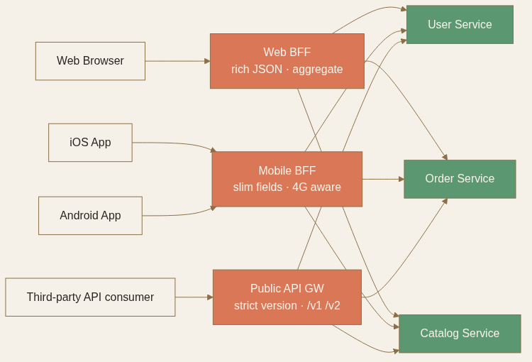

<!-- _class: chapter -->

<div class="ch-no">CHAPTER · 04 · TOPIC 03</div>

# API Gateway
## *微服務的前門——把橫切關注點集中，讓業務碼乾淨*


---


## API GATEWAY · WHY

<span class="kicker">SECTION 3 · API GATEWAY</span>

# 為何要在 LB 前面再放一層？

<br>

<div class="highlight">

**Load Balancer = 流量分發**（L4/L7）。  
**API Gateway = 應用層的瑞士刀**——認證、限流、路由、版本、熔斷、聚合。

</div>

<br>

- 把這些「橫切關注點」從業務服務抽出，**業務碼乾淨**
- 對外提供一致 API，內部可自由演化（v1 → v2、Microservice 拆分）

> Source: 常用技術/03 API Gateway.pdf · §什麼是 API Gateway


---


## API GATEWAY · HOW

# Gateway 該扛的 7 件事

<div class="matrix-2x2">
  <div class="featured">
    <strong>Authn / Authz</strong>
    JWT 驗證 · OAuth · API Key
  </div>
  <div>
    <strong>Rate Limiting</strong>
    Token bucket / Leaky bucket
  </div>
  <div>
    <strong>Routing</strong>
    路徑 / Header / Geo 路由
  </div>
  <div>
    <strong>Aggregation</strong>
    BFF · 1 個請求合併多後端
  </div>
  <div>
    <strong>Caching</strong>
    熱 GET 快取（5-60 秒）
  </div>
  <div>
    <strong>Circuit Breaker</strong>
    後端壞時快速失敗
  </div>
  <div>
    <strong>Logging / Tracing</strong>
    統一 trace ID 注入
  </div>
  <div>
    <strong>Transformation</strong>
    協定轉換（gRPC ↔ REST）
  </div>
</div>

> Source: 常用技術/03 API Gateway.pdf · §API Gateway 的核心職責


---


## API GATEWAY · 認證職責切分

# Gateway 認證 vs 服務授權

```
Client                  API Gateway              後端服務
  |--- GET /orders --->|                          |
  |    Bearer <JWT>    |--- 驗證 JWT 簽名          |
  |                    |--- 解析 user_id: 123     |
  |                    |--- GET /orders --------->|
  |                    |    X-User-Id: 123        |
  |                    |    X-User-Roles: admin   |
  |<-- 200 OK ---------|<-- 200 OK ---------------|
```

<div class="def">
<span class="term">Gateway 做認證 (Authn)</span>
驗 JWT 簽名與有效期——**「這個 token 是真的、沒過期」**。技術層驗證，業務無關。
</div>

<div class="def">
<span class="term">服務做授權 (Authz)</span>
**「這個用戶能不能看這筆訂單？」**——細粒度授權需要資料庫查詢，留在服務裡。
</div>

> Source: 常用技術/03 API Gateway.pdf · §怎麼做認證：在 Gateway 還是在服務裡


---


## API GATEWAY · 主流產品對比

# 4 個典型 Gateway 怎麼選

| 產品 | 性質 | 適合 | 痛點 |
|------|------|------|------|
| **AWS API Gateway** | 全託管 Serverless | Lambda 整合、不想管基礎設施 | 進階路由受限、高流量貴 |
| **Kong** | 開源（基於 Nginx） | 高度客製化、有 Nginx 經驗 | 自己維運、plugin 生態學習曲線 |
| **Envoy / Istio** | 服務網格核心 | K8s 環境、東西向流量 | 配置複雜、運維重 |
| **Nginx / Traefik** | 輕量 reverse proxy | 簡單路由 + SSL 終止 | 進階功能（限流、認證）需擴充 |

<br>

<span class="muted">**典型分工**：外部入口用 Kong / AWS API GW；內部 service-to-service 用 Envoy + Service Mesh。兩者職責不同，常常並存。</span>

> Source: 常用技術/03 API Gateway.pdf · §常見的 API Gateway 實作


---


## API GATEWAY · TRADE-OFF

# Gateway 不是免費

<div class="tradeoff">
  <div class="pro">
    <h3>Gateway 帶來</h3>
    <ul>
      <li>橫切關注點集中管理</li>
      <li>後端可任意演化</li>
      <li>對外一致 API surface</li>
    </ul>
  </div>
  <div class="con">
    <h3>Gateway 的代價</h3>
    <ul>
      <li>多一跳延遲（~ 1-5 ms）</li>
      <li>單點故障（必須多實例 + LB）</li>
      <li>config 過度膨脹（YAML 地獄）</li>
      <li>業務邏輯誤滑入 Gateway 層</li>
    </ul>
  </div>
</div>

<div class="alert">

**反模式**：把太多業務邏輯塞進 Gateway，它變成「第二個 monolith」——難測試、難維護。Gateway 應該是**薄薄的、可預期的轉發層**。

</div>

> Source: 常用技術/03 API Gateway.pdf · §總結 + §API Gateway 的效能怎麼保證


---


## API GATEWAY · BFF 模式

# 不同客戶端維護各自的 Gateway

```
Web Browser    → Web BFF       ──┐
iOS App        → Mobile BFF    ──┼──→ 後端微服務
Android App    → Mobile BFF    ──┤
Third-party    → Public API GW ──┘
```

<div class="stack">
  <div class="layer client"><strong>Web BFF</strong>　 大量資料聚合、回傳豐富 JSON（頻寬充足）</div>
  <div class="layer app"><strong>Mobile BFF</strong>　 精簡欄位、減少流量（4G 環境）</div>
  <div class="layer data"><strong>Public API GW</strong>　 嚴格版本化（/v1/、/v2/）、向後兼容</div>
</div>

<br>

<span class="muted">**代價**：你現在有多個 Gateway 要維護。**只有當客戶端差異夠大時 BFF 才划算**——小團隊用一個統一 Gateway 就好。</span>



> Source: 常用技術/03 API Gateway.pdf · §BFF（Backend for Frontend）模式

---


<!-- _class: end -->

# API Gateway 完
## *入口的職責清楚了——往下看流量怎麼分配到實例。*

<br>

<span class="lead">→ Topic 04 Load Balancer</span>
