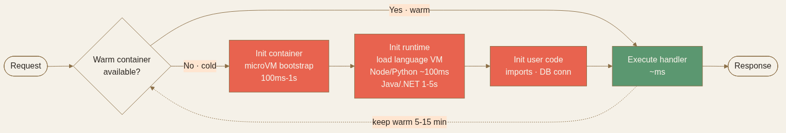

<!-- _class: chapter -->

<div class="ch-no">CHAPTER · 04 · TOPIC 06</div>

# Serverless
## *Serverless 不是「沒有伺服器」，是「你不需要管」*


---


## SERVERLESS · WHY

<span class="kicker">SECTION 6 · SERVERLESS</span>

# 為何 FaaS 是某些場景的最優解？

<br>

<div class="highlight">

**Serverless 的本質**：你寫一個 function，雲端負責**啟動 / 擴展 / 計費 / 修補**。  
不用想機器、不用想 OS、按執行毫秒數收費。

</div>

<br>

- **完美場景**：流量極不規律（每天幾次） · 偶發異步任務 · 邊緣計算
- **不適合**：穩定高負載（成本反而貴 5-10×）· 長時任務 · 需要 long-lived connection

> Source: 常用技術/06 Serverless.pdf · §什麼是 Serverless


---


## SERVERLESS · HOW

# Cold Start 的數字長什麼樣

```
請求 → Lambda
        │
        ├─ Init container（首次：幾百 ms - 幾秒）
        ├─ Init runtime（語言相關：Node/Python ~ 100ms · Java/.NET 可達數秒）
        └─ Execute function（warm：< 50ms · 無額外延遲）
```

<br>

| 語言 | Cold Start 典型範圍 |
|------|---------------------|
| **Python / Node.js** | 100-500 ms |
| **Go / Rust（編譯）** | 100-300 ms |
| **Java / .NET（JVM/CLR）** | 1-5 秒 |
| **Container Image Lambda** | 比 zip 慢，但能裝大依賴（ML model） |

<span class="muted">**Warm 期**：函式執行完不會立刻銷毀，保溫 5-15 分鐘。下次請求進來直接 warm start，無額外延遲。</span>



> Source: 常用技術/06 Serverless.pdf · §Cold Start 與 Warm Start

---


## SERVERLESS · 三層降溫

# Cold Start 的緩解手段

<div class="stack">
  <div class="layer client"><strong>① Provisioned Concurrency</strong>　 預熱 N 個實例 · cold start 降到 0 · 但要付閒置費</div>
  <div class="layer app"><strong>② Init 程式碼移出 handler</strong>　 DB 連線、設定載入放在 handler 外面，warm 時不重執行</div>
  <div class="layer data"><strong>③ SnapStart（AWS Java）</strong>　 JVM 啟動快照 · 降 10× cold start</div>
  <div class="layer infra"><strong>④ Warm-up 排程</strong>　 EventBridge 定期 ping 函式保熱（土法但有效）</div>
</div>

<br>

<div class="alert">

**重要區分**：**非同步場景**（SQS 觸發、排程）—— Cold Start 多幾百毫秒**完全無所謂**。只有**同步 API 請求**（P99 SLA < 100ms）才需要認真考慮。

</div>

> Source: 常用技術/06 Serverless.pdf · §Cold Start 怎麼辦


---


## SERVERLESS · 適合 / 不適合

# 場景判準

<div class="tradeoff">
  <div class="pro">
    <h3>選 Serverless</h3>
    <ul>
      <li>事件驅動（S3 上傳、SNS、API GW）</li>
      <li>流量峰谷明顯（白天百人晚上零）</li>
      <li>排程任務（cron / EventBridge）</li>
      <li>邊緣計算（Lambda@Edge、CF Workers）</li>
      <li>< 15 分鐘短任務</li>
    </ul>
  </div>
  <div class="con">
    <h3>不要選 Serverless</h3>
    <ul>
      <li>持續高 QPS（容器成本 1/3-1/10）</li>
      <li>長任務（&gt; 15 分鐘 Lambda 上限）</li>
      <li>P99 &lt; 100ms 嚴格 SLA</li>
      <li>WebSocket / 長連線 / streaming</li>
      <li>需要本地快取 / 連線池</li>
    </ul>
  </div>
</div>

<span class="muted">**Hybrid 是常態**：核心服務跑 Container，事件處理跑 Lambda。一個系統不用 all-in 或 all-out。</span>

> Source: 常用技術/06 Serverless.pdf · §Serverless 適合什麼 + §Serverless 不適合什麼


---


## SERVERLESS · 連線打爆陷阱

# Lambda + RDS 的經典痛點

```
傳統服務：1 process → DB 連線池（50 條）→ DB
Lambda：1000 並發實例 → 各自開連線 → DB 直接被打掛
```

<div class="def">
<span class="term">RDS Proxy / PgBouncer</span>
連線池代理 · Lambda 連到代理 · 代理用少量長連線餵 DB<br>
**結構**：Lambda × 1000 → RDS Proxy → RDS（50 連線）
</div>

<div class="def">
<span class="term">DynamoDB</span>
天然 Serverless 資料庫 · 沒有連線概念 · 按請求計費<br>
**Lambda + DynamoDB** 是最自然的全 Serverless 組合
</div>

<br>

<div class="alert">

**反模式**：把 PostgreSQL/MySQL 直接接 Lambda——並發一上來連線池立刻爆。**必須**配 RDS Proxy 或選 DynamoDB。

</div>

> Source: 常用技術/06 Serverless.pdf · §處理資料庫連線


---


## SERVERLESS · 成本估算

# 怎麼判斷 Serverless 划不划算

```
範例：每天 100 萬請求 · 平均 200ms · 512MB 記憶體

每月請求費用：30 × 1M × $0.2/1M       = $6
每月執行費用：30 × 1M × 0.2s × 0.5GB
              × $0.000016/GB-s         = $48
合計：約 $54/月

對比 EC2 t3.small（2GB / 2 vCPU）：~$15/月（不限請求量）
```

<br>

<div class="highlight">

**判斷口訣**：流量穩定 + 請求量大 → 容器更便宜。  
流量峰谷大（一天閒置 12+ 小時）→ Serverless 實際費用可能是估算的一半甚至更少。

</div>

> Source: 常用技術/06 Serverless.pdf · §Serverless 的成本怎麼估算


---


## SERVERLESS · TRADE-OFF

# Lambda vs Container 選型

<div class="tradeoff">
  <div class="pro">
    <h3>選 Lambda</h3>
    <ul>
      <li>事件驅動（S3 上傳、SNS、API GW）</li>
      <li>流量不規律（QPS 0-1000 跳動）</li>
      <li>< 15 分鐘短任務</li>
      <li>不想管 server / OS / scaling</li>
    </ul>
  </div>
  <div class="con">
    <h3>選 Container（K8s / ECS）</h3>
    <ul>
      <li>穩定高 QPS（成本 1/3-1/10）</li>
      <li>長任務 / WebSocket / streaming</li>
      <li>需要本地檔案系統</li>
      <li>需要 deterministic 啟動</li>
    </ul>
  </div>
</div>

<span class="muted">**Vendor lock-in 取捨**：Lambda 用了 SQS / DynamoDB / EventBridge 後，搬遷成本高。面試時主動承認這個取捨——「換不需要管基礎設施」。</span>

> Source: 常用技術/06 Serverless.pdf · §Serverless 與其他部署方式的比較 + §Serverless 有 vendor lock-in 的問題嗎


---


<!-- _class: end -->

# Serverless 完
## *6 個基礎設施都看過了——把它們串成一個真實系統。*

<br>

<span class="lead">→ Topic 99 CASE STUDY + RECAP</span>
