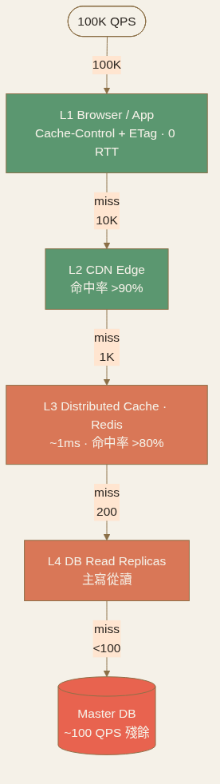

<!-- _class: chapter -->

CHAPTER · 06 · TOPIC 01

# Scaling Reads
## *讀流量的 4 層階梯，撐起 90% 系統*

---

## SCALE READS · WHY + HOW（4 層命中階梯）

100:1

**Web 常態**：每 1 寫背後 100 讀（Twitter timeline / E-commerce / News）。讀路徑撐住，整體系統就活著。

  
<strong>L1 · Browser / App</strong>　 Cache-Control + ETag · 0 RTT

  
<strong>L2 · CDN Edge</strong>　 靜態資源就近 · 命中率 >90%

  
<strong>L3 · Distributed Cache</strong>　 Redis · 1ms · 命中率 >80%

  
<strong>L4 · DB Read Replicas</strong>　 主寫從讀

**4 層命中率複合**：99.9% 請求都打到 L3 以前。**這就是 Twitter 撐 100K QPS 的原理**。

> Source: 設計模式/01 Scaling Reads.pdf · §1 + §3 Layers

---

## SCALE READS · 三個進階模式

# Materialized View · CQRS Read · Edge Compute

① Materialized View
把昂貴 join / aggregation **預先算好存表**。 
**例**：商品平均評分用 <code>CREATE MATERIALIZED VIEW product_ratings</code>，背景定期 refresh，比每次頁面載入都跑 GROUP BY 快 100×。

② CQRS Read Model
讀寫用不同資料模型——**讀模型可以是反正規化的**，為查詢優化。 
**例**：訂單的「總覽列表」用 Elasticsearch · 「詳情」用 PostgreSQL。

③ Edge Compute
把計算搬到 CDN edge（CloudFlare Workers · Lambda@Edge）。 
**例**：A/B 測試、個人化推薦、Auth 驗證 都在邊緣節點完成。

> Source: 設計模式/01 Scaling Reads.pdf · §5 Advanced

---

## SCALE READS · Cache 三大反模式

① Cache Stampede
TTL 到期那一秒 100K 請求同時 miss、同時打 DB = 自我 DDoS。 
**解**：TTL + jitter（基礎）· probabilistic early refresh（熱門 entry）· 背景主動刷新（最熱）。

② Invalidation Race（Cache Versioning 解）
寫入後刪 cache 有 race。**改成 cache key 帶版本號** <code>event:123:v43</code>——不刪 cache 而是繞過它。CDN / browser 也自動轉新 URL。

③ Hot Key（爆紅推文）
傳統 cache 假設 key 分散，**爆紅打破這假設**。 
**解**：request coalescing（並發只發 1 個回源）+ key fanout（<code>feed:taylor:1/2/...</code> 隨機讀）。

> Source: 設計模式/01 Scaling Reads.pdf · §6-7 Deep Dive

---

## SCALE READS · TRADE-OFF

# 讀擴展的成本

  

    <h3>讀擴展紅利</h3>
    <ul>
      <li>讀 QPS 隨 cache + replica 線性擴展</li>
      <li>單一 DB 主節點壓力降到 1/100</li>
      <li>P99 latency 大幅下降</li>
    </ul>
  

  

    <h3>讀擴展代價</h3>
    <ul>
      <li>多層 cache 增加 staleness window</li>
      <li>cache invalidation 複雜度上升</li>
      <li>Replication lag 帶來 read-your-own-write 問題</li>
      <li>Materialized view refresh 排程要顧</li>
    </ul>
  

**口訣**：讀路徑越多層越快，**但 cache 越多層 debug 越難**——層數要與 SRE 能力匹配。

> Source: 設計模式/01 Scaling Reads.pdf · §8
