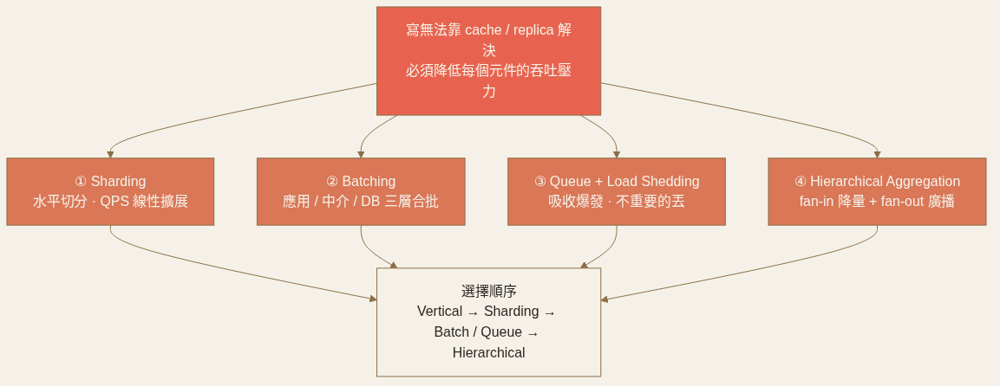
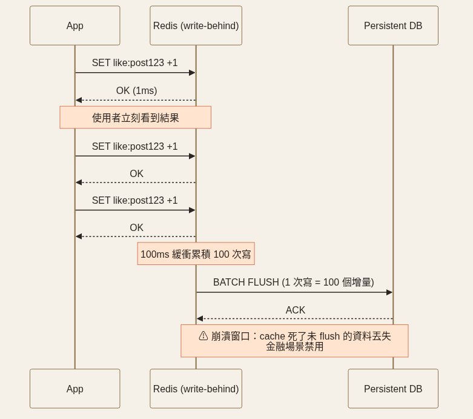

<!-- _class: chapter -->

<div class="ch-no">CHAPTER · 06 · TOPIC 02</div>

# Scaling Writes
## *Sharding、批量、佇列、階層聚合——讓每個元件只扛得住的負載*


---


## SCALE WRITES · WHY + 4 個策略

<div class="highlight">

**寫無法靠 cache 解決**（cache 給讀），**也無法靠 replica 解決**（replica 是讀副本，寫還是得回 leader）。

</div>

<div class="matrix-2x2">
  <div class="featured">
    <strong>Sharding</strong>
    水平切分 · QPS 線性擴展
  </div>
  <div>
    <strong>Queue + Load Shedding</strong>
    爆發吸收 · 不重要的寫直接丟
  </div>
  <div>
    <strong>Batching</strong>
    應用 / 中介 / DB 三層合批
  </div>
  <div>
    <strong>Hierarchical Aggregation</strong>
    fan-in 降量 + fan-out 廣播
  </div>
</div>

<span class="muted">**選擇順序**：Vertical 壓榨 → Sharding → Batch / Queue → Hierarchical（極端）。**核心**：降低每個元件的吞吐壓力。</span>



> Source: 設計模式/02 Scaling Writes.pdf · §1-2

---


## SCALE WRITES · Sharding · Hot Key · Vertical Partition

<div class="def">
<span class="term">Sharding key 選擇</span>
**Hash(userId)** 通常均勻 ✓ ／ **國家** 中國過載紐西蘭閒置 ✗ ／ **時間戳** 永遠寫最新 shard（hot shard）✗。<br>
**Resharding 8→16**：用 dual-write + gradual migration，**不要停機 rehash**。
</div>

<div class="def">
<span class="term">Hot Key Split</span>
爆紅推文 100K 按讚 = 單 shard 扛不住。<code>Post1Likes</code> → 固定拆 <code>Post1Likes-0/1/2...k-1</code>，讀者讀 k 份加總（**讀放大 k 倍是代價**）。
</div>

<div class="def">
<span class="term">Vertical Partitioning（按欄位拆表）</span>
<code>posts</code> 大表 → <code>post_content</code>（B-tree）+ <code>post_metrics</code>（in-memory counter）+ <code>post_analytics</code>（append-only time-series）。每張表針對自己 workload 優化。
</div>

> Source: 設計模式/02 Scaling Writes.pdf · §2 Sharding & Vertical · §6 Hot Key


---


## SCALE WRITES · Queue · Load Shedding · Batching

<div class="def">
<span class="term">Write Queue（短暫爆發）</span>
Kafka / SQS 緩衝峰值，DB 穩定消費。**反模式**：用 queue 蓋一個長期扛不住的 DB → queue 無限長。
</div>

<div class="def">
<span class="term">Load Shedding（不是所有寫都該活）</span>
Strava / Robotaxi 位置：丟一筆沒差，幾秒後就有新的。Analytics 先保 click 丟 impression。
</div>

<div class="def">
<span class="term">Batching 三層</span>
**應用層**（從 Kafka 讀一批寫一批，崩潰可重讀）／**中介層**（Like Batcher 60s 聚合 100 讚 = 1 寫）／**DB 層 write-behind**（Redis 100ms flush，**金融絕對不能用**——崩潰丟資料）。
</div>



> Source: 設計模式/02 Scaling Writes.pdf · §3 Queue · §4 Batching

---


## SCALE WRITES · Hierarchical Aggregation + TRADE-OFF

```
   N 觀眾 ─→ Write Proc（fan-in 聚合 N 條→1 條）─→ Root
                                              ↓
                  Broadcast Node（fan-out hash 分配觀眾）─→ N 觀眾
```

<div class="tradeoff">
  <div class="pro">
    <h3>紅利</h3>
    <ul>
      <li>寫 QPS 上 100K+</li>
      <li>百萬 N×N fan-out 變可行（直播留言）</li>
      <li>事件 log 給 audit / replay</li>
    </ul>
  </div>
  <div class="con">
    <h3>代價</h3>
    <ul>
      <li>每階聚合 1-2s 延遲（金融行情不行）</li>
      <li>Eventual consistency 滲透到 UI</li>
      <li>跨 shard 事務難（Saga 配套）· 運維翻倍</li>
    </ul>
  </div>
</div>

<div class="alert">

**反模式**：QPS 1K 就上 Kafka + CQRS = 寫複雜度 > 業務複雜度 = 過度工程。

</div>

> Source: 設計模式/02 Scaling Writes.pdf · §5 + §7
