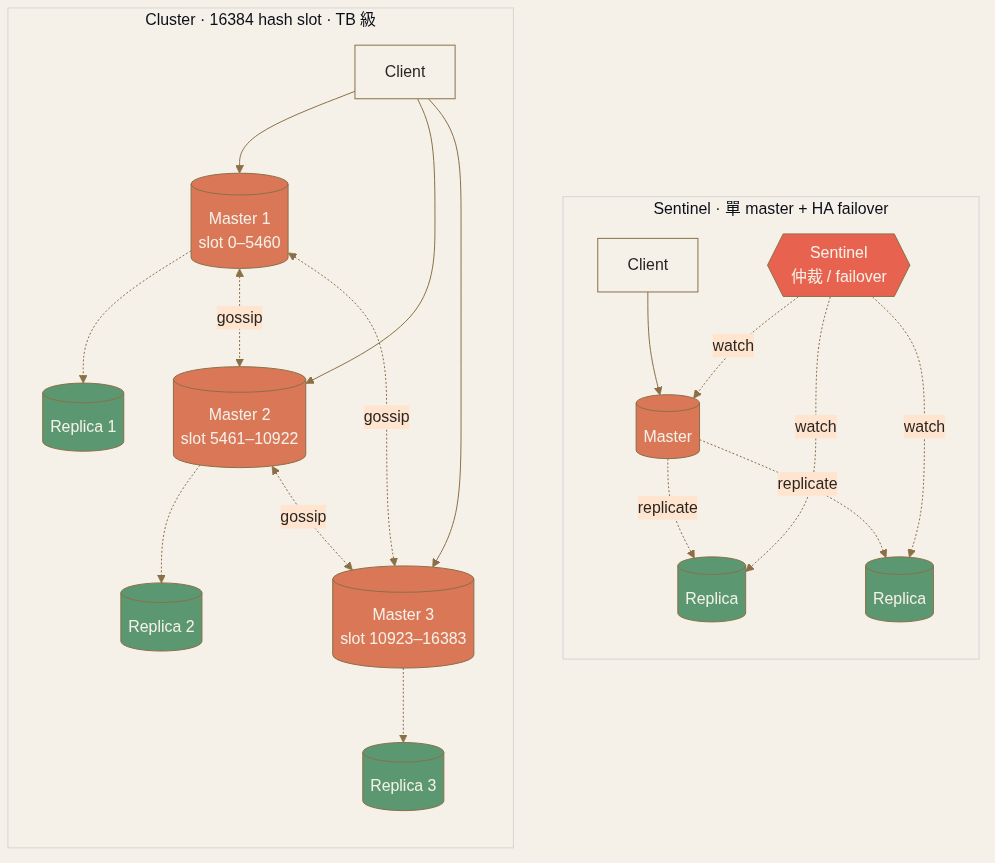

<!-- _class: chapter -->

CHAPTER · 06 · TOPIC 03

# Distributed Cache
## *當 cache 自己也變成需要被設計的分散式系統*

---

## DISTRIBUTED CACHE · WHY + Cluster 架構

**Local cache**：100 台 server = 100 份冗餘 / **Distributed**：共享一份，省記憶體 + 一致性。**心智轉變**：問題從「eviction / stampede」變「節點分配 / rebalancing / partial failure」——cache 自己成了分散式系統。

Sharding 必用 Consistent Hashing
反模式 <code>hash(key) % N</code>：5→6 台 → **幾乎所有 key 重新映射** = 瞬間 cold start。Consistent hashing 只解決平均，**不解決偏斜**。

Cluster vs Sentinel
**Cluster**：16384 hash slot + master 配 replica + Gossip → TB 級必選。 
**Sentinel**：單 master + HA failover，沒分片，運維簡單但寫入受限。

Hot Key 防禦
直播間/明星占 20%+ 流量 = bottleneck。**解**：Key 多副本 · App-level local cache · Key fanout。

> Source: 常用技術/08 Distributed Cache.pdf · §1-3

---

## DISTRIBUTED CACHE · Failure Modes

**真實事故**：訂票系統 50K QPS（45K cache 命中、5K 打 DB）。某天 cache cluster 配置錯誤全部重啟 → DB 瞬間承受 10× 流量 → **整個訂票系統掛掉**。Cache 不只是加速層，**它是 DB 的保護層**——必須有 replication。

① Cache Stampede
大量 key 同時過期 → 同時 miss → 同時打 DB。**解**：TTL + jitter · single-flight。

② Cold Start
新節點加入 / cluster 重啟 → cache 全空。**解**：預熱 · 流量逐步切換。

③ Partial Node Failure（最隱晦）
節點變慢但**沒 crash** → client timeout retry → 連鎖。**解**：timeout + circuit breaker。

> Source: 常用技術/08 Distributed Cache.pdf · §3 Replication · §4 Failure Modes

---

## DISTRIBUTED CACHE · TRADE-OFF + 容量

  

    <h3>紅利</h3>
    <ul>
      <li>共享記憶體 · 容量可擴 TB 級</li>
      <li>多 client 一致 · HA via replication</li>
      <li>**容量算式**：熱資料 × 1.5 = 集群 RAM</li>
      <li>**Eviction**：LFU 適熱點明顯場景</li>
    </ul>
  

  

    <h3>代價</h3>
    <ul>
      <li>Network RTT（μs → ms）</li>
      <li>Cluster 故障影響全部 client</li>
      <li>Rebalancing 期間流量峰值</li>
      <li>**Multi-region 不跨區複製**——cache 可重建，全球一致留給 DB</li>
    </ul>
  

**面試完整答**：sharded + consistent hashing + replica + TTL jitter + single-flight + hot key fallback + cluster failure 降級模式。

> Source: 常用技術/08 Distributed Cache.pdf · §6-8
