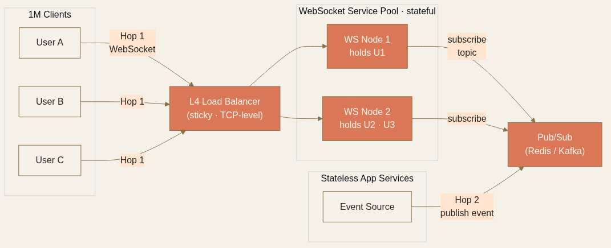

<!-- _class: chapter -->

<div class="ch-no">CHAPTER · 07 · TOPIC 04</div>

# Real-time Updates
## *Push 不是 Pull — 但 stateful 連線會帶走你一半的擴展性*


---


## REAL-TIME · WHY

# 為何輪詢不是答案？

<br>

<div class="highlight">

**輪詢的問題**：每秒 1 次 polling × 100k 用戶 = **100k QPS** 的純 wasted 流量。  
**90% 的 polling 都是「沒事」**——拿到「沒新訊息」就回去。

</div>

<br>

- Real-time 需求：聊天、通知、即時報價、協同編輯、遊戲、IoT、AI streaming
- 解法層級：Long Polling → SSE → WebSocket → 專用協定（MQTT / WebRTC）

> Source: 設計模式/05 Real-time Updates.pdf · §問題在哪裡


---


## REAL-TIME · 兩個 HOP

# 即時系統的雙重問題

<div class="stack">
  <div class="layer client"><strong>Hop 1</strong>　 更新如何從伺服器送達客戶端？　 <em>(client-server protocol)</em></div>
  <div class="layer app"><strong>Hop 2</strong>　 更新如何從事件來源傳到「拿著客戶端連線的那台伺服器」？　 <em>(server-side propagation)</em></div>
</div>

<br>

```
[Client] ←─── Hop 1 ───→ [Server holding conn] ←─── Hop 2 ───→ [Event Source]
              協定選擇                                Pub/Sub or Consistent Hash
```

<span class="muted">**面試常見錯誤**：只想 Hop 1（WebSocket）忘記 Hop 2（怎麼從產生 event 的服務找到「持有那條連線的 server」）。</span>

> Source: 設計模式/05 Real-time Updates.pdf · §解法的架構


---


## REAL-TIME · HOP 1 · 4 種推送技術

| 技術 | 方向 | 連線數 | 適用 |
|------|------|--------|------|
| **Long Polling** | client 等回應 | 1 連線 / req | 後備方案 · 通用 · 付款狀態 |
| **SSE（Server-Sent Events）** | server → client 單向 | 1 long-lived TCP | 通知 · 股票 · **AI streaming token** |
| **WebSocket** | 雙向全雙工 | 1 long-lived TCP | 聊天 · 協同 · 遊戲 |
| **WebRTC** | P2P（NAT/STUN/TURN） | 點對點 | 視訊通話 · 螢幕分享 · Canva 游標 |

<br>

<div class="highlight">

**選擇法則**：**單向推就用 SSE**（HTTP 原生 + 自動重連 + last-event-id）；雙向用 WebSocket；P2P 視訊用 WebRTC。

</div>

> Source: 設計模式/05 Real-time Updates.pdf · §第一個 Hop


---


## REAL-TIME · L4 vs L7 LB

# WebSocket 的隱性成本：負載平衡器

<div class="def">
<span class="term">Layer 4 LB</span>
TCP/IP 層做路由 · 不檢查封包內容 · **天然適合 WebSocket**（同一條 TCP 連線一直在）。
</div>

<div class="def">
<span class="term">Layer 7 LB</span>
HTTP 層 · 終止連線後對 backend 開新連線 · **每個 HTTP request 重新路由**——和 WebSocket 的長存連線本質衝突。
</div>

<br>

<span class="muted">**面試常考**：「WebSocket 用什麼 LB？」答 **L4**——L7 對 long polling 這類 HTTP 方案更好用。</span>

> Source: 設計模式/05 Real-time Updates.pdf · §負載平衡器


---


## REAL-TIME · HOP 2 · 100 萬連線

# 兩種觸發機制

<div class="tradeoff">
  <div class="pro">
    <h3>Consistent Hashing</h3>
    <ul>
      <li>用 ZooKeeper/etcd 記錄 user → server</li>
      <li>更新服務 hash(user_id) 找到 server 後直接送</li>
      <li>適合**連線需要維護大量狀態**（Google Docs）</li>
      <li>擴容時 hash ring 上連線遷移最小化</li>
    </ul>
  </div>
  <div class="con">
    <h3>Pub/Sub（Redis / Kafka）</h3>
    <ul>
      <li>用戶連到任意端點伺服器 · 訂閱 topic</li>
      <li>更新發布到 topic · Pub/Sub 廣播給所有訂閱端點</li>
      <li>**端點無狀態 · 用 least-connection LB 即可**</li>
      <li>適合**訊息小、不需太多關聯狀態**</li>
    </ul>
  </div>
</div>

> Source: 設計模式/05 Real-time Updates.pdf · §第二個 Hop


---


## REAL-TIME · 1M 連線架構

# 抽出專屬 WebSocket 服務

```
[User] ←→ [L4 LB] ←→ [WebSocket Service Pool] ←→ [Pub/Sub] ←→ [App Service]
                          (sticky · stateful)        (Redis/Kafka)   (stateless)
```

<div class="stack">
  <div class="layer client"><strong>① Stateful 隔離</strong>　 WebSocket 服務獨立部署 · 重啟頻率低 · 把 stateful 鎖在最小範圍</div>
  <div class="layer app"><strong>② Heartbeat</strong>　 偵測「殭屍連線」(client 以為連著但 server 早關了) · 通常 30s ping</div>
  <div class="layer data"><strong>③ Graceful Drain</strong>　 部署時逐步通知 client 重連 · 不能一次切光（驚群效應）</div>
  <div class="layer infra"><strong>④ 重連 + Last Event ID</strong>　 SSE 標準支援；WebSocket 要自己實作補發</div>
</div>



> Source: 設計模式/05 Real-time Updates.pdf · §連線失敗和重新連線

---


## REAL-TIME · TRADE-OFF

# WebSocket vs SSE 終極選擇

<div class="tradeoff">
  <div class="pro">
    <h3>選 WebSocket</h3>
    <ul>
      <li>需要雙向通訊（聊天、遊戲）</li>
      <li>需要 binary frame</li>
      <li>低延遲交互（< 100ms RTT）</li>
    </ul>
  </div>
  <div class="con">
    <h3>選 SSE</h3>
    <ul>
      <li>只需 server → client 推送</li>
      <li>原生支援 reconnect + last-event-id</li>
      <li>HTTP/2 multiplexing 友好</li>
      <li>防火牆 / proxy 通透性高</li>
      <li><strong>AI chat token streaming 預設</strong></li>
    </ul>
  </div>
</div>

<span class="muted">**業界趨勢**：通知、股票、AI streaming 大多用 SSE；聊天、遊戲、協同用 WebSocket。**過度採用 WebSocket 是常見錯誤**。</span>

> Source: 設計模式/05 Real-time Updates.pdf · §選擇指南


---


## REAL-TIME · 進階問題

# 名人 Fan-out & 協作編輯

<div class="def">
<span class="term">Celebrity Fan-out</span>
Taylor Swift 發文 → 幾千萬粉絲要立刻收到。**不寫進每個粉絲的 feed**（IO 爆炸）→ 只快取一次 → 讓各區端點 server 拉取後推給本地 client。**階層式聚合**避免單點崩潰。
</div>

<div class="def">
<span class="term">CRDT vs Operational Transform</span>
Google Docs 字元級協作的兩種衝突解決方法：**OT** 透過 transform 函數調整操作順序；**CRDT** 用無衝突資料結構。Figma / Notion 多走 CRDT。
</div>

> Source: 設計模式/05 Real-time Updates.pdf · §常見的 Deep Dive 問題


---


<!-- _class: end -->

# Real-time 完
## *push 容易 · scale 才難——下一站講搜尋怎麼別走 LIKE。*

<br>

<span class="lead">→ 05 Search System</span>
