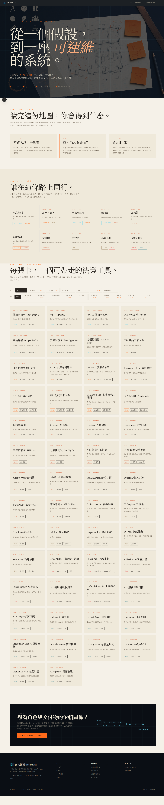
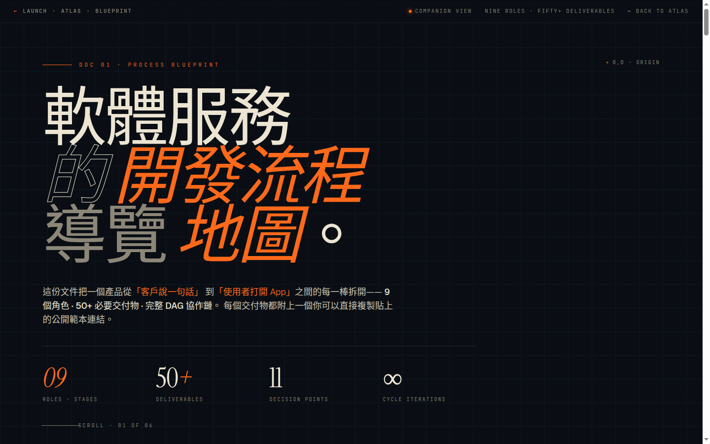
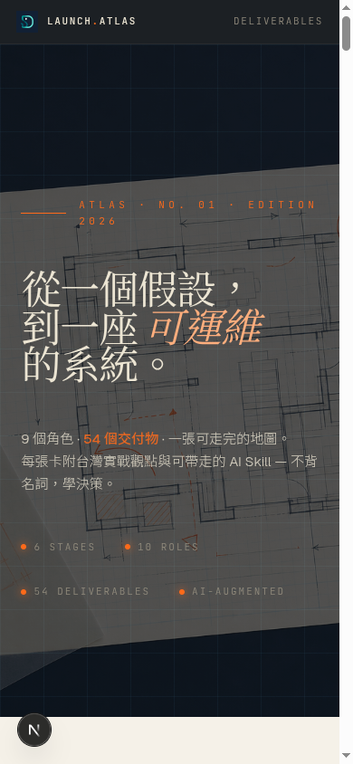

<div align="center">


# 落地圖鑑 · Launch Atlas

### 從一個假設，到一座可運維的系統。
**9 角色 · 54 交付物 · 6 階段 · 一張可走完的地圖。**

[](https://nextjs.org/)
[](https://react.dev/)
[](https://www.typescriptlang.org/)
[](#授權)
[](#編譯與部署)
[](https://claude.com/claude-code)

[**🌐 線上預覽**](#編譯與部署) · [**📐 視覺系統**](#視覺系統) · [**🗺 9 角色 × 54 交付物**](#你會得到什麼) · [**⚡ Quick Start**](#quick-start)

</div>

---

## 為什麼有這個專案？

市面上的 PM 框架知識庫已經很多了 — Notion、PMFrame.works、Reforge 全是「精選 62 個框架」的網格。

但我們需要的不是**更多框架**，而是一條**可走完的路** — 從一個商業假設，走到一個**凌晨三點還活著的系統**。

`pm.chiba.tw` 解決的是「該用哪個框架」的問題。
`Launch Atlas` 解決的是「下一步該做什麼、誰該做、AI 怎麼幫你做完」的問題。

> 不背名詞，學決策。每張卡只回答：**解決什麼問題 · 誰負責 · 何時用 · AI 怎麼加速。**

---

## 你會得到什麼

| 維度 | 數量 | 內容 |
|---|---|---|
| **SDLC 階段** | 6 個 | Discovery → Define → Design → Build → Ship → Operate |
| **角色** | 10 個 | PM / PO / BA / UX / UI / SA / Architect / Dev / QA / DevOps · SRE |
| **交付物** | 54 個 | PRD / OKR / JTBD / ADR / C4 / SLO / Runbook / Postmortem... |
| **AI Prompt 範例** | 54 個 | 每張卡片都附 Claude 加速用的 prompt（≤ 12 行可貼用） |
| **總頁數** | 78 頁 | 全部 SSG 靜態化，可離線開、可上 GitHub Pages |

---

## 視覺巡禮

<div align="center">

### Hero · 首頁


> 深墨 `#0a0e14` 底 + 工程網格 + GPT-image-2 生成的「建築師工作桌」hero · Instrument Serif 大字標題。

### 首頁全景 · Three Vows × Roles × Deliverables × Map CTA



> 三承諾 → 10 角色羅盤 → 54 交付物網格（含 Stage/Role 雙軸篩選）→ Map CTA → Footer。

### 交付物詳細頁 · ADR 範例


> 三張 ADR 卡片（橘勾 ACCEPTED / 灰減 SUPERSEDED / 藍圓 PROPOSED）+ 銅天平 hero · 四問結構 · 右側 meta + 前後序導覽。

### 角色頁 · 架構師


> C4 圖層 + ACCEPTED 章 + Trade-off 矩陣 hero · 何時招這個角色 / 失職訊號 / AI 加速一句話 · 推薦交付物 7 條。

### 階段頁 · Design


> 多層描圖紙 hero · 退出條件 / 典型卡關側欄 · 14 張階段內交付物網格。

### Blueprint Studio · 配套 DAG 流程地圖



> 從首頁 Map CTA 內部跳轉至 `/atlas-map.html` · 鋼藍工程網格 + 9 角色 × 50+ 交付物 handoff 鏈 · 1738 行 inline HTML/CSS/JS 互動視圖。

### 響應式 · Mobile



> 完整 reflow，rail 自動收摺、grid 改單欄、字級 clamp 縮放。

</div>

---

## 設計理念

逆向 [`pm.chiba.tw`](https://pm.chiba.tw/) 的精選框架知識庫哲學，但做了三個關鍵翻轉：

| 維度 | pm.chiba.tw | Launch Atlas |
|---|---|---|
| **內容單位** | 62 個框架 | **54 個交付物**（PRD/ADR/SRS/Runbook/SLO） |
| **結構** | 單長頁 + filter | **長頁 + 三層子頁**（角色 / 階段 / 交付物） |
| **視覺** | 光面紙 | **深墨 hero + 米白內容**雙主題 |
| **每張卡** | 一句話框架描述 | **四問結構**：解決什麼 / 誰負責 / 何時用 / AI 怎麼加速 |
| **哲學** | 對的框架對的時機 | **不背名詞學決策 + Why/How/Trade-off + AI 加速三問** |

---

## 視覺系統

採 **Architect's Blueprint** 美學（與配套視圖 Atlas Blueprint Studio 同調）：

| Token | Hex | 用途 |
|---|---|---|
| `--ink` | `#0a0e14` | 深墨 — Hero / Footer / divider |
| `--cream` | `#f5f1e8` | 米白紙 — 內容頁主背景 |
| `--accent` | `#ff6a1a` | correction orange — CTA / 強調 |
| `--blue` | `#6dd5ed` | blueprint cyan — 工程網格 / 鏈接 |
| `--accent-warm` | `#d97757` | anthropic warm orange — 副強調 |

**字體**：Instrument Serif（標題）/ Geist（介面）/ JetBrains Mono（資料）/ Noto Sans TC（中文）。
**Hero 圖片**：22 張 GPT-image-2 高解析（1536×1024, high quality）。

---

## Quick Start

```bash
# 開發
cd product_to_launch
npm install
npm run dev          # → http://localhost:3000

# 靜態匯出（可放任何靜態主機）
npm run build        # → ./out/ (78 個 .html，可離線開)

# 重生圖片（需要 OPENAI_API_KEY；自動從 ~/.openai.env 載入）
npm run gen:images   # → public/generated/ (22 PNG, ~$4 USD)
```

---

## 技術棧

| 層 | 選擇 | 為什麼 |
|---|---|---|
| Framework | Next.js 15 (App Router) | 動態路由 + SSG + 靜態匯出 一條龍 |
| Runtime | React 19 stable | Server components 簡化資料抓取 |
| Language | TypeScript 5.6 | type-safe taxonomy + content frontmatter |
| Styles | 純 CSS + CSS variables | 與配套 Blueprint Studio 同調，零相依 |
| Content | Markdown (gray-matter) | 70 個 `.md`，作者可直接寫 |
| Images | GPT-image-2 (high quality) | 24 張一致風格、$4 USD、可重生 |
| Deploy | static export → 任何靜態主機 | GitHub Pages / Netlify / Vercel / S3 |

---

## 目錄結構

```
product_to_launch/
├── app/                       Next.js 15 App Router
│   ├── layout.tsx             全域 layout + 字體
│   ├── globals.css            雙主題 CSS vars + utilities（~500 行）
│   ├── page.tsx               首頁
│   ├── roles/                 10 角色路由
│   ├── deliverables/          54 交付物路由
│   ├── stages/                6 階段路由
│   └── about/
├── components/                8 個元件（Rail / Hero / VowsTriad / RolesCompass /
│                              FilterableGrid / DeliverableCard / MapCTA / Footer）
├── content/                   70 個 Markdown
│   ├── roles/                 10 角色
│   ├── stages/                6 階段
│   └── deliverables/          54 交付物
├── lib/                       taxonomy.ts (列舉) / content.ts (MD 讀取) / seo.ts
├── public/
│   ├── logo/                  沿用既有 D 字標誌（3 PNG）
│   └── generated/             22 張 GPT-image-2 高解析圖
├── docs/screenshots/          7 張行銷截圖（本 README 引用）
└── scripts/gen-images.sh      批次生圖（quality=high, size=1536x1024）
```

---

## 內容格式（交付物 .md frontmatter）

```yaml
---
title: "PRD · 產品需求文件"
slug: "prd"
stage: "define"
roles: ["pm"]
order: 8
hook: "把模糊需求變可執行規格"
when_to_use: "團隊 ≥ 3 人、需求穩定度 < 60% 時必要"
ai_leverage: "用 Claude 把訪談錄音 → PRD draft"
art: "/generated/key-deliverable-prd.png"
source: "deep-research-report.md §產品經理"
---

## 解決什麼問題（What & Why）
## 誰負責、和誰對接（Who）
## 何時用、何時不用（When）
## AI 怎麼加速（AI-Leverage 含 prompt 範例）

> Source: ...
```

---

## 與姊妹專案的關係

本站是 [`system_design_allinone`](../README.md) 倉庫的**入口網站**，把四個姊妹專案的內容濃縮成一張可走完的地圖：

| 來源 | 用在哪 |
|---|---|
| [`deep-research-report.md`](../deep-research-report.md) | 9 角色 RACI、54 交付物清單 |
| [`software_develop_journey/ppt/`](../software_develop_journey/ppt/) | 角色 overview / outputs / boundary |
| [`public/atlas-map.html`](./public/atlas-map.html) | Atlas Blueprint Studio (DAG 互動圖) |
| [`software_architect/ppt/`](../software_architect/) | ADR / C4 / -ilities 引用 |
| [`ai_native_system_design/ppt/`](../ai_native_system_design/) | AI 加速 prompt 範例 |
| [`system_design/ppt/`](../system_design/) | SLO / Caching / Sharding 引用 |

---

## 三個承諾

| Vow | 內容 |
|---|---|
| **01 · 不背名詞，學決策** | 每張卡都回答「解決什麼、代價、不該用」 |
| **02 · Why / How / Trade-off** | 任何技術都能用這三段拆解 |
| **03 · AI 加速三問** | AI 能加速哪一步？哪一步必須留給人？人在這一步的判斷依據是什麼？ |

---

## Roadmap

- [x] **v1.0** · 10 角色 / 6 階段 / 54 交付物 / 22 hero 圖 / SSG 靜態匯出
- [ ] **v1.1** · 搜尋（client-side fuse.js）+ RSS feed + sitemap.xml
- [ ] **v1.2** · 互動 DAG 圖（替代目前的 ASCII map）+ 交付物範本下載中心
- [ ] **v2.0** · 多語切換（zh-Hant / en）+ CMS（Decap）+ 評論（giscus）

---

## 授權

MIT License · Part of [System Design All-in-One](../README.md)
© 2026 · v1.0 · 內容、視覺、結構均為 hand-crafted with [Claude Code](https://claude.com/claude-code)

---

<div align="center">
<sub>從一個假設，到一座可運維的系統。</sub><br/>
<sub>From hypothesis to production — for engineers who measure twice and cut once.</sub>
</div>
