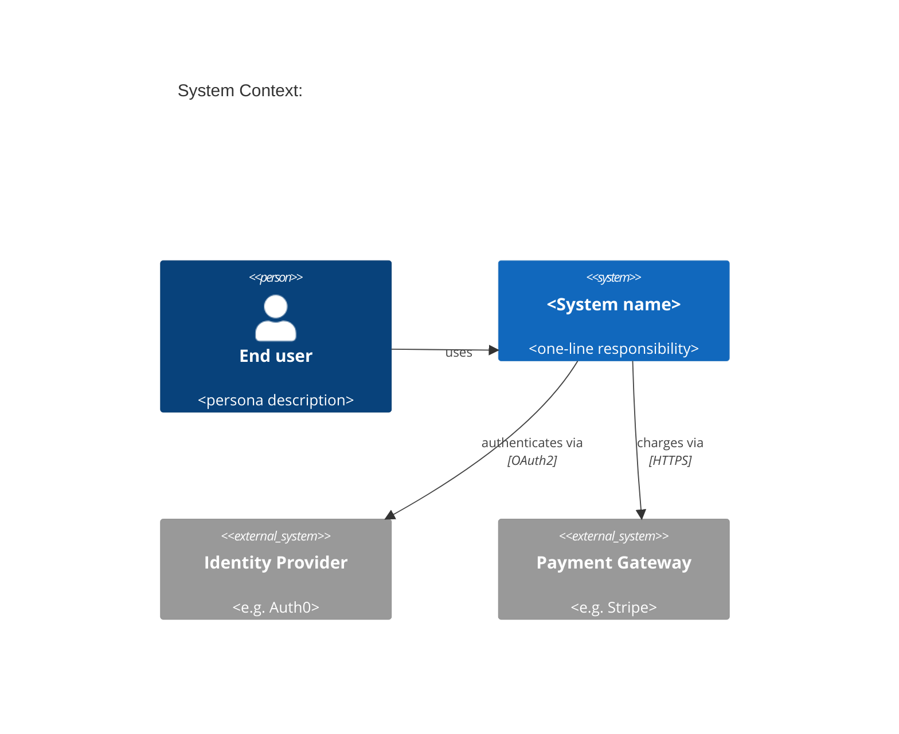
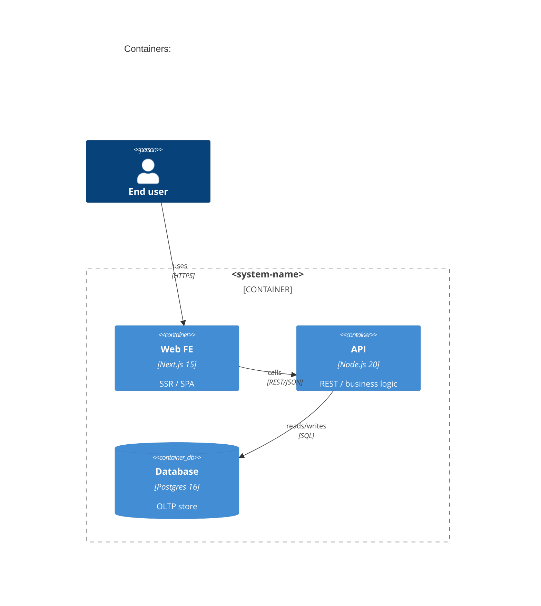
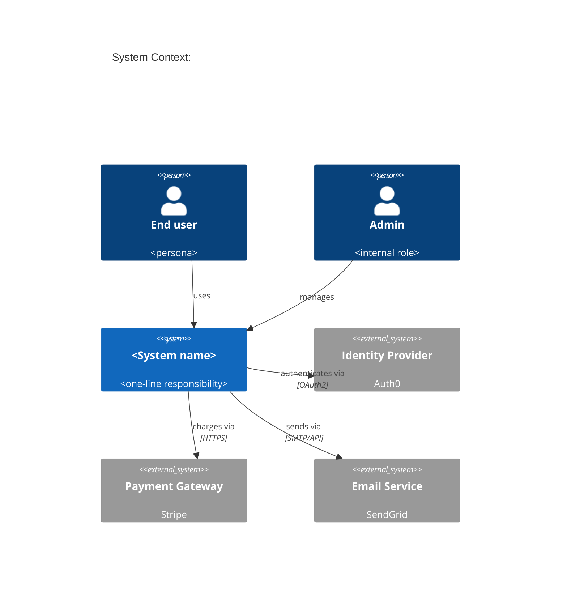
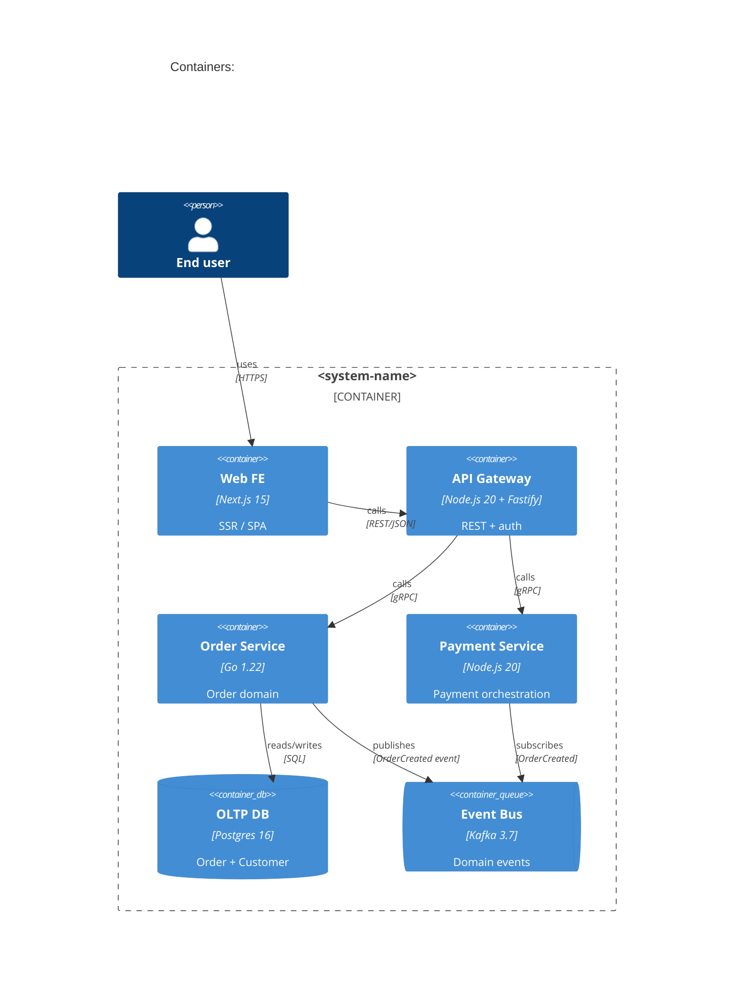
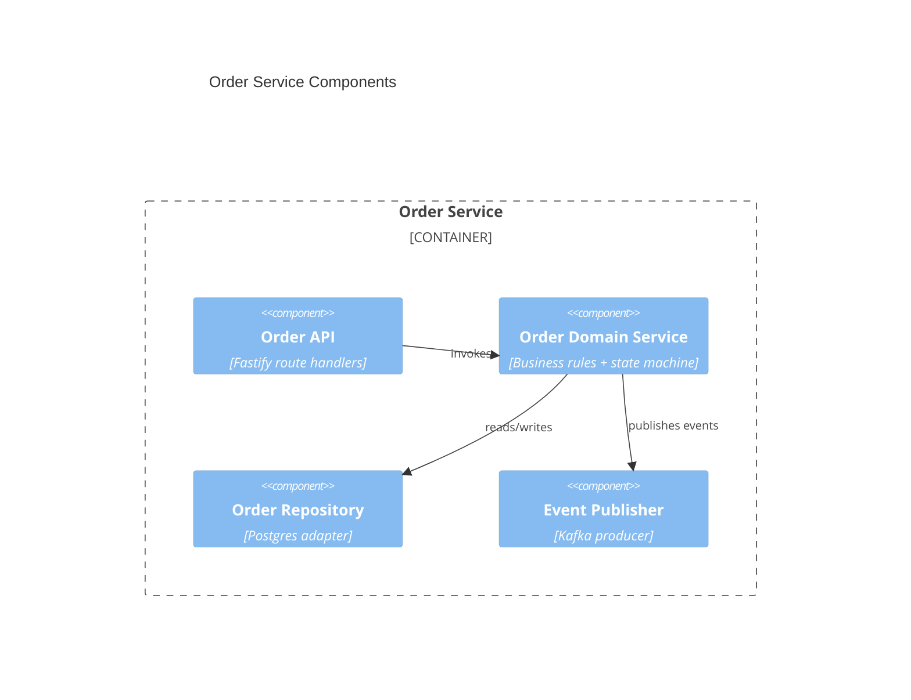

## 解決什麼問題

Architect 在白板上畫一張圖，工程師看不懂、PM 看不懂、SRE 看不懂——因為每個人想看的抽象層不同。
C4 模型（Context / Container / Component / Code）的價值是**分層**：高層給 stakeholder、中層給工程師、低層給 code reviewer。
沒有 C4，每次溝通都得重畫一張新圖。

## 誰負責、和誰對接

- **主責：** Architect
- **協作：** SA（補系統行為）、Dev Lead（補實作脈絡）、SRE（補營運視角）
- **下游收件：** 工程團隊（理解邊界）、新人（onboarding）、stakeholder（理解整體）

## 何時用、何時不用

- ✅ **必要時機：** 跨系統整合、團隊 ≥ 10 人、有外部 stakeholder 需要溝通架構
- ❌ **不需要時：** 單一 monolith 小團隊、PoC、純前端 SPA
- ⚠️ **常見誤用：** 一張圖塞所有東西（變成義大利麵）；每層 C4 應**對應一種讀者**，不要混層

## AI 怎麼加速

把 codebase 結構 + 既有 ADR + stakeholder / 外部系統清單整份丟給 agent，讓 agent 讀範本內的 `> [!IMPORTANT]` 規則與 `<!-- ai-fill -->` 註解自己填，**人工只審分層是否乾淨**。本卡輸出**真實 C4 markdown 文件**（含 Mermaid C4 圖、element 表格、relationship 表格、inline `[H/M/L]` badge），**不出 YAML schema**。

## 文件範本

下面兩個 tab 是同一份契約的兩種版本，AI 讀同一份範本可雙模式輸出：**輕量範本** 給 solo / 小團隊 / PoC 用（只畫 Context + Container 兩層），**完整範本** 給跨系統整合 / ≥ 10 人團隊 / 外部 stakeholder 溝通場景用（Context + Container + Component 三層）。Level 4 (code) 預設不畫——只在 reviewer 需要時另開 component-level 卡。範本內所有 `> [!IMPORTANT]` 是 AI 章節級規則、`<!-- ai-fill / ai-rule -->` 是欄位級微指引、結尾 `> [!CAUTION]` 是輸出前自檢清單。

````template-light
---
doc_type: "c4-diagram"
variant: "light"
status: "draft"
owner: "<your-name>"
last_updated: "YYYY-MM-DD"
upstream:
  required: ["codebase-structure", "adr"]
  optional: ["stakeholder-map"]
---

# C4 Architecture: <system-name>

**Status:** Draft · **Owner:** <Architect> · **Last updated:** YYYY-MM-DD

> [!IMPORTANT]
> **AI 填寫規則：** 本範本 5 段（編號 1, 2, 3, 9, 12），全部必填——刻意沿用完整版的章節編號讓兩版可對照。輕量版只畫 Level 1 (Context) + Level 2 (Container) 兩層。每結論行內加 `（依據：codebase §XXX / ADR-NNN）`；每欄位帶 `[H]/[M]/[L]` confidence badge；缺資料寫 `_TODO: 需要 XXX_` 不編造模組；**分層紀律：Level 1 只放 system + actor + external，Level 2 才放 container**，任何混層必須在 Omitted 段解釋。

---

## 1. Executive Summary

<!-- ai-fill: 3-5 行說明本圖讀者、抽象層、不畫的部分 -->

<3-5 行說明：本圖給誰看、含哪些層、為何不畫某層>

> **TL;DR:** <一句話：系統邊界 + 主要外部依賴>

---

## 2. Level 1 — System Context

<!-- ai-rule: 只放本 system + actor + external systems。不能出現 container / component -->



### Actors & External Systems

| Element | Type | Responsibility | Source |
|---|---|---|---|
| End user | Actor | <persona> | <ref> |
| Identity Provider | External | OAuth2 IdP | ADR-002 |
| Payment Gateway | External | 收款 | ADR-003 |

---

## 3. Level 2 — Containers

<!-- ai-rule: 列出 ≤ 7 個 container。每個 container 必含 tech + responsibility -->



| Container | Tech | Responsibility | Confidence | Source |
|---|---|---|---|---|
| Web FE | Next.js 15 | SSR + SPA | **[H]** | ADR-001 |
| API | Node.js 20 | Business logic | **[H]** | ADR-001 |
| Database | Postgres 16 | OLTP store | **[H]** | ADR-004 |

---

## 9. Architecture Risks

<!-- ai-rule: 至少列 3 個架構風險（單點故障 / cyclic dependency / 跨 boundary chatty call） -->

> **R1:** <e.g. API → DB 單點故障> — **Severity:** H — **Follow-up:** 開 ADR 評估 read replica
>
> **R2:** ...
>
> **R3:** ...

---

## 12. Confidence & Sources & TODO

- **整份文件最低 confidence 欄位：** <列出所有 [L] 與 [M]>
- **Fabricated assumptions（推測但 input 未明說）：**
  - <假設 1：例：假設 IdP 是 external（codebase 沒明示）>
- **Highest-value next input:** <下一份最該補的：deployment topology / ADR / DDD context map>

### TODO（缺資料）

- _TODO: 需要 SA 確認 Payment Gateway 是同步 vs webhook 模式_

---

> [!CAUTION]
> **輸出前 AI 自檢：**
> - [ ] 5 段 H2 章節齊全（編號 1, 2, 3, 9, 12，刻意不連號）
> - [ ] Level 1 (Context) 不含 container / component
> - [ ] Level 2 (Container) 每個 container 含 tech + responsibility + confidence
> - [ ] 每個 element / relationship 有 source（codebase / ADR ref）
> - [ ] ≥ 3 個架構風險點（單點 / cyclic / chatty）
> - [ ] Mermaid C4 語法可渲染（C4Context / C4Container）
> - [ ] 無 YAML / JSON schema 輸出（C4 是給人讀的 markdown + mermaid）
````

````template-full
---
doc_type: "c4-diagram"
variant: "full"
status: "draft"
owner: "<your-name>"
last_updated: "YYYY-MM-DD"
upstream:
  required: ["codebase-structure", "adr", "stakeholder-map"]
  optional: ["ddd-context-map", "deployment-topology"]
---

# C4 Architecture: <system-name>

**Status:** Draft · **Owner:** <Architect> · **Last updated:** YYYY-MM-DD · **Reviewers:** Dev Lead / SRE / SA

> [!IMPORTANT]
> **AI 填寫規則：** 12 段 H2 章節全部必填（任一缺失即不合格）。畫 Level 1 (Context) + Level 2 (Container) + Level 3 (Component)；Level 4 (code) 預設不畫。每結論行內 `（依據：codebase §XXX / ADR-NNN）`；每欄位 `[H/M/L]` badge；缺資料寫 `_TODO: 需要 XXX_` 不編造模組；**分層紀律：Level 1 只放 system + actor + external、Level 2 才放 container、Level 3 才放 component**，任何混層必須在 Omitted 段解釋；技術選型與 ADR 一致（不一致須在 Decision Log 紀錄為何偏離）；至少 3 個架構風險點（單點 / cyclic / chatty）；禁 YAML/JSON schema 輸出。

---

## 1. Executive Summary
<!-- owner: Architect · required: always -->

<!-- ai-fill: 3-5 行說明本圖讀者、含哪些層、為何不畫某層 -->

<3-5 行說明>

> **TL;DR:** <一句話：系統邊界 + 主要 BC + 主要外部依賴>

---

## 2. Level 1 — System Context
<!-- owner: Architect · required: always · audience: stakeholder -->

<!-- ai-rule: 只放本 system + actor + external systems。不能出現 container / component -->



### Actors & External Systems

| Element | Type | Responsibility | Confidence | Source |
|---|---|---|---|---|
| End user | Actor | <persona> | **[H]** | <ref> |
| Admin | Actor | <internal> | **[H]** | <ref> |
| Identity Provider | External | OAuth2 IdP | **[H]** | ADR-002 |
| Payment Gateway | External | 收款 | **[H]** | ADR-003 |
| Email Service | External | 通知 | **[M]** | _TODO_ |

---

## 3. Level 2 — Containers
<!-- owner: Architect + Dev Lead · required: always · audience: engineer -->

<!-- ai-rule: ≤ 7 個 container 為宜。每個含 tech + responsibility。Container 間關係必含 protocol -->



| Container | Tech | Responsibility | Confidence | Source |
|---|---|---|---|---|
| Web FE | Next.js 15 | SSR + SPA | **[H]** | ADR-001 |
| API Gateway | Node.js 20 + Fastify | REST + auth | **[H]** | ADR-001 |
| Order Service | Go 1.22 | Order domain | **[H]** | ADR-005 |
| Payment Service | Node.js 20 | Payment orchestration | **[M]** | ADR-006 |
| OLTP DB | Postgres 16 | Order + Customer | **[H]** | ADR-004 |
| Event Bus | Kafka 3.7 | Domain events | **[M]** | ADR-007 |

---

## 4. Level 3 — Components（per critical container）
<!-- owner: Architect + Dev Lead · required: full-only · audience: engineer + code reviewer -->

<!-- ai-rule: 只對 1-2 個關鍵 container 拆 component。每個 component 含 responsibility + dependency -->

### Order Service Components



| Component | Responsibility | Confidence | Source |
|---|---|---|---|
| Order API | Route handler + validation | **[H]** | codebase §src/api |
| Order Domain Service | Business rules + state machine | **[H]** | codebase §src/domain |
| Order Repository | Postgres adapter | **[H]** | codebase §src/repo |
| Event Publisher | Kafka producer | **[M]** | codebase §src/events |

---

## 5. Bounded Contexts & Boundaries
<!-- owner: Architect · required: full-only -->

<!-- ai-rule: 列出 DDD bounded contexts，每個 BC 含其 container/component + 邊界依據 -->

| BC | Contains | Boundary rationale | Confidence |
|---|---|---|---|
| Order BC | Order Service, Order DB schema | <DDD ubiquitous language: Order, LineItem, OrderStatus> | **[H]** |
| Payment BC | Payment Service, Payment DB schema | <隔離 PCI scope> | **[H]** |
| Identity BC | Auth via external IdP | <不自建 user store> | **[M]** |

---

## 6. Relationships & Protocols
<!-- owner: Architect · required: full-only -->

<!-- ai-rule: 列出所有跨 container 關係。Protocol + sync/async 必填 -->

| From | To | Purpose | Protocol | Sync/Async | Confidence |
|---|---|---|---|---|---|
| Web FE | API Gateway | 業務操作 | REST/JSON | sync | **[H]** |
| API Gateway | Order Service | Order CRUD | gRPC | sync | **[H]** |
| Order Service | OLTP DB | persist | Postgres wire | sync | **[H]** |
| Order Service | Event Bus | OrderCreated | Kafka topic | async | **[H]** |
| Payment Service | Event Bus | OrderCreated subscribe | Kafka topic | async | **[H]** |

---

## 7. Omitted Details
<!-- owner: Architect · required: full-only -->

<!-- ai-rule: 明示本圖不畫的元素 + 為何不畫（不是漏掉，是刻意） -->

| What | Why omitted |
|---|---|
| Cache (Redis) | 不在 Level 2 讀者關心範圍，屬 Component-level |
| Auth proxy sidecar | 不在 Container 層討論，屬 deployment 卡 |
| Observability stack (Prometheus / Grafana) | 屬 SRE 營運視圖，另張 ops diagram |
| Code-level class diagram | Level 4 預設不畫 |

---

## 8. Tech Stack Summary
<!-- owner: Architect · required: full-only -->

<!-- ai-rule: 全 container 的技術選型彙整，每筆對應 ADR -->

| Layer | Technology | Source ADR |
|---|---|---|
| FE framework | Next.js 15 | ADR-001 |
| BE framework | Fastify + gRPC | ADR-001 |
| Order Service lang | Go 1.22 | ADR-005 |
| Database | Postgres 16 | ADR-004 |
| Event Bus | Kafka 3.7 | ADR-007 |
| Auth | Auth0 OAuth2 | ADR-002 |

---

## 9. Architecture Risks
<!-- owner: Architect + SRE · required: always -->

<!-- ai-rule: 至少 3 個風險。每條格式：失效模式 + Severity + Mitigation + Owner -->

> **R1:** <e.g. OLTP DB 單點故障> — **Severity:** H — **Mitigation:** 開 ADR 評估 streaming replication + failover — **Owner:** <SRE>
>
> **R2:** <e.g. Order ↔ Payment 透過 gRPC + event bus 雙通道，可能 cyclic dependency> — **Severity:** M — **Mitigation:** 改純 event-driven 解耦 — **Owner:** <Architect>
>
> **R3:** <e.g. API Gateway → Order Service chatty calls（N+1）> — **Severity:** M — **Mitigation:** 引入 BFF pattern aggregating — **Owner:** <Dev Lead>

---

## 10. Decision Log
<!-- owner: Architect · required: always -->

<!-- ai-rule: 每條必含 ≥ 2 個 rejected options + 各自 rejected reason -->

| Date | Decision | Options considered | Chosen | Rejected why | Confidence |
|---|---|---|---|---|---|
| YYYY-MM-DD | 是否拆 Order / Payment | 單 monolith / 兩 service / 三 service | 兩 service | monolith (PCI scope 擴散)、三 service (over-split) | **[H]** |

---

## 11. Out of Scope
<!-- owner: Architect · required: full-only -->

本 C4 文件 **不處理**：

- ❌ **Level 4 (code) 不畫** — 由 PR-level review 處理
- ❌ **Deployment / infra topology** — 屬 deployment-diagram 卡
- ❌ **資料模型 / ERD** — 屬 data-model 卡
- ❌ **網路安全 / 防火牆規則** — 屬 threat-model + ops 卡

---

## 12. Confidence & Sources & TODO
<!-- owner: All · required: always -->

- **整份文件最低 confidence 欄位：** <列出所有 [L] 與 [M] 欄位>
- **Fabricated assumptions（推測但 input 未明說的）：**
  - <假設 1：例：假設 IdP 是 external（codebase 沒明示）>
  - <假設 2：例：假設 Payment Service 用 Kafka 訂閱 OrderCreated（ADR 未確認）>
- **Highest-value next input:** <下一份最該補的：DDD context map / ADR-007 (event bus) / deployment topology>

### TODO（缺資料）

- _TODO: 需要 SA 確認 Payment Service 訂閱 vs 同步呼叫_
- _TODO: 需要 SRE 確認 Kafka 部署 topology 是否 multi-AZ_

---

> [!CAUTION]
> **輸出前 AI 自檢：**
> - [ ] 12 段 H2 章節齊全（編號 1-12）
> - [ ] Level 1 (Context) 不含 container / component
> - [ ] Level 2 (Container) 每個 container 含 tech + responsibility + confidence
> - [ ] Level 3 (Component) 至少對 1-2 個關鍵 container 拆解
> - [ ] 每個 element / relationship 有 source（codebase / ADR ref）
> - [ ] Tech Stack 表每筆對應 ADR
> - [ ] ≥ 3 個架構風險點（單點 / cyclic / chatty）
> - [ ] Omitted Details 段明示不畫的部分（不是漏，是刻意）
> - [ ] Mermaid C4 語法可渲染（C4Context / C4Container / C4Component）
> - [ ] Decision Log 每條 ≥ 2 個 rejected options + 各自 reason
> - [ ] 無 YAML / JSON schema 輸出（C4 是給人讀的 markdown + mermaid）
````

## 怎麼觸發

先在上方 tab 選「輕量範本」或「完整範本」、按複製存到你的 AI 工作環境（web chat 對話框、Claude Code / Cursor / Aider 等 harness agent 的 context、或專案內任何 markdown 檔），再複製下面這段、把貼位區換成你的真實文件全文，給 AI：

```trigger
請依據以下「文件範本」與「上游文件」產出 C4 架構 markdown。嚴格遵守範本內所有 `> [!IMPORTANT]` 規則、`<!-- ai-fill -->` / `<!-- ai-rule -->` 欄位指引，並在結尾跑完 `> [!CAUTION]` 自檢清單。

## 文件範本（貼這裡）
⏬
（貼上面選好的「輕量範本」或「完整範本」全文）
⏫

## 上游文件（貼這裡）
⏬
（貼 codebase 結構 / 主要 ADR 清單 / stakeholder & external systems 清單 全文）
⏫
```

> [!TIP]
> **常見錯誤：** 一張圖塞所有東西（Level 1 出現 component = 義大利麵）、技術選型與 ADR 不一致沒寫 Rationale、Omitted Details 段沒寫（讀者以為漏畫不是刻意）、Relationship 沒標 protocol + sync/async（QA 無法測）、忘了 ≥ 3 個架構風險（看起來沒 risk 反而最可疑）。AI 若漏這些，自檢清單會抓到並回頭補。
