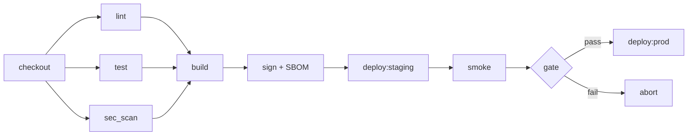

## 解決什麼問題

業界公認的四個交付指標（部署頻率、前置時間、變更失敗率、復原時間）都依賴一件事：pipeline 可信。CI/CD 把 build、test、scan、artifact、deploy 串成可重現流程，並留證據鏈。

## 誰負責、和誰對接

- **主責：** DevOps
- **協作：** Dev（測試 stage）、Security（SAST/SCA gate）、SRE（部署策略）
- **下游收件：** Release Plan、Rollback Plan、Audit

## 何時用、何時不用

- ✅ **必要時機：** 多人協作、跨環境部署、合規要求
- ❌ **不需要時：** 一次性腳本、個人實驗
- ⚠️ **常見誤用：** pipeline 通過就上線，沒有 release gate；artifact 不可重現

## AI 怎麼加速

把現有 pipeline yaml + 安全合規清單 + DORA 目標整份丟給 agent，讓 agent 讀範本內的 `> [!IMPORTANT]` 規則與 `<!-- ai-fill -->` 註解自己填，**人工只審 trade-off 與 secret 政策**。本卡輸出**真實 CI/CD Pipeline Audit markdown 文件**（含 stage flowchart、gate 表、SLSA 等級），**不出 YAML schema**。

## 文件範本

下面兩個 tab 是同一份契約的兩種版本：**輕量範本** 給小團隊 / 單一 repo / 早期 pipeline 用，**完整範本** 給多 repo / 合規場景 / SLSA L3 目標用。範本內所有 `> [!IMPORTANT]` 是 AI 章節級規則、`<!-- ai-fill / ai-rule -->` 是欄位級微指引、結尾 `> [!CAUTION]` 是輸出前自檢清單。

```template-light
---
doc_type: "ci-cd-pipeline"
variant: "light"
status: "draft"
owner: "<your-name>"
last_updated: "YYYY-MM-DD"
upstream:
  required: ["current-pipeline-yaml", "dora-targets"]
  optional: ["security-policy"]
---

# CI/CD Pipeline Audit: <repo-name>

**Status:** Draft v0.X · **Owner:** <DevOps name> · **Last updated:** YYYY-MM-DD

> [!IMPORTANT]
> **AI 填寫規則：** 本範本 6 段（編號 1, 2, 3, 5, 7, 10），全部必填——刻意沿用完整版的章節編號讓兩版可對照。每結論行內加 `（依據：pipeline-yaml §XXX / dora §YYY）`；每量化欄位加 `[H]/[M]/[L]` confidence badge；缺資料寫 `_TODO: 需要 XXX_` 不編造；Redundancy 識別必須附「移除後對 DORA metric 的預估影響」。

---

## 1. Executive Summary

<!-- ai-fill: 3-5 行，Dev Lead 30 秒讀完。寫「目前 pipeline 多長、最弱的 gate、最大的 supply-chain gap」 -->

<3-5 行說明>

> **TL;DR:** <一句話：最該動的 stage + 預估 lead time 縮短>

---

## 2. Stages

<!-- ai-rule: 至少 5 個標準 stage（lint / test / build / sec_scan / deploy / smoke）。每階段標 duration_p95 + 是否可並行 -->

| Stage | Purpose | Duration p95 | Parallelizable | Confidence |
|---|---|---|---|---|
| lint | 風格 + 靜態檢查 | 1 min | yes | **[H]** |
| test | unit + integration | 6 min | yes | **[H]** |
| build | 產出可重現 artifact | 4 min | no | **[H]** |
| sec_scan | SAST / SCA / secret scan | 3 min | yes | **[M]** |
| deploy | rollout to staging | 2 min | no | **[H]** |
| smoke | post-deploy 健康檢查 | 1 min | no | **[H]** |

---

## 3. Gates per Stage

<!-- ai-rule: 每階段必須有明確 gate 與 fail_action（block / warn / manual_review）。輕量版至少覆蓋 test / sec_scan -->

| Stage | Gate | Fail action | Confidence |
|---|---|---|---|
| test | unit coverage ≥ 80% | block | **[H]** |
| sec_scan | SAST high = 0 · secrets = 0 | block | **[H]** |
| smoke | health endpoint 200 in 30s | block | **[H]** |

---

## 5. Secret Management

<!-- ai-rule: 必含 storage / rotation / audit_log 三件；缺一即 supply-chain risk -->

- **Storage:** <vault / OIDC short-lived / env> **[H]**
- **Rotation:** <policy + interval> **[M]**
- **Audit log:** required / _TODO: 缺 audit trail_

---

## 7. Redundancy to Remove

<!-- ai-rule: 至少列 1 條冗餘 stage + DORA 影響估算 + 移除後風險 -->

| Stage / step | Reason redundant | DORA impact | Risk if removed |
|---|---|---|---|
| <例：重複的 lint job> | <為何重複> | lead time -2 min | <例：失去某 PR check> |

---

## 10. Decision Log（key 2-3 條）

<!-- ai-rule: 每條必含 chosen + 至少 1 個 rejected option + 拒絕原因 -->

| Date | Decision | Options | Chosen | Rejected why | Confidence |
|---|---|---|---|---|---|
| YYYY-MM-DD | runner 選型 | self-hosted vs managed | managed | self-hosted (維運成本 > 收益) | **[H]** |

---

> [!CAUTION]
> **輸出前 AI 自檢：**
> - [ ] 6 段 H2 章節齊全（編號 1, 2, 3, 5, 7, 10）
> - [ ] Stages 表至少含 lint / test / build / sec_scan / deploy / smoke
> - [ ] Gates 段至少覆蓋 test + sec_scan 兩階段
> - [ ] Secret management 含 storage / rotation / audit_log 三件
> - [ ] Redundancy 段附 DORA impact 估算
> - [ ] Decision Log ≥ 1 條，含 rejected reason
> - [ ] 無 YAML / JSON schema 輸出
```

````template-full
---
doc_type: "ci-cd-pipeline"
variant: "full"
status: "draft"
owner: "<your-name>"
last_updated: "YYYY-MM-DD"
upstream:
  required: ["current-pipeline-yaml", "dora-targets", "security-policy"]
  optional: ["sbom-spec", "slsa-target"]
---

# CI/CD Pipeline Audit: <repo-name>

**Status:** Draft v0.X · **Owner:** <DevOps name> · **Last updated:** YYYY-MM-DD · **Reviewers:** Dev Lead / Security / SRE

> [!IMPORTANT]
> **AI 填寫規則：** 10 段 H2 章節全部必填（任一缺失即不合格）。對標 NIST SSDF / SLSA L3 / DORA metrics。每結論行內 `（依據：pipeline-yaml §XXX / dora §YYY / security-policy §ZZZ）`；每量化欄位 `[H/M/L]` badge；缺資料 `_TODO: 需要 XXX_` 不編造；Redundancy 識別必須附「移除後對 DORA metric 的預估影響」；NIST SSDF / SLSA 必備項任一未覆蓋必須在 Rationale 寫明風險與補救；禁 YAML/JSON schema 輸出。

---

## 1. Executive Summary
<!-- owner: DevOps · required: always -->

<!-- ai-fill: 3-5 行，Dev Lead 30 秒讀完。寫「pipeline 總時長、最弱 gate、SLSA 現況、預估改善後 DORA 數字」 -->

<3-5 行說明>

> **TL;DR:** <一句話總結>

---

## 2. Pipeline Flow
<!-- owner: DevOps · required: always -->

<!-- ai-rule: 用 mermaid flowchart 畫 stage 串接，含並行區塊。節點數 6-10 個 -->



---

## 3. Stages
<!-- owner: DevOps · required: always -->

<!-- ai-rule: 完整 6 階段必填（lint / test / build / sec_scan / deploy / smoke）。每階段標 duration_p95、是否並行、目前瓶頸 -->

| Stage | Purpose | Duration p95 | Parallelizable | Bottleneck? | Confidence |
|---|---|---|---|---|---|
| lint | 風格 + 靜態檢查 | 1 min | yes | no | **[H]** |
| test | unit + integration + contract | 6 min | yes | yes | **[H]** |
| build | 可重現 artifact + SBOM | 4 min | no | no | **[H]** |
| sec_scan | SAST / SCA / secret / image | 3 min | yes | no | **[M]** |
| deploy | progressive rollout | 2 min | no | no | **[H]** |
| smoke | post-deploy 健康檢查 | 1 min | no | no | **[H]** |

---

## 4. Gates per Stage
<!-- owner: Security + DevOps · required: always -->

<!-- ai-rule: 每階段必含 gate + fail_action（block / warn / manual_review）。block 過多會拖慢 lead time、過少會放過 supply-chain risk -->

| Stage | Gate | Fail action | Owner | Confidence |
|---|---|---|---|---|
| test | unit coverage ≥ 80% · contract pass | block | Dev | **[H]** |
| sec_scan | SAST high = 0 · SCA critical = 0 · secrets = 0 | block | Security | **[H]** |
| build | SBOM 生成成功 · 簽章 valid | block | DevOps | **[H]** |
| smoke | health endpoint 200 in 30s · key API < p95 target | block | SRE | **[H]** |

---

## 5. Parallelism & Cache
<!-- owner: DevOps · required: always -->

<!-- ai-rule: 標明 current vs proposed，附預估 lead time 縮短 -->

### Parallelism

| Aspect | Current | Proposed | Expected lead time reduction |
|---|---|---|---|
| lint + test + sec_scan | serial | parallel fan-out | -4 min |
| build matrix | 1 platform | 3 platforms parallel | n/a (擴充) |

### Cache strategy

- **Layers:** dependency cache (npm/pip) · build cache (turbo / bazel) · test cache (vitest cache)
- **Invalidation rules:** lockfile hash · source-file digest
- **Missing:** _TODO: docker layer cache 缺_

---

## 6. Secret Management
<!-- owner: Security · required: always -->

<!-- ai-rule: 三件齊全（storage / rotation / audit_log）；缺一即 supply-chain risk -->

| Aspect | Spec | Confidence |
|---|---|---|
| Storage | OIDC short-lived token (no long-lived secrets) | **[H]** |
| Rotation | <policy + interval, e.g. 90d> | **[M]** |
| Audit log | required, retention ≥ 1 yr | **[H]** |
| Scope minimization | per-env, per-repo | **[H]** |

---

## 7. SBOM & Provenance (SLSA)
<!-- owner: Security + DevOps · required: always -->

<!-- ai-rule: 必填 SBOM format / signing / SLSA 等級 + 補到下一級所缺 -->

| Item | Spec | Confidence |
|---|---|---|
| SBOM format | CycloneDX 1.5 | **[H]** |
| Signing | cosign + sigstore | **[H]** |
| Current SLSA level | L2 | **[H]** |
| Gap to L3 | 需要 hermetic build + provenance metadata | **[M]** |

---

## 8. Redundancy to Remove
<!-- owner: DevOps · required: full-only -->

<!-- ai-rule: 至少列 2 條冗餘 + DORA impact + 移除後風險。沒冗餘也要寫「無冗餘 — 依據：XXX」 -->

| Stage / step | Reason redundant | DORA impact | Risk if removed |
|---|---|---|---|
| <例：重複的 lint job in PR + main> | <為何重複> | lead time -2 min · CFR 持平 | <例：失去 main branch 額外 check> |
| ... | ... | ... | ... |

---

## 9. Risks & Open Questions
<!-- owner: All · required: always -->

### Risks

> **R1:** <例：sec_scan 在 PR block 過嚴，導致 Dev 繞過跑 main> — **Mitigation:** warn-then-block 漸進 — **Owner:** Security
>
> **R2:** ...

### Open Questions

- [ ] **Q1:** <例：是否升級到 SLSA L3？ROI 估算>
- [ ] **Q2:** ...

---

## 10. Decision Log & Out of Scope
<!-- owner: DevOps · required: always -->

<!-- ai-rule: 每條 ≥ 2 個 rejected options + 各自 reason -->

| Date | Decision | Options considered | Chosen | Rejected why | Confidence |
|---|---|---|---|---|---|
| YYYY-MM-DD | runner 選型 | self-hosted vs managed vs hybrid | managed | self-hosted (維運成本)、hybrid (複雜度) | **[H]** |
| YYYY-MM-DD | SLSA 目標 | L2 vs L3 vs L4 | L3 | L2 (供應鏈風險未足)、L4 (短期 ROI 不足) | **[M]** |

### Out of Scope

本 audit **不處理**：

- ❌ **Runtime security（cluster RBAC、admission control）** — 屬 platform-security 卡
- ❌ **Image registry 治理與 retention policy** — 屬 platform-ops 卡
- ❌ **Cluster autoscaling 與 cost optimization** — 屬 finops 卡

---

> [!CAUTION]
> **輸出前 AI 自檢：**
> - [ ] 10 段 H2 章節齊全（編號 1-10）
> - [ ] Pipeline Flow 段含 mermaid，節點數 6-10
> - [ ] Stages 至少 6 階段（lint / test / build / sec_scan / deploy / smoke）
> - [ ] Gates 每階段含 fail_action + owner
> - [ ] Secret management 三件齊全（storage / rotation / audit_log）
> - [ ] SBOM & Provenance 含 SLSA 等級 + gap 到下一級
> - [ ] Redundancy 至少 2 條 + DORA impact
> - [ ] Decision Log 每條 ≥ 2 個 rejected options + 各自 reason
> - [ ] Risks 每條格式：失效模式 + Mitigation + Owner
> - [ ] 無 YAML / JSON schema 輸出
````

## 怎麼觸發

先在上方 tab 選「輕量範本」或「完整範本」、按複製存到你的 AI 工作環境（web chat 對話框、Claude Code / Cursor / Aider 等 harness agent 的 context、或專案內任何 markdown 檔），再複製下面這段、把貼位區換成你的真實文件全文，給 AI：

```trigger
請依據以下「文件範本」與「上游文件」產出 CI/CD Pipeline Audit markdown。嚴格遵守範本內所有 `> [!IMPORTANT]` 規則、`<!-- ai-fill -->` / `<!-- ai-rule -->` 欄位指引，並在結尾跑完 `> [!CAUTION]` 自檢清單。

## 文件範本（貼這裡）
⏬
（貼上面選好的「輕量範本」或「完整範本」全文）
⏫

## 上游文件（貼這裡）
⏬
（貼現有 pipeline yaml / DORA 目標 / security policy 全文）
⏫
```

> [!TIP]
> **常見錯誤：** 把 pipeline 通過當成可上線（缺 release gate）、artifact 不可重現（沒有 SBOM + 簽章）、secret 用長期 env var（無 rotation / audit）、SLSA 等級沒對齊目標、redundancy 沒估 DORA impact 就砍。AI 若漏這些，自檢清單會抓到並回頭補。
