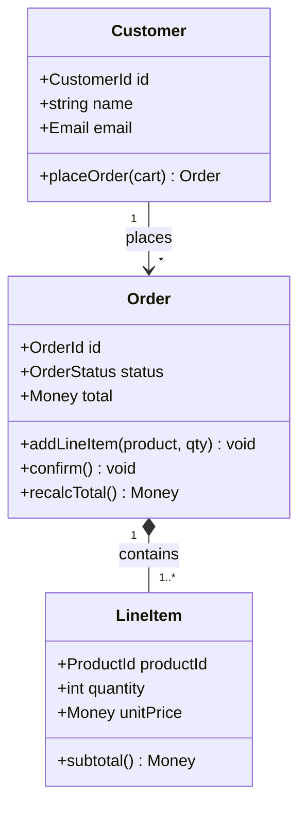
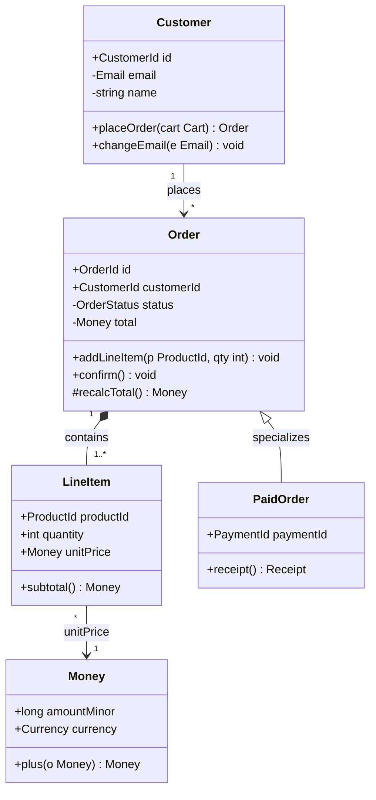

## 解決什麼問題

用文字描述「Order 有很多 LineItem、Customer 可以下很多單」很容易遺漏**關聯方向、多重度（multiplicity）、誰擁有誰（ownership）**。
Class Diagram 強迫把**物件結構、屬性型別、方法簽章、類別間關聯與多重度**畫出來，讓 Dev 照圖直接建 entity / 型別，是最早抓出 anemic domain model（只有 getter/setter 沒有行為）與 god class（一個類別塞所有邏輯）的最便宜工具。
不畫，整合到一半才發現 `Order` 與 `LineItem` 的 1:* 關係被實作成雙向可變參考，刪一筆 order 留下孤兒 line item。

## 誰負責、和誰對接

- **主責：** SD
- **協作：** Dev Lead（驗證型別與實作可行）、Architect（對齊 BC 邊界、不跨 aggregate 亂引用）、DBA（對齊 ORM mapping 與 entity ↔ table）
- **下游收件：** Dev 建 entity / 型別 / 領域服務、DBA 對應 schema 與 FK、QA 依 invariant 設計測試

## 何時用、何時不用

- ✅ **必要時機：** OO 領域模型複雜、有繼承 / 組合 / 多型、需要 DDD aggregate 邊界、ORM entity 設計
- ❌ **不需要時：** 純 CRUD DTO / 純資料搬運、無行為的 config 物件、函數式 / 純 procedural 服務
- ⚠️ **常見誤用：** 把每個 getter/setter 都逆向畫出來——**模型領域，不模型 boilerplate**；類別圖的價值在表達**關聯、多重度、ownership 與 invariant**，不是把 IDE outline 抄一遍。簡單 CRUD DTO 不需要類別圖，畫了只是噪音。

## AI 怎麼加速

把 data-model（entity 與欄位）+ use case（領域行為）+ 既有 module-design / api-spec 整份丟給 agent，讓 agent 讀範本內的 `> [!IMPORTANT]` 規則與 `<!-- ai-fill -->` 註解自己填，**人工只審 aggregate 邊界與 invariant 是否落在模型裡**。本卡輸出**真實 class-diagram markdown 文件**（含 Mermaid `classDiagram`、class responsibility 表格、relationship 表格、inline `[H/M/L]` badge），**不出 YAML / JSON schema**——schema 是 data-model 卡的事。

## 文件範本

下面兩個 tab 是同一份契約的兩種版本，AI 讀同一份範本可雙模式輸出：**輕量範本** 給單一 aggregate / 3-4 類別 / 無複雜繼承場景用（只畫核心類別圖 + 責任 + 風險），**完整範本** 給多 aggregate / 有繼承或多型 / 需明示 DDD 邊界場景用（含 aggregate boundary、value object vs entity、invariant、enum/state）。**只畫類別框沒畫關聯多重度 = 沒畫**。class diagram 的價值就在 association / composition / inheritance 的方向與多重度，以及模型裡守住的 invariant。範本內所有 `> [!IMPORTANT]` 是 AI 章節級規則、`<!-- ai-fill / ai-rule -->` 是欄位級微指引、結尾 `> [!CAUTION]` 是輸出前自檢清單。

````template-light
---
doc_type: "class-diagram"
variant: "light"
status: "draft"
owner: "<your-name>"
last_updated: "YYYY-MM-DD"
upstream:
  required: ["data-model", "use-case"]
  optional: ["module-design", "api-spec"]
---

# Class Diagram: <domain-name>

**Status:** Draft · **Owner:** <SD> · **Last updated:** YYYY-MM-DD

> [!IMPORTANT]
> **AI 填寫規則：** 本範本 5 段（編號 1, 2, 3, 9, 12），全部必填——刻意沿用完整版的章節編號讓兩版可對照。每結論行內加 `（依據：data-model §XXX / use-case §YYY）`；每欄位帶 `[H]/[M]/[L]` confidence badge；缺資料寫 `_TODO: 需要 XXX_` 不編造類別或關聯；**核心紀律：模型領域，不模型 boilerplate；組合優先於繼承**；**每條 relationship 必標多重度（如 "1" / "*"）**；類別不可只有 getter/setter（anemic model 不接受），至少帶 1 個有行為的方法。

---

## 1. Executive Summary

<!-- ai-fill: 3-5 行說明本圖涵蓋的 domain、含幾個類別、aggregate root 是誰、最關鍵的 invariant -->

<3-5 行說明：本圖建哪個領域模型、aggregate root、最關鍵 invariant>

> **TL;DR:** <一句話：Order aggregate root + LineItem composition + Customer association，核心 invariant 是 total = Σ line items>

---

## 2. Class Diagram



---

## 3. Class Responsibilities

| Class | Responsibility | Key invariants | Confidence |
|---|---|---|---|
| Customer | 帳戶身分 + 下單入口 | email 唯一且已驗證 | **[H]** |
| Order | aggregate root；訂單狀態與金額一致性 | total = Σ lineItem.subtotal；至少 1 個 LineItem | **[H]** |
| LineItem | 單一商品行；數量 × 單價 | quantity ≥ 1；unitPrice ≥ 0 | **[H]** |

---

## 9. Design Risks

<!-- ai-rule: 至少列 3 個（anemic domain model / god class / inheritance-over-composition） -->

> **R1:** <e.g. Order 若只剩 getter/setter，金額一致性散到 service = anemic domain model> — **Mitigation:** invariant 收進 Order.recalcTotal()
>
> **R2:** <e.g. Order 同時管狀態機 + 金額 + 出貨 = god class> — **Mitigation:** 拆出 ShippingPolicy 值物件
>
> **R3:** <e.g. 用繼承表達 OrderType 變體導致深繼承樹> — **Mitigation:** 組合優先於繼承，用 strategy

---

## 12. Confidence & Sources & TODO

- **整份文件最低 confidence 欄位：** <列出所有 [L] 與 [M]>
- **Fabricated assumptions（推測但 input 未明說）：**
  - <假設 1：例：假設 Order 為 aggregate root（data-model 未明示邊界）>
- **Highest-value next input:** <下一份最該補的：完整 use case 例外流程 / DBA ORM mapping 確認>

### TODO（缺資料）

- _TODO: 需要 Architect 確認 Order / Customer 是否屬同一 aggregate_

---

> [!CAUTION]
> **輸出前 AI 自檢：**
> - [ ] 5 段 H2 章節齊全（編號 1, 2, 3, 9, 12，刻意不連號）
> - [ ] Class Diagram 含 mermaid classDiagram（屬性帶型別、方法帶行為）
> - [ ] 每條 relationship 標多重度（"1" / "*" / "1..*"）
> - [ ] 無 anemic-model-only 類別（每類別至少 1 個有行為方法）
> - [ ] aggregate root 已標明
> - [ ] 無 YAML / JSON schema 輸出（schema 屬 data-model 卡）
````

````template-full
---
doc_type: "class-diagram"
variant: "full"
status: "draft"
owner: "<your-name>"
last_updated: "YYYY-MM-DD"
upstream:
  required: ["data-model", "use-case"]
  optional: ["module-design", "api-spec"]
---

# Class Diagram: <domain-name>

**Status:** Draft · **Owner:** <SD> · **Last updated:** YYYY-MM-DD · **Reviewers:** Dev Lead / Architect / DBA

> [!IMPORTANT]
> **AI 填寫規則：** 12 段 H2 章節全部必填（任一缺失即不合格）。每結論行內 `（依據：data-model §XXX / use-case §YYY）`；每欄位 `[H/M/L]` badge；缺資料寫 `_TODO: 需要 XXX_` 不編造類別、關聯或 invariant；**核心紀律：模型領域，不模型 boilerplate；組合優先於繼承**；**每條 relationship 必標 type（association / aggregation / composition / inheritance / realization）+ 多重度**；類別需標 visibility（+ public / - private / # protected）、屬性帶型別、方法帶簽章；必須區分 value object 與 entity，並明示 aggregate 邊界；invariant 必須落在模型方法裡（不可只散在 service）；禁 YAML/JSON schema 輸出。

---

## 1. Executive Summary
<!-- owner: SD · required: always -->

<!-- ai-fill: 3-5 行說明本圖 domain、含幾個 aggregate、aggregate root、value object、最高風險 invariant -->

<3-5 行說明>

> **TL;DR:** <一句話：Order aggregate（root=Order）+ Customer aggregate，跨 aggregate 只用 id 參考，核心 invariant 是金額一致性>

---

## 2. Class Diagram
<!-- owner: SD · required: always -->

<!-- ai-rule: 標 visibility（+/-/#）、屬性帶型別、方法帶簽章。組合用 *--，繼承用 <|--，實作用 ..|> -->



---

## 3. Class Responsibilities
<!-- owner: SD + Dev Lead · required: always -->

| Class | Responsibility | Key invariants | Confidence |
|---|---|---|---|
| Customer | aggregate root；身分 + 下單入口 | email 唯一且已驗證 | **[H]** |
| Order | aggregate root；訂單狀態機 + 金額一致性 | total = Σ lineItem.subtotal；≥ 1 LineItem；status 轉移合法 | **[H]** |
| LineItem | aggregate 內部 entity；商品行 | quantity ≥ 1；unitPrice ≥ 0 | **[H]** |
| Money | value object；金額 + 幣別 | amountMinor ≥ 0；同幣別才可加 | **[H]** |
| PaidOrder | Order 已付款特化 | 必有 paymentId | **[M]** |

---

## 4. Relationships
<!-- owner: SD + Architect · required: always -->

<!-- ai-rule: 每條標 type + 多重度。跨 aggregate 只能 association by id，不可 composition -->

| From | To | Type | Multiplicity | Confidence |
|---|---|---|---|---|
| Customer | Order | association (by id) | 1 → * | **[H]** |
| Order | LineItem | composition | 1 → 1..* | **[H]** |
| LineItem | Money | aggregation | * → 1 | **[H]** |
| PaidOrder | Order | inheritance | — | **[M]** |
| Order | OrderRepository | realization (port) | 1 → 1 | **[M]** |

---

## 5. Aggregate Boundaries
<!-- owner: Architect · required: full-only -->

<!-- ai-rule: 列出 DDD aggregate root，明示一致性邊界內含哪些 entity / value object；跨邊界只能用 id 參考 -->

| Aggregate | Root | Inside boundary | Cross-aggregate refs | Confidence |
|---|---|---|---|---|
| Order aggregate | Order | Order, LineItem, Money (VO) | Customer 用 customerId（非物件參考） | **[H]** |
| Customer aggregate | Customer | Customer, Email (VO) | Order 用 orderId 反查 | **[H]** |

- **一致性規則：** 一個 transaction 只修改一個 aggregate；Order 與 Customer 跨 aggregate 用 id + eventual consistency（依據：data-model §邊界 / use-case §下單）。

---

## 6. Value Objects vs Entities
<!-- owner: SD · required: full-only -->

<!-- ai-rule: 區分 entity（有 id、可變、生命週期）與 value object（無 id、不可變、以值相等） -->

| Type | Name | Identity | Mutability | Equality | Confidence |
|---|---|---|---|---|---|
| Entity | Order | OrderId | mutable（狀態機） | by id | **[H]** |
| Entity | LineItem | local id（aggregate 內） | mutable | by id within aggregate | **[H]** |
| Value Object | Money | none | immutable | by value (amount + currency) | **[H]** |
| Value Object | Email | none | immutable | by value | **[H]** |

---

## 7. Key Methods & Invariants
<!-- owner: SD + Dev Lead · required: full-only -->

<!-- ai-rule: 列出守 business rule 的方法，每條寫清楚它強制的 invariant -->

| Class.method | Business rule enforced | Confidence |
|---|---|---|
| `Order.addLineItem(p, qty)` | qty ≥ 1；同 product 合併行而非新增；呼叫後 recalcTotal | **[H]** |
| `Order.confirm()` | 僅 DRAFT → PENDING；至少 1 LineItem；否則 throw | **[H]** |
| `Order.recalcTotal()` | total = Σ lineItem.subtotal，保證金額一致性 | **[H]** |
| `Money.plus(o)` | 僅同 currency 可加，否則 throw CurrencyMismatch | **[H]** |

---

## 8. Enums & State
<!-- owner: SD · required: full-only -->

<!-- ai-rule: 列出領域 enum；若有狀態機，連到 state-diagram 卡，不在此重畫轉移 -->

| Enum | Values | Note |
|---|---|---|
| OrderStatus | DRAFT, PENDING, PAID, SHIPPED, CANCELLED | 完整轉移規則見 state-diagram 卡 |
| Currency | TWD, USD, JPY | ISO 4217 子集 |

- **狀態轉移細節不在此圖**——`OrderStatus` 的合法轉移、guard、副作用屬 **state-diagram 卡**；本圖只列舉 enum 值。

---

## 9. Design Risks
<!-- owner: SD + Dev Lead · required: always -->

<!-- ai-rule: 至少 3 個。每條格式：失效模式 + Mitigation + Owner。涵蓋 anemic domain model / god class / inheritance-over-composition -->

> **R1:** <e.g. Order 金額一致性若散到 OrderService 而非 Order 本身 = anemic domain model> — **Mitigation:** invariant 收進 Order.recalcTotal() / addLineItem() — **Owner:** <SD>
>
> **R2:** <e.g. Order 同時管狀態機 + 金額 + 出貨 + 退款 = god class> — **Mitigation:** 拆出 ShippingPolicy / RefundPolicy 值物件與領域服務 — **Owner:** <Dev Lead>
>
> **R3:** <e.g. 用 PaidOrder/ShippedOrder 繼承表達狀態 = inheritance-over-composition，狀態切換需換型別> — **Mitigation:** 狀態用 OrderStatus enum + state，組合優先於繼承 — **Owner:** <Architect>

---

## 10. Decision Log
<!-- owner: Architect · required: always -->

<!-- ai-rule: 每條必含 ≥ 2 個 rejected options + 各自 rejected reason -->

| Date | Decision | Options considered | Chosen | Rejected why | Confidence |
|---|---|---|---|---|---|
| YYYY-MM-DD | 訂單狀態表達 | enum + state / 子類別繼承 / 旗標欄位 | enum + state | 子類別繼承（狀態切換需換型別、深繼承）、旗標欄位（多旗標互斥靠人記） | **[H]** |
| YYYY-MM-DD | Order ↔ Customer 關係 | 物件參考 / by id association | by id association | 物件參考（跨 aggregate 直連破壞一致性邊界、ORM lazy-load 地雷） | **[H]** |

---

## 11. Out of Scope
<!-- owner: SD · required: full-only -->

本 Class Diagram **不處理**：

- ❌ **DB 物理 schema / 欄位型別 / index** — 屬 data-model 卡
- ❌ **元件 / 模組接線（哪個 service 呼叫哪個）** — 屬 component-design 卡
- ❌ **方法層級的呼叫時序 / failure path** — 屬 sequence-diagram 卡
- ❌ **狀態轉移規則 / guard / 副作用** — 屬 state-diagram 卡

---

## 12. Confidence & Sources & TODO
<!-- owner: All · required: always -->

- **整份文件最低 confidence 欄位：** <列出所有 [L] 與 [M] 欄位>
- **Fabricated assumptions（推測但 input 未明說的）：**
  - <假設 1：例：假設 Order 為 aggregate root（data-model 未明示邊界）>
  - <假設 2：例：假設 Money 為 value object 而非共享 entity>
- **Highest-value next input:** <下一份最該補的：DBA ORM mapping 確認 / use-case 例外流程 / state-diagram 對齊 enum>

### TODO（缺資料）

- _TODO: 需要 Architect 確認 Order / Customer aggregate 邊界_
- _TODO: 需要 DBA 確認 LineItem 是否獨立 table 或 embedded_

---

> [!CAUTION]
> **輸出前 AI 自檢：**
> - [ ] 12 段 H2 章節齊全（編號 1-12）
> - [ ] Class Diagram 含 mermaid classDiagram（visibility +/-/#、屬性帶型別、方法帶簽章）
> - [ ] 每條 relationship 標 type（association / aggregation / composition / inheritance / realization）+ 多重度
> - [ ] aggregate root 已標明，跨 aggregate 只用 id 參考（非物件參考）
> - [ ] value object vs entity 已區分（identity / mutability / equality）
> - [ ] invariant 落在模型方法裡（無 anemic-model-only 類別）
> - [ ] Enum 列舉但狀態轉移交給 state-diagram 卡（不重畫）
> - [ ] Design Risks ≥ 3（涵蓋 anemic / god class / inheritance-over-composition）
> - [ ] Decision Log 每條 ≥ 2 個 rejected options + 各自 reason
> - [ ] 無 YAML / JSON schema 輸出（schema 屬 data-model 卡，本卡用 mermaid + 表格表達）
````

## 怎麼觸發

先在上方 tab 選「輕量範本」或「完整範本」、按複製存到你的 AI 工作環境（web chat 對話框、Claude Code / Cursor / Aider 等 harness agent 的 context、或專案內任何 markdown 檔），再複製下面這段、把貼位區換成你的真實文件全文，給 AI：

```trigger
請依據以下「文件範本」與「上游文件」產出 Class Diagram markdown。嚴格遵守範本內所有 `> [!IMPORTANT]` 規則、`<!-- ai-fill -->` / `<!-- ai-rule -->` 欄位指引，並在結尾跑完 `> [!CAUTION]` 自檢清單。**只畫類別框沒畫關聯多重度等於沒畫** — 每條 relationship 必標 type + 多重度，且模型領域不模型 boilerplate。

## 文件範本（貼這裡）
⏬
（貼上面選好的「輕量範本」或「完整範本」全文）
⏫

## 上游文件（貼這裡）
⏬
（貼 data-model.md / use-case.md / module-design.md / api-spec.md 全文）
⏫
```

> [!TIP]
> **常見錯誤：** anemic domain model（類別只剩 getter/setter、行為散到 service）、god class（一個 Order 塞狀態機 + 金額 + 出貨 + 退款）、繼承濫用（用子類別表達狀態，狀態切換得換型別，應組合優先於繼承）、relationship 沒標多重度（1 vs * 不分，Dev 不知該建 list 還是單一參考）、跨 aggregate 用物件參考而非 id（破壞一致性邊界、ORM lazy-load 地雷）、把類別圖畫成 ERD（混進 DB 欄位與 index，那是 data-model 卡的事）。AI 若漏這些，自檢清單會抓到並回頭補。
