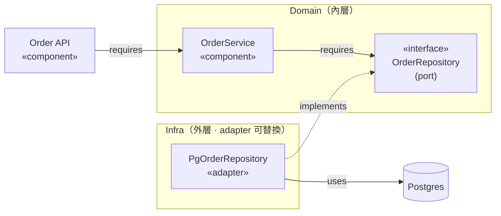
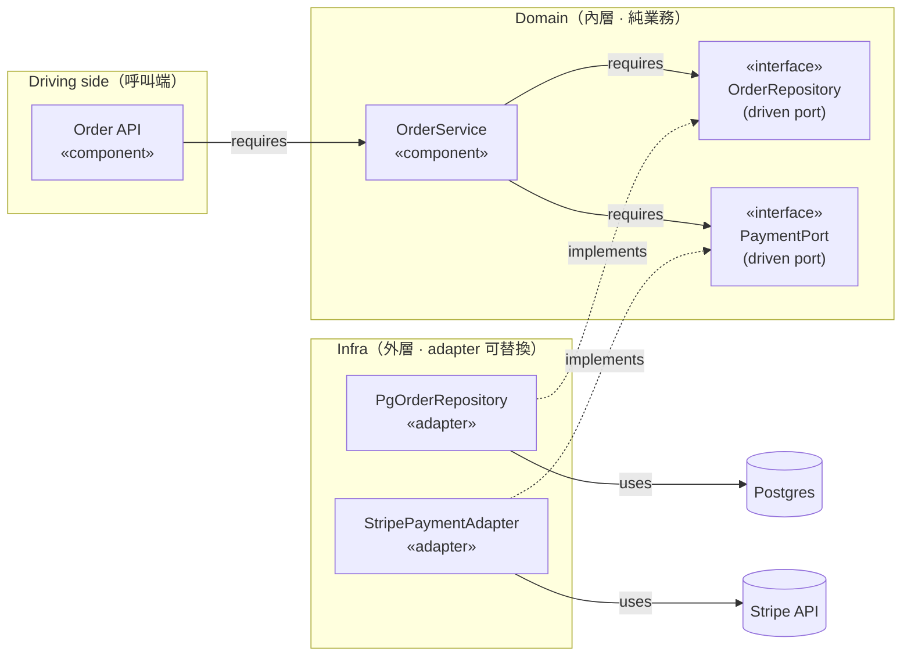

## 解決什麼問題

模組內部「誰呼叫誰」用一句話描述「Service 用 Repository」很模糊：沒定義介面契約，元件就被具體實作綁死——換掉 Postgres 要改 domain、寫單元測試只能起真資料庫。
Component Design 強迫把**介面契約（provided / required interface）、依賴方向、port 與 adapter 的對應**釘出來，是讓元件能**獨立替換、獨立測試**的最便宜工具。
核心紀律是 **依賴指向內層 (domain)，adapter 可替換**：domain 定義 port、infra 提供 adapter、依賴箭頭只准朝內。
不釘，整合測試才發現 domain import 了 Postgres driver、mock 不掉外部依賴、換金流要動到業務邏輯。

## 誰負責、和誰對接

- **主責：** SD（System Designer）
- **協作：** Dev Lead（驗證介面契約可實作）、Architect（確認元件邊界不越界）、QA（設計 test double / 替身）
- **下游收件：** Dev 依介面實作元件、QA 依 test seam 寫單元測試

## 何時用、何時不用

- ✅ **必要時機：** 模組需定義 port/adapter、跨團隊共用元件、要寫單元測試替身、外部依賴需可替換（DB / 金流 / 通知）
- ❌ **不需要時：** 純 CRUD 薄層、一次性腳本、無外部依賴的工具函式
- ⚠️ **常見誤用：** 介面契約只寫方法名沒寫錯誤行為與邊界、依賴方向朝外（domain import infra）、port 與 adapter 一對一硬綁（失去替換意義）；業界實踐強調**抽象會洩漏（leaky abstraction）**——介面若回傳 infra 專屬型別（如 `sql.Rows`），等於沒抽象

## AI 怎麼加速

把 module design（元件清單 + 職責）+ API spec（對外契約）+ 既有 class diagram / ADR 整份丟給 agent，讓 agent 讀範本內的 `> [!IMPORTANT]` 規則與 `<!-- ai-fill -->` 註解自己填，**人工只審依賴方向與抽象是否洩漏**。本卡輸出**真實 Component Design markdown 文件**（含 Mermaid 元件圖、interface contract 表格、dependency-injection wiring 表、inline `[H/M/L]` badge），**不出 YAML schema**。

## 文件範本

下面兩個 tab 是同一份契約的兩種版本，AI 讀同一份範本可雙模式輸出：**輕量範本** 給單模組 / ≤ 4 元件 / 只有 1-2 個外部依賴場景用（畫元件圖 + 介面契約 + 風險），**完整範本** 給跨團隊共用元件 / hexagonal port-adapter / 多外部依賴需可替換場景用（含依賴注入、port/adapter 對應、生命週期、test seam、邊界行為）。**介面契約只寫方法名 = 沒寫**——必須寫清楚 provided / required interface、錯誤行為、邊界。範本內所有 `> [!IMPORTANT]` 是 AI 章節級規則、`<!-- ai-fill / ai-rule -->` 是欄位級微指引、結尾 `> [!CAUTION]` 是輸出前自檢清單。

````template-light
---
doc_type: "component-design"
variant: "light"
status: "draft"
owner: "<your-name>"
last_updated: "YYYY-MM-DD"
upstream:
  required: ["module-design", "api-spec"]
  optional: ["class-diagram", "adr"]
---

# Component Design: <module-name>

**Status:** Draft · **Owner:** <SD> · **Last updated:** YYYY-MM-DD

> [!IMPORTANT]
> **AI 填寫規則：** 本範本 5 段（編號 1, 2, 3, 9, 12），全部必填——刻意沿用完整版的章節編號讓兩版可對照。每結論行內加 `（依據：module-design §XXX / api-spec §YYY）`；每欄位帶 `[H]/[M]/[L]` confidence badge；缺資料寫 `_TODO: 需要 XXX_` 不編造元件或介面。**核心紀律：依賴指向內層 (domain)，adapter 可替換**——元件圖的依賴箭頭只准朝內，任何 domain → infra 的箭頭即不合格。介面契約須含 provided + required interface，只寫方法名不寫錯誤行為不接受。

---

## 1. Executive Summary

<!-- ai-fill: 3-5 行說明本模組含哪些元件、哪些是 domain port、哪些是 infra adapter、最高風險 -->

<3-5 行說明>

> **TL;DR:** <一句話：元件數 + 哪些 port 可替換 + 依賴方向>

---

## 2. Component Diagram

<!-- ai-rule: Mermaid 無原生 UML component 型別，用 flowchart 配 «interface» 標籤表達 provided/required interface；依賴箭頭只准朝內 (domain)。標出哪些是 port (interface)、哪些是 adapter (impl) -->



> 依賴方向：`API → Service → «OrderRepository» port`，adapter `PgOrderRepository` 由外層 implements port（箭頭朝內），換 DB 只換 adapter。

---

## 3. Interface Contracts

<!-- ai-rule: 每個元件列 provided interface（對外提供）+ required interface（向內依賴的 port）。只寫方法名不寫回傳/錯誤行為不接受 -->

| Component | Provided interface | Required interface (port) | Confidence |
|---|---|---|---|
| Order API | `POST createOrder(dto) → 201 \| 409` | `OrderService` | **[H]** |
| OrderService | `place(cmd) → Order \| DomainError` | `OrderRepository` | **[H]** |
| PgOrderRepository | implements `OrderRepository` | `Postgres pool` | **[M]** |

- `OrderRepository.save(order) → void \| ConflictError`：唯一鍵衝突回 `ConflictError`，不洩漏 `sql.Error`（依據：module-design §repo）

---

## 9. Risks

<!-- ai-rule: 至少 3 個（leaky abstraction / hidden temporal coupling / circular DI），每條含失效模式 + Mitigation + Owner -->

> **R1:** <e.g. `OrderRepository.find` 回傳 `sql.Rows`（leaky abstraction），domain 被 driver 綁死> — **Mitigation:** port 只回 domain 型別 — **Owner:** <SD>
>
> **R2:** <e.g. Service 假設 Repository 已先呼叫 `init()`（hidden temporal coupling）> — **Mitigation:** 建構子注入完成即可用 — **Owner:** <Dev Lead>
>
> **R3:** ...

---

## 12. Confidence & Sources & TODO

- **整份文件最低 confidence 欄位：** <列出所有 [L] 與 [M]>
- **Fabricated assumptions（推測但 input 未明說）：**
  - <假設 1：例：假設 OrderRepository 用 Postgres adapter（module-design 未指定）>
- **Highest-value next input:** <下一份最該補的：class-diagram（元件內部結構）/ ADR（持久化選型）>

### TODO（缺資料）

- _TODO: 需要 Dev Lead 確認 OrderRepository port 是否需支援 batch save_

---

> [!CAUTION]
> **輸出前 AI 自檢：**
> - [ ] 5 段 H2 章節齊全（編號 1, 2, 3, 9, 12，刻意不連號）
> - [ ] Component Diagram 含 mermaid，標出 port (interface) vs adapter (impl)
> - [ ] 依賴箭頭只朝內（無 domain → infra 箭頭）
> - [ ] 每個元件有 provided + required interface（非只方法名，含錯誤行為）
> - [ ] Risks ≥ 3（含 leaky abstraction / temporal coupling / circular DI）
> - [ ] 無 YAML / JSON schema 輸出（用 mermaid + 表格表達）
````

````template-full
---
doc_type: "component-design"
variant: "full"
status: "draft"
owner: "<your-name>"
last_updated: "YYYY-MM-DD"
upstream:
  required: ["module-design", "api-spec"]
  optional: ["class-diagram", "adr"]
---

# Component Design: <module-name>

**Status:** Draft · **Owner:** <SD> · **Last updated:** YYYY-MM-DD · **Reviewers:** Dev Lead / Architect / QA

> [!IMPORTANT]
> **AI 填寫規則：** 12 段 H2 章節全部必填（任一缺失即不合格）。每結論行內 `（依據：module-design §XXX / api-spec §YYY）`；每欄位 `[H/M/L]` badge；缺資料寫 `_TODO: 需要 XXX_` 不編造元件或介面。**核心紀律：依賴指向內層 (domain)，adapter 可替換**——hexagonal inward-only dependency rule：domain 定義 port、infra 提供 adapter、依賴箭頭只准朝內，任何 domain → infra 的依賴即不合格須在 Decision Log 說明；介面契約須含 provided + required interface + 錯誤行為 + 邊界（只寫方法名不接受）；抽象不得洩漏 infra 專屬型別（leaky abstraction）；每個對外 port 須有 test seam（可被 mock/stub）；Risks ≥ 3；Decision Log 每條 ≥ 2 個 rejected options；禁 YAML/JSON schema 輸出。

---

## 1. Executive Summary
<!-- owner: SD · required: always -->

<!-- ai-fill: 3-5 行說明本模組含哪些元件、哪些是 domain port、哪些是 infra adapter、依賴方向、最高風險 -->

<3-5 行說明>

> **TL;DR:** <一句話：元件數 + hexagonal port/adapter 模型 + 哪些可替換 + 依賴方向朝內>

---

## 2. Component Diagram
<!-- owner: SD · required: always -->

<!-- ai-rule: Mermaid 無原生 UML component 型別，用 flowchart 配 «interface» 標籤表達 provided/required interface（或 C4Component）；依賴箭頭只准朝內。實線 = uses/requires、虛線 = implements -->



> 依賴方向：箭頭只從外往內（API → Service → port），adapter 由外層 `implements` port（虛線），domain 不知道 Postgres / Stripe 存在。換 DB / 金流 = 換 adapter，不動 domain。

---

## 3. Interface Contracts
<!-- owner: SD + Dev Lead · required: always -->

<!-- ai-rule: 每個元件列 provided interface（對外提供）+ required interface（向內依賴的 port）。回傳型別須為 domain 型別、錯誤行為必填。只寫方法名不接受 -->

| Component | Provided interface | Required interface (port) | Confidence |
|---|---|---|---|
| Order API | `createOrder(CreateOrderDto) → 201 OrderView \| 409 Conflict` | `OrderService` | **[H]** |
| OrderService | `place(PlaceOrderCmd) → Order \| DomainError` | `OrderRepository`, `PaymentPort` | **[H]** |
| PgOrderRepository | implements `OrderRepository` | `Postgres pool` | **[H]** |
| StripePaymentAdapter | implements `PaymentPort` | `Stripe SDK` | **[M]** |

詳細契約（含錯誤與邊界）：

- `OrderRepository.save(order: Order) → void | ConflictError`：唯一鍵衝突回 domain `ConflictError`，**不洩漏** `sql.Error`（依據：module-design §repo / api-spec §POST /orders）
- `OrderRepository.findById(id: OrderId) → Order | null`：查無回 `null`，不丟例外
- `PaymentPort.charge(orderId, amount) → PaymentResult | PaymentError`：timeout / 拒付一律映成 domain `PaymentError`（依據：api-spec §payment）

---

## 4. Dependency Direction & Injection
<!-- owner: SD + Architect · required: always -->

<!-- ai-rule: 列出 who depends on whom；標明 port (domain 定義) vs adapter (infra 實作)；闡明 inward-only dependency rule -->

| Depender | Depends on | Kind | Inward? | Confidence |
|---|---|---|---|---|
| Order API | `OrderService` | concrete (domain) | ✅ inward | **[H]** |
| OrderService | `OrderRepository` (port) | abstraction | ✅ inward | **[H]** |
| OrderService | `PaymentPort` (port) | abstraction | ✅ inward | **[H]** |
| PgOrderRepository | `OrderRepository` (port) | implements | ✅ inward (adapter→port) | **[H]** |
| StripePaymentAdapter | `PaymentPort` (port) | implements | ✅ inward | **[M]** |

- **Inward-only rule（hexagonal）：** 依賴箭頭一律朝 domain；domain 只認 port（interface），不 import 任何 infra 套件。違反須在 §10 記錄。
- **注入方式：** 建構子注入（constructor injection）。composition root 在 `main`/`bootstrap`，由它 new adapter 並注入 service（依據：module-design §wiring）。

```mermaid
flowchart TB
    ROOT["Composition Root<br/>(main / bootstrap)"]
    ROOT -->|new + inject| REPO["PgOrderRepository"]
    ROOT -->|new + inject| PAY["StripePaymentAdapter"]
    ROOT -->|new OrderService(repo, pay)| SVC["OrderService"]
    ROOT -->|new + inject svc| API["Order API"]
```

---

## 5. Ports & Adapters Mapping
<!-- owner: SD · required: full-only -->

<!-- ai-rule: 每個 domain port 對應其 infra adapter；標出 test 用的替身 adapter -->

| Domain port (interface) | Prod adapter | Test adapter (seam) | Swappable? | Confidence |
|---|---|---|---|---|
| `OrderRepository` | `PgOrderRepository` (Postgres) | `InMemoryOrderRepository` | ✅ 換 DB 只換 adapter | **[H]** |
| `PaymentPort` | `StripePaymentAdapter` | `FakePaymentAdapter` | ✅ 換金流只換 adapter | **[M]** |
| `EventPublisherPort` | `KafkaPublisher` | `RecordingPublisher` | ✅ | **[M]** |

> 替換準則：domain 端只要 port 簽章不變，prod / test / 替代供應商 adapter 可互換而不動業務邏輯。

---

## 6. Lifecycle & State
<!-- owner: SD + Dev Lead · required: full-only -->

<!-- ai-rule: 每個元件標 scope（singleton / scoped / transient）+ init / dispose 行為 -->

| Component | Scope | Init | Dispose | Confidence |
|---|---|---|---|---|
| `Postgres pool` | singleton | 啟動建 pool（min/max conn） | graceful drain on SIGTERM | **[H]** |
| `PgOrderRepository` | singleton | 注入 pool，無額外狀態 | none（stateless over pool） | **[H]** |
| `OrderService` | singleton | constructor 注入 ports 即可用 | none | **[H]** |
| `StripePaymentAdapter` | singleton | 讀 API key + 建 HTTP client | close keep-alive conn | **[M]** |
| request context (per-request) | scoped | per HTTP request 建 | request 結束釋放 | **[M]** |

> 紀律：domain 元件無 init 順序依賴（避免 hidden temporal coupling）；建構完成即 ready。

---

## 7. Test Seams
<!-- owner: QA + SD · required: full-only -->

<!-- ai-rule: 每個 port / 外部依賴標明該 mock 還是 stub，以及測什麼 -->

| Interface / dependency | Double type | What to fake | What it enables | Confidence |
|---|---|---|---|---|
| `OrderRepository` | fake (in-memory) | save / findById | service 純單元測試免起 DB | **[H]** |
| `PaymentPort` | mock | charge 回 success / `PaymentError` | 測補償與失敗分支 | **[H]** |
| `EventPublisherPort` | spy (recording) | 記錄 publish 呼叫 | 驗證有發 `OrderCreated` | **[M]** |
| `Clock` / time | stub | 固定 now() | 測 TTL / 過期 | **[M]** |

> 每個對外 port 都必須有 seam：若某依賴無法注入替身，代表它沒抽成 port（回頭補 §3）。

---

## 8. Error & Boundary Behaviour
<!-- owner: SD + Dev Lead · required: full-only -->

<!-- ai-rule: 每個 interface 標明錯誤如何映射（infra error → domain error）與邊界輸入行為 -->

| Interface | Infra error | Maps to domain | Boundary input | Confidence |
|---|---|---|---|---|
| `OrderRepository.save` | unique violation | `ConflictError` | null order → 立即拒絕 | **[H]** |
| `OrderRepository.findById` | conn timeout | `RepositoryUnavailable` | 未知 id → 回 `null` 非例外 | **[H]** |
| `PaymentPort.charge` | HTTP 5xx / timeout | `PaymentError(retryable)` | amount ≤ 0 → `ValidationError` | **[M]** |
| `EventPublisherPort.publish` | broker down | `PublishError` | 由 outbox 補償，不阻塞主流程 | **[M]** |

> 邊界紀律：adapter 負責把 infra 專屬例外**轉譯**成 domain error；domain 不得 catch infra 型別（否則抽象洩漏）。

---

## 9. Risks
<!-- owner: All · required: always -->

<!-- ai-rule: 至少 3 個（leaky abstraction / hidden temporal coupling / circular DI），每條含失效模式 + Mitigation + Owner -->

> **R1（leaky abstraction）:** <e.g. `OrderRepository.find` 回傳 `sql.Rows` 或 ORM entity，domain 被 driver 綁死，換 DB 即破> — **Mitigation:** port 只回 domain 型別，adapter 內部轉譯 — **Owner:** <SD>
>
> **R2（hidden temporal coupling）:** <e.g. `OrderService` 假設 `Repository.connect()` 已先被呼叫，順序錯就 NPE> — **Mitigation:** 建構子注入已連線的 pool，建好即 ready — **Owner:** <Dev Lead>
>
> **R3（circular DI）:** <e.g. `OrderService` 依賴 `NotificationService`，後者又回頭依賴 `OrderService`，composition root 無法 new> — **Mitigation:** 抽共用 port 或改 event-driven 解耦 — **Owner:** <Architect>

---

## 10. Decision Log
<!-- owner: SD + Architect · required: always -->

<!-- ai-rule: 每條必含 ≥ 2 個 rejected options + 各自 rejected reason -->

| Date | Decision | Options considered | Chosen | Rejected why | Confidence |
|---|---|---|---|---|---|
| YYYY-MM-DD | 持久化抽象方式 | active record / repository port / 直接 SQL in service | repository port | active record（domain 綁 ORM）、直接 SQL（無 test seam、抽象洩漏） | **[H]** |
| YYYY-MM-DD | 依賴注入方式 | service locator / 建構子注入 / 全域 singleton | 建構子注入 | service locator（隱藏依賴難測）、全域 singleton（temporal coupling + 不可替換） | **[H]** |

---

## 11. Out of Scope
<!-- owner: SD · required: full-only -->

本 Component Design **不處理**：

- ❌ **模組如何切分 / 模組邊界** — 屬 module-design 卡
- ❌ **元件內部 class 結構 / 欄位與方法明細** — 屬 class-diagram 卡
- ❌ **wire-level API 契約（HTTP 動詞 / status / payload schema）** — 屬 api-spec 卡
- ❌ **部署 / 容器 topology** — 屬 deployment-diagram 卡

---

## 12. Confidence & Sources & TODO
<!-- owner: All · required: always -->

- **整份文件最低 confidence 欄位：** <列出所有 [L] 與 [M] 欄位>
- **Fabricated assumptions（推測但 input 未明說的）：**
  - <假設 1：例：假設 OrderRepository 用 Postgres adapter（module-design 未指定持久化）>
  - <假設 2：例：假設 PaymentPort 對 Stripe（api-spec 未確認供應商）>
- **Highest-value next input:** <下一份最該補的：class-diagram（元件內部結構）/ ADR（持久化與金流選型）>

### TODO（缺資料）

- _TODO: 需要 Dev Lead 確認 OrderRepository port 是否需支援 batch / transaction span_
- _TODO: 需要 QA 確認 PaymentPort 的 test double 是否需模擬 webhook 回呼_

---

> [!CAUTION]
> **輸出前 AI 自檢：**
> - [ ] 12 段 H2 章節齊全（編號 1-12）
> - [ ] Component Diagram 含 mermaid，標出 port (interface) vs adapter (impl)
> - [ ] 依賴方向 inward-only（無 domain → infra 箭頭，違反須在 Decision Log 說明）
> - [ ] 每個元件有 provided + required interface（含回傳 domain 型別 + 錯誤行為，非只方法名）
> - [ ] Ports & Adapters 對應表每個 port 有 prod + test adapter
> - [ ] 每個元件標 lifecycle scope（singleton/scoped/transient）+ init/dispose
> - [ ] 每個對外 port 有 test seam（可 mock/stub）
> - [ ] Error & Boundary：adapter 把 infra error 轉譯成 domain error（無洩漏）
> - [ ] Risks ≥ 3（含 leaky abstraction / hidden temporal coupling / circular DI）
> - [ ] Decision Log 每條 ≥ 2 個 rejected options + 各自 reason
> - [ ] 無 YAML / JSON schema 輸出（用 mermaid + 表格表達）
````

## 怎麼觸發

先在上方 tab 選「輕量範本」或「完整範本」、按複製存到你的 AI 工作環境（web chat 對話框、Claude Code / Cursor / Aider 等 harness agent 的 context、或專案內任何 markdown 檔），再複製下面這段、把貼位區換成你的真實文件全文，給 AI：

```trigger
請依據以下「文件範本」與「上游文件」產出 Component Design markdown。嚴格遵守範本內所有 `> [!IMPORTANT]` 規則、`<!-- ai-fill -->` / `<!-- ai-rule -->` 欄位指引，並在結尾跑完 `> [!CAUTION]` 自檢清單。**核心紀律：依賴指向內層 (domain)，adapter 可替換** — domain 不得 import infra，介面契約須含 provided + required interface 與錯誤行為。

## 文件範本（貼這裡）
⏬
（貼上面選好的「輕量範本」或「完整範本」全文）
⏫

## 上游文件（貼這裡）
⏬
（貼 module-design.md（元件清單 + 職責）/ api-spec.md（對外契約）/ 既有 class-diagram / ADR 全文）
⏫
```

> [!TIP]
> **常見錯誤：** 依賴方向朝外（domain import Postgres / Stripe = hexagonal 破功）、介面契約只寫方法名沒寫錯誤與邊界行為（QA 無法設計替身）、抽象洩漏 infra 型別（port 回 `sql.Rows` / ORM entity，換實作即破）、port 與 adapter 一對一硬綁沒留 test seam（只能起真 DB 測）、circular DI 假裝沒有（composition root new 不出來才發現）。AI 若漏這些，自檢清單會抓到並回頭補。
