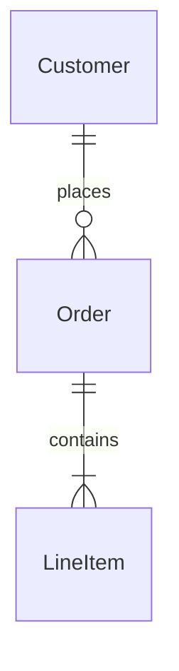
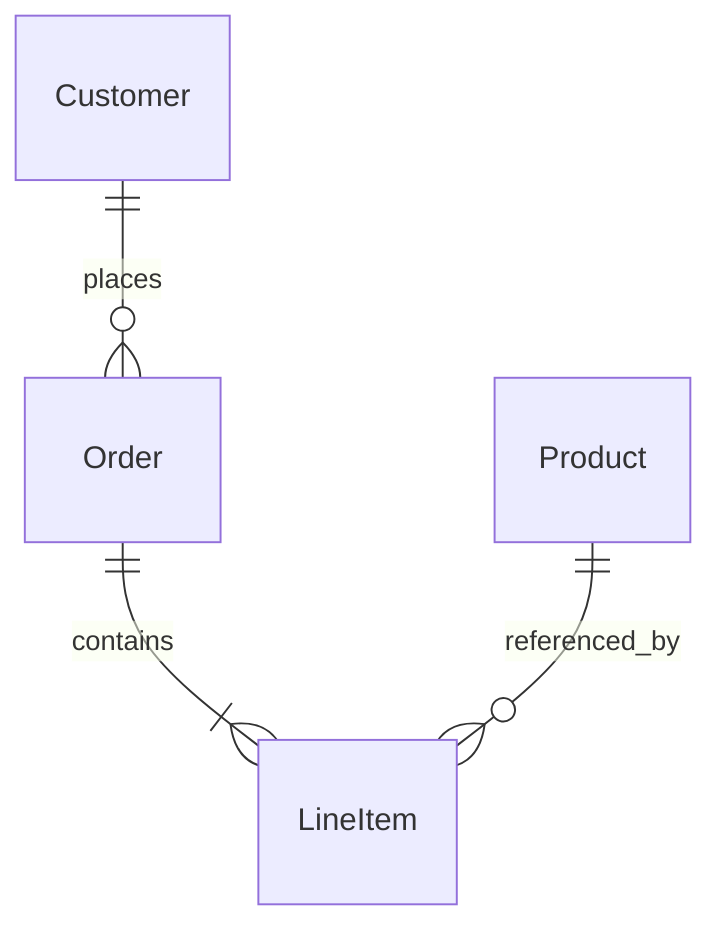
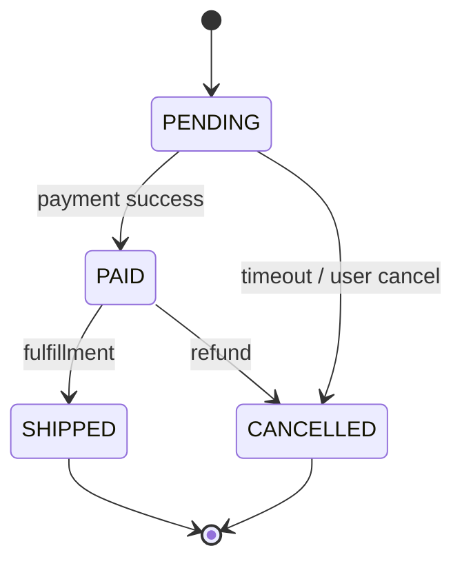

## 解決什麼問題

工程師憑直覺建表，半年後查歷史訂單發現 status 用 enum、誰改的、何時改的全沒紀錄。
資料模型是**長期資產**：API 可以改、UI 可以重做，但 data migration 成本永遠最高。
不先設計好 entity、關聯、constraint、retention，後面 migration 永遠在補洞。

## 誰負責、和誰對接

- **主責：** Architect（高層）/ DBA（物理層）/ Dev（實作）
- **協作：** SA（補業務規則）、BE（API 對應）、SRE（補 retention 與 backup）
- **下游收件：** BE 寫 ORM、DBA 寫 migration、QA 設計資料測試

## 何時用、何時不用

- ✅ **必要時機：** 新 entity 設計、跨系統整合、合規/稽核（有 PII / audit 需求）
- ❌ **不需要時：** 純前端 / stateless service、單一 key-value cache
- ⚠️ **常見誤用：** 只畫 entity 不畫 constraint / index / retention；Fowler 強調**所有 DB 變更應為 migration 且與 code 共版控**

## AI 怎麼加速

把 SRS + business rules + 既有 ER / 資料分類政策整份丟給 agent，讓 agent 讀範本內的 `> [!IMPORTANT]` 規則與 `<!-- ai-fill -->` 註解自己填，**人工只審 PII 標註與 audit 欄位**。本卡輸出**真實 Data Model markdown 文件**（含 entity 表格、relationship 表格、index 表格、Mermaid ERD、inline `[H/M/L]` badge），**不出 YAML schema**（migration DDL 由 ORM 從本文件衍生）。

## 文件範本

下面兩個 tab 是同一份契約的兩種版本，AI 讀同一份範本可雙模式輸出：**輕量範本** 給單一服務 / 內部資料 / 無合規負擔場景用，**完整範本** 給跨系統整合 / 含 PII/PCI/PHI / 合規稽核場景用。範本內所有 `> [!IMPORTANT]` 是 AI 章節級規則、`<!-- ai-fill / ai-rule -->` 是欄位級微指引、結尾 `> [!CAUTION]` 是輸出前自檢清單。

````template-light
---
doc_type: "data-model"
variant: "light"
status: "draft"
owner: "<your-name>"
last_updated: "YYYY-MM-DD"
upstream:
  required: ["srs", "business-rules"]
  optional: ["existing-er"]
---

# Data Model: <bounded-context-name>

**Status:** Draft · **Owner:** <Architect/Dev> · **Last updated:** YYYY-MM-DD

> [!IMPORTANT]
> **AI 填寫規則：** 本範本 6 段（編號 1, 2, 3, 6, 10, 12），全部必填——刻意沿用完整版的章節編號讓兩版可對照。每結論行內加 `（依據：srs §XXX）`；每欄位帶 `[H]/[M]/[L]` confidence badge；缺資料寫 `_TODO: 需要 XXX_` 不編造欄位；**每個 entity 必含 audit 欄位（created_at / updated_at / version / deleted_at）**，不可省略；輕量版可省略合規 / 加密 / retention，但若涉 PII 必須升級到完整版。

---

## 1. Executive Summary

<!-- ai-fill: 3-5 行說明本模型範圍、核心 entity、是否涉 PII -->

<3-5 行說明>

> **TL;DR:** <一句話：N 個 entity，涵蓋哪個 BC>

---

## 2. Entities

<!-- ai-rule: 每個 entity 必含 audit 欄位（created_at / updated_at / version / deleted_at） -->

### Order · **[H]**

| Field | Type | Nullable | Constraints | Notes |
|---|---|---|---|---|
| `id` | uuid (v7) | ❌ | PK | |
| `customer_id` | uuid | ❌ | FK → Customer | |
| `status` | enum | ❌ | `PENDING/PAID/SHIPPED/CANCELLED` | state machine |
| `total_cents` | bigint | ❌ | check > 0 | 金額用整數存 |
| `created_at` | timestamptz | ❌ | audit, default `now()` | UTC |
| `updated_at` | timestamptz | ❌ | audit | trigger 更新 |
| `version` | int | ❌ | audit, optimistic lock | |
| `deleted_at` | timestamptz | ✅ | audit, soft delete | |

### Customer · **[H]**

...

---

## 3. Relationships



| From | To | Cardinality | FK | On delete | Confidence |
|---|---|---|---|---|---|
| Order | Customer | N:1 | `customer_id` | RESTRICT | **[H]** |
| LineItem | Order | N:1 | `order_id` | CASCADE | **[H]** |

---

## 6. Indexes（核心 query 覆蓋）

<!-- ai-rule: 列出覆蓋主要 query 的 index，至少 2-3 個 -->

| Entity | Index name | Type | Columns | Covers query |
|---|---|---|---|---|
| Order | `idx_order_customer_created` | B-tree | `(customer_id, created_at DESC)` | 用戶訂單列表（最新優先） |
| Order | `idx_order_status` | B-tree | `(status)` | 後台依狀態篩選 |

---

## 10. Decision Log

<!-- ai-rule: 每條必含 chosen + 至少 1 個 rejected option + 拒絕原因 -->

| Date | Decision | Options | Chosen | Rejected why | Confidence |
|---|---|---|---|---|---|
| YYYY-MM-DD | PK 策略 | auto-increment / uuid v4 / uuid v7 | uuid v7 | auto-increment (分散式發號難)、uuid v4 (B-tree fragmentation) | **[H]** |

---

## 12. Confidence & Sources & TODO

- **整份文件最低 confidence 欄位：** <列出所有 [L] 與 [M]>
- **Fabricated assumptions（推測但 input 未明說）：**
  - <假設 1：例：假設 soft delete（input 沒明說）>
- **Highest-value next input:** <下一份最該補的資料>

### TODO（缺資料）

- _TODO: 需要確認 Order.status 是否需保留歷史 transition log_

---

> [!CAUTION]
> **輸出前 AI 自檢：**
> - [ ] 6 段 H2 章節齊全（編號 1, 2, 3, 6, 10, 12，刻意不連號）
> - [ ] 每個 entity 含 audit 欄位（created_at / updated_at / version / deleted_at）
> - [ ] Relationships 段有 mermaid erDiagram
> - [ ] 每個 FK 標 on_delete 行為（RESTRICT / CASCADE / SET NULL）
> - [ ] Index 至少覆蓋 2 個主要 query pattern
> - [ ] 若涉 PII 欄位，**必須升級到完整版**（含加密 / retention / GDPR erasure）
> - [ ] Decision Log ≥ 1 條，每條有 rejected reason
> - [ ] 無 YAML / JSON schema 輸出（migration DDL 由 ORM 衍生）
````

````template-full
---
doc_type: "data-model"
variant: "full"
status: "draft"
owner: "<your-name>"
last_updated: "YYYY-MM-DD"
upstream:
  required: ["srs", "business-rules", "data-classification-policy"]
  optional: ["existing-er", "query-patterns", "compliance-obligations"]
---

# Data Model: <bounded-context-name>

**Status:** Draft · **Owner:** <Architect/DBA> · **Last updated:** YYYY-MM-DD · **Reviewers:** BE Lead / DBA / Compliance

> [!IMPORTANT]
> **AI 填寫規則：** 12 段 H2 章節全部必填（任一缺失即不合格）。每結論行內 `（依據：srs §XXX / business-rule §YYY）`；每欄位 `[H/M/L]` badge；缺資料寫 `_TODO: 需要 XXX_` 不編造欄位；**每個 entity 必含 audit 欄位（created_at / updated_at / version / deleted_at）**；PII / PCI / PHI 欄位必須標註 + 加密策略 + retention 期間 + GDPR right-to-erasure 處理（任一不適用要寫明原因）；禁 YAML/JSON schema 傾倒（用 markdown 表格 + mermaid 表達）。

---

## 1. Executive Summary
<!-- owner: Architect · required: always -->

<!-- ai-fill: 3-5 行說明本模型範圍、核心 entity、是否涉 PII/PCI/PHI、主要 query pattern -->

<3-5 行說明>

> **TL;DR:** <一句話：N 個 entity，涵蓋哪個 BC，含哪些敏感資料>

---

## 2. Entities
<!-- owner: Architect + BE Lead · required: always -->

<!-- ai-rule: 每個 entity 必含 audit 欄位。每個欄位含 type + nullable + constraints + source -->

### Order · **[H]** · Source: `srs §3.2`

| Field | Type | Nullable | Constraints | PII? | Notes |
|---|---|---|---|---|---|
| `id` | uuid (v7) | ❌ | PK | ❌ | 時間排序友善 |
| `customer_id` | uuid | ❌ | FK → Customer | ❌ | |
| `status` | enum | ❌ | `PENDING/PAID/SHIPPED/CANCELLED` | ❌ | state machine（見 §3） |
| `total_cents` | bigint | ❌ | check > 0 | ❌ | 金額用整數存 |
| `currency` | char(3) | ❌ | ISO 4217 | ❌ | |
| `created_at` | timestamptz | ❌ | audit, default `now()` | ❌ | UTC |
| `updated_at` | timestamptz | ❌ | audit, trigger | ❌ | |
| `version` | int | ❌ | audit, optimistic lock | ❌ | |
| `deleted_at` | timestamptz | ✅ | audit, soft delete | ❌ | |

### Customer · **[H]** · Source: `srs §3.1`

| Field | Type | Nullable | Constraints | PII? | Notes |
|---|---|---|---|---|---|
| `id` | uuid (v7) | ❌ | PK | ❌ | |
| `email` | text | ❌ | unique, lowercase | ✅ | PII，需加密 at-rest |
| `phone` | text | ✅ | E.164 format | ✅ | PII |
| `created_at` / `updated_at` / `version` / `deleted_at` | ... | ... | audit | ❌ | (略) |

### LineItem · **[H]**

...

---

## 3. Relationships & ERD
<!-- owner: Architect · required: always -->

<!-- ai-rule: 用 mermaid erDiagram 畫主要關係。FK + cascade 必填 -->



| From | To | Cardinality | FK | On delete | Rationale | Confidence |
|---|---|---|---|---|---|---|
| Order | Customer | N:1 | `customer_id` | RESTRICT | 保留歷史訂單，禁止級聯刪 | **[H]** |
| LineItem | Order | N:1 | `order_id` | CASCADE | 訂單刪則明細刪 | **[H]** |
| LineItem | Product | N:1 | `product_id` | RESTRICT | 商品下架不影響歷史訂單 | **[H]** |

---

## 4. State Machines
<!-- owner: Architect + BE Lead · required: full-only -->

<!-- ai-rule: 對含 status enum 的 entity 畫狀態轉移 -->

### Order.status



| From | To | Trigger | Side effect |
|---|---|---|---|
| PENDING | PAID | payment confirm | publish `OrderPaid` event |
| PENDING | CANCELLED | timeout 30min | release inventory |

---

## 5. Normalization & Trade-offs
<!-- owner: Architect · required: full-only -->

| Field | Value |
|---|---|
| **Current normalization** | 3NF (with selective denorm in `LineItem.product_snapshot`) |
| **Rationale** | 維持資料一致性；snapshot 是因應商品下架後仍需顯示歷史價格 |
| **Trade-off** | 熱路徑 query 需 join Customer + Order + LineItem (3 tables)；用 covering index 緩解 |

---

## 6. Indexes
<!-- owner: BE Lead + DBA · required: always -->

<!-- ai-rule: 每個 index 含 covers_query 與 cost estimate（write amplification） -->

| Entity | Index name | Type | Columns | Covers query | Cost |
|---|---|---|---|---|---|
| Order | `idx_order_customer_created` | B-tree | `(customer_id, created_at DESC)` | 用戶訂單列表 | +1 write per insert |
| Order | `idx_order_status_created` | composite | `(status, created_at DESC) WHERE deleted_at IS NULL` | 後台依狀態 + 時間篩選 | +1 write per status change |
| Customer | `idx_customer_email_lower` | unique | `(LOWER(email))` | login | +1 write per insert/update |
| LineItem | `idx_lineitem_order` | B-tree | `(order_id)` | 訂單明細查詢 | +1 write per insert |

---

## 7. Data Classification & Compliance
<!-- owner: Architect + Compliance · required: full-only -->

<!-- ai-rule: 每個 PII / PCI / PHI 欄位含 class + 加密 + retention + GDPR erasure 處理（任一不適用要說明） -->

| Column | Class | Encryption | Retention | GDPR erasure | Source |
|---|---|---|---|---|---|
| `Customer.email` | PII | AES-256 at-rest + TLS 1.3 in-transit | 7 years post account closure | 帳號刪除後 30 天內覆寫為 `hash(id)` | data-classification-policy §2 |
| `Customer.phone` | PII | AES-256 at-rest + TLS 1.3 | 同上 | 同上 | 同上 |
| `Order.payment_token` | PCI (tokenized) | 不存原始卡號（PCI scope 隔離） | 7 years (稅務) | 法定保留優先，30 天後 column-level redaction | PCI DSS §3.4 |

### Compliance mapping

| Regime | Applicable | Notes |
|---|---|---|
| GDPR | ✅ | right-to-erasure 流程見上表 |
| SOC 2 | ✅ | audit log retention 90 天 |
| PCI DSS | ✅ (SAQ-A) | 不自儲卡號，僅存 token |
| HIPAA | ❌ N/A | 不處理健康資料 |
| ISO 27001 | ✅ | Annex A.8 (Asset management) |

---

## 8. Migration Strategy
<!-- owner: DBA + BE Lead · required: full-only -->

| Field | Value |
|---|---|
| **Versioning tool** | Flyway / Liquibase |
| **DDL location** | `/db/migrations/V<n>__<desc>.sql` |
| **Rollback plan** | 每個 migration 必含 `undo` script（destructive op 例外） |
| **Zero-downtime** | ✅ for additive (add column / index concurrent); ❌ for destructive (drop column 需分兩步 release) |
| **Backfill strategy** | 大表 backfill 用 chunked (10k rows) + sleep 100ms |

---

## 9. Risks & Open Questions
<!-- owner: All · required: always -->

### Risks

<!-- ai-rule: 每條格式：失效模式 + Mitigation + Owner 三件齊 -->

> **R1:** <e.g. Customer.email 加密金鑰輪換中斷查詢> — **Mitigation:** envelope encryption + KMS rotation runbook — **Owner:** <SRE>
>
> **R2:** <e.g. Order.deleted_at soft delete 累積導致表膨脹> — **Mitigation:** 季度 archive job 搬到冷儲存 — **Owner:** <DBA>
>
> **R3:** ...

### Open Questions

- [ ] **Q1:** <例：是否需 audit log 表記錄所有 update？>
- [ ] **Q2:** ...

---

## 10. Decision Log
<!-- owner: Architect · required: always -->

<!-- ai-rule: 每條必含 ≥ 2 個 rejected options + 各自 rejected reason -->

| Date | Decision | Options considered | Chosen | Rejected why | Confidence |
|---|---|---|---|---|---|
| YYYY-MM-DD | PK 策略 | auto-increment / uuid v4 / uuid v7 | uuid v7 | auto-increment (分散式發號難)、uuid v4 (B-tree fragmentation) | **[H]** |
| YYYY-MM-DD | Soft vs hard delete | soft only / hard only / 混用 | soft only | hard (法遵保留)、混用 (代碼複雜度) | **[H]** |

---

## 11. Out of Scope
<!-- owner: Architect · required: full-only -->

本 Data Model **不處理**：

- ❌ **物理儲存層（partition / shard）** — 由 DBA 另開 ADR
- ❌ **Cache / read replica 策略** — 屬 ops / capacity 卡
- ❌ **Analytic warehouse / OLAP 模型** — 由 data team 處理
- ❌ **CDC / event sourcing 設計** — 屬 event-streaming 卡

---

## 12. Confidence & Sources & TODO
<!-- owner: All · required: always -->

- **整份文件最低 confidence 欄位：** <列出所有 [L] 與 [M] 欄位>
- **Fabricated assumptions（推測但 input 未明說的）：**
  - <假設 1：例：假設 soft delete>
  - <假設 2：例：假設 UTC 儲存（input 沒明說 timezone 策略）>
- **Highest-value next input:** <下一份最該補的：query pattern 統計 / 預期 row count / compliance 條款細節>

### TODO（缺資料）

- _TODO: 需要 BE 確認 Order.status 是否需保留 transition history 表_
- _TODO: 需要 Compliance 確認 retention 是否需依國別差異化_

---

> [!CAUTION]
> **輸出前 AI 自檢：**
> - [ ] 12 段 H2 章節齊全（編號 1-12）
> - [ ] 每個 entity 含 audit 欄位（created_at / updated_at / version / deleted_at）
> - [ ] Relationships 段有 mermaid erDiagram + 每個 FK 標 on_delete 行為
> - [ ] State Machine 對含 status enum 的 entity 都畫了
> - [ ] Index 至少覆蓋 3 個主要 query pattern + cost estimate
> - [ ] Data Classification 每個 PII/PCI/PHI 欄位有 encryption + retention + GDPR erasure
> - [ ] Compliance mapping 涵蓋 GDPR / SOC 2 / PCI / HIPAA / ISO 27001 (N/A 須說明)
> - [ ] Migration Strategy 含 rollback plan + zero-downtime 判斷
> - [ ] Decision Log 每條 ≥ 2 個 rejected options + 各自 reason
> - [ ] Risks 每條格式：失效模式 + Mitigation + Owner
> - [ ] 無 YAML / JSON schema 傾倒（用 markdown 表格 + mermaid 表達）
````

## 怎麼觸發

先在上方 tab 選「輕量範本」或「完整範本」、按複製存到你的 AI 工作環境（web chat 對話框、Claude Code / Cursor / Aider 等 harness agent 的 context、或專案內任何 markdown 檔），再複製下面這段、把貼位區換成你的真實文件全文，給 AI：

```trigger
請依據以下「文件範本」與「上游文件」產出 Data Model markdown。嚴格遵守範本內所有 `> [!IMPORTANT]` 規則、`<!-- ai-fill -->` / `<!-- ai-rule -->` 欄位指引，並在結尾跑完 `> [!CAUTION]` 自檢清單。若 input 涉 PII / PCI / PHI 但你選了輕量範本，請主動升級到完整範本。

## 文件範本（貼這裡）
⏬
（貼上面選好的「輕量範本」或「完整範本」全文）
⏫

## 上游文件（貼這裡）
⏬
（貼 srs.md / business-rules.md / 既有 ER / 資料分類政策 / 主要 query patterns 全文）
⏫
```

> [!TIP]
> **常見錯誤：** 忘記 audit 欄位（半年後查不出誰改的）、PII 欄位沒標 + 沒寫 retention（GDPR 罰款）、Index 只憑直覺加（沒對應 query pattern）、FK 沒標 on_delete 行為（後人盲改成 CASCADE 連坐刪資料）、PK 用 auto-increment 沒考慮分散式（合併資料時撞 ID）。AI 若漏這些，自檢清單會抓到並回頭補。
