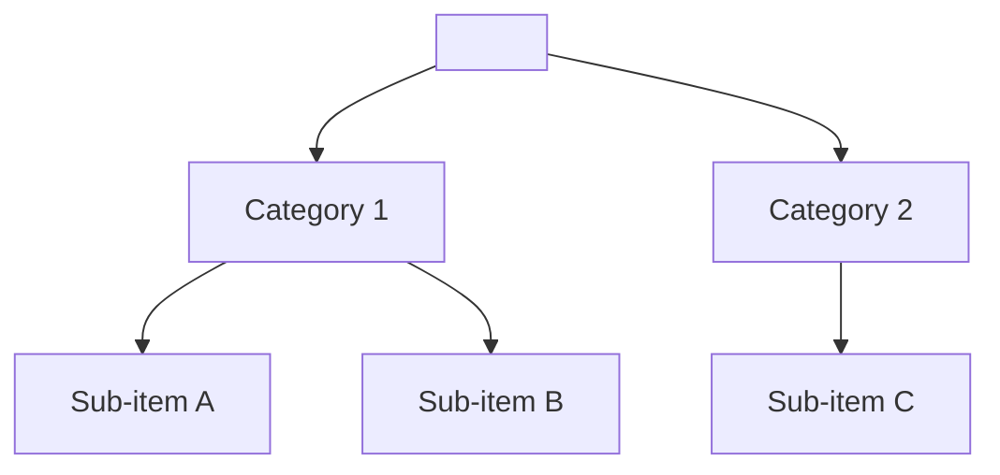
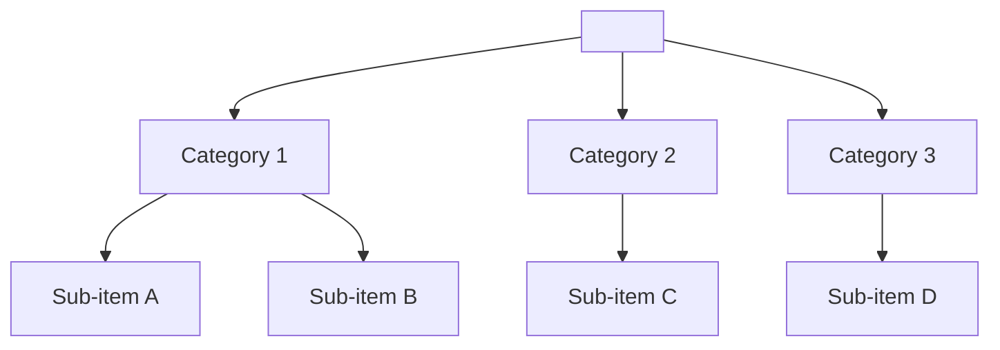

## 解決什麼問題

功能堆到一定數量後，導航變成迷宮：每個 PM 把自己的功能塞最上層、每個使用者問「OO 在哪？」沒有 IA，UI 美也救不回。
IA 在畫 wireframe 之前先決定**「資訊怎麼分類、命名、層級、跨層關聯」**，是後續所有設計的骨架。
沒做 IA，wireframe 重畫三輪都不會收斂。

## 誰負責、和誰對接

- **主責：** UX
- **協作：** SA（系統能力與資料邊界）、PM（商業優先序）、內容團隊（命名一致性）
- **下游收件：** UX 畫 wireframe、UI 做導航元件、SEO 規劃 URL 結構

## 何時用、何時不用

- ✅ **必要時機：** 新產品建構、改版、功能/內容 ≥ 30 項、跨平台一致性
- ❌ **不需要時：** 單一 flow 工具、小 widget 改版
- ⚠️ **常見誤用：** 把 IA 寫成「sitemap」就算了；IA 應包含**分類邏輯（why）+ 命名規則 + 跨層關聯**，並用 card sorting 驗證

## AI 怎麼加速

把功能清單 + 使用者語彙整份丟給 agent，讓 agent 讀範本內 `> [!IMPORTANT]` 規則與 `<!-- ai-fill -->` 註解自己填，**人工只審心智模型對齊**。本卡輸出**真實 IA markdown 文件**（含 hierarchy mermaid tree、分類表、inline `[H/M/L]` confidence badge），**不出 YAML schema**。

## 文件範本

下面兩個 tab 是同一份 IA 契約的兩種版本：**輕量範本** 給 < 30 項功能、小範圍改版 / MVP 用，**完整範本** 給 ≥ 30 項功能、跨平台導航、需 card sorting 驗證的情境用。範本內所有 `> [!IMPORTANT]` 是 AI 章節級規則、`<!-- ai-fill / ai-rule -->` 是欄位級微指引、結尾 `> [!CAUTION]` 是輸出前自檢清單。

````template-light
---
doc_type: "information-architecture"
variant: "light"
status: "draft"
owner: "<your-name>"
last_updated: "YYYY-MM-DD"
upstream:
  required: ["feature-list", "user-research"]
  optional: ["competitive-scan"]
---

# Information Architecture: <product-name>

**Status:** Draft v0.X · **Owner:** <UX name> · **Last updated:** YYYY-MM-DD

> [!IMPORTANT]
> **AI 填寫規則：** 本範本 6 段（編號 1, 2, 3, 6, 10, 12），全部必填——刻意沿用完整版章節編號讓兩版可對照。每分類行內加 `（依據：功能清單 §XXX / 訪談 P3 / SA spec §YY）`；每量化欄位加 `[H]/[M]/[L]` confidence badge；缺資料寫 `_TODO: 需要 XXX_` 不編造；層級 ≤ 3 層深；命名不能反映內部組織。

---

## 1. Executive Summary

<!-- ai-fill: 3-5 行：N 個 top-level 分類、分類邏輯（task / audience / topic）、最強 evidence 來源 -->

<3-5 行說明>

> **TL;DR:** <一句話：使用者進到此產品最常找什麼>

---

## 2. Top-level Categories

<!-- ai-rule: 3-7 個頂層分類；每條附 rationale + items_under 估計 + source -->

| # | Category | Rationale | Items under | Confidence |
|---|---|---|---|---|
| C1 | <分類名> | <引用使用者語彙> | <約 X 項> | **[H]** |
| C2 | ... | ... | ... | **[M]** |

---

## 3. Hierarchy Tree

<!-- ai-rule: 用 mermaid `flowchart TD` 畫層級樹；≤ 3 層深；節點命名與第 2 段一致 -->



---

## 6. Taxonomy Rules

<!-- ai-rule: 命名風格 + label 字數上限 + ambiguity 自評 -->

- **Naming style:** noun-first / verb-first / hybrid — **Rationale:** <為何>
- **Label max chars:** <如 18>
- **Ambiguity check:** <每個 label 評歧義度 H/M/L>

---

## 10. Decision Log（key 2-3 條）

<!-- ai-rule: 每條必含 chosen + 至少 1 個 rejected + 拒絕原因 -->

| Date | Decision | Options | Chosen | Rejected why | Confidence |
|---|---|---|---|---|---|
| YYYY-MM-DD | 分類用哪種維度 | task / audience / topic | task | audience (多角色分裂)、topic (跨類別重複) | **[H]** |

---

## 12. Confidence & Sources & TODO

- **整份文件最低 confidence 欄位：** <列出所有 [L] 與 [M]>
- **Fabricated assumptions：**
  - <假設 1：例「新使用者佔比 > 老使用者」>
- **Highest-value next input:** <例：30 人 card sorting>

### TODO（缺資料）

- _TODO: 需要 30 人 card sorting 驗證 C2 / C3 邊界_

---

> [!CAUTION]
> **輸出前 AI 自檢：**
> - [ ] 6 段 H2 章節齊全（編號 1, 2, 3, 6, 10, 12）
> - [ ] Hierarchy tree 用 mermaid，≤ 3 層深
> - [ ] 每個分類帶 inline `[H/M/L]` badge + `（依據：...）`
> - [ ] Decision Log ≥ 1 條，每條有 rejected reason
> - [ ] 命名未直接反映內部組織架構
> - [ ] 無 YAML / JSON schema 輸出（IA 是給人讀的 markdown）
````

````template-full
---
doc_type: "information-architecture"
variant: "full"
status: "draft"
owner: "<your-name>"
last_updated: "YYYY-MM-DD"
upstream:
  required: ["feature-list", "user-research", "sa-data-boundary"]
  optional: ["competitive-scan", "business-priority"]
---

# Information Architecture: <product-name>

**Status:** Draft v0.X · **Owner:** <UX name> · **Last updated:** YYYY-MM-DD · **Reviewers:** SA / PM / 內容團隊

> [!IMPORTANT]
> **AI 填寫規則：** 12 段 H2 章節全部必填（任一缺失即不合格）。每分類決策行內 `（依據：功能清單 §XXX / 訪談 P3 / SA spec §YY）`；每量化欄位 `[H/M/L]` badge；缺資料寫 `_TODO: 需要 XXX_` 不編造；層級 ≤ 3 層深；命名不能反映內部組織架構；未經 card sorting 驗證者必標 M 或 L；禁 YAML/JSON schema 輸出。

---

## 1. Executive Summary
<!-- owner: UX · required: always -->

<!-- ai-fill: 3-5 行：N 個頂層分類、分類邏輯、最強 evidence -->

<3-5 行說明>

> **TL;DR:** <一句話：使用者進到此產品最常找什麼>

---

## 2. Top-level Categories
<!-- owner: UX + PM · required: always -->

<!-- ai-rule: 3-7 個頂層分類；引用使用者語彙作為 rationale，不能用內部部門名 -->

| # | Category | Rationale | Items under | Confidence | Source |
|---|---|---|---|---|---|
| C1 | <分類名> | <引用使用者語彙> | <約 X 項> | **[H]** | 訪談 P3 §5 |
| C2 | ... | ... | ... | **[M]** | 功能清單 §A |

---

## 3. Hierarchy Tree
<!-- owner: UX · required: always -->

> [!IMPORTANT]
> **AI 填寫規則：** 用 mermaid `flowchart TD` 畫層級樹；≤ 3 層深（超過 3 層必須在下方寫 rationale 為何此複雜度必要）。節點命名須與第 2 段一致。



---

## 4. Navigation Pattern
<!-- owner: UX + UI · required: full-only -->

<!-- ai-rule: primary + secondary 兩層 nav 都要描述；含 a11y landmark roles + skip link -->

- **Primary:** top-nav / side-nav / tab-bar / hub-spoke — **Rationale:** <為何此 pattern>
- **Secondary:** breadcrumb / sub-nav / contextual menu
- **A11y:** landmark roles（`<nav>` / `<main>` / `<aside>`）+ skip-to-content link + keyboard tab order

---

## 5. Cross-link Relationships
<!-- owner: UX + SA · required: full-only · skippable: 若無明顯跨層關聯則寫「無」 -->

<!-- ai-rule: 列出跨分類的 referencing 路徑（如「設定」可從多處進入），避免資訊孤島 -->

| From | To | Trigger | Rationale |
|---|---|---|---|
| C1 / Sub-item A | C3 / Sub-item D | 使用者完成 A 後常找 D | 訪談 P2 §7 高頻路徑 |

---

## 6. Taxonomy Rules
<!-- owner: UX + 內容團隊 · required: always -->

<!-- ai-rule: 命名風格 + label 字數上限 + 每個 label 自評 ambiguity -->

- **Naming style:** noun-first / verb-first / hybrid — **Rationale:** <為何>
- **Label max chars:** <如 18>
- **Internal vs user vocab mapping:** <列出內部術語 → 使用者語彙>

| Label | Ambiguity | Notes |
|---|---|---|
| <label> | **[L]** | 已通過內容團隊審 |
| <label> | **[M]** | 受測者 2/5 誤解，需 card sorting |

---

## 7. Search Strategy
<!-- owner: UX + SA · required: full-only -->

<!-- ai-rule: scope + 同義詞對應 + filter facets -->

- **Scope:** 全站 / 分類內
- **Synonyms required:** <使用者語彙 vs 內部術語對應，至少列 3 組>
- **Filters / facets:** <facet 1>, <facet 2>

---

## 8. Card Sorting / Tree Testing Plan
<!-- owner: UX · required: full-only -->

<!-- ai-rule: 含 method + 目標人數 + 關鍵題目 + 可預期爭議分類 -->

- **Method:** open / closed / hybrid
- **Participants target:** <如 30 人 / segment 描述>
- **Key questions:**
  - <題目 1>
  - <題目 2>
- **Expected disagreement zones:** <可預期會引爭議的分類邊界>

---

## 9. Risks & Open Questions
<!-- owner: All · required: always -->

### Risks

> **R1:** <例：C2 / C3 邊界未經驗證可能造成 findability 問題> — **Mitigation:** 30 人 card sorting — **Owner:** <name>
>
> **R2:** ...

### Open Questions

- [ ] **Q1:** <例：「設定」放頂層還是各分類內？>
- [ ] **Q2:** ...

---

## 10. Decision Log
<!-- owner: UX · required: always -->

<!-- ai-rule: 每條必含 ≥ 2 個 rejected options + 各自 rejected reason -->

| Date | Decision | Options considered | Chosen | Rejected why | Confidence |
|---|---|---|---|---|---|
| YYYY-MM-DD | 分類用哪種維度 | task / audience / topic | task | audience (多角色分裂)、topic (跨類別重複) | **[H]** |

---

## 11. Out of Scope
<!-- owner: UX · required: full-only -->

本 IA 文件 **不處理**：

- ❌ **不畫 wireframe / 視覺呈現** — 屬 wireframe 卡
- ❌ **不寫 URL routing 實作細節** — 屬 dev / api-spec
- ❌ **不做 SEO 關鍵字研究** — 屬 marketing
- ❌ **不定義導航元件視覺** — 屬 design-system / hi-fi mockup

---

## 12. Confidence & Sources & TODO
<!-- owner: All · required: always -->

- **整份文件最低 confidence 欄位：** <列出所有 [L] 與 [M]>
- **Fabricated assumptions：**
  - <假設 1：例「新使用者佔比 > 老使用者」>
  - <假設 2>
- **Highest-value next input:** <30 人 card sorting / 競品 IA 對標 / tree testing>

### TODO（缺資料）

- _TODO: 需要 30 人 card sorting 驗證 C2 / C3 邊界_
- _TODO: 補內容團隊 label 終審_

---

> [!CAUTION]
> **輸出前 AI 自檢：**
> - [ ] 12 段 H2 章節齊全（編號 1-12）
> - [ ] Hierarchy tree 用 mermaid，≤ 3 層深（超過須寫 rationale）
> - [ ] 每個分類帶 inline `[H/M/L]` badge + 行內 `（依據：...）`
> - [ ] Navigation Pattern 含 a11y landmark + skip link + tab order
> - [ ] Taxonomy 表每個 label 自評 ambiguity
> - [ ] Decision Log 每條 ≥ 2 個 rejected options + 各自 reason
> - [ ] 命名未直接反映內部組織架構（不出現部門名稱）
> - [ ] 無 YAML / JSON schema 輸出（IA 是給人讀的 markdown）
````

## 怎麼觸發

先在上方 tab 選「輕量範本」或「完整範本」、按複製存到你的 AI 工作環境（web chat 對話框、Claude Code / Cursor / Aider 等 harness agent 的 context、或專案內任何 markdown 檔），再複製下面這段、把貼位區換成你的真實文件全文，給 AI：

```trigger
請依據以下「文件範本」與「上游文件」產出 IA markdown。嚴格遵守範本內所有 `> [!IMPORTANT]` 規則、`<!-- ai-fill -->` / `<!-- ai-rule -->` 欄位指引，並在結尾跑完 `> [!CAUTION]` 自檢清單。

## 文件範本（貼這裡）
⏬
（貼上面選好的「輕量範本」或「完整範本」全文）
⏫

## 上游文件（貼這裡）
⏬
（貼 功能清單 / 使用者訪談語彙 / SA 資料邊界 spec 全文）
⏫
```

> [!TIP]
> **常見錯誤：** 把 IA 寫成 sitemap 沒寫分類 why、命名直接拿內部部門名（「客服系統」而非「協助」）、層級超過 3 層卻沒寫 rationale、未經 card sorting 就標 H confidence、Decision Log 只列 chosen 不列 rejected（= 黑箱）。AI 若漏這些，自檢清單會抓到並回頭補。
