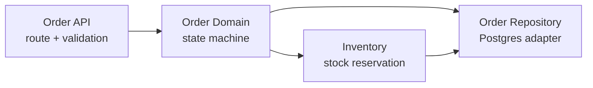
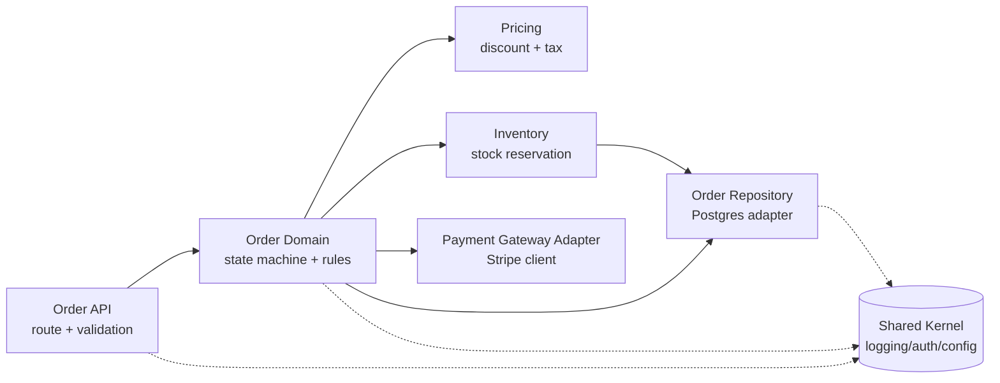
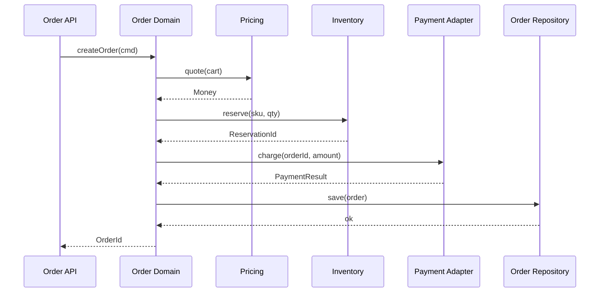

## 解決什麼問題

服務一開始小，大家「順手」把功能塞進最近的檔案，依賴隨手 import，三個月後 order 模組 import payment、payment 又回頭 import order，環就成形了。
一旦依賴成環，改一個模組會牽動一整圈、編譯與測試無法獨立、新人看不懂邊界、兩個工程師同時動同一坨程式碼天天衝突。
Module Design 強迫在寫 code 前先把**模組切分（單一責任）、各模組擁有的資料、對外介面、依賴方向**畫清楚，核心紀律是**依賴方向單向、不成環 (acyclic)**。
切分對了，多個 dev 才能照模組並行開工、QA 才能設計模組級測試邊界。

## 誰負責、和誰對接

- **主責：** SD（System Designer）
- **協作：** Architect（確認不越服務邊界）、Dev Lead（驗證可實作）、QA（對應測試邊界）
- **下游收件：** Dev 照模組開工、QA 設計模組級測試

## 何時用、何時不用

- ✅ **必要時機：** 單一服務內部 ≥ 5 個模組、多人要並行開發、要明確控制依賴方向、要切出可獨立測試的邊界
- ❌ **不需要時：** 單檔 script、PoC、純 CRUD 薄服務（模組少到一眼看完）
- ⚠️ **常見誤用：** 切出一個 god module（`common` / `utils` 什麼都塞），或讓依賴雙向互指形成環；模組切分的價值就在**單一責任 + 無環依賴**，切完還是一坨互相 import = 沒切

## AI 怎麼加速

把 C4 component 圖 + use case + 既有 ADR 對模組邊界的決定整份丟給 agent，讓 agent 讀範本內的 `> [!IMPORTANT]` 規則與 `<!-- ai-fill -->` 註解自己填，**人工只審依賴方向是否成環、有沒有 god module**。本卡輸出**真實 Module Design markdown 文件**（含 Mermaid 模組依賴圖、責任表、依賴矩陣、inline `[H/M/L]` badge），**不出 YAML schema**。依賴一旦成環，自檢清單會抓出來要求拆。

## 文件範本

下面兩個 tab 是同一份契約的兩種版本，AI 讀同一份範本可雙模式輸出：**輕量範本** 給 5-7 個模組 / 單一團隊場景用（模組圖 + 責任表 + 風險），**完整範本** 給 ≥ 8 模組 / 多人並行 / 要嚴格控管依賴方向場景用（含依賴矩陣、cohesion 理由、模組級時序、決策紀錄）。**依賴成環 = 沒切**。模組設計的價值就在**單一責任 + 依賴單向無環 (acyclic)**。範本內所有 `> [!IMPORTANT]` 是 AI 章節級規則、`<!-- ai-fill / ai-rule -->` 是欄位級微指引、結尾 `> [!CAUTION]` 是輸出前自檢清單。

````template-light
---
doc_type: "module-design"
variant: "light"
status: "draft"
owner: "<your-name>"
last_updated: "YYYY-MM-DD"
upstream:
  required: ["c4-diagram", "adr"]
  optional: ["use-case", "non-functional-reqs"]
---

# Module Design: <service-name>

**Status:** Draft · **Owner:** <SD> · **Last updated:** YYYY-MM-DD

> [!IMPORTANT]
> **AI 填寫規則：** 本範本 5 段（編號 1, 2, 3, 9, 12），全部必填——刻意沿用完整版的章節編號讓兩版可對照。每結論行內加 `（依據：c4-diagram §XXX / ADR-NNN）`；每欄位帶 `[H]/[M]/[L]` confidence badge；缺資料寫 `_TODO: 需要 XXX_` 不編造模組；**核心紀律：依賴方向單向、不成環 (acyclic)** — 模組圖的箭頭只能往一個方向流，任何雙向互指或回指上游的環必須在 Risks 段標為 violation 並提出拆解。

---

## 1. Executive Summary

<!-- ai-fill: 3-5 行說明本服務切成幾個模組、切分原則（單一責任）、依賴方向、最高風險 -->

<3-5 行說明：本服務拆幾個模組、為何這樣切、依賴方向、有無環>

> **TL;DR:** <一句話：N 個模組、依賴單向 acyclic、最該擔心的是 X 模組責任過載>

---

## 2. Module Map

<!-- ai-rule: 畫 graph LR / flowchart，箭頭代表「依賴」方向（A-->B 表示 A 依賴 B）。不能有環 -->



> 箭頭方向 = 依賴方向。上圖無回指（`repo` 不 import `domain`），確認 acyclic。（依據：c4-diagram §Order Service Components）

---

## 3. Responsibility Table

<!-- ai-rule: 每個模組單一責任。owns-data 寫該模組獨占的資料；public-interface 寫對外暴露的函式/介面 -->

| Module | Responsibility | Owns Data | Public Interface | Confidence |
|---|---|---|---|---|
| Order API | route handler + 入參驗證 | 無（無狀態） | `POST /orders`, `GET /orders/{id}` | **[H]** |
| Order Domain | order 狀態機 + 業務規則 | order aggregate（記憶體中） | `createOrder()`, `transition()` | **[H]** |
| Inventory | 庫存預留 / 釋放 | `inventory` 表 | `reserve(sku, qty)`, `release()` | **[H]** |
| Order Repository | Postgres 持久化 | `orders` 表 | `save()`, `findById()` | **[M]** |

---

## 9. Risks

<!-- ai-rule: 至少 3 個。必含 god module / cyclic dependency / leaky abstraction 三類各至少一 -->

> **R1（cyclic dependency）：** <e.g. 若 Inventory 為了發通知而 import Order Domain，會與既有 domain-->inventory 形成環> — **Severity:** H — **Mitigation:** 通知改由 Domain 透過 event 觸發，Inventory 不回指 — **Owner:** <SD>
>
> **R2（god module）：** <e.g. Order Domain 同時管狀態機 + 折扣 + 稅務，責任過載> — **Severity:** M — **Mitigation:** 折扣/稅務拆為獨立 Pricing 模組 — **Owner:** <SD>
>
> **R3（leaky abstraction）：** <e.g. Order API 直接吃 Repository 回傳的 ORM entity，繞過 Domain> — **Severity:** M — **Mitigation:** Repository 只回 domain object，不外洩 ORM 型別 — **Owner:** <Dev Lead>

---

## 12. Confidence & Sources & TODO

- **整份文件最低 confidence 欄位：** <列出所有 [L] 與 [M]>
- **Fabricated assumptions（推測但 input 未明說）：**
  - <假設 1：例：假設 Inventory 與 Order 同庫，可同交易內預留>
- **Highest-value next input:** <下一份最該補的：class-diagram / 既有 codebase import graph>

### TODO（缺資料）

- _TODO: 需要 Dev Lead 確認 Inventory 是否與 Order 共用同一 DB 交易_

---

> [!CAUTION]
> **輸出前 AI 自檢：**
> - [ ] 5 段 H2 章節齊全（編號 1, 2, 3, 9, 12，刻意不連號）
> - [ ] Module Map 含 mermaid graph LR / flowchart
> - [ ] 依賴圖 acyclic（無回指、無雙向箭頭）
> - [ ] 每個模組單一責任（無 god module / 無 `common` 雜物袋）
> - [ ] Responsibility Table 每模組含 owns-data + public-interface
> - [ ] 每結論有 source（c4-diagram / ADR ref）
> - [ ] Risks ≥ 3（含 god module / cyclic / leaky abstraction）
> - [ ] 無 YAML / JSON schema 輸出（用 mermaid + 表格表達）
````

````template-full
---
doc_type: "module-design"
variant: "full"
status: "draft"
owner: "<your-name>"
last_updated: "YYYY-MM-DD"
upstream:
  required: ["c4-diagram", "adr"]
  optional: ["use-case", "non-functional-reqs"]
---

# Module Design: <service-name>

**Status:** Draft · **Owner:** <SD> · **Last updated:** YYYY-MM-DD · **Reviewers:** Architect / Dev Lead / QA

> [!IMPORTANT]
> **AI 填寫規則：** 12 段 H2 章節全部必填（任一缺失即不合格）。每結論行內 `（依據：c4-diagram §XXX / ADR-NNN）`；每欄位 `[H/M/L]` badge；缺資料寫 `_TODO: 需要 XXX_` 不編造模組或介面；**核心紀律：依賴方向單向、不成環 (acyclic)** — 模組圖與依賴矩陣的方向必須一致且無環，任何環一律在 Dependency Matrix 與 Risks 段標為 **VIOLATION** 並提拆解方案；每個模組必須單一責任（拒絕 god module / `common` / `utils` 雜物袋）；不外洩底層型別（leaky abstraction）；技術與邊界須與 c4-diagram / ADR 一致（偏離須記入 Decision Log）；禁 YAML/JSON schema 輸出。

---

## 1. Executive Summary
<!-- owner: SD · required: always -->

<!-- ai-fill: 3-5 行說明本服務切成幾個模組、切分原則、依賴方向是否 acyclic、最高風險模組 -->

<3-5 行說明>

> **TL;DR:** <一句話：N 個模組 + 依賴單向 acyclic + 最該擔心的責任過載/leaky 模組>

---

## 2. Module Map
<!-- owner: SD · required: always · audience: dev -->

<!-- ai-rule: graph LR / flowchart。箭頭 A-->B 表示「A 依賴 B」。圖必須 acyclic -->



> 實線箭頭 = 業務依賴方向（單向、無回指）；虛線 = 對 Shared Kernel 的橫切依賴（允許所有模組指向 kernel，kernel 不回指任何業務模組）。（依據：c4-diagram §Order Service Components / ADR-005）

---

## 3. Responsibility Table
<!-- owner: SD · required: always -->

<!-- ai-rule: 每模組一行、單一責任。owns-data = 該模組獨占且唯一可寫的資料；public-interface = 對外簽章 -->

| Module | Responsibility | Owns Data | Public Interface | Confidence |
|---|---|---|---|---|
| Order API | HTTP route + 入參驗證 + 序列化 | 無（無狀態） | `POST /orders`, `GET /orders/{id}` | **[H]** |
| Order Domain | order 狀態機 + 編排業務規則 | order aggregate（in-memory） | `createOrder(cmd)`, `transition(id, evt)` | **[H]** |
| Pricing | 折扣 + 稅務計算 | 折扣規則快取 | `quote(cart) -> Money` | **[M]** |
| Inventory | 庫存預留 / 釋放 | `inventory` 表 | `reserve(sku, qty)`, `release(resId)` | **[H]** |
| Payment Gateway Adapter | 封裝 Stripe 呼叫 | 無（外部狀態在 Stripe） | `charge(orderId, amount)` | **[M]** |
| Order Repository | order 持久化 | `orders` 表 | `save(order)`, `findById(id)` | **[H]** |

---

## 4. Dependency Matrix / Direction
<!-- owner: SD · required: always -->

<!-- ai-rule: 列 depends-on 矩陣。✓ = row 依賴 column。任何讓圖成環的 ✓ 標 VIOLATION -->

行 = 依賴方（依賴 column）；✓ = 有依賴、— = 無：

| ↓依賴→ | API | Domain | Pricing | Inventory | Payment | Repo |
|---|---|---|---|---|---|---|
| **API** | — | ✓ | — | — | — | — |
| **Domain** | — | — | ✓ | ✓ | ✓ | ✓ |
| **Pricing** | — | — | — | — | — | — |
| **Inventory** | — | — | — | — | — | ✓ |
| **Payment** | — | — | — | — | — | — |
| **Repo** | — | — | — | — | — | — |

- **方向檢查：** 上三角以外無回填 → 拓樸可排序 → **acyclic ✓**（依據：c4-diagram §Order Service Components）
- **若出現環（範例 VIOLATION）：** 若 `Repo --> Domain`（為了在儲存時跑業務驗證）會與 `Domain --> Repo` 成環 → **VIOLATION** → 拆解：驗證上移到 Domain，Repo 只負責 persist，不回指。

---

## 5. Module Boundaries & Cohesion rationale
<!-- owner: SD · required: full-only -->

<!-- ai-rule: 解釋每個邊界為何這樣切（high cohesion / low coupling），對照被拒的切法 -->

| Boundary | Cohesion 依據 | 為何不併入鄰居 | Confidence |
|---|---|---|---|
| Pricing 獨立於 Domain | 折扣/稅務變動頻率高、規則自成一體 | 併入 Domain 會讓狀態機被計價邏輯污染（god module 風險） | **[M]** |
| Inventory 獨立於 Domain | 庫存有自己的並發鎖與獨占資料 | 併入會讓 Domain 直接碰 `inventory` 表，破壞 owns-data | **[H]** |
| Payment 用 Adapter 隔離 | 隔離外部 SDK 變動 + 可測試替身 | Domain 直接 call Stripe SDK = leaky + 無法 mock | **[H]** |

---

## 6. Public Interfaces per module
<!-- owner: SD + Dev Lead · required: full-only -->

<!-- ai-rule: 每模組列對外簽章（型別用 domain 型別、不外洩 ORM/SDK 型別）-->

| Module | Interface (簽章) | 回傳型別 | 不外洩 | Confidence |
|---|---|---|---|---|
| Order Domain | `createOrder(cmd: CreateOrderCmd) -> OrderId` | domain `OrderId` | 不回 ORM entity | **[H]** |
| Pricing | `quote(cart: Cart) -> Money` | value object `Money` | 不回 DB row | **[H]** |
| Inventory | `reserve(sku, qty) -> ReservationId` | `ReservationId` | 不外洩鎖實作 | **[H]** |
| Payment Adapter | `charge(orderId, amount: Money) -> PaymentResult` | domain `PaymentResult` | 不回 Stripe `Charge` 物件 | **[M]** |
| Order Repository | `save(order: Order) -> void` | — | 只吃/回 domain `Order` | **[H]** |

---

## 7. Shared Kernel / Cross-cutting
<!-- owner: SD + Architect · required: full-only -->

<!-- ai-rule: 列橫切關注（logging/auth/config）。kernel 允許被所有模組依賴，但 kernel 不可回指業務模組 -->

| Concern | 提供者 | 使用方式 | 依賴規則 | Confidence |
|---|---|---|---|---|
| Logging | Shared Kernel | 結構化 logger 注入各模組 | 所有業務模組 → kernel，kernel 不回指 | **[H]** |
| Auth / RBAC | Shared Kernel | API 層中介層驗證 token | kernel 不知道 Order 業務 | **[H]** |
| Config | Shared Kernel | 啟動時注入，模組不自讀 env | 單向：模組 → kernel | **[H]** |

> Shared Kernel 是唯一允許「被多方依賴」的節點，但它**不得 import 任何業務模組**，否則立即成環。（依據：ADR-008）

---

## 8. Module-level Sequence（請求如何跨模組）
<!-- owner: SD · required: full-only -->

<!-- ai-rule: 畫一條代表性請求如何依序穿過模組，驗證它只沿依賴方向流動（不回指） -->



> 呼叫只由 API → Domain → 下游葉模組，葉模組不回呼 Domain（無回指），與 Dependency Matrix 一致。（依據：use-case §下單主流程）

---

## 9. Risks
<!-- owner: All · required: always -->

<!-- ai-rule: ≥ 3 個。必含 god module / cyclic dependency / leaky abstraction 三類各至少一。每條：失效模式 + Severity + Mitigation + Owner -->

> **R1（cyclic dependency）：** <e.g. Repository 為了存檔時跑業務驗證而 import Domain → 與 Domain-->Repo 成環> — **Severity:** H — **Mitigation:** 驗證留在 Domain，Repo 純 persist 不回指 — **Owner:** <SD>
>
> **R2（god module）：** <e.g. Order Domain 同時扛狀態機 + 計價 + 稅務 + 通知，責任過載> — **Severity:** H — **Mitigation:** 計價拆 Pricing、通知改 event-driven，Domain 只留編排 — **Owner:** <SD>
>
> **R3（leaky abstraction）：** <e.g. Payment Adapter 把 Stripe `Charge` 物件直接回給 Domain> — **Severity:** M — **Mitigation:** Adapter 只回 domain `PaymentResult`，封裝 SDK 型別 — **Owner:** <Dev Lead>
>
> **R4（雜物袋）：** <e.g. 出現 `common` / `utils` 模組吸納跨領域邏輯> — **Severity:** M — **Mitigation:** 拆為具名橫切關注（logging/auth/config）進 Shared Kernel — **Owner:** <Architect>

---

## 10. Decision Log
<!-- owner: SD · required: always -->

<!-- ai-rule: 每條必含 ≥ 2 個 rejected options + 各自 rejected reason -->

| Date | Decision | Options considered | Chosen | Rejected why | Confidence |
|---|---|---|---|---|---|
| YYYY-MM-DD | Pricing 是否獨立模組 | 併入 Domain / 獨立 Pricing / 獨立 service | 獨立 Pricing 模組 | 併入 Domain (污染狀態機成 god module)、獨立 service (服務內邏輯過度拆出邊界，屬 architect 範疇) | **[H]** |
| YYYY-MM-DD | Payment 如何接入 | Domain 直 call SDK / Adapter 隔離 / 共享 client | Adapter 隔離 | 直 call SDK (leaky + 不可 mock)、共享 client (耦合外部型別擴散) | **[H]** |
| YYYY-MM-DD | 橫切關注擺哪 | 各模組自帶 / `common` 雜物袋 / Shared Kernel | Shared Kernel（單向被依賴） | 各模組自帶 (重複 + 設定漂移)、`common` 雜物袋 (god module + 易成環) | **[M]** |

---

## 11. Out of Scope
<!-- owner: SD · required: full-only -->

本 Module Design **不處理**：

- ❌ **class / 方法層設計** — 屬 class-diagram 卡
- ❌ **跨服務邊界切分** — 屬 architect（C4 Container / 服務拆分）
- ❌ **部署拓樸 / infra topology** — 屬 deployment-diagram 卡
- ❌ **資料表 schema / ERD 欄位** — 屬 data-model 卡

---

## 12. Confidence & Sources & TODO
<!-- owner: All · required: always -->

- **整份文件最低 confidence 欄位：** <列出所有 [L] 與 [M] 欄位>
- **Fabricated assumptions（推測但 input 未明說的）：**
  - <假設 1：例：假設 Pricing 折扣規則可記憶體快取（未確認更新頻率）>
  - <假設 2：例：假設 Inventory 與 Order 同庫可共交易>
- **Highest-value next input:** <下一份最該補的：class-diagram / 既有 codebase import graph / ADR-008 (shared kernel)>

### TODO（缺資料）

- _TODO: 需要 Dev Lead 確認 Inventory 與 Order 是否共用同一 DB 交易_
- _TODO: 需要 Architect 確認 Pricing 留在服務內 vs 抽成獨立 service_

---

> [!CAUTION]
> **輸出前 AI 自檢：**
> - [ ] 12 段 H2 章節齊全（編號 1-12）
> - [ ] Module Map 含 mermaid graph LR / flowchart
> - [ ] 依賴圖與 Dependency Matrix 方向一致且 **acyclic**（無環、無回指）
> - [ ] 任何環一律標 VIOLATION 並附拆解方案
> - [ ] 每個模組單一責任（無 god module / 無 `common` / `utils` 雜物袋）
> - [ ] Responsibility Table 每模組含 owns-data + public-interface
> - [ ] Public Interface 不外洩 ORM / SDK 型別（無 leaky abstraction）
> - [ ] Shared Kernel 被單向依賴、不回指業務模組
> - [ ] Module-level Sequence 只沿依賴方向流動（葉模組不回呼上游）
> - [ ] Risks ≥ 3（含 god module / cyclic / leaky abstraction）
> - [ ] Decision Log 每條 ≥ 2 個 rejected options + 各自 reason
> - [ ] 每結論有 source（c4-diagram / ADR ref）
> - [ ] 無 YAML / JSON schema 輸出（用 mermaid + 表格表達）
````

## 怎麼觸發

先在上方 tab 選「輕量範本」或「完整範本」、按複製存到你的 AI 工作環境（web chat 對話框、Claude Code / Cursor / Aider 等 harness agent 的 context、或專案內任何 markdown 檔），再複製下面這段、把貼位區換成你的真實文件全文，給 AI：

```trigger
請依據以下「文件範本」與「上游文件」產出 Module Design markdown。嚴格遵守範本內所有 `> [!IMPORTANT]` 規則、`<!-- ai-fill -->` / `<!-- ai-rule -->` 欄位指引，並在結尾跑完 `> [!CAUTION]` 自檢清單。**依賴成環等於沒切** — 模組圖與依賴矩陣方向必須一致且 acyclic，任何環標為 VIOLATION 並提拆解。

## 文件範本（貼這裡）
⏬
（貼上面選好的「輕量範本」或「完整範本」全文）
⏫

## 上游文件（貼這裡）
⏬
（貼 c4-diagram.md (Component 層) / 相關 ADR (邊界決定) / use-case.md / non-functional-reqs 全文）
⏫
```

> [!TIP]
> **常見錯誤：** 切出 god module（`common` / `utils` 什麼都塞，最常見）、依賴雙向互指或回指上游形成環（acyclic 紀律破功，等於沒切）、Public Interface 外洩 ORM / Stripe SDK 型別（leaky abstraction，下游被外部變動綁架）、owns-data 沒標清楚（兩個模組同時寫同一張表 = 邊界破洞）、Decision Log 沒寫被拒的切法（讀者以為這是唯一解）。AI 若漏這些，自檢清單會抓到並回頭補。
