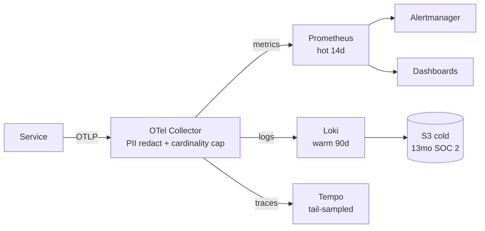

## 解決什麼問題

出事時最痛苦的是沒資料。Observability Spec 在設計階段就決定要產生哪些 metric、log、trace、event，及它們如何回答「使用者受到什麼影響」。

## 誰負責、和誰對接

- **主責：** Architect + DevOps
- **協作：** Dev 實作埋點、SRE 設儀表板
- **下游收件：** SLO、Runbook、Incident Report

## 何時用、何時不用

- ✅ **必要時機：** 新服務、新關鍵路徑、SLO 無法量測時
- ❌ **不需要時：** 短命腳本、無使用者依賴
- ⚠️ **常見誤用：** 只埋 server-side metric；log 沒結構化；trace 缺 user id

## AI 怎麼加速

把 SLO + journey + service map + 資料分類表整份丟給 agent，讓 agent 讀範本內的 `> [!IMPORTANT]` 規則與 `<!-- ai-fill -->` 註解自己填，**人工只審 sampling 與 PII 合規**。本卡輸出**真實 Observability Spec markdown**（含 metric/log/trace 三層信號表、cardinality budget、PII redaction 規則、可選 mermaid 訊號流圖、inline `[H/M/L]` confidence badge），**不出 YAML schema**。

## 文件範本

下面兩個 tab 是同一份契約的兩種版本：**輕量範本**給單服務 / MVP / 內部工具，**完整範本**給跨服務 / 對外 production / GDPR-HIPAA-PCI-SOC 2 合規場景。範本內所有 `> [!IMPORTANT]` 是 AI 章節級規則、`<!-- ai-fill / ai-rule -->` 是欄位級微指引、結尾 `> [!CAUTION]` 是輸出前自檢清單。

```template-light
---
doc_type: "observability-spec"
variant: "light"
status: "draft"
owner: "<your-name>"
last_updated: "YYYY-MM-DD"
upstream:
  required: ["slo", "service-map"]
  optional: ["user-journey", "pii-classification"]
---

# Observability Spec: <service-name>

**Status:** Draft v0.X · **Owner:** <Architect / DevOps> · **Last updated:** YYYY-MM-DD

> [!IMPORTANT]
> **AI 填寫規則：** 本範本 6 段（編號 1, 2, 3, 5, 6, 9），全部必填——刻意沿用完整版章節編號讓兩版可對照。每結論行內加 `（依據：SLO §XXX / journey §YYY）`；每量化欄位帶 `[H]/[M]/[L]` confidence badge；缺資料寫 `_TODO: 需要 XXX_` 不編造；每個 metric 必須標 label + cardinality 估算（≤ 10k unique series 預設）；每個 SLI 必須有對應 metric；PII 欄位無分類資料寫 `_TODO_` 不假設可採集。

---

## 1. Executive Summary

<!-- ai-fill: 3-5 行，主管 30 秒讀完。內容：要觀測哪個服務、有幾條 SLI、cardinality 估算、最敏感 PII 處理 -->

<3-5 行說明>

> **TL;DR:** <一句話：本卡定義 X 服務的 N 條 metric / M 條 log / K 條 trace，覆蓋 Y 條 SLI>

---

## 2. Signals Required（metric / log / trace 三層）

<!-- ai-rule: 每個 metric 必填 type + labels + cardinality + sli_ref；每個 SLI 必須有對應 metric -->

### Metrics

| Name | Type | Labels | Cardinality | Unit | SLI ref | Confidence |
|---|---|---|---|---|---|---|
| http_request_duration_seconds | histogram | route, method, status_class | 500 | seconds | SLI-001 | **[H]** |
| db_query_duration_seconds | histogram | query_kind | 50 | seconds | SLI-002 | **[H]** |

### Logs

| Event | Fields | PII handling | Retention tier |
|---|---|---|---|
| checkout_failed | user_id_hash, order_id, error_code, latency_ms | hash user_id | hot |
| auth_login | user_id_hash, ip_truncated, ua_fingerprint | truncate ip | warm |

### Traces

| Span | Attributes | Parent span |
|---|---|---|
| db.query.checkout | db.statement_truncated, db.rows_examined | http.handler.checkout |

---

## 3. Cardinality Budget & Retention

<!-- ai-rule: per_metric_max ≤ 10k 預設；retention tier 須對應 hot/warm/cold 三檔 -->

### Cardinality budget

| Field | Value |
|---|---|
| **Per metric max** | 10,000 unique series |
| **Per service max** | 100,000 unique series |
| **Enforcement** | reject_on_ingest |

### Retention per tier

| Tier | Retention | Use case |
|---|---|---|
| **Hot** | 14d | 即時 debug |
| **Warm** | 90d | trend / weekly review |
| **Cold** | 13 months | SOC 2 audit |

---

## 5. Alert Rules（top 3-5）

<!-- ai-rule: 每條 alert 對應 ≥ 1 條 SLI；含 expression + threshold + duration + runbook -->

| Name | Expression (PromQL or eq) | Threshold | Window | SLO ref | Severity | Runbook |
|---|---|---|---|---|---|---|
| slo_burn_fast | error_rate / target_error_rate | 14.4× | 1h | SLO-001 | SEV2 | <link> |
| slo_burn_slow | error_rate / target_error_rate | 6× | 6h | SLO-001 | SEV3 | <link> |

---

## 6. Sampling & PII Redaction

<!-- ai-rule: sampling 必須說明 head-based + tail-based 策略；PII 欄位無分類寫 _TODO_ -->

### Sampling strategy

| Signal | Strategy | Rationale |
|---|---|---|
| Traces | head-based 1% + tail-based 100% for error | 控成本 + 保留錯誤 debug 力 |
| Logs | full ERROR, sample 10% INFO | 同上 |

### PII redaction

| Field | Rule | Compliance basis |
|---|---|---|
| email | hash with HMAC-SHA256 | GDPR Art.32 |
| credit_card | drop entirely | PCI DSS |
| ip_address | truncate last octet | GDPR Art.5 |

---

## 9. Decision Log（key 2-3 條）

<!-- ai-rule: 每條必含 chosen + 至少 1 個 rejected + 拒絕原因 -->

| Date | Decision | Options | Chosen | Rejected why | Confidence |
|---|---|---|---|---|---|
| YYYY-MM-DD | Trace sampling rate | 1% / 10% / 100% | 1% head + 100% tail-on-error | 10% (太貴)、100% (違反 cardinality budget) | **[H]** |

---

> [!CAUTION]
> **輸出前 AI 自檢：**
> - [ ] 6 段 H2 章節齊全（編號 1, 2, 3, 5, 6, 9）
> - [ ] 每個 metric 含 type + labels + cardinality + SLI ref
> - [ ] 每條 SLI 在 metric 表有對應條目
> - [ ] Per-metric cardinality ≤ 10k
> - [ ] Retention 三檔（hot / warm / cold）
> - [ ] Alert rules 每條對應 ≥ 1 條 SLI + 有 runbook link
> - [ ] PII 表逐項對應 compliance basis（GDPR / PCI / HIPAA）
> - [ ] Sampling 含 head + tail 策略
> - [ ] Decision Log ≥ 1 條，每條有 rejected reason
> - [ ] 無 YAML / JSON schema 輸出
```

````template-full
---
doc_type: "observability-spec"
variant: "full"
status: "draft"
owner: "<your-name>"
last_updated: "YYYY-MM-DD"
upstream:
  required: ["slo", "service-map", "user-journey", "pii-classification"]
  optional: ["existing-dashboards", "cost-baseline"]
---

# Observability Spec: <service-name>

**Status:** Draft v0.X · **Owner:** <Architect / DevOps> · **Last updated:** YYYY-MM-DD · **Reviewers:** Dev / SRE / Security / Finance

> [!IMPORTANT]
> **AI 填寫規則：** 11 段 H2 章節全部必填（任一缺失即不合格）。對標 OpenTelemetry semantic conventions + Google SRE Workbook + GDPR/HIPAA/PCI/SOC 2 retention 合規。每結論行內 `（依據：SLO §XXX / journey §YYY / pii §ZZZ）`；每量化欄位 `[H/M/L]` badge；缺資料 `_TODO: 需要 XXX_` 不編造；每個 metric 必須標 label + cardinality 估算（≤ 10k unique series 預設）；每個 SLI 必須有對應 metric；無 PII 分類資料寫 `_TODO_` 不假設可採集；GDPR / HIPAA / PCI / SOC 2 四象限合規必填；禁 YAML / JSON schema 輸出。

---

## 1. Executive Summary
<!-- owner: Architect · required: always -->

<!-- ai-fill: 3-5 行，主管 30 秒讀完。內容：要觀測哪個服務、有幾條 SLI、cardinality 估算、retention 成本、最敏感 PII 處理、最大不確定性 -->

<3-5 行說明>

> **TL;DR:** <一句話：本卡定義 X 服務的 N 條 metric / M 條 log / K 條 trace，覆蓋 Y 條 SLI，預估月觀測成本 $Z>

---

## 2. Signal Flow Overview
<!-- owner: Architect · required: full-only · skippable: 單服務 + 無 collector pipeline 時可省 -->

<!-- ai-rule: 用 mermaid flowchart 描述 signal 從 service → collector → storage → consumer 的流向，標出 PII redaction 點與 cardinality 限制點 -->



---

## 3. Signals Required（metric / log / trace 三層）
<!-- owner: Dev + SRE · required: always -->

<!-- ai-rule: 每個 metric 必填 type + labels + cardinality + sli_ref；每個 SLI 必須有對應 metric；每個 log event 必填 PII handling -->

### Metrics

| Name | Type | Labels | Cardinality | Unit | SLI ref | Source | Confidence |
|---|---|---|---|---|---|---|---|
| http_request_duration_seconds | histogram | route, method, status_class | 500 | seconds | SLI-001 | journey §2 | **[H]** |
| db_query_duration_seconds | histogram | query_kind | 50 | seconds | SLI-002 | service-map §3 | **[H]** |
| external_api_errors_total | counter | provider, error_class | 30 | count | SLI-003 | service-map §4 | **[M]** |

### Logs

| Event | Fields | PII handling | Retention tier | Source |
|---|---|---|---|---|
| checkout_failed | user_id_hash, order_id, error_code, latency_ms | hash user_id | hot | journey §3 |
| auth_login | user_id_hash, ip_truncated, ua_fingerprint | truncate ip | warm | security §1 |
| payment_processed | order_id, amount, currency | no PII | cold (SOC 2 audit) | finance §1 |

### Traces

| Span | Attributes | Parent span | Source |
|---|---|---|---|
| db.query.checkout | db.statement_truncated, db.rows_examined | http.handler.checkout | journey §3 |
| external.stripe.charge | http.url, http.status_code, retry_count | http.handler.checkout | service-map §4 |

---

## 4. Cardinality Budget
<!-- owner: SRE + Finance · required: always -->

<!-- ai-rule: per_metric_max ≤ 10k 預設；超過必須在 decision log 說明 + Finance 簽核 -->

| Field | Value | Rationale |
|---|---|---|
| **Per metric max** | 10,000 unique series | 預設安全線 |
| **Per service max** | 100,000 unique series | 預估月成本 $X |
| **Enforcement** | reject_on_ingest | 違反即拒收 |
| **Exception process** | <Architect + Finance dual approval> | — |

---

## 5. Alert Rules
<!-- owner: SRE · required: always -->

<!-- ai-rule: 每條 alert 對應 ≥ 1 條 SLI；fast + slow burn-rate 兩組；含 expression + threshold + duration + runbook -->

| Name | Expression | Threshold | Window | SLO ref | Severity | Runbook |
|---|---|---|---|---|---|---|
| slo_burn_fast | error_rate / target_error_rate | 14.4× | 1h | SLO-001 | SEV2 | <link> |
| slo_burn_slow | error_rate / target_error_rate | 6× | 6h | SLO-001 | SEV3 | <link> |
| external_dep_error_rate | rate(external_api_errors[5m]) | > 5% | 5m | SLO-003 | SEV3 | <link> |
| cardinality_breach | per_metric_series > 9000 | warn | — | — | SEV4 | <link> |

---

## 6. Dashboards
<!-- owner: SRE · required: full-only -->

<!-- ai-rule: 至少 3 個 dashboard：oncall / exec / service owner；audience 必填 -->

| Name | Panels | Audience |
|---|---|---|
| <service>-overview | SLI status, error rate, p99 latency, traffic | oncall |
| <service>-exec | SLO compliance %, error budget remaining, MTTR | exec |
| <service>-owner | dependency health, recent deploys, top errors | owner |

---

## 7. Sampling Strategy
<!-- owner: SRE + Finance · required: always -->

<!-- ai-rule: 必含 head-based + tail-based 兩種；附 cost / debug trade-off rationale -->

| Signal | Strategy | Rationale |
|---|---|---|
| Traces | head-based 1% + tail-based 100% for error / latency > p99 | 控制 trace 成本同時保留錯誤 debug 力 |
| Logs | full ERROR, sample 10% INFO, drop DEBUG in prod | 同上 |
| Metrics | no sampling (counter / histogram 全收) | metric 是 SLI source of truth |

---

## 8. Retention per Tier & Compliance
<!-- owner: SRE + Legal + Security · required: always -->

<!-- ai-rule: 四象限合規必填（GDPR / HIPAA / PCI / SOC 2）；audit log ≥ 12 months -->

### Retention

| Tier | Retention | Storage | Cost class |
|---|---|---|---|
| **Hot** | 14d | Prometheus / Loki hot | high |
| **Warm** | 90d | Loki warm | medium |
| **Cold (audit)** | 13 months | S3 Glacier | low |

### Compliance matrix

| Regulation | Requirement | Implementation |
|---|---|---|
| **GDPR Art.17** (right to erasure) | 個資可刪 | user_id hash + 30d soft-delete pipeline |
| **HIPAA** (if applicable) | PHI redaction | drop fields list in collector |
| **PCI DSS** | no PAN in logs | regex scrubber + collector drop |
| **SOC 2** | audit log ≥ 12 months | cold tier 13 months |

---

## 9. PII Redaction Rules
<!-- owner: Security · required: always -->

<!-- ai-rule: 每條 field 對應 compliance basis；無 PII 分類資料寫 _TODO_ 不假設 -->

| Field | Rule | Compliance basis | Confidence |
|---|---|---|---|
| email | hash with HMAC-SHA256 | GDPR Art.32 | **[H]** |
| credit_card | drop entirely | PCI DSS | **[H]** |
| ip_address | truncate last octet | GDPR Art.5 | **[H]** |
| health_record_id | drop entirely | HIPAA | **[M]** |
| <other> | _TODO: 需 PII 分類表確認_ | — | **[L]** |

---

## 10. Decision Log
<!-- owner: Architect + SRE · required: always -->

<!-- ai-rule: 每條必含 ≥ 2 個 rejected options + 各自 rejected reason -->

| Date | Decision | Options considered | Chosen | Rejected why | Confidence |
|---|---|---|---|---|---|
| YYYY-MM-DD | Trace sampling rate | 1% / 10% / 100% | 1% head + 100% tail-on-error | 10% (太貴 $X/mo)、100% (違反 cardinality budget) | **[H]** |
| YYYY-MM-DD | Log retention cold tier | 6mo / 13mo / 7y | 13mo | 6mo (違反 SOC 2)、7y (儲存成本 ×5) | **[H]** |
| YYYY-MM-DD | Email PII handling | drop / hash / encrypt | hash HMAC-SHA256 | drop (失去 join 能力)、encrypt (key 管理複雜) | **[M]** |

---

## 11. Out of Scope & Risks & Confidence
<!-- owner: All · required: always -->

本 Observability Spec **不處理**：

- ❌ **不處理個別 dashboard 視覺設計** — 屬 SRE 自由決定
- ❌ **不處理告警通知 routing 政策** — 屬 on-call rotation 卡
- ❌ **不處理 log query 語法教學** — 屬 enablement

### Risks

<!-- ai-rule: 每條格式：失效模式 + Mitigation + Owner -->

> **R1:** <cardinality 爆炸 → metric 拒收> — **Mitigation:** ingest-time reject + 告警 + label allowlist — **Owner:** SRE
>
> **R2:** <PII 漏網 → GDPR 違規> — **Mitigation:** collector-level regex scrubber + 季度 audit — **Owner:** Security
>
> **R3:** <retention 成本超預算> — **Mitigation:** tier downgrade 政策 + 月度 Finance review — **Owner:** SRE + Finance

### Confidence & Sources

- **整份文件最低 confidence 欄位：** <列出所有 [L] 與 [M] 欄位>
- **Fabricated assumptions（推測但 input 未明說）：**
  - <假設 1：log volume 預估>
  - <假設 2：PII 欄位完整性>
- **Highest-value next input:** <下一份最該補的輸入：歷史 cardinality 報表 / PII 資料分類表完整版 / cost baseline>

### TODO（缺資料）

- _TODO: 補 PII 分類表覆蓋率_
- _TODO: 補預估月 log volume_

---

> [!CAUTION]
> **輸出前 AI 自檢：**
> - [ ] 11 段 H2 章節齊全（編號 1-11）
> - [ ] Signal flow mermaid 含 PII redact 點與 retention tier 標示
> - [ ] 每個 metric 含 type + labels + cardinality + SLI ref
> - [ ] 每條 SLI 在 metric 表有對應條目
> - [ ] Per-metric cardinality ≤ 10k（超過須在 Decision Log 說明）
> - [ ] Alert rules 含 fast + slow burn-rate 兩組
> - [ ] Dashboards ≥ 3 個 audience（oncall / exec / owner）
> - [ ] Sampling 含 head + tail 策略 + trade-off rationale
> - [ ] Compliance matrix 四象限全填（GDPR / HIPAA / PCI / SOC 2）
> - [ ] PII 表每條對應 compliance basis
> - [ ] Decision Log 每條 ≥ 2 個 rejected options + 各自 reason
> - [ ] Risks 每條格式：失效模式 + Mitigation + Owner
> - [ ] 無 YAML / JSON schema 輸出
````

## 怎麼觸發

先在上方 tab 選「輕量範本」或「完整範本」、按複製存到你的 AI 工作環境（web chat 對話框、Claude Code / Cursor / Aider 等 harness agent 的 context、或專案內任何 markdown 檔），再複製下面這段、把貼位區換成你的真實文件全文，給 AI：

```trigger
請依據以下「文件範本」與「上游文件」產出 Observability Spec markdown。嚴格遵守範本內所有 `> [!IMPORTANT]` 規則、`<!-- ai-fill -->` / `<!-- ai-rule -->` 欄位指引，並在結尾跑完 `> [!CAUTION]` 自檢清單。

## 文件範本（貼這裡）
⏬
（貼上面選好的「輕量範本」或「完整範本」全文）
⏫

## 上游文件（貼這裡）
⏬
（貼 SLO 定義（含 SLI 量測點）/ User journey map / Service map / 資料分類表（PII / sensitive 欄位）全文）
⏫
```

> [!TIP]
> **常見錯誤：** 只埋 server-side metric 沒埋 client / edge（看不到使用者實際體驗）、log 沒結構化（grep 拼字串）、metric label 帶 user_id（cardinality 爆炸）、PII redaction 寫「依需要處理」（合規 audit 直接 fail）、retention 沒對應合規（SOC 2 audit log 不足 12 個月）、sampling 一刀切（debug 力或成本必犧牲）。AI 若漏這些，自檢清單會抓到並回頭補。
