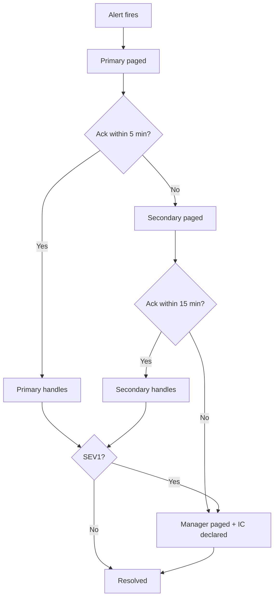

## 解決什麼問題

On-call 撐住的是可用性，但也撐垮人。輪值制度的目標是：覆蓋風險、平均負擔、明確升級路徑、可被工程師接受地長期執行。

## 誰負責、和誰對接

- **主責：** DevOps Manager / SRE Lead
- **協作：** HR/合規（加班規範）、Dev Lead（人員池）
- **下游收件：** Runbook、Incident Report、補休制度

## 何時用、何時不用

- ✅ **必要時機：** 對外服務、SLA ≥ 99.9%
- ❌ **不需要時：** 內部工具、無 paging 告警
- ⚠️ **常見誤用：** Primary 同時是 Secondary；無升級階梯；無補休

## AI 怎麼加速

把近 90 天告警歷史 + 團隊資料 + SLO 整份丟給 agent，讓 agent 讀範本內的 `> [!IMPORTANT]` 規則與 `<!-- ai-fill -->` 註解推輪值結構與密度，**人工只審 fairness、勞動法合規、補休是否真會執行**。本卡輸出**真實 on-call rotation markdown 文件**（含表格、mermaid 升級流程、inline `[H/M/L]` confidence badge），**不出 YAML schema**。

## 文件範本

下面兩個 tab 是同一份契約的兩種版本：**輕量範本**給單時區小團隊 / 業務時段覆蓋用，**完整範本**給 24x7 / 跨時區 follow-the-sun / 需 HR & Finance 對齊場景。範本內所有 `> [!IMPORTANT]` 是 AI 章節級規則、`<!-- ai-fill / ai-rule -->` 是欄位級微指引、結尾 `> [!CAUTION]` 是輸出前自檢清單。

```template-light
---
doc_type: "on-call-rotation"
variant: "light"
status: "draft"
owner: "<sre-lead-or-devops-manager>"
last_updated: "YYYY-MM-DD"
upstream:
  required: ["alert-history-90d", "team-roster"]
  optional: ["slo", "hr-policy"]
---

# On-Call Rotation: <team-or-service-name>

**Status:** Draft v0.X · **Owner:** <SRE Lead> · **Last updated:** YYYY-MM-DD

> [!IMPORTANT]
> **AI 填寫規則：** 本範本 6 段（編號 1, 2, 3, 6, 10, 12），全部必填——刻意沿用完整版的章節編號讓兩版可對照。每結論行內加 `（依據：alert-history §XXX / roster §YYY）`；每量化欄位 `[H]/[M]/[L]` confidence badge；缺資料寫 `_TODO: 需要 XXX_` 不編造；**Primary 不可同時是 Secondary**；**每月 on-call 工時 ≤ 法規上限**；**每週至少 1 天 paging-free**。

---

## 1. Rotation Structure

<!-- ai-fill: 1-2 行說明選擇的結構與為何 -->

| Field | Value |
|---|---|
| **Structure** | weekly / daily / follow-the-sun / business-hours-only |
| **Shift length** | <e.g. 168 hours (1 week)> |
| **Pool size** | <人數> |
| **Coverage** | 24x7 / business-hours-only |
| **Rationale** | <為何這個結構適合本團隊> |
| **Confidence** | **[H]** |

---

## 2. Primary / Secondary

<!-- ai-rule: Primary 不可同時是 Secondary；ack SLA 必須對應 SLO 的 MTTA 目標 -->

| Role | Source pool | Ack SLA | Note |
|---|---|---|---|
| **Primary** | <rotation pool A> | <e.g. 5 min> | 第一線接 page |
| **Secondary** | <rotation pool B, 與 Primary 互斥> | <e.g. 15 min> | Primary 無回應後接手 |
| **Tertiary（升級）** | <manager> | <e.g. 30 min> | Primary + Secondary 都無回應後 |

---

## 3. Paging Routing

<!-- ai-rule: 按 SEV 分流；SEV1 必須多人同時 page；SEV3 可降為 slack 非工時 -->

| Severity | Page targets | Note |
|---|---|---|
| **SEV1** | Primary + Secondary + Manager（10 min 後同時） | 業務影響大、需多人協作 |
| **SEV2** | Primary, 15 min 後 Secondary | <說明> |
| **SEV3** | Primary（業務時段）/ Slack notify（非工時） | <說明> |

---

## 6. Fatigue & Fairness

<!-- ai-rule: 必含 alert density per shift + fairness metric + 補休政策三件 -->

| Aspect | Value | Threshold | Source |
|---|---|---|---|
| **Alert density p50 / p95** | <events/week> | target p95 ≤ 2 paging / shift | alert-history §X |
| **Alerts per engineer (30d)** | <e.g. avg 3, max 7> | rebalance trigger ≥ 1.5σ | roster §Y |
| **Off-hours share** | <e.g. avg 30%, max 55%> | rebalance trigger > 40% | alert-history §Z |
| **Comp time per off-hours page** | <e.g. 1.5h> | per HR policy | hr-policy §A |

---

## 10. Decision Log（key 1-2 條）

<!-- ai-rule: 每條必含 chosen + 至少 1 個 rejected + 拒絕原因 -->

| Date | Decision | Options | Chosen | Rejected why | Confidence |
|---|---|---|---|---|---|
| YYYY-MM-DD | Rotation 結構 | weekly / daily / follow-the-sun | weekly | daily (handoff 太頻繁、MTTA 變慢)、follow-the-sun (人池不足跨 3 時區) | **[H]** |

---

## 12. Confidence & Sources & TODO

- **整份文件最低 confidence 欄位：** <列出所有 [L] 與 [M]>
- **Fabricated assumptions（推測但 input 未明說）：**
  - <假設 1>
- **Highest-value next input:** <下一份最該補的：90d alert noise 報表 / 團隊意願調查>

### TODO（缺資料）

- _TODO: 需要 90d alert log 校準 alert density target_

---

> [!CAUTION]
> **輸出前 AI 自檢：**
> - [ ] 6 段 H2 章節齊全（編號 1, 2, 3, 6, 10, 12，刻意不連號）
> - [ ] **Primary ≠ Secondary**（不能同一人）
> - [ ] Paging routing 按 SEV1/2/3 分流
> - [ ] Fairness 含 alert density + per-engineer + off-hours share 三指標
> - [ ] 補休政策已寫（comp_time 或 paid_overtime）
> - [ ] Decision Log ≥ 1 條，每條有 rejected reason
> - [ ] 無 YAML / JSON schema 輸出（rotation 是給人讀的 markdown）
```

````template-full
---
doc_type: "on-call-rotation"
variant: "full"
status: "draft"
owner: "<sre-lead-or-devops-manager>"
last_updated: "YYYY-MM-DD"
upstream:
  required: ["alert-history-90d", "team-roster", "slo", "hr-policy"]
  optional: ["timezone-distribution", "comp-policy"]
---

# On-Call Rotation: <team-or-service-name>

**Status:** Draft v0.X · **Owner:** <SRE Lead> · **Last updated:** YYYY-MM-DD · **Reviewers:** HR / Dev Lead / Finance

> [!IMPORTANT]
> **AI 填寫規則：** 12 段 H2 章節全部必填（任一缺失即不合格）。對標 Google SRE oncall、PagerDuty incident response guide、SOC 2 變更管理。每結論行內 `（依據：alert-history §XXX / roster §YYY / hr-policy §ZZZ）`；每量化欄位 `[H/M/L]` badge；缺資料 `_TODO: 需要 XXX_` 不編造；**Primary 不可同時是 Secondary**；**每月 on-call 工時 ≤ 法規上限**；**每週至少 1 天 paging-free**；**MTTA / MTTR 目標必須對齊 SLO**；NFR 含勞動法工時、最短休息間隔、補休追蹤（SOC 2 audit）；禁 YAML/JSON schema 輸出。

---

## 1. Rotation Structure
<!-- owner: SRE Lead · required: always -->

<!-- ai-fill: 1-2 行說明結構選擇 -->

| Field | Value | Source | Confidence |
|---|---|---|---|
| **Structure** | weekly / daily / follow-the-sun / business-hours-only | <input> | **[H]** |
| **Shift length** | <e.g. 168 hours> | hr-policy §X | **[H]** |
| **Pool size** | <人數> | roster §Y | **[H]** |
| **Coverage** | 24x7 / business-hours | slo §Z | **[H]** |
| **Timezone distribution** | <e.g. GMT+8 ×5, GMT-5 ×3> | roster §Y | **[H]** |
| **Rationale** | <為何此結構適合> | — | **[M]** |

---

## 2. Primary / Secondary / Tertiary
<!-- owner: SRE Lead · required: always -->

<!-- ai-rule: Primary 不可同時是 Secondary；ack SLA 必須對應 SLO MTTA -->

| Role | Source pool | Ack SLA | Escalation trigger | Note |
|---|---|---|---|---|
| **Primary** | <pool A> | <5 min> | — | 第一線 |
| **Secondary** | <pool B, 與 Primary 互斥> | <15 min> | Primary 無回應 > 5 min | 第二線 |
| **Tertiary** | <manager> | <30 min> | Primary + Secondary 都無回應 > 15 min | 升級 |

---

## 3. Paging Routing
<!-- owner: SRE Lead · required: always -->

<!-- ai-rule: 按 SEV 分流；SEV1 必須多人同時 page -->

| Severity | Page targets | SLA | Channel |
|---|---|---|---|
| **SEV1** | Primary + Secondary + Manager 同時（10 min 內） | ack ≤ 5 min | PagerDuty + 電話 |
| **SEV2** | Primary → Secondary 後備（15 min） | ack ≤ 15 min | PagerDuty |
| **SEV3** | Primary（業務時段）/ Slack（非工時） | ack ≤ 2h | Slack channel |

---

## 4. Escalation Flow
<!-- owner: SRE Lead · required: full-only -->

> [!IMPORTANT]
> **AI 填寫規則：** 用 mermaid `flowchart TD` 畫升級流程；節點數 5-9 個；必含 Primary → Secondary → Manager → IC 四階。



---

## 5. Handoff Protocol
<!-- owner: SRE Lead · required: full-only -->

<!-- ai-rule: 必含 cadence + artifacts + format 三件 -->

| Field | Value |
|---|---|
| **Cadence** | <e.g. weekly Monday 10:00 local time> |
| **Artifacts** | open_incidents, recent_changes, known_issues |
| **Format** | <e.g. 15-min sync + written handoff doc in shared channel> |
| **Backup if handoff missed** | <自動延長前班 24h + manager notify> |

---

## 6. Alert Density & Fairness
<!-- owner: SRE Lead + HR · required: always -->

<!-- ai-rule: 必含 alert density per shift + per-engineer fairness + off-hours share + rebalance trigger 四件 -->

| Aspect | Current | Target | Rebalance trigger | Source |
|---|---|---|---|---|
| **Alert density p50 / p95** | <events/week> | p95 ≤ 2 paging/shift | > target 持續 2 週 | alert-history §X |
| **Alerts per engineer (30d)** | avg X / max Y | balanced | ≥ 1.5σ from team mean | roster §Y |
| **Off-hours share** | avg X% / max Y% | ≤ 40% | > 40% sustained | alert-history §Z |
| **Consecutive paging weeks** | max <N> | ≤ 3 | auto-swap with backup | rotation log |

---

## 7. Fatigue Indicators & Compensation
<!-- owner: SRE Lead + HR · required: full-only -->

<!-- ai-rule: 列 ≥ 2 個 fatigue signal + 補休政策 -->

| Signal | Threshold | Action |
|---|---|---|
| Consecutive paging weeks | ≥ 3 weeks | auto-swap with backup |
| Off-hours alerts in last 7d | > 5 | 提前換班 + 補休 |
| Total on-call hours / month | > 法規上限 | 強制下班 + 補休 |

> **Compensation policy:**
> - **Comp time per off-hours page:** <e.g. 1.5h>
> - **Paid overtime threshold:** <e.g. > 法規上限>
> - **Tracking:** <comp-time log in HR system, audited quarterly>

---

## 8. SLO Alignment & NFR
<!-- owner: SRE Lead · required: full-only -->

<!-- ai-rule: MTTA / MTTR 目標必須對齊 SLO；勞動法工時上限與最短休息間隔必填 -->

| Dimension | Target | Source | Confidence |
|---|---|---|---|
| **MTTA** | <e.g. ≤ 5 min for SEV1> | slo §X | **[H]** |
| **MTTR** | <e.g. ≤ 60 min for SEV1> | slo §Y | **[H]** |
| **Max consecutive hours** | <法規 + 公司政策> | hr-policy §A | **[H]** |
| **Min rest interval** | <e.g. 11h between shifts> | hr-policy §B | **[H]** |
| **Paging-free per week** | ≥ 1 day | rotation policy | **[H]** |

---

## 9. Risks & Open Questions
<!-- owner: All · required: always -->

### Risks

<!-- ai-rule: 每條格式：失效模式 + Mitigation + Owner -->

> **R1:** <例：人池 < 6 人時 burnout 風險高> — **Mitigation:** <與外部團隊建立 backup pool> — **Owner:** <SRE Lead>
>
> **R2:** <例：跨時區 handoff 失敗> — **Mitigation:** <written handoff doc 強制> — **Owner:** <Manager>

### Open Questions

- [ ] **Q1:** <e.g. 是否需要外包夜班？>
- [ ] **Q2:** ...

---

## 10. Decision Log
<!-- owner: SRE Lead · required: always -->

<!-- ai-rule: 每條必含 ≥ 2 個 rejected options + 各自 rejected reason -->

| Date | Decision | Options considered | Chosen | Rejected why | Confidence |
|---|---|---|---|---|---|
| YYYY-MM-DD | Rotation 結構 | weekly / daily / follow-the-sun | weekly | daily (handoff 太頻繁、MTTA 變慢)、follow-the-sun (人池不足跨 3 時區) | **[H]** |

---

## 11. Out of Scope
<!-- owner: SRE Lead · required: full-only -->

本 On-Call Rotation 文件 **不處理**：

- ❌ **個別 runbook 內容** — 屬 runbook 卡
- ❌ **告警閾值合理性** — 屬 observability spec
- ❌ **加班費精算** — 屬 HR / Finance

---

## 12. Confidence & Sources & TODO
<!-- owner: All · required: always -->

- **整份文件最低 confidence 欄位：** <列出所有 [L] 與 [M] 欄位>
- **Fabricated assumptions（推測但 input 未明說的）：**
  - <假設 1：成員意願>
  - <假設 2：未來人員流動率>
- **Highest-value next input:** <下一份最該補的：90d alert noise 報表 / 團隊意願調查 / 跨時區協作經驗訪談>

### TODO（缺資料）

- _TODO: 需要 90d alert log 校準 alert density target_
- _TODO: 需要 HR 確認補休追蹤可被 SOC 2 audit_

---

> [!CAUTION]
> **輸出前 AI 自檢：**
> - [ ] 12 段 H2 章節齊全（編號 1-12）
> - [ ] **Primary ≠ Secondary**（不能同一人）
> - [ ] Escalation Flow 段含 mermaid，含 Primary → Secondary → Manager → IC 四階
> - [ ] Paging routing 按 SEV1/2/3 分流
> - [ ] Fairness 含 alert density + per-engineer + off-hours share + rebalance trigger 四件
> - [ ] 補休政策已寫（comp_time + paid_overtime + tracking）
> - [ ] MTTA / MTTR 目標對齊 SLO
> - [ ] **勞動法工時上限 + 最短休息間隔 + 每週 1 天 paging-free 三項都填**
> - [ ] Decision Log 每條 ≥ 2 個 rejected options + 各自 reason
> - [ ] Risks 每條格式：失效模式 + Mitigation + Owner
> - [ ] 無 YAML / JSON schema 輸出（rotation 是給人讀的 markdown）
````

## 怎麼觸發

先在上方 tab 選「輕量範本」或「完整範本」、按複製存到你的 AI 工作環境（web chat 對話框、Claude Code / Cursor / Aider 等 harness agent 的 context、或專案內任何 markdown 檔），再複製下面這段、把貼位區換成你的真實文件全文，給 AI：

```trigger
請依據以下「文件範本」與「上游文件」產出 on-call rotation markdown。嚴格遵守範本內所有 `> [!IMPORTANT]` 規則、`<!-- ai-fill -->` / `<!-- ai-rule -->` 欄位指引，並在結尾跑完 `> [!CAUTION]` 自檢清單。

## 文件範本（貼這裡）
⏬
（貼上面選好的「輕量範本」或「完整範本」全文）
⏫

## 上游文件（貼這裡）
⏬
（貼近 90 天告警歷史（時段 / SEV / ack 時間）/ 團隊成員池（人數 / 技能 / 時區 / 目前負擔）/ SLO 與業務時段定義 / 勞動法或公司 HR 規範全文）
⏫
```

> [!TIP]
> **常見錯誤：** Primary 同時當 Secondary（= 沒備援）、無升級階梯（升級條件不明確）、無補休（撐到 burnout 與離職）、follow-the-sun 但人池 < 6 人（handoff 風險爆增）、Decision Log 只列 chosen 不列 rejected（HR 無法 audit）。AI 若漏這些，自檢清單會抓到並回頭補。
